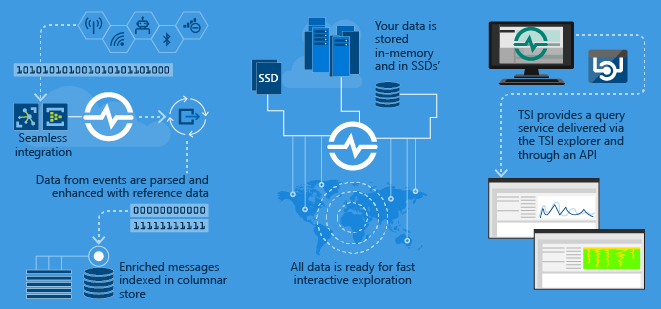
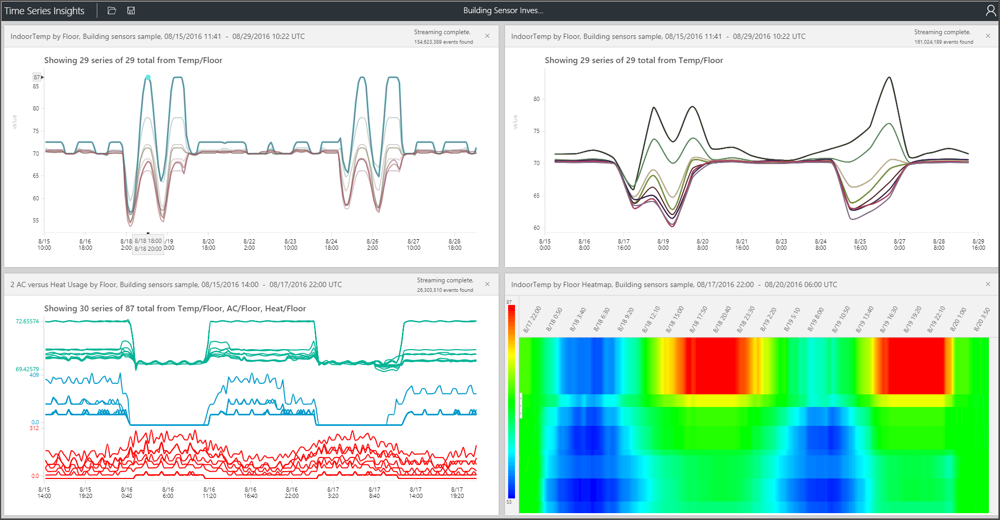

# What is Azure Time Series Insights Gen1?

> [!CAUTION]
> This is a Gen1 article.

Azure Time Series Insights is built to store, visualize, and query large amounts of time series data, such as that generated by IoT devices. If you want to store, manage, query, or visualize time series data in the cloud, Azure Time Series Insights is likely right for you.

Azure Time Series Insights has four key jobs:

- It's fully integrated with cloud gateways like Azure IoT Hub and Azure Event Hubs. It easily connects to these event sources and parses JSON from messages and structures that have data in clean rows and columns. It joins metadata with telemetry and indexes your data in a columnar store.
- Azure Time Series Insights manages the storage of your data. To make sure that data is always easily accessible, it stores your data in memory and SSDs for up to 400 days. You can interactively query billions of events in seconds–on demand.
- Azure Time Series Insights provides out-of-the-box visualization through the Azure Time Series Insights Explorer.
- Azure Time Series Insights provides a query service, both in the Azure Time Series Insights Explorer and by using APIs that are easy to integrate to embed your time series data into custom applications.

If you build an application for internal consumption or for external customers to use, you can use Azure Time Series Insights as a back end. You can use it to index, store, and aggregate time series data. To build a custom visualization and user experience on top, use the [Client SDK](https://github.com/microsoft/tsiclient/blob/master/docs/API.md). Azure Time Series Insights is also equipped with several [Query APIs](./concepts-json-flattening-escaping-rules.md) to enable these customized scenarios.

Time series data represents how an asset or process changes over time. Time series data is indexed by timestamps, and time is the most meaningful axis along which such data is organized. Time series data typically arrives in sequential order, so it's treated as an insert rather than an update to your database.

It can be a challenge to store, index, query, analyze, and visualize time series data in large volumes.
Azure Time Series Insights captures and stores every new event as a row, and change is efficiently measured over time. As a result, you can look backwards to draw insights from the past to help predict future change.

## Video

### Learn more about Azure Time Series Insights, the cloud-based IoT analytics platform. 

## Primary scenarios

- Store time series data in a scalable way.

   At its core, Azure Time Series Insights has a database designed with time series data in mind. Because it's scalable and fully managed, Azure Time Series Insights handles the work of storing and managing events.

- Explore data in near real time.

   Azure Time Series Insights provides an Explorer that visualizes all data that streams into an environment. Shortly after you connect to an event source, you can view, explore, and query event data within Azure Time Series Insights. The data helps you to validate whether a device emits data as expected and to monitor an IoT asset for health, productivity, and overall effectiveness.

- Perform root-cause analysis and detect anomalies.

   Azure Time Series Insights has tools like patterns and perspective views to conduct and save multistep root-cause analysis. Azure Time Series Insights also works with alerting services like Azure Stream Analytics so that you can view alerts and detected anomalies in near real time in the Azure Time Series Insights Explorer.

- Gain a global view of time series data that streams from disparate locations for multi-asset or site comparison.

   You can connect multiple event sources to an Azure Time Series Insights environment. This way you can view data that streams in from multiple, disparate locations together in near real time. Users can take advantage of this visibility to share data with business leaders. They can collaborate better with domain experts who can apply their expertise to help solve problems, apply best practices, and share learnings.

- Build a customer application on top of Azure Time Series Insights.

   Azure Time Series Insights exposes REST Query APIs that you can use to build applications that use time series data.

## Capabilities

- **Get started quickly**: Azure Time Series Insights doesn't require upfront data preparation, so you can quickly connect to millions of events in your IoT hub or event hub. After you connect, you can visualize and interact with sensor data to quickly validate your IoT solutions. You can interact with your data without writing code, and you don't need to learn a new language. Azure Time Series Insights provides a granular, free-text query surface for advanced users, and point-and-click exploration.

- **Near real-time insights**: Azure Time Series Insights can ingest millions of sensor events per day, with one-minute latency. Azure Time Series Insights helps you gain insights into your sensor data. Use it to spot trends and anomalies, conduct root-cause analyses, and avoid costly downtime. Cross-correlation between real-time and historical data helps you find hidden trends in the data.

- **Build custom solutions**: Embed Azure Time Series Insights data into your existing applications. You also can create new custom solutions with the Azure Time Series Insights REST APIs. Create personalized views you can share for others to explore your insights.

- **Scalability**: Azure Time Series Insights is designed to support IoT at scale. It can ingress from 1 million to 100 million events per day, with a default retention span of 31 days. You can visualize and analyze live data streams in near real time, alongside historical data.

## Get started

To get started, follow these steps.

1. Provision an Azure Time Series Insights environment in the Azure portal.
1. Connect to an event source like an IoT hub or an event hub.
1. Upload reference data. This isn't an additional service.
1. Review and display your data in minutes with the Azure Time Series Insights Explorer.

## Explorer

View, analyze, and discover trends in your data using the Azure Time Series Insights Explorer.

Learn how to use the [Azure Time Series Insights Explorer](time-series-insights-explorer.md) and draw insights from your data.

## Next steps

- Explore the Azure Time Series Insights Gen1 [demo environment](./time-series-quickstart.md).

- Learn more about how to [plan your Azure Time Series Insights](time-series-insights-environment-planning.md) environment.