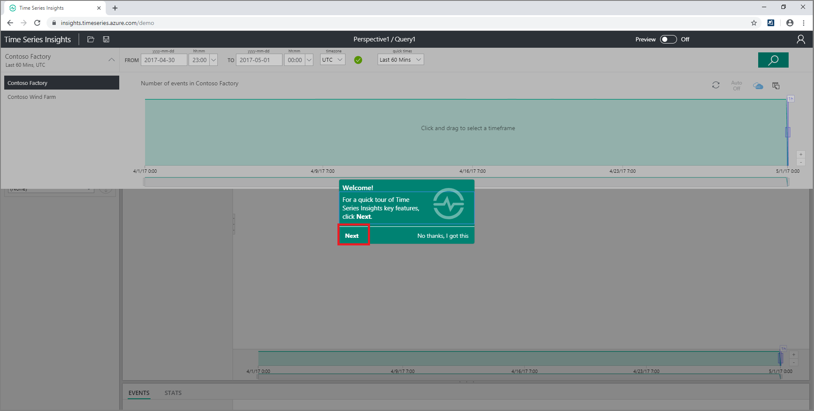
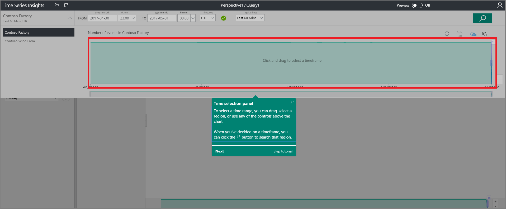
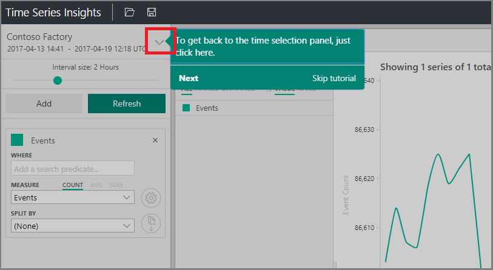
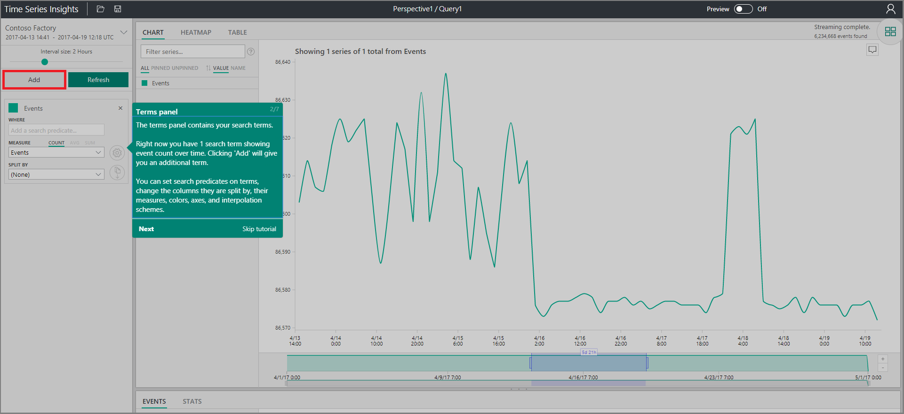
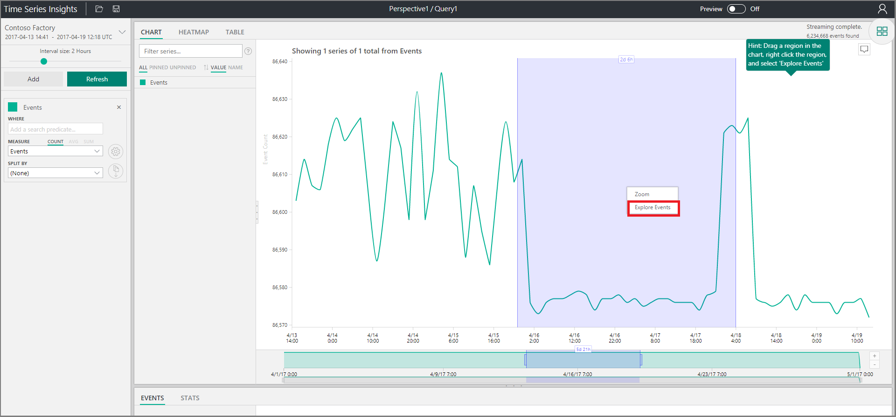
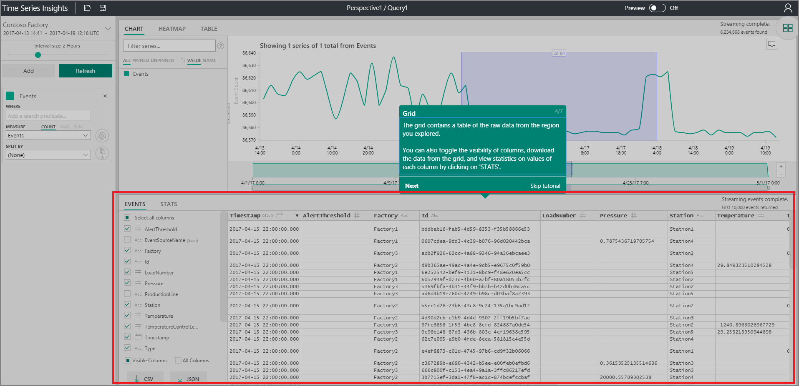
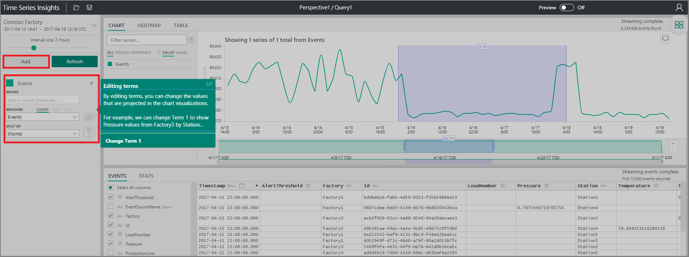
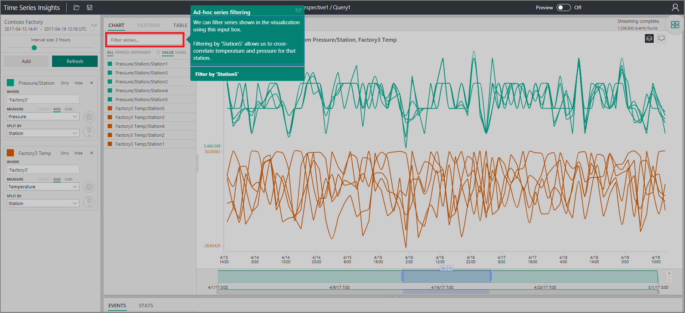

# Quickstart: Explore Azure Time Series Insights

This Azure Time Series Insights explorer quickstart helps you get started with Time Series Insights in a free demonstration environment. Through it, you learn how to use your web browser to visualize large volumes of IoT data and tour key features that are generally available now.

Azure Time Series Insights is a fully managed analytics, storage, and visualization service that simplifies how to explore and analyze billions of IoT events simultaneously. It gives you a global view of your data so that you can quickly validate your IoT solution and avoid costly downtime to mission-critical devices. Azure Time Series Insights helps you to discover hidden trends, spot anomalies, and conduct root-cause analyses in near real time.

For additional flexibility, you can add Azure Time Series Insights to a preexisting application through its powerful [REST APIs](./time-series-insights-update-tsq.md) and [client SDK](./tutorial-create-tsi-sample-spa.md). You can use the APIs to store, query, and consume time series data in a client application of your choice. You also can use the client SDK to add UI components to your existing application.

This Time Series Insights explorer quickstart offers a guided tour of features that are generally available now.

## Prepare the demo environment

1. Create a [free Azure account](https://azure.microsoft.com/free/?ref=microsoft.com&utm_source=microsoft.com&utm_medium=docs&utm_campaign=visualstudio) if you haven't created one already.

1. In your browser, go to the [general availability demo](https://insights.timeseries.azure.com/demo).

1. If prompted, sign in to the Time Series Insights explorer by using your Azure account credentials.

1. The Time Series Insights quick tour page displays. Select **Next** to begin the quick tour.

   

## Explore the demo environment

1. The **Time selection panel** displays. Use this panel to select a time frame to visualize.

   

1. Select a time frame and drag it in the region. Then select **Search**.

   

   Time Series Insights displays a chart visualization for the time frame you specified. You can do various actions within the line chart. For example, you can filter, pin, sort, and stack.

   To return to the **Time selection panel**, select the down arrow as shown:

   

1. Select **Add** in the **Terms panel** to add a new search term.

   

1. In the chart, you can select a region, right-click the region, and select **Explore Events**.

   

   A grid of your raw data displays from the region that you're exploring.

   

## Select and filter data

1. Edit your terms to change the values in the chart. Add another term to cross-correlate different types of values.

   

1. Enter a filter term in the **Filter series** box for improvised series filtering. For the quickstart, enter **Station5** to cross-correlate temperature and pressure for that station.

   

After you finish the quickstart, you can experiment with the sample data set to create different visualizations.

## Next steps

You're ready to create your own Time Series Insights environment:
> [!div class="nextstepaction"]
> [Plan your Time Series Insights environment](time-series-insights-environment-planning.md)
