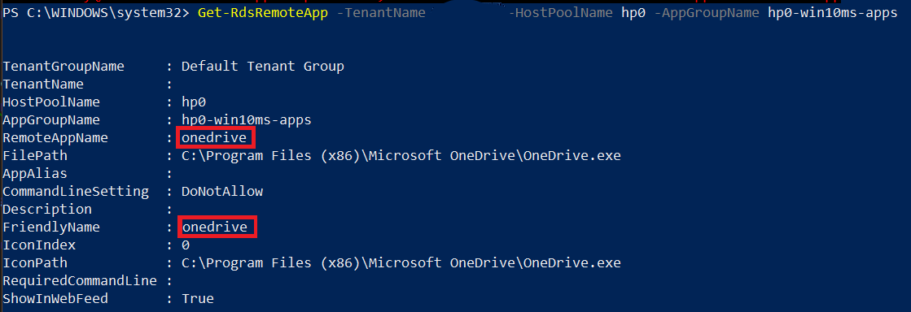

# Customize feed for Windows Virtual Desktop users

You can customize the feed so the RemoteApp and remote desktop resources appear in a recognizable way for your users.

First, [download and import the Windows Virtual Desktop PowerShell module](https://docs.microsoft.com/powershell/windows-virtual-desktop/overview) to use in your PowerShell session if you haven't already. After that, run the following cmdlet to sign in to your account:

```powershell
Add-RdsAccount -DeploymentUrl "https://rdbroker.wvd.microsoft.com"
```

## Customize the display name for a RemoteApp

You can change the display name for a published RemoteApp by setting the friendly name. By default, the friendly name is the same as the name of the RemoteApp program.

To retrieve a list of published RemoteApps for an app group, run the following PowerShell cmdlet:

```powershell
Get-RdsRemoteApp -TenantName <tenantname> -HostPoolName <hostpoolname> -AppGroupName <appgroupname>
```


To assign a friendly name to a RemoteApp, run the following PowerShell cmdlet:

```powershell
Set-RdsRemoteApp -TenantName <tenantname> -HostPoolName <hostpoolname> -AppGroupName <appgroupname> -Name <existingappname> -FriendlyName <newfriendlyname>
```


## Customize the display name for a Remote Desktop

You can change the display name for a published remote desktop by setting a friendly name. If you manually created a host pool and desktop app group through PowerShell, the default friendly name is "Session Desktop." If you created a host pool and desktop app group through the GitHub Azure Resource Manager template or the Azure Marketplace offering, the default friendly name is the same as the host pool name.

To retrieve the remote desktop resource, run the following PowerShell cmdlet:

```powershell
Get-RdsRemoteDesktop -TenantName <tenantname> -HostPoolName <hostpoolname> -AppGroupName <appgroupname>
```


To assign a friendly name to the remote desktop resource, run the following PowerShell cmdlet:

```powershell
Set-RdsRemoteDesktop -TenantName <tenantname> -HostPoolName <hostpoolname> -AppGroupName <appgroupname> -FriendlyName <newfriendlyname>
```


## Next steps

Now that you've customized the feed for users, you can sign in to a Windows Virtual Desktop client to test it out. To do so, continue to the Connect to Windows Virtual Desktop How-tos:
	
 * [Connect from Windows 10 or Windows 7](connect-windows-7-and-10.md)
 * [Connect from a web browser](connect-web.md) 
