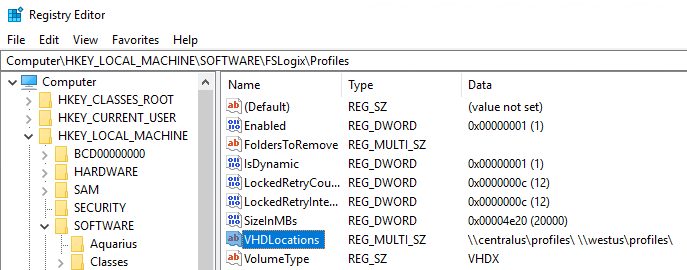
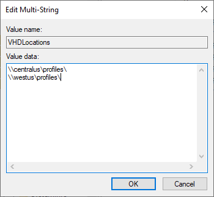

# Set up a business continuity and disaster recovery plan

To keep your organization's data safe, you may need to adopt a business continuity and disaster recovery (BCDR) strategy. A sound BCDR strategy keeps your apps and workload up and running during planned and unplanned service or Azure outages.

Windows Virtual Desktop offers BCDR for the Windows Virtual Desktop service to preserve customer metadata during outages. When an outage occurs in a region, the service infrastructure components will fail over to the secondary location and continue functioning as normal. You can still access service-related metadata, and users can still connect to available hosts. End-user connections will stay online as long as the tenant environment or hosts remain accessible.

To make sure users can still connect during a region outage, you need to replicate their virtual machines (VMs) in a different location. During outages, the primary site fails over to the replicated VMs in the secondary location. Users can continue to access apps from the secondary location without interruption. On top of VM replication, you'll need to keep user identities accessible at the secondary location. If you're using profile containers, you'll also need to replicate them. Finally, make sure your business apps that rely on data in the primary location can fail over with the rest of the data.

To summarize, to keep your users connected during an outage, you'll need to do the following things in this order:

- Replicate the VMs in a secondary location.
- If you're using profile containers, set up data replication in the secondary location.
- Make sure user identities you set up in the primary location are available in the secondary location.
- Make sure any line-of-business applications relying on data in your primary location are failed over to the secondary location.

## VM replication

First, you'll need to replicate your VMs to the secondary location. Your options for doing so depend on how your VMs are configured:

- You can configure all your VMs for both pooled and personal host pools with Azure Site Recovery. With this method, you'll only need to set up one host pool and its related app groups and workspaces.
- You can create a new host pool in the failover region while keeping all resources in your failover location turned off. For this method, you'd need to set up new app groups and workspaces in the failover region. You can then use an Azure Site Recovery plan to turn host pools on.
- You can create a host pool that's populated by VMs built in both the primary and failover regions while keeping the VMs in the failover region turned off. In this case, you only need to set up one host pool and its related app groups and workspaces. You can use an Azure Site Recovery plan to power on host pools with this method.

We recommend you use [Azure Site Recovery](../site-recovery/site-recovery-overview.md) to manage replicating VMs in other Azure locations, as described in [Azure-to-Azure disaster recovery architecture](../site-recovery/azure-to-azure-architecture.md). We especially recommend using Azure Site Recovery for personal host pools, because Azure Site Recovery supports both [server-based and client-based SKUs](../site-recovery/azure-to-azure-support-matrix.md#replicated-machine-operating-systems).

If you use Azure Site Recovery, you won't need to register these VMs manually. The Windows Virtual Desktop agent in the secondary VM will automatically use the latest security token to connect to the service instance closest to it. The VM (session host) in the secondary location will automatically become part of the host pool. The end-user will have to reconnect during the process, but apart from that, there are no other manual operations.

If there are existing user connections during the outage, before the admin can start failover to the secondary region, you need to end the user connections in the current region.

To disconnect users in Windows Virtual Desktop (classic), run this cmdlet:

```powershell
Invoke-RdsUserSessionLogoff
```

To disconnect users in the Azure-integrated version of Windows Virtual Desktop, run this cmdlet:

```powershell
Remove-AzWvdUserSession
```

Once you've signed out all users in the primary region, you can fail over the VMs in the primary region and let users connect to the VMs in the secondary region. For more information about how this process works, see [Replicate Azure VMs to another Azure region](../site-recovery/azure-to-azure-how-to-enable-replication.md).

## Virtual network

Next, consider your network connectivity during the outage. You'll need to make sure you've set up a virtual network (VNET) in your secondary region. If your users need to access on-premises resources, you'll need to configure this VNET to access them. You can establish on-premises connections with a VPN, ExpressRoute, or virtual WAN.

We recommend you use Azure Site Recovery to set up the VNET in the failover region because it preserves your primary network's settings and doesn't need peering.

## User identities

Next, ensure that the domain controller is available at the secondary location. 

There are three ways to keep the domain controller available:

   - Have Active Directory Domain Controller at secondary location
   - Use an on-premises Active Directory Domain Controller
   - Replicate Active Directory Domain Controller using [Azure Site Recovery](../site-recovery/site-recovery-active-directory.md)

## User and app data

If you're using profile containers, the next step is to set up data replication in the secondary location. You have five options to store FSLogix profiles:

   - Storage Spaces Direct (S2D)
   - Network drives (VM with extra drives)
   - Azure Files
   - Azure NetApp Files
   - Cloud Cache for replication

For more information, check out [Storage options for FSLogix profile containers in Windows Virtual Desktop](store-fslogix-profile.md).

If you're setting up disaster recovery for profiles, these are your options:

   - Set up Native Azure Replication (for example, Azure Files Standard storage account replication, Azure NetApp Files replication, or Azure Files Sync for file servers).
    
     >[!NOTE]
     >NetApp replication is automatic after you first set it up. With Azure Site Recovery plans, you can add pre-scripts and post-scripts to fail over non-VM resources replicate Azure Storage resources.

   - Set up FSLogix Cloud Cache for both app and user data.
   - Set up disaster recovery for app data only to ensure access to business-critical data at all times. With this method, you can retrieve user data after the outage is over.

Let’s take a look at how to configure FSLogix to set up disaster recovery for each option.

### FSLogix configuration

The FSLogix agent can support multiple profile locations if you configure the registry entries for FSLogix.

To configure the registry entries:

1. Open the **Registry Editor**.
2. Go to **Computer** > **HKEY_LOCAL_MACHINE** > **SOFTWARE** > **FSLogix** > **Profiles**.
   
     > [!div class="mx-imgBorder"]
     > 

3. Right-click on **VHDLocations** and select **Edit Multi-String**.

     > [!div class="mx-imgBorder"]
     > 

4. In the **Value Data** field, enter the locations you want to use.
5. When you're done, select **OK**.

If the first location is unavailable, the FSLogix agent will automatically fail over to the second, and so on.

We recommend you configure the FSLogix agent with a path to the secondary location in the main region. Once the primary location shuts down, the FLogix agent will replicate as part of the VM Azure Site Recovery replication. Once the replicated VMs are ready, the agent will automatically attempt to path to the secondary region.

For example, let's say your primary session host VMs are in the Central US region, but your profile container is in the Central US region for performance reasons.

In this case, you would configure the FSLogix agent with a path to the storage in Central US. You would configure the session host VMs to replicate in West US. Once the path to Central US fails, the agent will try to create a new path for storage in West US instead.

### S2D

Since S2D handles replication across regions internally, you don't need to manually set up the secondary path.

### Network drives (VM with extra drives)

If you replicate the network storage VMs using Azure Site Recovery like the session host VMs, then the recovery keeps the same path, which means you don't need to reconfigure FSlogix.

### Azure Files

Azure Files supports cross-region asynchronous replication that you can specify when you create the storage account. If the asynchronous nature of Azure Files already covers your disaster recovery goals, then you don't need to do additional configuration.

If you need synchronous replication to minimize data loss, then we recommend you use FSLogix Cloud Cache instead.

>[!NOTE]
>This section doesn't cover the failover authentication mechanism for
Azure Files.

### Azure NetApp Files

Learn more about Azure NetApp Files at [Create replication peering for Azure NetApp Files](../azure-netapp-files/cross-region-replication-create-peering.md).

## App dependencies

Finally, make sure that any business apps that rely on data located in the primary region can fail over to the secondary location. Also, be sure to configure the settings the apps need to work in the new location. For example, if one of the apps is dependent on the SQL backend, make sure to replicate SQL in the secondary location. You should configure the app to use the secondary location as either part of the failover process or as its default configuration. You can model app dependencies on Azure Site Recovery plans. To learn more, see [About recovery plans](../site-recovery/recovery-plan-overview.md).

## Disaster recovery testing

After you're done setting up disaster recovery, you'll want to test your plan to make sure it works.

Here are some suggestions for how to test your plan:

- If the test VMs have internet access, they will take over any existing session host for new connections, but all existing connections to the original session host will remain active. Make sure the admin running the test signs out all active users before testing the plan. 
- You should only do full disaster recovery tests during a maintenance window to not disrupt your users. You can also use a host pool in the validation environment for the test. 
- Make sure your test covers all business-critical apps.
- We recommend you only failover up to 100 VMs at a time. If you have more VMs than that, we recommend you fail them over in batches 10 minutes apart.

## Next steps

If you have questions about how to keep your data secure in addition to planning for outages, check out our [security guide](security-guide.md).