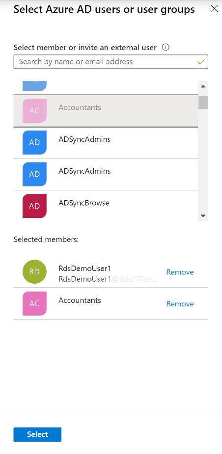
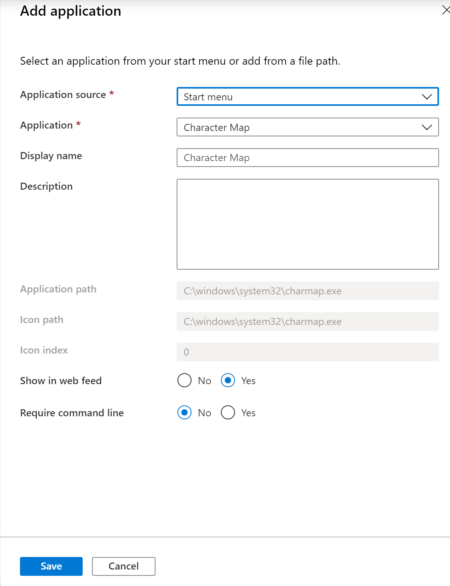
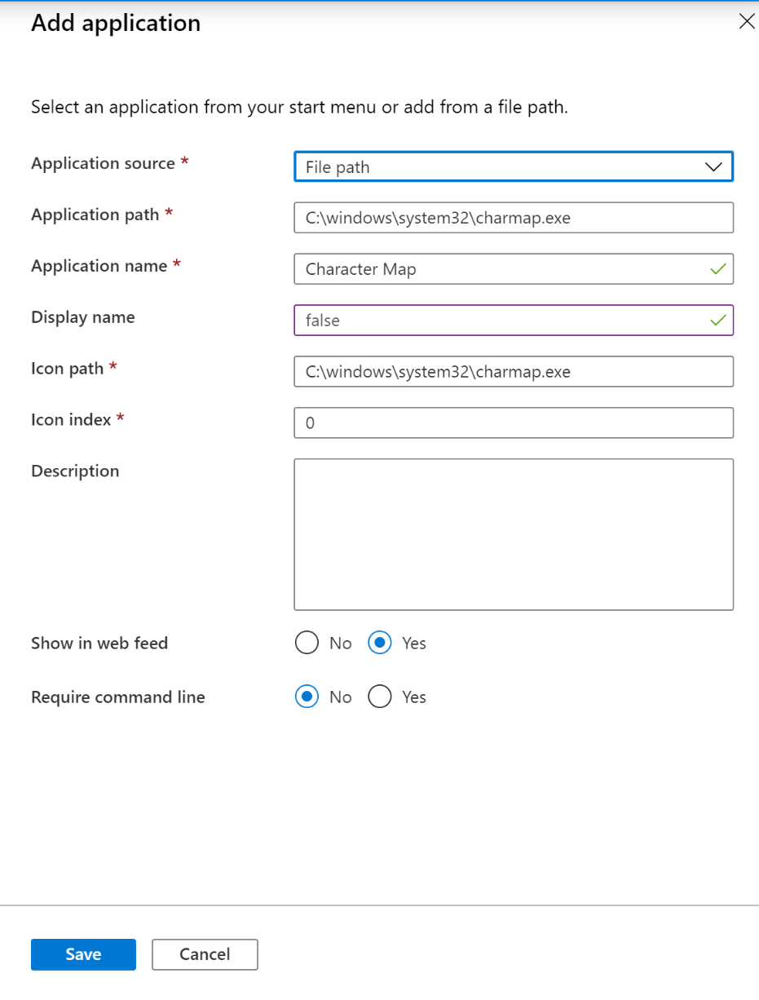
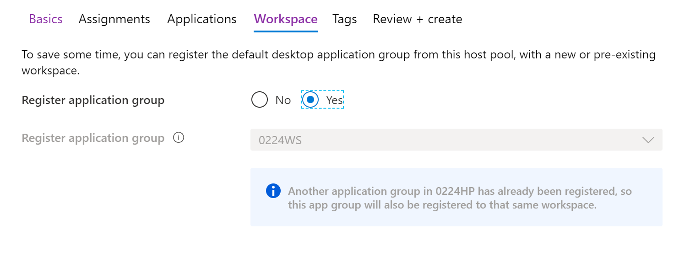

# Tutorial: Manage app groups with the Azure portal

>[!IMPORTANT]
>This content applies to Windows Virtual Desktop with Azure Resource Manager Windows Virtual Desktop objects. If you're using Windows Virtual Desktop (classic) without Azure Resource Manager objects, see [this article](./virtual-desktop-fall-2019/manage-app-groups-2019.md).

The default app group created for a new Windows Virtual Desktop host pool also publishes the full desktop. In addition, you can create one or more RemoteApp application groups for the host pool. Follow this tutorial to create a RemoteApp app group and publish individual Start menu apps.

In this tutorial, learn how to:

> [!div class="checklist"]
> * Create a RemoteApp group.
> * Grant access to RemoteApp programs.

## Create a RemoteApp group

If you've already created a host pool and session host VMs using the Azure
portal or PowerShell, you can add application groups from the Azure portal with
the following process:

1.  Sign in to the [Azure portal](https://portal.azure.com/).
   
    >[!NOTE]
    > If you're signing in to the US Gov portal, go to [https://portal.azure.us/](https://portal.azure.us/) instead.

2.  Search for and select **Windows Virtual Desktop**.

3. You can add an application group directly or you can add it from an existing host pool. Choose an option below:

    - Select **Application groups** in the menu on the left side of the page, then select **+ Add**.

    - Select **Host pools** in the menu on the left side of the screen, select the name of the host pool, select **Application groups** from the menu on the left side, then select **+ Add**. In this case, the host pool will already be selected on the Basics tab.

4. On the **Basics** tab, select the **Subscription** and **Resource group** you want to create the app group for. You can also choose to create a new resource group instead of selecting an existing one.

5. Select the **Host pool** that will be associated with the application group from the drop-down menu.

    >[!NOTE]
    >You must select the host pool associated with the application group. App groups have apps or desktops that are served from a session host and session hosts are part of host pools. The app group needs to be associated with a host pool during creation.

    > [!div class="mx-imgBorder"]
    > 

6. Select **RemoteApp** under **Application group type**, then enter a name for your RemoteApp.

      > [!div class="mx-imgBorder"]
      > 

7.  Select **Next: Assignments >** tab.

8.  To assign individual users or user groups to the app group, select **+Add Azure AD users or user groups**.

9.  Select the users you want to have access to the apps. You can select single or multiple users and user groups.

     > [!div class="mx-imgBorder"]
     > 

10.  Select **Select**.

11.  Select **Next: Applications >**, then select **+Add applications**.

12.  To add an application from the start menu:

      - Under **Application source**, select **Start menu** from the drop-down menu. Next, under **Application**, choose the application from the drop-down menu.

     > [!div class="mx-imgBorder"]
     > 

      - In **Display name**, enter the name for the application that will be shown to the user on their client.

      - Leave the other options as-is and select **Save**.

13.  To add an application from a specific file path:

      - Under **Application source**, select **File path** from the drop-down menu.

      - In **Application path**, enter the path to the application on the session host registered with the associated host pool.

      - Enter the application's details in the **Application name**, **Display name**, **Icon path**, and **Icon index** fields.

      - Select **Save**.

     > [!div class="mx-imgBorder"]
     > 

14.  Repeat this process for every application you want to add to the application group.

15.  Next, select **Next: Workspace >**.

16.  If you want to register the app group to a workspace, select **Yes** for **Register application group**. If you'd rather register the app group at a later time, select **No**.

17.  If you select **Yes**, you can select an existing workspace to register your app group to.

       >[!NOTE]
       >You can only register the app group to workspaces created in the same location as the host pool. Also. if you've previously registered another app group from the same host pool as your new app group to a workspace, it will be selected and you can't edit it. All app groups from a host pool must be registered to the same workspace.

     > [!div class="mx-imgBorder"]
     > 

18.  Optionally, if you want to create tags to make your workspace easy to organize, select **Next: Tags >** and enter your tag names.

19.  When you're done, select **Review + create**.

20.  Wait a bit for the validation process to complete. When it's done, select **Create** to deploy your app group.

The deployment process will do the following things for you:

- Create the RemoteApp app group.
- Add your selected apps to the app group.
- Publish the app group published to users and user groups you selected.
- Register the app group, if you chose to do so.
- Create a link to an Azure Resource Manager template based on your configuration that you can download and save for later.

>[!IMPORTANT]
>You can only create 200 application groups for each Azure Active Directory tenant. We added this limit because of service limitations for retrieving feeds for our users. This limit doesn't apply to app groups created in Windows Virtual Desktop (classic).

## Next steps

In this tutorial, you learned how to create an app group, populate it with RemoteApp programs, and assign users to the app group. To learn how to create a validation host pool, see the following tutorial. You can use a validation host pool to monitor service updates before rolling them out to your production environment.

> [!div class="nextstepaction"]
> [Create a host pool to validate service updates](./create-validation-host-pool.md)
