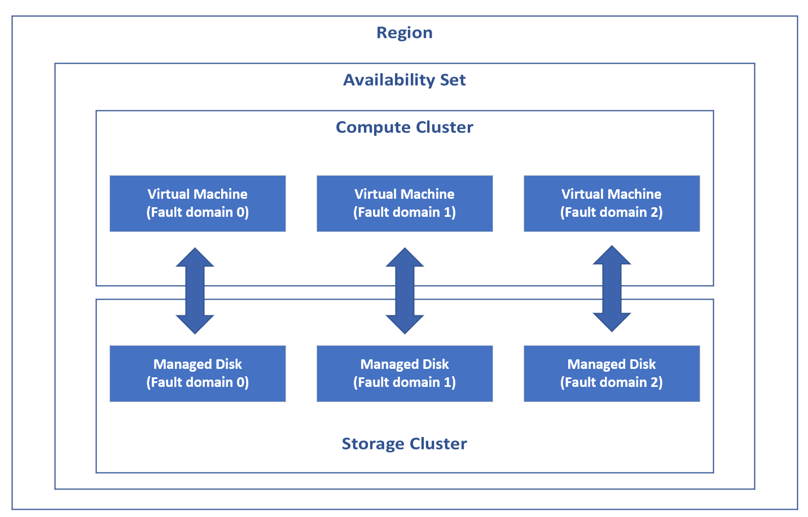

# Availability sets overview

This article provides you with an overview of the availability features of Azure virtual machines (VMs).

## What is an availability set? 

An availability set is a logical grouping of VMs that allows Azure to understand how your application is built to provide for redundancy and availability. We recommended that two or more VMs are created within an availability set to provide for a highly available application and to meet the [99.95% Azure SLA](https://azure.microsoft.com/support/legal/sla/virtual-machines/). There is no cost for the Availability Set itself, you only pay for each VM instance that you create.

## How do availability sets work?
Each virtual machine in your availability set is assigned an **update domain** and a **fault domain** by the underlying Azure platform. For a given availability set, five non-user-configurable update domains are assigned by default (Resource Manager deployments can then be increased to provide up to 20 update domains) to indicate groups of virtual machines and underlying physical hardware that can be rebooted at the same time. When more than five virtual machines are configured within a single availability set, the sixth virtual machine is placed into the same update domain as the first virtual machine, the seventh in the same update domain as the second virtual machine, and so on. The order of update domains being rebooted may not proceed sequentially during planned maintenance, but only one update domain is rebooted at a time. A rebooted update domain is given 30 minutes to recover before maintenance is initiated on a different update domain.

Fault domains define the group of virtual machines that share a common power source and network switch. By default, the virtual machines configured within your availability set are separated across up to three fault domains for Resource Manager deployments. While placing your virtual machines into an availability set does not protect your application from operating system or application-specific failures, it does limit the impact of potential physical hardware failures, network outages, or power interruptions.

For VMs using [Azure Managed Disks](./faq-for-disks.md), VMs are aligned with managed disk fault domains when using a managed availability set. This alignment ensures that all the managed disks attached to a VM are within the same managed disk fault domain. 

Only VMs with managed disks can be created in a managed availability set. The number of managed disk fault domains varies by region - either two or three managed disk fault domains per region. 

## Next steps
You can now start to use these availability and redundancy features to build your Azure environment. For best practices information, see [Azure availability best practices](/azure/architecture/checklist/resiliency-per-service).

