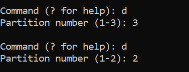
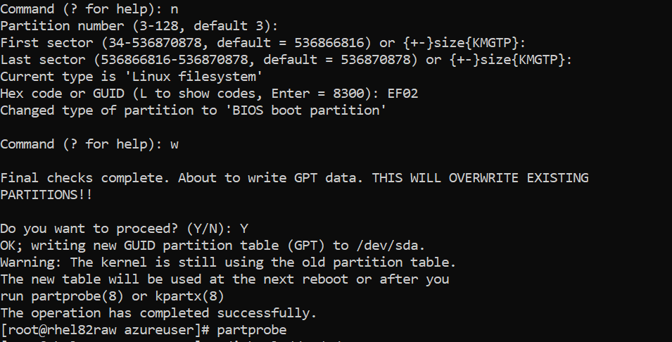
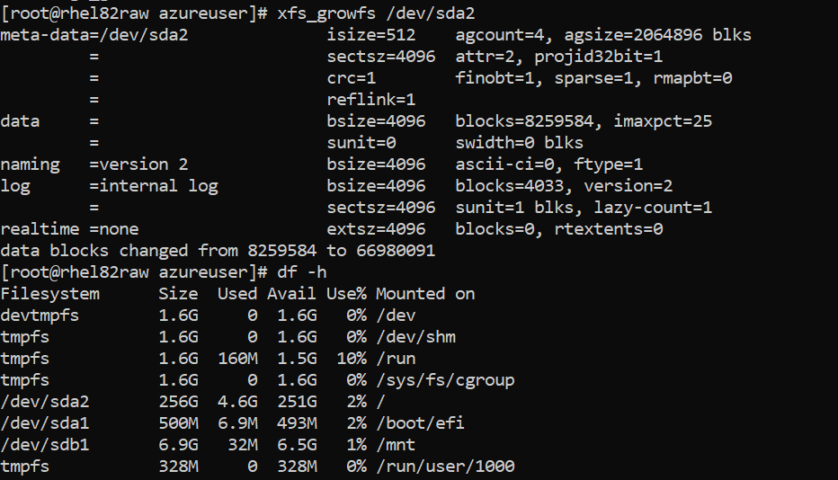

# Resize an OS disk that has a GPT partition

> [!NOTE]
> This article applies only to OS disks that have a GUID Partition Table (GPT) partition.

This article describes how to increase the size of an OS disk that has a GPT partition in Linux. 

## Identify whether the OS disk has an MBR or GPT partition

Use the `parted` command to identify if the disk partition has been created with either a master boot record (MBR) partition or a GPT partition.

### MBR partition

In the following output, **Partition Table** shows a value of **msdos**. This value identifies an MBR partition.

```
[user@myvm ~]# parted -l /dev/sda
Model: Msft Virtual Disk (scsi)
Disk /dev/sda: 107GB
Sector size (logical/physical): 512B/512B
Partition Table: msdos
Number  Start   End     Size    Type     File system  Flags
1       1049kB  525MB   524MB   primary  ext4         boot
2       525MB   34.4GB  33.8GB  primary  ext4
[user@myvm ~]#
```

### GPT partition

In the following output, **Partition Table** shows a value of **gpt**. This value identifies a GPT partition.

```
[user@myvm ~]# parted -l /dev/sda
Model: Msft Virtual Disk (scsi)
Disk /dev/sda: 68.7GB
Sector size (logical/physical): 512B/512B
Partition Table: gpt
Disk Flags:

Number  Start   End     Size    File system  Name                  Flags
1       1049kB  525MB   524MB   fat16        EFI System Partition  boot
2       525MB   1050MB  524MB   xfs
3       1050MB  1052MB  2097kB                                     bios_grub
4       1052MB  68.7GB  67.7GB                                     lvm
```

If your virtual machine (VM) has a GPT partition on your OS disk, increase the size of the OS disk.

## Increase the size of the OS disk

The following instructions apply to Linux-endorsed distributions.

> [!NOTE]
> Before you proceed, make a backup copy of your VM, or take a snapshot of your OS disk.

### Ubuntu

To increase the size of the OS disk in Ubuntu 16.*x* and 18.*x*:

1. Stop the VM.
1. Increase the size of the OS disk from the portal.
1. Restart the VM, and then sign in to the VM as a **root** user.
1. Verify that the OS disk now displays an increased file system size.

In the following example, the OS disk has been resized from the portal to 100 GB. The **/dev/sda1** file system mounted on **/** now displays 97 GB.

```
user@myvm:~# df -Th
Filesystem     Type      Size  Used Avail Use% Mounted on
udev           devtmpfs  314M     0  314M   0% /dev
tmpfs          tmpfs      65M  2.3M   63M   4% /run
/dev/sda1      ext4       97G  1.8G   95G   2% /
tmpfs          tmpfs     324M     0  324M   0% /dev/shm
tmpfs          tmpfs     5.0M     0  5.0M   0% /run/lock
tmpfs          tmpfs     324M     0  324M   0% /sys/fs/cgroup
/dev/sda15     vfat      105M  3.6M  101M   4% /boot/efi
/dev/sdb1      ext4       20G   44M   19G   1% /mnt
tmpfs          tmpfs      65M     0   65M   0% /run/user/1000
user@myvm:~#
```

### SUSE

To increase the size of the OS disk in SUSE 12 SP4, SUSE SLES 12 for SAP, SUSE SLES 15, and SUSE SLES 15 for SAP:

1. Stop the VM.
1. Increase the size of the OS disk from the portal.
1. Restart the VM.

When the VM has restarted, complete these steps:

1. Access your VM as a **root** user by using this command:

   ```
   # sudo -i
   ```

1. Use the following command to install the **growpart** package, which you'll use to resize the partition:

   ```
   # zypper install growpart
   ```

1. Use the `lsblk` command to find the partition mounted on the root of the file system (**/**). In this case, we see that partition 4 of device **sda** is mounted on **/**:

   ```
   # lsblk
   NAME   MAJ:MIN RM  SIZE RO TYPE MOUNTPOINT
   sda      8:0    0   48G  0 disk
   ├─sda1   8:1    0    2M  0 part
   ├─sda2   8:2    0  512M  0 part /boot/efi
   ├─sda3   8:3    0    1G  0 part /boot
   └─sda4   8:4    0 28.5G  0 part /
   sdb      8:16   0    4G  0 disk
   └─sdb1   8:17   0    4G  0 part /mnt/resource
   ```

1. Resize the required partition by using the `growpart` command and the partition number determined in the preceding step:

   ```
   # growpart /dev/sda 4
   CHANGED: partition=4 start=3151872 old: size=59762655 end=62914527 new: size=97511391 end=100663263
   ```

1. Run the `lsblk` command again to check whether the partition has been increased.

   The following output shows that the **/dev/sda4** partition has been resized to 46.5 GB:
   
   ```
   linux:~ # lsblk
   NAME   MAJ:MIN RM  SIZE RO TYPE MOUNTPOINT
   sda      8:0    0   48G  0 disk
   ├─sda1   8:1    0    2M  0 part
   ├─sda2   8:2    0  512M  0 part /boot/efi
   ├─sda3   8:3    0    1G  0 part /boot
   └─sda4   8:4    0 46.5G  0 part /
   sdb      8:16   0    4G  0 disk
   └─sdb1   8:17   0    4G  0 part /mnt/resource
   ```

1. Identify the type of file system on the OS disk by using the `lsblk` command with the `-f` flag:

   ```
   linux:~ # lsblk -f
   NAME   FSTYPE LABEL UUID                                 MOUNTPOINT
   sda
   ├─sda1
   ├─sda2 vfat   EFI   AC67-D22D                            /boot/efi
   ├─sda3 xfs    BOOT  5731a128-db36-4899-b3d2-eb5ae8126188 /boot
   └─sda4 xfs    ROOT  70f83359-c7f2-4409-bba5-37b07534af96 /
   sdb
   └─sdb1 ext4         8c4ca904-cd93-4939-b240-fb45401e2ec6 /mnt/resource
   ```

1. Based on the file system type, use the appropriate commands to resize the file system.
   
   For **xfs**, use this command:
   
   ```
   #xfs_growfs /
   ```
   
   Example output:
   
   ```
   linux:~ # xfs_growfs /
   meta-data=/dev/sda4              isize=512    agcount=4, agsize=1867583 blks
            =                       sectsz=512   attr=2, projid32bit=1
            =                       crc=1        finobt=0 spinodes=0 rmapbt=0
            =                       reflink=0
   data     =                       bsize=4096   blocks=7470331, imaxpct=25
            =                       sunit=0      swidth=0 blks
   naming   =version 2              bsize=4096   ascii-ci=0 ftype=1
   log      =internal               bsize=4096   blocks=3647, version=2
            =                       sectsz=512   sunit=0 blks, lazy-count=1
   realtime =none                   extsz=4096   blocks=0, rtextents=0
   data blocks changed from 7470331 to 12188923
   ```
   
   For **ext4**, use this command:
   
   ```
   #resize2fs /dev/sda4
   ```
   
1. Verify the increased file system size for **df -Th** by using this command:
   
   ```
   #df -Thl
   ```
   
   Example output:
   
   ```
   linux:~ # df -Thl
   Filesystem     Type      Size  Used Avail Use% Mounted on
   devtmpfs       devtmpfs  445M  4.0K  445M   1% /dev
   tmpfs          tmpfs     458M     0  458M   0% /dev/shm
   tmpfs          tmpfs     458M   14M  445M   3% /run
   tmpfs          tmpfs     458M     0  458M   0% /sys/fs/cgroup
   /dev/sda4      xfs        47G  2.2G   45G   5% /
   /dev/sda3      xfs      1014M   86M  929M   9% /boot
   /dev/sda2      vfat      512M  1.1M  511M   1% /boot/efi
   /dev/sdb1      ext4      3.9G   16M  3.7G   1% /mnt/resource
   tmpfs          tmpfs      92M     0   92M   0% /run/user/1000
   tmpfs          tmpfs      92M     0   92M   0% /run/user/490
   ```
   
   In the preceding example, we can see that the file system size for the OS disk has been increased.

### RHEL with LVM

1. Access your VM as a **root** user by using this command:

   ```bash
   [root@dd-rhel7vm ~]# sudo -i
   ```

1. Use the `lsblk` command to determine which logical volume (LV) is mounted on the root of the file system (**/**). In this case, we see that **rootvg-rootlv** is mounted on **/**. If you want another file system, substitute the LV and mount point throughout this article.

   ```shell
   [root@dd-rhel7vm ~]# lsblk -f
   NAME                  FSTYPE      LABEL   UUID                                   MOUNTPOINT
   fd0
   sda
   ├─sda1                vfat                C13D-C339                              /boot/efi
   ├─sda2                xfs                 8cc4c23c-fa7b-4a4d-bba8-4108b7ac0135   /boot
   ├─sda3
   └─sda4                LVM2_member         zx0Lio-2YsN-ukmz-BvAY-LCKb-kRU0-ReRBzh
      ├─rootvg-tmplv      xfs                 174c3c3a-9e65-409a-af59-5204a5c00550   /tmp
      ├─rootvg-usrlv      xfs                 a48dbaac-75d4-4cf6-a5e6-dcd3ffed9af1   /usr
      ├─rootvg-optlv      xfs                 85fe8660-9acb-48b8-98aa-bf16f14b9587   /opt
      ├─rootvg-homelv     xfs                 b22432b1-c905-492b-a27f-199c1a6497e7   /home
      ├─rootvg-varlv      xfs                 24ad0b4e-1b6b-45e7-9605-8aca02d20d22   /var
      └─rootvg-rootlv     xfs                 4f3e6f40-61bf-4866-a7ae-5c6a94675193   /
   ```

1. Check whether there's free space in the LVM volume group (VG) that contains the root partition. If there is free space, skip to step 12.

   ```bash
   [root@dd-rhel7vm ~]# vgdisplay rootvg
   --- Volume group ---
   VG Name               rootvg
   System ID
   Format                lvm2
   Metadata Areas        1
   Metadata Sequence No  7
   VG Access             read/write
   VG Status             resizable
   MAX LV                0
   Cur LV                6
   Open LV               6
   Max PV                0
   Cur PV                1
   Act PV                1
   VG Size               <63.02 GiB
   PE Size               4.00 MiB
   Total PE              16132
   Alloc PE / Size       6400 / 25.00 GiB
   Free  PE / Size       9732 / <38.02 GiB
   VG UUID               lPUfnV-3aYT-zDJJ-JaPX-L2d7-n8sL-A9AgJb
   ```

   In this example, the line **Free  PE / Size** shows that there's 38.02 GB free in the volume group. You don't need to resize the disk before you add space to the volume group.

1. To increase the size of the OS disk in RHEL 7.*x* with LVM:

   1. Stop the VM.
   1. Increase the size of the OS disk from the portal.
   1. Start the VM.

1. When the VM has restarted, complete the following step:

   - Install the **cloud-utils-growpart** package to provide the **growpart** command, which is required to increase the size of the OS disk and the gdisk handler for GPT disk layouts. These packages are preinstalled on most marketplace images.

   ```bash
   [root@dd-rhel7vm ~]# yum install cloud-utils-growpart gdisk
   ```

1. Determine which disk and partition holds the LVM physical volume or volumes (PV) in the volume group named **rootvg** by using the `pvscan` command. Note the size and free space listed between the brackets (**[** and **]**).

   ```bash
   [root@dd-rhel7vm ~]# pvscan
     PV /dev/sda4   VG rootvg          lvm2 [<63.02 GiB / <38.02 GiB free]
   ```

1. Verify the size of the partition by using `lsblk`. 

   ```bash
   [root@dd-rhel7vm ~]# lsblk /dev/sda4
   NAME            MAJ:MIN RM SIZE RO TYPE MOUNTPOINT
   sda4              8:4    0  63G  0 part
   ├─rootvg-tmplv  253:1    0   2G  0 lvm  /tmp
   ├─rootvg-usrlv  253:2    0  10G  0 lvm  /usr
   ├─rootvg-optlv  253:3    0   2G  0 lvm  /opt
   ├─rootvg-homelv 253:4    0   1G  0 lvm  /home
   ├─rootvg-varlv  253:5    0   8G  0 lvm  /var
   └─rootvg-rootlv 253:6    0   2G  0 lvm  /
   ```

1. Expand the partition that contains this PV by using `growpart`, the device name, and the partition number. Doing so will expand the specified partition to use all the free contiguous space on the device.

   ```bash
   [root@dd-rhel7vm ~]# growpart /dev/sda 4
   CHANGED: partition=4 start=2054144 old: size=132161536 end=134215680 new: size=199272414 end=201326558
   ```

1. Verify that the partition has resized to the expected size by using the `lsblk` command again. Notice that in the example **sda4** has changed from 63 GB to 95 GB.

   ```bash
   [root@dd-rhel7vm ~]# lsblk /dev/sda4
   NAME            MAJ:MIN RM SIZE RO TYPE MOUNTPOINT
   sda4              8:4    0  95G  0 part
   ├─rootvg-tmplv  253:1    0   2G  0 lvm  /tmp
   ├─rootvg-usrlv  253:2    0  10G  0 lvm  /usr
   ├─rootvg-optlv  253:3    0   2G  0 lvm  /opt
   ├─rootvg-homelv 253:4    0   1G  0 lvm  /home
   ├─rootvg-varlv  253:5    0   8G  0 lvm  /var
   └─rootvg-rootlv 253:6    0   2G  0 lvm  /
   ```

1. Expand the PV to use the rest of the newly expanded partition:

   ```bash
   [root@dd-rhel7vm ~]# pvresize /dev/sda4
   Physical volume "/dev/sda4" changed
   1 physical volume(s) resized or updated / 0 physical volume(s) not resized
   ```

1. Verify that the new size of the PV is the expected size, comparing it to the original **[size / free]** values:

   ```bash
   [root@dd-rhel7vm ~]# pvscan
   PV /dev/sda4   VG rootvg          lvm2 [<95.02 GiB / <70.02 GiB free]
   ```

1. Expand the desired logical volume (LV) by the amount you want. The amount doesn't need to be all the free space in the volume group. In the following example, **/dev/mapper/rootvg-rootlv** is resized from 2 GB to 12 GB (an increase of 10 GB). This command will also resize the file system.

   ```bash
   [root@dd-rhel7vm ~]# lvresize -r -L +10G /dev/mapper/rootvg-rootlv
   ```

   Example output:

   ```bash
   [root@dd-rhel7vm ~]# lvresize -r -L +10G /dev/mapper/rootvg-rootlv
   Size of logical volume rootvg/rootlv changed from 2.00 GiB (512 extents) to 12.00 GiB (3072 extents).
   Logical volume rootvg/rootlv successfully resized.
   meta-data=/dev/mapper/rootvg-rootlv isize=512    agcount=4, agsize=131072 blks
            =                       sectsz=4096  attr=2, projid32bit=1
            =                       crc=1        finobt=0 spinodes=0
   data     =                       bsize=4096   blocks=524288, imaxpct=25
            =                       sunit=0      swidth=0 blks
   naming   =version 2              bsize=4096   ascii-ci=0 ftype=1
   log      =internal               bsize=4096   blocks=2560, version=2
            =                       sectsz=4096  sunit=1 blks, lazy-count=1
   realtime =none                   extsz=4096   blocks=0, rtextents=0
   data blocks changed from 524288 to 3145728
   ```

1. The `lvresize` command automatically calls the appropriate resize command for the file system in the LV. Check whether **/dev/mapper/rootvg-rootlv**, which is mounted on **/**, has an increased file system size by using this command:

   ```shell
   [root@dd-rhel7vm ~]# df -Th /
   ```

   Example output:

   ```shell
   [root@dd-rhel7vm ~]# df -Th /
   Filesystem                Type  Size  Used Avail Use% Mounted on
   /dev/mapper/rootvg-rootlv xfs    12G   71M   12G   1% /
   [root@dd-rhel7vm ~]#
   ```

> [!NOTE]
> To use the same procedure to resize any other logical volume, change the LV name in step 12.

### RHEL RAW
>[!NOTE] 
>Always take a snapshot of the VM before increasing OS disk size.

To increase the size of the OS disk in an RHEL RAW partition:

1. Stop the VM.
1. Increase the size of the OS disk from the portal.
1. Start the VM.

When the VM has restarted, perform the following steps:

1. Access your VM as a **root** user by using the following command:
 
   ```
   sudo su
   ```

1. Install the **gptfdisk** package, which is required to increase the size of the OS disk.

   ```
   yum install gdisk -y
   ```

1.  To see all the  sectors available on the disk, run the following command:
    ```
    gdisk -l /dev/sda
    ```

1. You will see the details informing the partition type. Ensure it is GPT. Identify the root partition. Do not change or delete the boot partition (BIOS boot partition) and the system partition ('EFI System Partition')

1. Use the following command to start the partitioning for the first time. 
    ```
    gdisk /dev/sda
    ```

1. Now you will see a message asking for the next command ('Command: ? for help'). 

   ```
   w
   ```

1. You will receive a warning stating "Warning! Secondary header is placed too early on the disk! Do you want to
correct this problem? (Y/N):". You have to press 'Y'

   ```
   Y
   ```

1. You should see a message informing that final checks are complete and asking for confirmation. Press 'Y'

   ```
   Y
   ```

1. Check if everything happened correctly using partprobe command

   ```
   partprobe
   ```

1. The above steps have ensured that the secondary GPT header is placed at the end. The next step is to start the process of resizing by using the gdisk tool again. Use the following command.

   ```
   gdisk /dev/sda
   ```
1. In the command menu, press 'p' to see list of partition. Identify the root partition (In the steps, sda2 is considered as the root partition) and the boot partition (In the steps, sda3 is considered as the boot partition) 

   ```
   p
   ```
    

1. Press 'd' to delete the partition and select the partition number assigned to boot (in this example it is '3')
   ```
   d
   3
   ```
1. Press 'd' to delete the partition and select the partition number assigned to boot (in this example it is '2')
   ```
   d
   2
   ```
    

1. To recreate root partition with increased size, Press 'n', enter the partition number you deleted previously for root('2' for this example) and choose the First Sector as 'Default Value', Last Sector as 'Last sector value -  boot size sector' ('4096 in this case' corresponding to 2MB boot) and Hex Code as '8300'
   ```
   n
   2
   (Enter default)
   (Calculateed value of Last sector value - 4096)
   8300
   ```
1. To recreate boot partition, Press 'n', enter the partition number you deleted previously for boot('3' for this example) and choose the First Sector as 'Default Value', Last Sector as 'Default value'  and Hex Code as 'EF02'
   ```
   n
   3
   (Enter default)
   (Enter default)
   EF02
   ```

1. Write the changes with the 'w' command and press 'Y' to confirm
   ```
   w
   Y
   ```
1. Run command 'partprobe' to check for disk stability
   ```
   partprobe
   ```
1. Reboot the VM and the root partition size would have been increased
   ```
   reboot
   ```

   

1. Run the xfs_growfs command on the partition to resize it
   ```
   xfs_growfs /dev/sda2
   ```

   


1. Verify the new size is reflected by using the **df** command:

   ```bash
   [root@vm-dd-cent7 ~]# df -hl
   Filesystem      Size  Used Avail Use% Mounted on
   devtmpfs        452M     0  452M   0% /dev
   tmpfs           464M     0  464M   0% /dev/shm
   tmpfs           464M  6.8M  457M   2% /run
   tmpfs           464M     0  464M   0% /sys/fs/cgroup
   /dev/sda2        48G  2.1G   46G   5% /
   /dev/sda1       494M   65M  430M  13% /boot
   /dev/sda15      495M   12M  484M   3% /boot/efi
   /dev/sdb1       3.9G   16M  3.7G   1% /mnt/resource
   tmpfs            93M     0   93M   0% /run/user/1000
   ```
