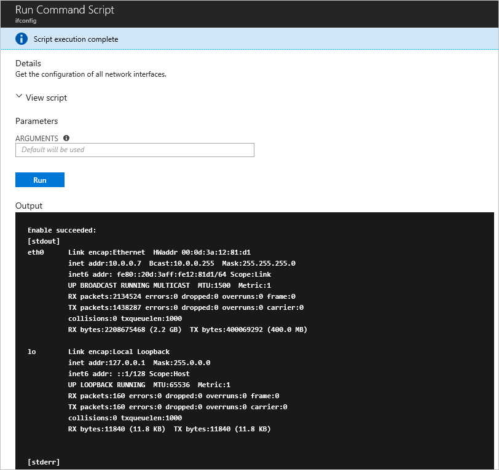

# Run shell scripts in your Linux VM by using Run Command

The Run Command feature uses the virtual machine (VM) agent to run shell scripts within an Azure Linux VM. You can use these scripts for general machine or application management. They can help you to quickly diagnose and remediate VM access and network issues and get the VM back to a good state.

## Benefits

You can access your virtual machines in multiple ways. Run Command can run scripts on your virtual machines remotely by using the VM agent. You use Run Command through the Azure portal, [REST API](/rest/api/compute/virtual%20machines%20run%20commands/runcommand), or [Azure CLI](/cli/azure/vm/run-command?view=azure-cli-latest#az-vm-run-command-invoke) for Linux VMs.

This capability is useful in all scenarios where you want to run a script within a virtual machine. It's one of the only ways to troubleshoot and remediate a virtual machine that doesn't have the RDP or SSH port open because of improper network or administrative user configuration.

## Restrictions

The following restrictions apply when you're using Run Command:

* Output is limited to the last 4,096 bytes.
* The minimum time to run a script is about 20 seconds.
* Scripts run by default as an elevated user on Linux.
* You can run one script at a time.
* Scripts that prompt for information (interactive mode) are not supported.
* You can't cancel a running script.
* The maximum time a script can run is 90 minutes. After that, the script will time out.
* Outbound connectivity from the VM is required to return the results of the script.

> [!NOTE]
> To function correctly, Run Command requires connectivity (port 443) to Azure public IP addresses. If the extension doesn't have access to these endpoints, the scripts might run successfully but not return the results. If you're blocking traffic on the virtual machine, you can use [service tags](../../virtual-network/security-overview.md#service-tags) to allow traffic to Azure public IP addresses by using the `AzureCloud` tag.

## Available commands

This table shows the list of commands available for Linux VMs. You can use the **RunShellScript** command to run any custom script that you want. When you're using the Azure CLI or PowerShell to run a command, the value that you provide for the `--command-id` or `-CommandId` parameter must be one of the following listed values. When you specify a value that is not an available command, you receive this error:

```error
The entity was not found in this Azure location
```

|**Name**|**Description**|
|---|---|
|**RunShellScript**|Runs a Linux shell script.|
|**ifconfig**| Gets the configuration of all network interfaces.|

## Azure CLI

The following example uses the [az vm run-command](/cli/azure/vm/run-command?view=azure-cli-latest#az-vm-run-command-invoke) command to run a shell script on an Azure Linux VM.

```azurecli-interactive
az vm run-command invoke -g myResourceGroup -n myVm --command-id RunShellScript --scripts "sudo apt-get update && sudo apt-get install -y nginx"
```

> [!NOTE]
> To run commands as a different user, enter `sudo -u` to specify a user account.

## Azure portal

Go to a VM in the [Azure portal](https://portal.azure.com) and select **Run command** under **OPERATIONS**. You see a list of the available commands to run on the VM.


Choose a command to run. Some of the commands might have optional or required input parameters. For those commands, the parameters are presented as text fields for you to provide the input values. For each command, you can view the script that's being run by expanding **View script**. **RunShellScript** is different from the other commands, because it allows you to provide your own custom script.

> [!NOTE]
> The built-in commands are not editable.

After you choose the command, select **Run** to run the script. After the script finishes, it returns the output and any errors in the output window. The following screenshot shows an example output from running the **ifconfig** command.



### PowerShell

The following example uses the [Invoke-AzVMRunCommand](https://docs.microsoft.com/powershell/module/az.compute/invoke-azvmruncommand) cmdlet to run a PowerShell script on an Azure VM. The cmdlet expects the script referenced in the `-ScriptPath` parameter to be local to where the cmdlet is being run.

```powershell-interactive
Invoke-AzVMRunCommand -ResourceGroupName '<myResourceGroup>' -Name '<myVMName>' -CommandId 'RunPowerShellScript' -ScriptPath '<pathToScript>' -Parameter @{"arg1" = "var1";"arg2" = "var2"}
```

## Limiting access to Run Command

Listing the run commands or showing the details of a command requires the `Microsoft.Compute/locations/runCommands/read` permission at the subscription level. The built-in [Reader](../../role-based-access-control/built-in-roles.md#reader) role and higher levels have this permission.

Running a command requires the `Microsoft.Compute/virtualMachines/runCommand/action` permission at the subscription level. The [Virtual Machine Contributor](../../role-based-access-control/built-in-roles.md#virtual-machine-contributor) role and higher levels have this permission.

You can use one of the [built-in roles](../../role-based-access-control/built-in-roles.md) or create a [custom role](../../role-based-access-control/custom-roles.md) to use Run Command.

## Next steps

To learn about other ways to run scripts and commands remotely in your VM, see [Run scripts in your Linux VM](run-scripts-in-vm.md).
