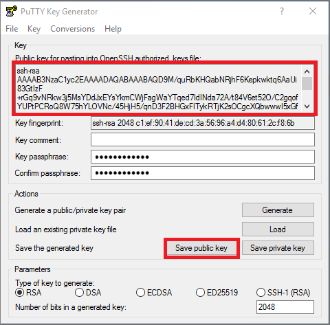
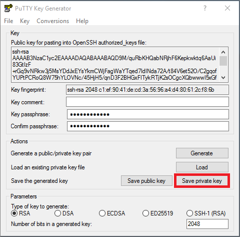
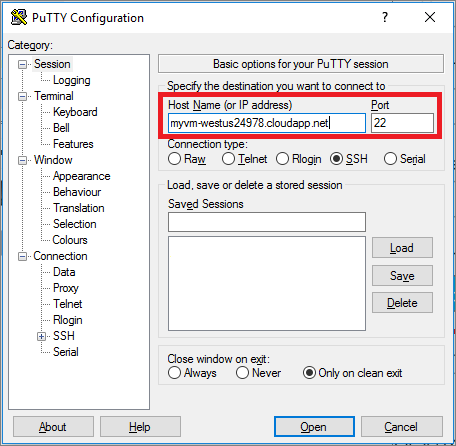

# How to use SSH keys with Windows on Azure

This article describes ways to generate and use *secure shell* (SSH) keys on a Windows computer to create and connect to a Linux virtual machine (VM) in Azure. To use SSH keys from a Linux or macOS client, see the [quick](mac-create-ssh-keys.md) or [detailed](create-ssh-keys-detailed.md) guidance.

[!INCLUDE [virtual-machines-common-ssh-overview](../../../includes/virtual-machines-common-ssh-overview.md)]

[!INCLUDE [virtual-machines-common-ssh-support](../../../includes/virtual-machines-common-ssh-support.md)]

## Windows packages and SSH clients
You connect to and manage Linux VMs in Azure using an *SSH client*. Computers running Linux or macOS usually have a suite of SSH commands to generate and manage SSH keys and to make SSH connections. 

Windows computers do not always have comparable SSH commands installed. Recent versions of Windows 10 provide [OpenSSH client commands](https://blogs.msdn.microsoft.com/commandline/2018/03/07/windows10v1803/) to create and manage SSH keys and make SSH connections from a command prompt. Recent Windows 10 versions also include the [Windows Subsystem for Linux](https://docs.microsoft.com/windows/wsl/about) to run and access utilities such as an SSH client natively within a Bash shell. 

Other common Windows SSH clients you can install locally are included in the following packages:

* [PuTTY](https://www.chiark.greenend.org.uk/~sgtatham/putty/)
* [Git For Windows](https://git-for-windows.github.io/)
* [MobaXterm](https://mobaxterm.mobatek.net/)
* [Cygwin](https://cygwin.com/)

You can also use the SSH utilities available in Bash in the [Azure Cloud Shell](../../cloud-shell/overview.md). 

* Access Cloud Shell in your web browser at [https://shell.azure.com](https://shell.azure.com) or in the [Azure portal](https://portal.azure.com). 
* Access Cloud Shell as a terminal from within Visual Studio Code by installing the [Azure Account extension](https://marketplace.visualstudio.com/items?itemName=ms-vscode.azure-account).

## Create an SSH key pair
The following sections describe two options to create an SSH key pair on Windows. You can use a shell command (`ssh-keygen`) or a GUI tool (PuTTYgen).

### Create SSH keys with ssh-keygen

If you run a command shell on Windows that supports SSH client tools (or you use Azure Cloud Shell), create an SSH key pair using the `ssh-keygen` command. Type the following command, and answer the prompts. If an SSH key pair exists in the chosen location, those files are overwritten. 

```bash
ssh-keygen -t rsa -b 2048
```

For more background and information, see the [quick](mac-create-ssh-keys.md) or [detailed](create-ssh-keys-detailed.md) steps to create SSH keys using `ssh-keygen`.

### Create SSH keys with PuTTYgen

If you prefer to use a GUI-based tool to create SSH keys, you can use the PuTTYgen key generator, included with the [PuTTY download package](https://www.chiark.greenend.org.uk/~sgtatham/putty/download.html). 

To create an SSH RSA key pair with PuTTYgen:

1. Start PuTTYgen.

2. Click **Generate**. By default PuTTYgen generates a 2048-bit SSH-2 RSA key.

4. Move the mouse around in the blank area to provide randomness for the key.

5. After the public key is generated, optionally enter and confirm a passphrase. You will be prompted for the passphrase when you authenticate to the VM with your private SSH key. Without a passphrase, if someone obtains your private key, they can sign in to any VM or service that uses that key. We recommend you create a passphrase. However, if you forget the passphrase, there is no way to recover it.

6. The public key is displayed at the top of the window. You can copy this entire public key and then paste it into the Azure portal or an Azure Resource Manager template when you create a Linux VM. You can also select **Save public key** to save a copy to your computer:

    

7. Optionally, to save the private key in PuTTy private key format (.ppk file), select **Save private key**. You will need the .ppk file later to use PuTTY to make an SSH connection to the VM.

    

    If you want to save the private key in the OpenSSH format, the private key format used by many SSH clients, select **Conversions** > **Export OpenSSH key**.

## Provide an SSH public key when deploying a VM

To create a Linux VM that uses SSH keys for authentication, provide your SSH public key when creating the VM using the Azure portal or other methods.

The following example shows how you would copy and paste this public key into the Azure portal when you create a Linux VM. The public key is typically then stored in the ~/.ssh/authorized_key directory on your new VM.

   


## Connect to your VM

One way to make an SSH connection to your Linux VM from Windows is to use an SSH client. This is the preferred method if you have an SSH client installed on your Windows system, or if you use the SSH tools in Bash in Azure Cloud Shell. If you prefer a GUI-based tool, you can connect with PuTTY.  

### Use an SSH client
With the public key deployed on your Azure VM, and the private key on your local system, SSH to your VM using the IP address or DNS name of your VM. Replace *azureuser* and *myvm.westus.cloudapp.azure.com* in the following command with the administrator user name and the fully qualified domain name (or IP address):

```bash
ssh azureuser@myvm.westus.cloudapp.azure.com
```

If you configured a passphrase when you created your key pair, enter the passphrase when prompted during the sign-in process.

If the VM is using the just-in-time access policy, you need to request access before you can connect to the VM. For more information about the just-in-time policy, see [Manage virtual machine access using the just in time policy](../../security-center/security-center-just-in-time.md).

### Connect with PuTTY

If you installed the [PuTTY download package](https://www.chiark.greenend.org.uk/~sgtatham/putty/download.html) and previously generated a PuTTY private key (.ppk) file, you can connect to a Linux VM with PuTTY.

1. Start PuTTy.

2. Fill in the host name or IP address of your VM from the Azure portal:

    

3. Select the **Connection** > **SSH** > **Auth** category. Browse to and select your PuTTY private key (.ppk file):

    

4. Click **Open** to connect to your VM.

## Next steps

* For detailed steps, options, and advanced examples of working with SSH keys, see [Detailed steps to create SSH key pairs](create-ssh-keys-detailed.md).

* You can also use PowerShell in Azure Cloud Shell to generate SSH keys and make SSH connections to Linux VMs. See the [PowerShell quickstart](../../cloud-shell/quickstart-powershell.md#ssh).

* If you have difficulty using SSH to connect to your Linux VMs, see [Troubleshoot SSH connections to an Azure Linux VM](troubleshoot-ssh-connection.md?toc=%2fazure%2fvirtual-machines%2flinux%2ftoc.json).
