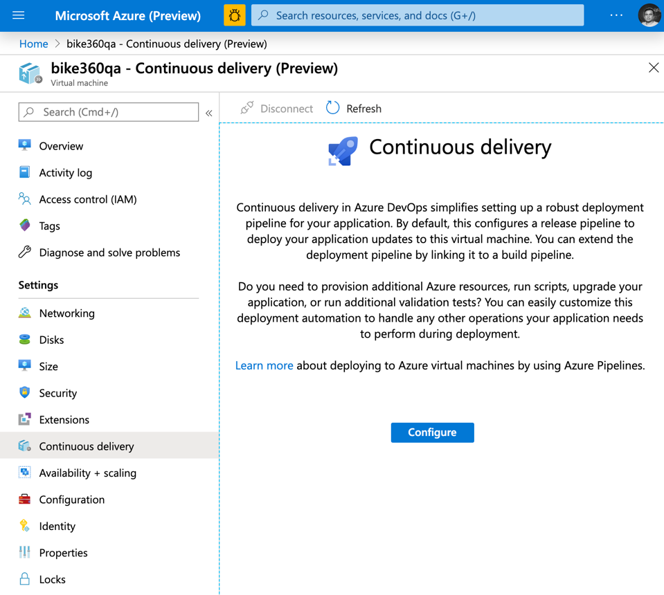
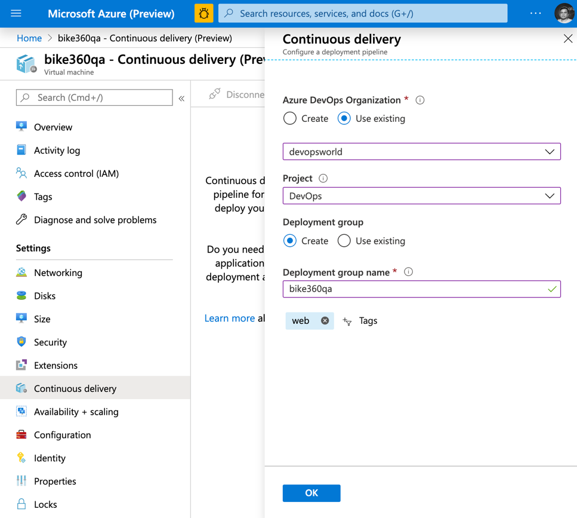
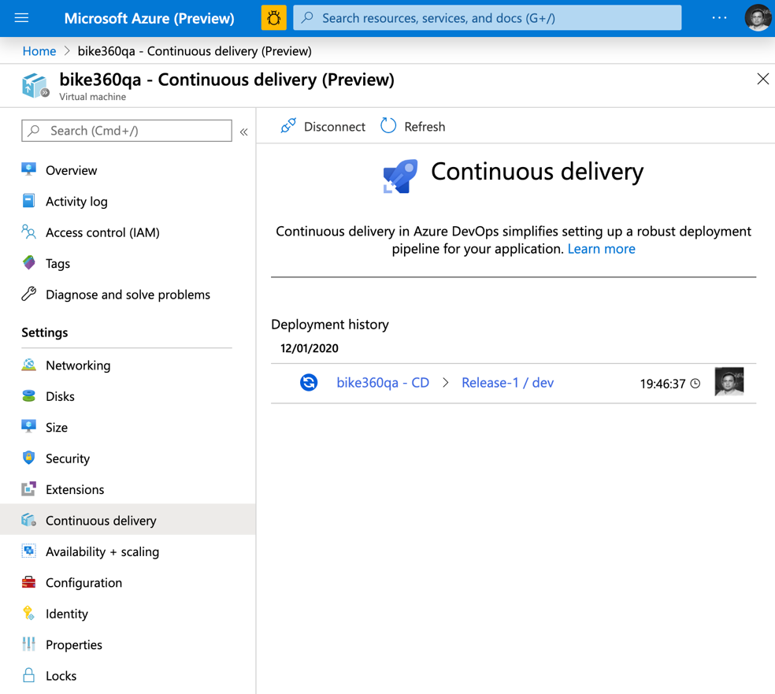
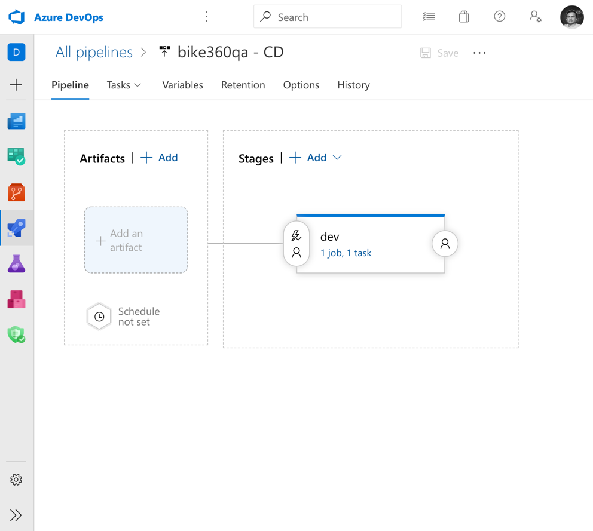
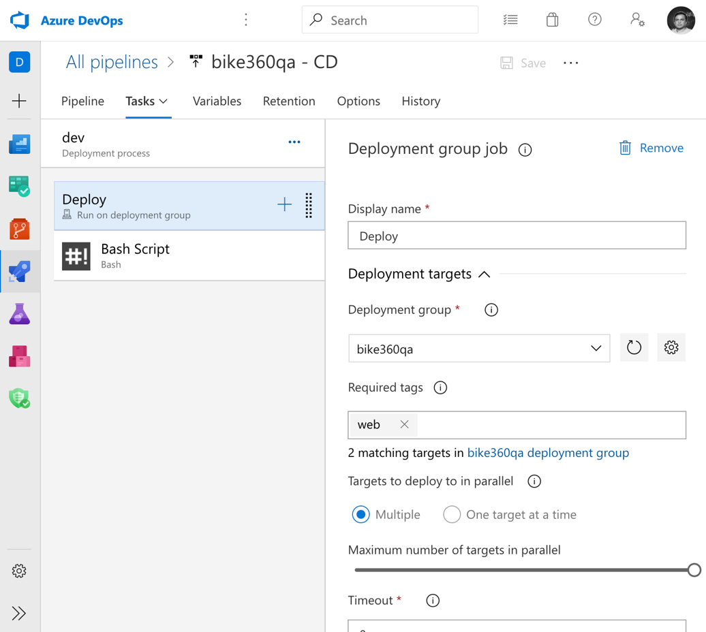
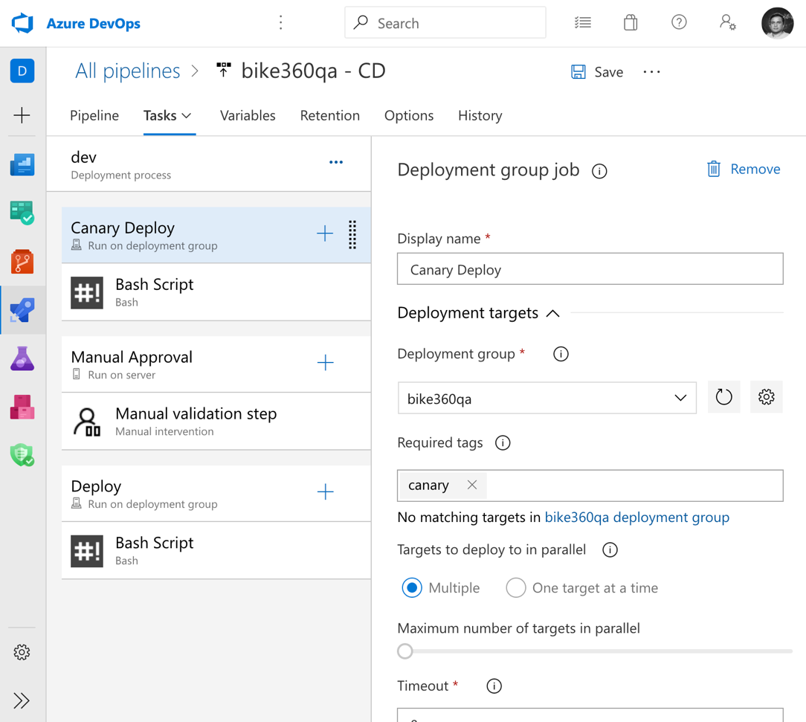
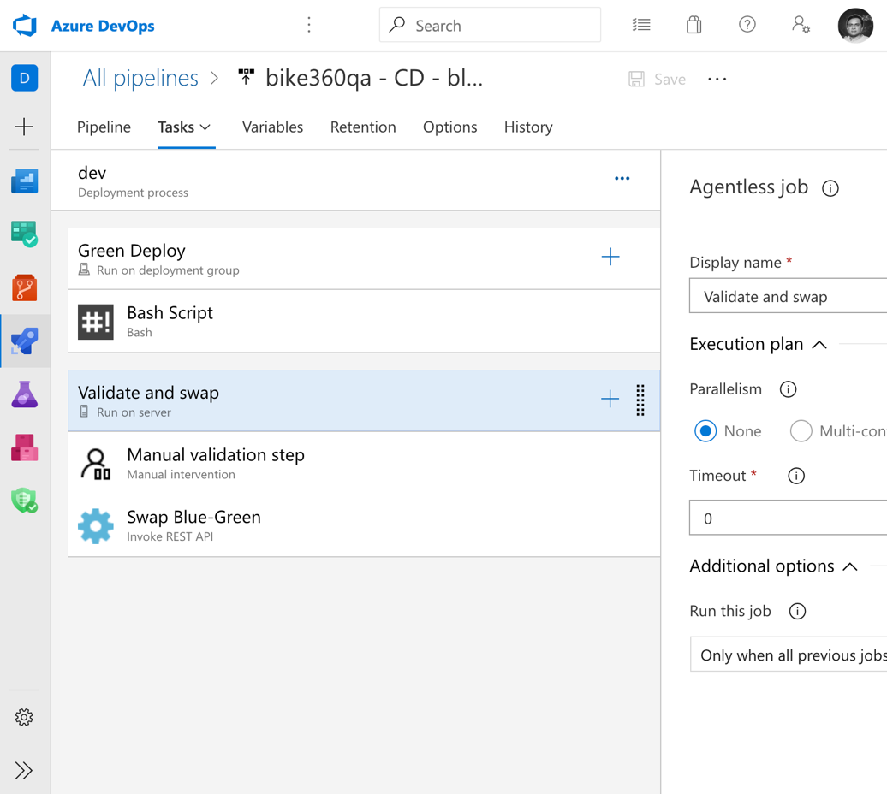

# Tutorial: Integrated DevOps for IaaS and PaaS on Azure

With end-to-end solutions on Azure, teams can implement DevOps practices in each of the application lifecycle phases: plan, develop, deliver, and operate. 

Below are some of the Azure Services that simplify cloud workloads and can be combined to enable amazingly powerful scenarios.
These technologies, combined with people and processes, enable teams to continually provide value to customers. 

- Azure: https://portal.azure.com – Portal for building cloud workloads. Manage and monitor everything from simple web apps to complex cloud applications 
- Azure DevOps: https://dev.azure.com – Plan smarter, collaborate better, and ship faster with a set of modern dev services 
- Azure Machine Learning studio: https://ml.azure.com - Prep data, train, and deploy machine learning models 
 

Azure DevOps is a built-in Azure service that automates each part of the DevOps process with continuous integration and continuous delivery for any Azure resource.
Whether your app uses virtual machines, web apps, Kubernetes, or any other resource, you can implement, infrastructure as code, continuous integration, continuous testing, continuous delivery, and continuous monitoring with Azure and Azure DevOps.  
 
 
 
## IaaS - Configure CI/CD 
Azure Pipelines provides a complete, fully featured set of CI/CD automation tools for deployments to virtual machines. You can configure a continuous delivery pipeline for an Azure VM directly from Azure portal. This document contains the steps associated with setting up a CI/CD pipeline for multi-machine deployments from Azure portal. 
Configure CI/CD on Virtual Machines.

Virtual machines can be added as targets to a [deployment group](https://docs.microsoft.com/azure/devops/pipelines/release/deployment-groups) and can be targeted for multi-machine rolling updates. Deployment history views within Deployment groups provide traceability from VM to the pipeline and then to the commit. 
 
**Rolling updates**: A rolling deployment replaces instances of the previous version of an application with instances of the new version of the application on a fixed set of machines (rolling set) in each iteration. Let’s walkthrough how you can configure a rolling update to virtual machines.  
You can configure rolling updates to your “**virtual machines**” within the Azure portal using continuous delivery option. 

Here is the step-by-step walkthrough. 
1. Sign in to your Azure portal and navigate to a virtual machine. 
2. In the VM left pane, navigate to the **continuous delivery** menu. Then click on **Configure**. 
    
3. In the configuration panel, click on “Azure DevOps Organization” to select an existing account or create one. Then select the project under which you would like to configure the pipeline.  
    
4. A deployment group is a logical set of deployment target machines that represent the physical environments; for example, "Dev", "Test", "UAT", and "Production". You can create a new deployment group or select an existing deployment group. You can optionally tag the machine with the role. For example, ‘web’, ‘db’ etc.  
5. Click **OK** on the dialog to configure the continuous delivery pipeline. 
6. Once done, you will have a continuous delivery pipeline configured to deploy to the virtual machine.  
   
7. You will see that the deployment to the virtual machine is in progress. You can click on the link to navigate to the pipeline. Click on **Release-1** to view the deployment. Or you can click on the **Edit** to modify the release pipeline definition. 
8. If you have multiple VMs to be configured, repeat the steps 2-5, for other VMs to be added to the deployment group. 
9. Once done, click on the pipeline definition, navigate to the Azure DevOps organization, and click on **Edit** release pipeline. 
   
10. Click on the link **1 job, 1 task** in **dev** stage. Click on the **Deploy** phase.  
   
11. From the configuration pane on the right, you can see that by default the pipeline is configured to do a rolling update to all targets in parallel. You can configure the deployments to happen either one at a time or in terms of percentage by using the slider.  
  
  
**Canary** reduces the risk by slowly rolling out the change to a small subset of users. As you gain more confidence in the new version, you can start releasing it to more servers in your infrastructure and routing more users to it. 
You can configure canary deployments to your “**virtual machines**” with the Azure portal using continuous delivery option. 
Here is the step-by-step walkthrough. 
1. Sign in to your Azure portal and navigate to a virtual machine 
2. Follow the steps 2-5 in the previous section to add multiple VMs to the deployment group. 
3. Add a custom tag to the VMs that are to be part of canary deployments. For example, “canary”.
4. Once the pipeline is configured for the VMs, click on the pipeline, launch Azure DevOps organization, **Edit** the pipeline, and navigate to the **dev** stage. Add tag to the filter “canary”. 
5. Add another deployment group phase, configure the phase with the tags to target remaining VMs in the deployment group.  
6. Optionally, configure a manual validation step that can promote/reject the canary deployments. 
   

**Blue-Green** reduces deployment downtime by having identical standby environment. At any time one of the environments is live. As you prepare for a new release, you do your final stage of testing in the green environment. Once the software is working in the green environment, switch the traffic so that all incoming requests go to the green environment - the blue environment is now idle.
You can configure Blue-Green deployments to your “**virtual machines**” from the Azure portal using the continuous delivery option. 

Here is the step-by-step walkthrough. 

1. Sign in to your Azure portal and navigate to a Virtual Machine 
2. Follow the steps 2-5 under the **Rolling updates** section to add multiple VMs to the deployment group. Add a custom tag to the VMs that are to be part of blue-green deployments. For example, “blue” or “green” for the VMs that are for the stand-by role. 
3. Once the pipeline is configured for the VMs, click on the pipeline, launch Azure DevOps organization, **Edit** the pipeline, navigate to the **dev** stage. Add tag to the filter “green”. 
4. Add an agent-less phase, configure the phase with manual validation step and an invoke-REST api step to swap the tags. 
   
 
 
## Azure DevOps project 
Get started with Azure more easily than ever.
 
With DevOps Projects, start running your application on any Azure service in just three steps: select an application language, a runtime, and an Azure service.
 
[Learn more](https://azure.microsoft.com/features/devops-projects/ ).
 
## Additional resources 
- [Deploy to Azure Virtual Machines using DevOps project](https://docs.microsoft.com/azure/devops-project/azure-devops-project-vms)
- [Implement continuous deployment of your app to an Azure Virtual Machine Scale Set](https://docs.microsoft.com/azure/devops/pipelines/apps/cd/azure/deploy-azure-scaleset)
