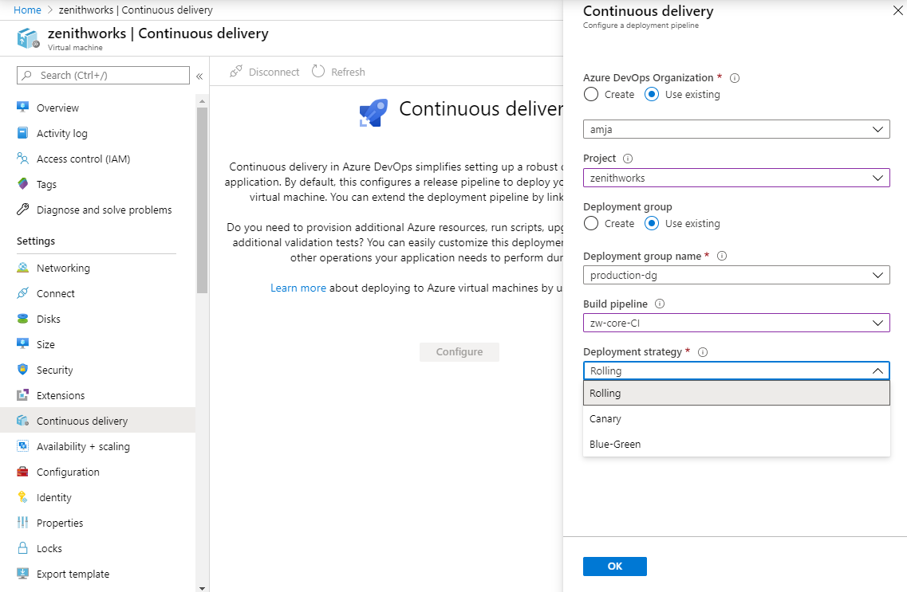
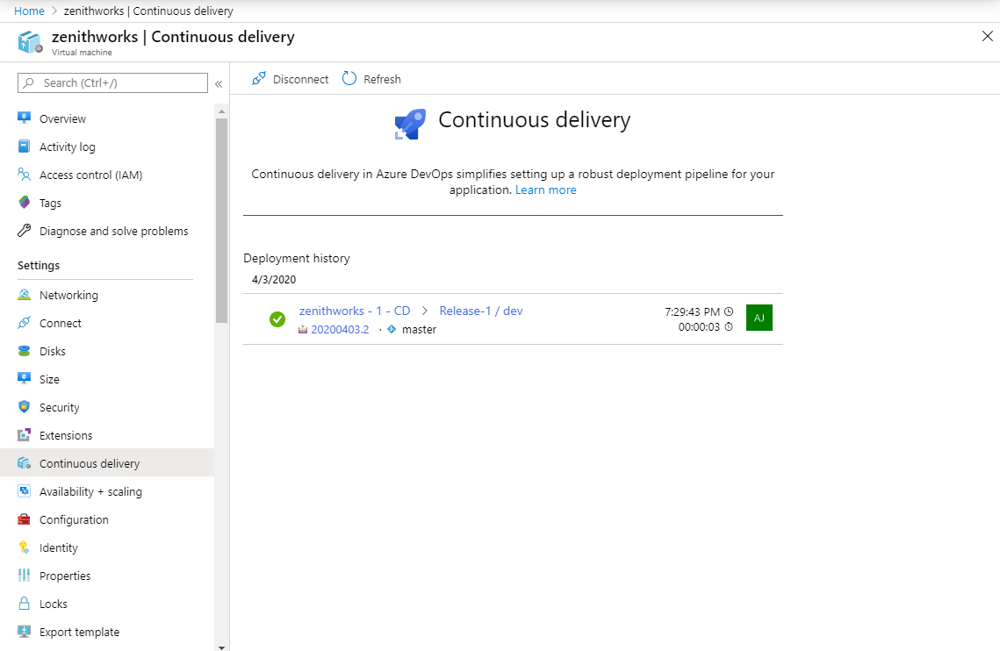
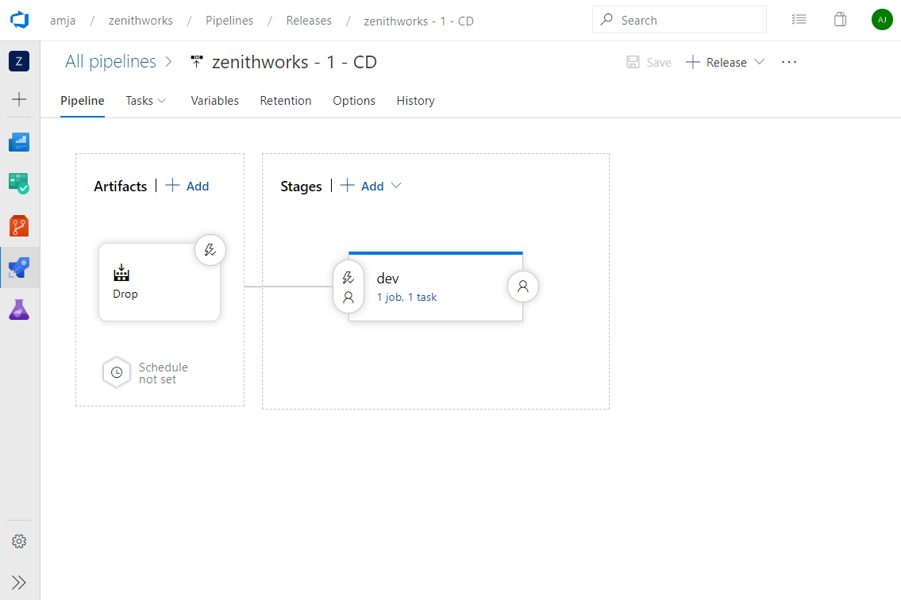

# Tutorial - Configure Rolling deployment strategy for Azure Linux Virtual Machines

Azure DevOps is a built-in Azure service that automates each part of the DevOps process with continuous integration and continuous delivery for any Azure resource.
Whether your app uses virtual machines, web apps, Kubernetes, or any other resource, you can implement infrastructure as code, continuous integration, continuous testing, continuous delivery, and continuous monitoring with Azure and Azure DevOps.  

 

## IaaS - Configure CI/CD 
Azure Pipelines provides a complete, fully featured set of CI/CD automation tools for deployments to virtual machines. You can configure a continuous delivery pipeline for an Azure VM directly from the Azure portal. This document contains the steps associated with setting up a CI/CD pipeline for rolling multi-machine deployments from Azure portal. You can also take a look at other strategies like [canary](https://aka.ms/AA7jdrz) and [blue-green](https://aka.ms/AA83fwu), which are supported out-of-box from Azure portal. 

**Configure CI/CD on Virtual Machines**

Virtual machines can be added as targets to a [deployment group](https://docs.microsoft.com/azure/devops/pipelines/release/deployment-groups) and can be targeted for multi-machine update. Once deployed, **Deployment History** within a deployment group provides traceability from VM to the pipeline and then to the commit. 
 

**Rolling Deployments**: A rolling deployment replaces instances of the previous version of an application with instances of the new version of the application on a fixed set of machines (rolling set) in each iteration. Let’s walkthrough how you can configure a rolling update to virtual machines.  
You can configure rolling updates to your “**virtual machines**” within the Azure portal using continuous delivery option. 

Here is the step-by-step walkthrough. 
1. Sign in to your Azure portal and navigate to a virtual machine. 
2. In the VM left pane, navigate to the **continuous delivery** menu. Then click on **Configure**. 

    
3. In the configuration panel, click on “Azure DevOps Organization” to select an existing account or create one. Then select the project under which you would like to configure the pipeline.  

    
4. A deployment group is a logical set of deployment target machines that represent the physical environments; for example, "Dev", "Test", "UAT", and "Production". You can create a new deployment group or select an existing deployment group. 
5. Select the build pipeline that publishes the package to be deployed to the virtual machine. Note that the published package should have a deployment script _deploy.ps1_ or _deploy.sh_ in the `deployscripts` folder at package root. This deployment script will be run by Azure DevOps pipeline at run time.
6. Select the deployment strategy of your choice. In this case, lets select 'Rolling'.
7. Optionally, you can tag the machine with the role. For example, ‘web’, ‘db’ etc. This helps you target VMs that have specific role only.
8. Click **OK** on the dialog to configure the continuous delivery pipeline. 
9. Once done, you will have a continuous delivery pipeline configured to deploy to the virtual machine.  

   
10. You will see that the deployment to the virtual machine is in progress. You can click on the link to navigate to the pipeline. Click on **Release-1** to view the deployment. Or you can click on the **Edit** to modify the release pipeline definition. 
11. If you have multiple VMs to be configured, repeat the steps 2-4 for other VMs to be added to the deployment group. Note that if you select an Deployment Group for which a pipeline run already exists, the VM will be just added to the deployment group without creating any new pipelines. 
12. Once done, click on the pipeline definition, navigate to the Azure DevOps organization, and click on **Edit** release pipeline. 
   
13. Click on the link **1 job, 1 task** in **dev** stage. Click on the **Deploy** phase.
   
14. From the configuration pane on the right, you can specify the number of machines that you want to deploy in parallel in each iteration. In case you want to deploy to multiple machines at a time, you can specify it in terms of percentage by using the slider.  

15. The Execute Deploy Script task will by default execute the deployment script _deploy.ps1_ or _deploy.sh_ in 'deployscripts' folder at the root directory of published package.  

## Other deployment strategies

- [Configure Canary Deployment Strategy](https://aka.ms/AA7jdrz)
- [Configure Blue-Green Deployment Strategy](https://aka.ms/AA83fwu)

 
## Azure DevOps project 
Get started with Azure more easily than ever.
 
With DevOps Projects, start running your application on any Azure service in just three steps: select an application language, a runtime, and an Azure service.
 
[Learn more](https://azure.microsoft.com/features/devops-projects/ ).
 
## Additional resources 
- [Deploy to Azure Virtual Machines using DevOps project](https://docs.microsoft.com/azure/devops-project/azure-devops-project-vms)
- [Implement continuous deployment of your app to an Azure Virtual Machine Scale Set](https://docs.microsoft.com/azure/devops/pipelines/apps/cd/azure/deploy-azure-scaleset)
