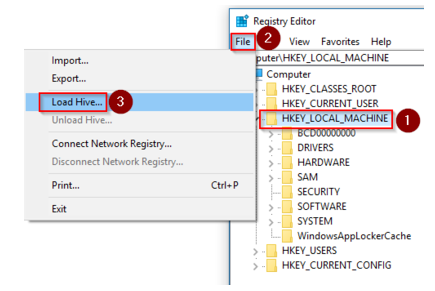

# Enable or disable a firewall rule on an Azure VM Guest OS

This article provides a reference for troubleshooting a situation in which you suspect that the guest operating system firewall is filtering partial traffic on a virtual machine (VM). This could be useful for the following reasons:

*	If a change was deliberately made to the firewall that caused RDP connections to fail, using the Custom Script Extension feature can resolve the issue.

*   Disabling all firewall profiles is a more foolproof way of troubleshooting than setting the RDP-specific firewall rule.

## Solution

How you configure the firewall rules depends on the level of access to the VM that’s required. The following examples use RDP rules. However, the same methods can be applied to any other kind of traffic by pointing to the correct registry key.

### Online troubleshooting 

#### Mitigation 1: Custom Script Extension

1.	Create your script by using the following template.

    *	To enable a rule:
        ```cmd
        netsh advfirewall firewall set rule dir=in name="Remote Desktop - User Mode (TCP-In)" new enable=yes
        ```

    *   To disable a rule:
        ```cmd
        netsh advfirewall firewall set rule dir=in name="Remote Desktop - User Mode (TCP-In)" new enable=no
        ```

2.	Upload this script in the Azure portal using the [Custom Script Extension](../extensions/custom-script-windows.md) feature. 

#### Mitigation 2: Remote PowerShell

If the VM is online and can be accessed on another VM on the same virtual network, you can make the follow mitigations by using the other VM.

1.	On the troubleshooting VM, open a PowerShell console window.

2.	Run the following commands, as appropriate.

    *	To enable a rule:
        ```powershell
        Enter-PSSession (New-PSSession -ComputerName "<HOSTNAME>" -Credential (Get-Credential) -SessionOption (New-PSSessionOption -SkipCACheck -SkipCNCheck)) 
        Enable-NetFirewallRule -DisplayName  "RemoteDesktop-UserMode-In-TCP"
        exit
        ```

    *	To disable a rule:
        ```powershell
        Enter-PSSession (New-PSSession -ComputerName "<HOSTNAME>" -Credential (Get-Credential) -SessionOption (New-PSSessionOption -SkipCACheck -SkipCNCheck)) 
        Disable-NetFirewallRule -DisplayName  "RemoteDesktop-UserMode-In-TCP"
        exit
        ```

#### Mitigation 3: PSTools commands

If the VM is online and can be accessed on another VM on the same virtual network, you can make the follow mitigations by using the other VM.

1.	On the troubleshooting VM, download [PSTools](https://docs.microsoft.com/sysinternals/downloads/pstools).

2.	Open a CMD instance, and access the VM through its Internal IP (DIP). 

    * To enable a rule:
        ```cmd
        psexec \\<DIP> ​-u <username> cmd
        netsh advfirewall firewall set rule dir=in name="Remote Desktop - User Mode (TCP-In)" new enable=yes
        ```

    *	To disable a rule:
        ```cmd
        psexec \\<DIP> ​-u <username> cmd
        netsh advfirewall firewall set rule dir=in name="Remote Desktop - User Mode (TCP-In)" new enable=no
        ```

#### Mitigation 4: Remote Registry

If the VM is online and can be accessed on another VM on the same virtual network, you can use [Remote Registry](https://support.microsoft.com/help/314837/how-to-manage-remote-access-to-the-registry) on the other VM.

1.	On the troubleshooting VM, start Registry Editor (regedit.exe), and then select **File** > **Connect Network Registry**.

2.	Open the *TARGET MACHINE*\SYSTEM branch, and then specify the following values:

    * To enable a rule, open the following registry value:
    
        *TARGET MACHINE*\SYSTEM\CurrentControlSet\Services\SharedAccess\Parameters\FirewallPolicy\FirewallRules\RemoteDesktop-UserMode-In-TCP
    
        Then, change **Active=FALSE** to **Active=TRUE** in the string:

        **v2.22|Action=Allow|Active=TRUE|Dir=In|Protocol=6|Profile=Domain|Profile=Private|Profile=Public|LPort=3389|App=%SystemRoot%\system32\svchost.exe|Svc=termservice|Name=\@FirewallAPI.dll,-28775|Desc=\@FirewallAPI.dll,-28756|EmbedCtxt=\@FirewallAPI.dll,-28752|**
    
    * To disable a rule, open the following registry value:
    
        *TARGET MACHINE*\SYSTEM\CurrentControlSet\Services\SharedAccess\Parameters\FirewallPolicy\FirewallRules\RemoteDesktop-UserMode-In-TCP

        Then, change **Active =TRUE** to **Active=FALSE**:
        
        **v2.22|Action=Allow|Active=FALSE|Dir=In|Protocol=6|Profile=Domain|Profile=Private|Profile=Public|LPort=3389|App=%SystemRoot%\system32\svchost.exe|Svc=termservice|Name=\@FirewallAPI.dll,-28775|Desc=\@FirewallAPI.dll,-28756|EmbedCtxt=\@FirewallAPI.dll,-28752|**

3.	Restart the VM to apply the changes.

### Offline troubleshooting 

If you cannot access the VM by any method, using Custom Script Extension will fail, and you will have to work in OFFLINE mode by working directly through the system disk.

Before you follow these steps, take a snapshot of the system disk of the affected VM as a backup. For more information, see [Snapshot a disk](../windows/snapshot-copy-managed-disk.md).

1.  [Attach the system disk to a recovery VM](troubleshoot-recovery-disks-portal-windows.md).

2.	Start a Remote Desktop connection to the recovery VM.

3.	Make sure that the disk is flagged as **Online** in the Disk Management console. Note that the drive letter that is assigned to the attached system disk.

4.	Before you make any changes, create a copy of the \windows\system32\config folder in case a rollback of the changes is necessary.

5.	On the troubleshooting VM, start Registry Editor (regedit.exe).

6.	Highlight the **HKEY_LOCAL_MACHINE** key, and then select **File** > **Load Hive** from the menu.

    

7.	Locate and then open the \windows\system32\config\SYSTEM file. 

    > [!Note]
    > You are prompted for a name. Enter **BROKENSYSTEM**, and then expand **HKEY_LOCAL_MACHINE**. You will now see an additional key that’s named **BROKENSYSTEM**. For this troubleshooting, we are mounting these problem hives as **BROKENSYSTEM**.

8.	Make the following changes on the BROKENSYSTEM branch:

    1.	Check which **ControlSet** registry key the VM is starting from. You will see its key number in HKLM\BROKENSYSTEM\Select\Current.

    2.	To enable a rule, open the following registry value:
    
        HKLM\BROKENSYSTEM\ControlSet00X\Services\SharedAccess\Parameters\FirewallPolicy\FirewallRules\RemoteDesktop-UserMode-In-TCP
        
        Then, change **Active=FALSE** to **Active=True**.
        
        **v2.22|Action=Allow|Active=TRUE|Dir=In|Protocol=6|Profile=Domain|Profile=Private|Profile=Public|LPort=3389|App=%SystemRoot%\system32\svchost.exe|Svc=termservice|Name=\@FirewallAPI.dll,-28775|Desc=\@FirewallAPI.dll,-28756|EmbedCtxt=\@FirewallAPI.dll,-28752|**

    3.	To disable a rule, open the following registry key:

        HKLM\BROKENSYSTEM\ControlSet00X\Services\SharedAccess\Parameters\FirewallPolicy\FirewallRules\RemoteDesktop-UserMode-In-TCP

        Then, change **Active=True** to **Active=FALSE**.
        
        **v2.22|Action=Allow|Active=FALSE|Dir=In|Protocol=6|Profile=Domain|Profile=Private|Profile=Public|LPort=3389|App=%SystemRoot%\system32\svchost.exe|Svc=termservice|Name=\@FirewallAPI.dll,-28775|Desc=\@FirewallAPI.dll,-28756|EmbedCtxt=\@FirewallAPI.dll,-28752|**

9.	Highlight **BROKENSYSTEM**, and then select **File** > **Unload Hive​** from the menu.

10.	[Detach the system disk and re-create the VM](troubleshoot-recovery-disks-portal-windows.md).

11.	Check whether the issue is resolved.
