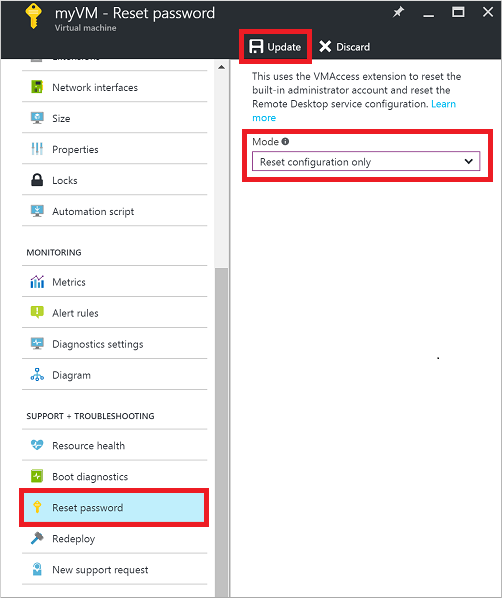
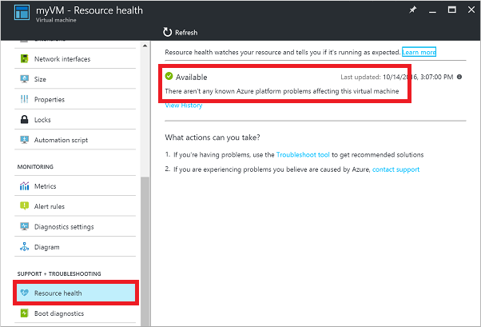
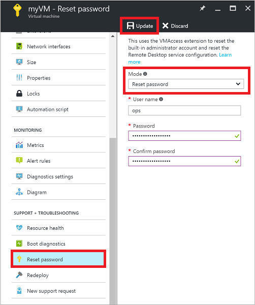
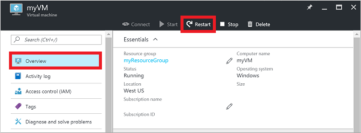
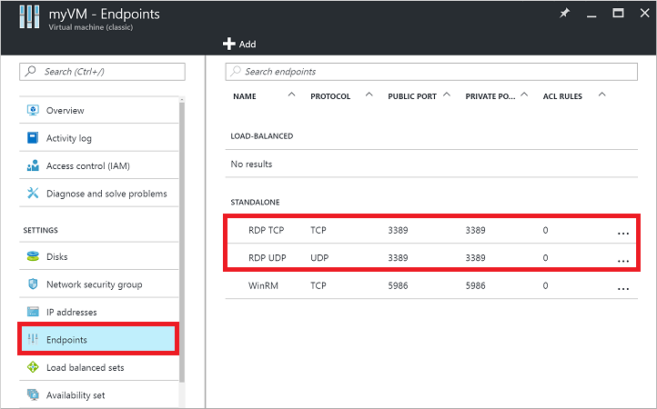
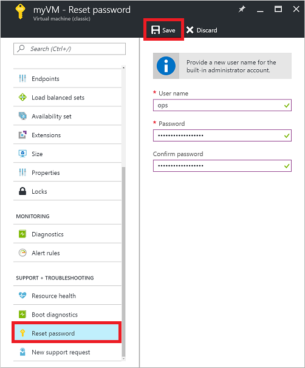
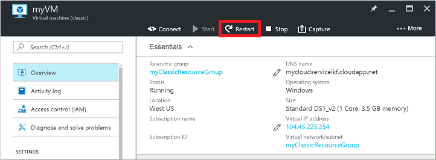

# Troubleshoot Remote Desktop connections to an Azure virtual machine
The Remote Desktop Protocol (RDP) connection to your Windows-based Azure virtual machine (VM) can fail for various reasons, leaving you unable to access your VM. The issue can be with the Remote Desktop service on the VM, the network connection, or the Remote Desktop client on your host computer. This article guides you through some of the most common methods to resolve RDP connection issues. 

If you need more help at any point in this article, you can contact the Azure experts on [the MSDN Azure and Stack Overflow forums](https://azure.microsoft.com/support/forums/). Alternatively, you can file an Azure support incident. Go to the [Azure support site](https://azure.microsoft.com/support/options/) and select **Get Support**.

 

<a id="quickfixrdp"></a>

## Quick troubleshooting steps
After each troubleshooting step, try reconnecting to the VM:

1. Reset Remote Desktop configuration.
2. Check Network Security Group rules / Cloud Services endpoints.
3. Review VM console logs.
4. Reset the NIC for the VM.
5. Check the VM Resource Health.
6. Reset your VM password.
7. Restart your VM.
8. Redeploy your VM.

Continue reading if you need more detailed steps and explanations. Verify that local network equipment such as routers and firewalls are not blocking outbound TCP port 3389, as noted in [detailed RDP troubleshooting scenarios](detailed-troubleshoot-rdp.md).

> [!TIP]
> If the **Connect** button for your VM is grayed out in the portal and you are not connected to Azure via an [Express Route](../../expressroute/expressroute-introduction.md) or [Site-to-Site VPN](../../vpn-gateway/vpn-gateway-howto-site-to-site-resource-manager-portal.md) connection, you need to create and assign your VM a public IP address before you can use RDP. You can read more about [public IP addresses in Azure](../../virtual-network/public-ip-addresses.md).


## Ways to troubleshoot RDP issues
You can troubleshoot VMs created using the Resource Manager deployment model by using one of the following methods:

* Azure portal - great if you need to quickly reset the RDP configuration or user credentials and you don't have the Azure tools installed.
* Azure PowerShell - if you are comfortable with a PowerShell prompt, quickly reset the RDP configuration or user credentials using the Azure PowerShell cmdlets.

You can also find steps on troubleshooting VMs created using the [Classic deployment model](#troubleshoot-vms-created-using-the-classic-deployment-model).

<a id="fix-common-remote-desktop-errors"></a>

## Troubleshoot using the Azure portal
After each troubleshooting step, try connecting to your VM again. If you still cannot connect, try the next step.

1. **Reset your RDP connection**. This troubleshooting step resets the RDP configuration when Remote Connections are disabled or Windows Firewall rules are blocking RDP, for example.
   
    Select your VM in the Azure portal. Scroll down the settings pane to the **Support + Troubleshooting** section near bottom of the list. Click the **Reset password** button. Set the **Mode** to **Reset configuration only** and then click the **Update** button:
   
    
2. **Verify Network Security Group rules**. Use [IP flow verify](../../network-watcher/diagnose-vm-network-traffic-filtering-problem.md) to confirm if a rule in a Network Security Group is blocking traffic to or from a virtual machine. You can also review effective security group rules to ensure inbound "Allow" NSG rule exists and is prioritized for RDP port(default 3389). For more information, see [Using Effective Security Rules to troubleshoot VM traffic flow](../../virtual-network/diagnose-network-traffic-filter-problem.md).

3. **Review VM boot diagnostics**. This troubleshooting step reviews the VM console logs to determine if the VM is reporting an issue. Not all VMs have boot diagnostics enabled, so this troubleshooting step may be optional.
   
    Specific troubleshooting steps are beyond the scope of this article, but may indicate a wider problem that is affecting RDP connectivity. For more information on reviewing the console logs and VM screenshot, see [Boot Diagnostics for VMs](boot-diagnostics.md).

4. **Reset the NIC for the VM**. For more information, see [how to reset NIC for Azure Windows VM](./reset-network-interface.md).
5. **Check the VM Resource Health**. This troubleshooting step verifies there are no known issues with the Azure platform that may impact connectivity to the VM.
   
    Select your VM in the Azure portal. Scroll down the settings pane to the **Support + Troubleshooting** section near bottom of the list. Click the **Resource health** button. A healthy VM reports as being **Available**:
   
    
6. **Reset user credentials**. This troubleshooting step resets the password on a local administrator account when you are unsure or have forgotten the credentials.  Once you have logged into the VM, you should reset the password for that user.
   
    Select your VM in the Azure portal. Scroll down the settings pane to the **Support + Troubleshooting** section near bottom of the list. Click the **Reset password** button. Make sure the **Mode** is set to **Reset password** and then enter your username and a new password. Finally, click the **Update** button:
   
    
7. **Restart your VM**. This troubleshooting step can correct any underlying issues the VM itself is having.
   
    Select your VM in the Azure portal and click the **Overview** tab. Click the **Restart** button:
   
    
8. **Redeploy your VM**. This troubleshooting step redeploys your VM to another host within Azure to correct any underlying platform or networking issues.
   
    Select your VM in the Azure portal. Scroll down the settings pane to the **Support + Troubleshooting** section near bottom of the list. Click the **Redeploy** button, and then click **Redeploy**:
   
    
   
    After this operation finishes, ephemeral disk data is lost and dynamic IP addresses that are associated with the VM are updated.

9. **Verify routing**. Use Network Watcher's [Next hop](../../network-watcher/diagnose-vm-network-routing-problem.md) capability to confirm that a route isn't preventing traffic from being routed to or from a virtual machine. You can also review effective routes to see all effective routes for a network interface. For more information, see [Using effective routes to troubleshoot VM traffic flow](../../virtual-network/diagnose-network-routing-problem.md).

10. Ensure that any on-premises firewall, or firewall on your computer, allows outbound TCP 3389 traffic to Azure.

If you are still encountering RDP issues, you can [open a support request](https://azure.microsoft.com/support/options/) or read [more detailed RDP troubleshooting concepts and steps](detailed-troubleshoot-rdp.md?toc=%2fazure%2fvirtual-machines%2fwindows%2ftoc.json).

## Troubleshoot using Azure PowerShell
If you haven't already, [install and configure the latest Azure PowerShell](/powershell/azure/).

The following examples use variables such as `myResourceGroup`, `myVM`, and `myVMAccessExtension`. Replace these variable names and locations with your own values.

> [!NOTE]
> You reset the user credentials and the RDP configuration by using the [Set-AzVMAccessExtension](/powershell/module/az.compute/set-azvmaccessextension) PowerShell cmdlet. In the following examples, `myVMAccessExtension` is a name that you specify as part of the process. If you have previously worked with the VMAccessAgent, you can get the name of the existing extension by using `Get-AzVM -ResourceGroupName "myResourceGroup" -Name "myVM"` to check the properties of the VM. To view the name, look under the 'Extensions' section of the output.

After each troubleshooting step, try connecting to your VM again. If you still cannot connect, try the next step.

1. **Reset your RDP connection**. This troubleshooting step resets the RDP configuration when Remote Connections are disabled or Windows Firewall rules are blocking RDP, for example.
   
    The follow example resets the RDP connection on a VM named `myVM` in the `WestUS` location and in the resource group named `myResourceGroup`:
   
    ```powershell
    Set-AzVMAccessExtension -ResourceGroupName "myResourceGroup" `
        -VMName "myVM" -Location Westus -Name "myVMAccessExtension"
    ```
2. **Verify Network Security Group rules**. This troubleshooting step verifies that you have a rule in your Network Security Group to permit RDP traffic. The default port for RDP is TCP port 3389. A rule to permit RDP traffic may not be created automatically when you create your VM.
   
    First, assign all the configuration data for your Network Security Group to the `$rules` variable. The following example obtains information about the Network Security Group named `myNetworkSecurityGroup` in the resource group named `myResourceGroup`:
   
    ```powershell
    $rules = Get-AzNetworkSecurityGroup -ResourceGroupName "myResourceGroup" `
        -Name "myNetworkSecurityGroup"
    ```
   
    Now, view the rules that are configured for this Network Security Group. Verify that a rule exists to allow TCP port 3389 for inbound connections as follows:
   
    ```powershell
    $rules.SecurityRules
    ```
   
    The following example shows a valid security rule that permits RDP traffic. You can see `Protocol`, `DestinationPortRange`, `Access`, and `Direction` are configured correctly:
   
    ```powershell
    Name                     : default-allow-rdp
    Id                       : /subscriptions/guid/resourceGroups/myResourceGroup/providers/Microsoft.Network/networkSecurityGroups/myNetworkSecurityGroup/securityRules/default-allow-rdp
    Etag                     : 
    ProvisioningState        : Succeeded
    Description              : 
    Protocol                 : TCP
    SourcePortRange          : *
    DestinationPortRange     : 3389
    SourceAddressPrefix      : *
    DestinationAddressPrefix : *
    Access                   : Allow
    Priority                 : 1000
    Direction                : Inbound
    ```
   
    If you do not have a rule that allows RDP traffic, [create a Network Security Group rule](../windows/nsg-quickstart-powershell.md?toc=%2fazure%2fvirtual-machines%2fwindows%2ftoc.json). Allow TCP port 3389.
3. **Reset user credentials**. This troubleshooting step resets the password on the local administrator account that you specify when you are unsure of, or have forgotten, the credentials.
   
    First, specify the username and a new password by assigning credentials to the `$cred` variable as follows:
   
    ```powershell
    $cred=Get-Credential
    ```
   
    Now, update the credentials on your VM. The following example updates the credentials on a VM named `myVM` in the `WestUS` location and in the resource group named `myResourceGroup`:
   
    ```powershell
    Set-AzVMAccessExtension -ResourceGroupName "myResourceGroup" `
        -VMName "myVM" -Location WestUS -Name "myVMAccessExtension" `
        -UserName $cred.GetNetworkCredential().Username `
        -Password $cred.GetNetworkCredential().Password
    ```
4. **Restart your VM**. This troubleshooting step can correct any underlying issues the VM itself is having.
   
    The following example restarts the VM named `myVM` in the resource group named `myResourceGroup`:
   
    ```powershell
    Restart-AzVM -ResourceGroup "myResourceGroup" -Name "myVM"
    ```
5. **Redeploy your VM**. This troubleshooting step redeploys your VM to another host within Azure to correct any underlying platform or networking issues.
   
    The following example redeploys the VM named `myVM` in the `WestUS` location and in the resource group named `myResourceGroup`:
   
    ```powershell
    Set-AzVM -Redeploy -ResourceGroupName "myResourceGroup" -Name "myVM"
    ```

6. **Verify routing**. Use Network Watcher's [Next hop](../../network-watcher/diagnose-vm-network-routing-problem.md) capability to confirm that a route isn't preventing traffic from being routed to or from a virtual machine. You can also review effective routes to see all effective routes for a network interface. For more information, see [Using effective routes to troubleshoot VM traffic flow](../../virtual-network/diagnose-network-routing-problem.md).

7. Ensure that any on-premises firewall, or firewall on your computer, allows outbound TCP 3389 traffic to Azure.

If you are still encountering RDP issues, you can [open a support request](https://azure.microsoft.com/support/options/) or read [more detailed RDP troubleshooting concepts and steps](detailed-troubleshoot-rdp.md?toc=%2fazure%2fvirtual-machines%2fwindows%2ftoc.json).

## Troubleshoot VMs created using the Classic deployment model

[!INCLUDE [classic-vm-deprecation](../../../includes/classic-vm-deprecation.md)]


After each troubleshooting step, try reconnecting to the VM.

1. **Reset your RDP connection**. This troubleshooting step resets the RDP configuration when Remote Connections are disabled or Windows Firewall rules are blocking RDP, for example.
   
    Select your VM in the Azure portal. Click the **...More** button, then click **Reset Remote Access**:
   
    
2. **Verify Cloud Services endpoints**. This troubleshooting step verifies that you have endpoints in your Cloud Services to permit RDP traffic. The default port for RDP is TCP port 3389. A rule to permit RDP traffic may not be created automatically when you create your VM.
   
   Select your VM in the Azure portal. Click the **Endpoints** button to view the endpoints currently configured for your VM. Verify that endpoints exist that allow RDP traffic on TCP port 3389.
   
   The following example shows valid endpoints that permit RDP traffic:
   
   
   
   If you do not have an endpoint that allows RDP traffic, [create a Cloud Services endpoint](/previous-versions/azure/virtual-machines/windows/classic/setup-endpoints). Allow TCP to private port 3389.
3. **Review VM boot diagnostics**. This troubleshooting step reviews the VM console logs to determine if the VM is reporting an issue. Not all VMs have boot diagnostics enabled, so this troubleshooting step may be optional.
   
    Specific troubleshooting steps are beyond the scope of this article, but may indicate a wider problem that is affecting RDP connectivity. For more information on reviewing the console logs and VM screenshot, see [Boot Diagnostics for VMs](https://azure.microsoft.com/blog/boot-diagnostics-for-virtual-machines-v2/).
4. **Check the VM Resource Health**. This troubleshooting step verifies there are no known issues with the Azure platform that may impact connectivity to the VM.
   
    Select your VM in the Azure portal. Scroll down the settings pane to the **Support + Troubleshooting** section near bottom of the list. Click the **Resource Health** button. A healthy VM reports as being **Available**:
   
    
5. **Reset user credentials**. This troubleshooting step resets the password on the local administrator account that you specify when you are unsure or have forgotten the credentials.  Once you have logged into the VM, you should reset the password for that user.
   
    Select your VM in the Azure portal. Scroll down the settings pane to the **Support + Troubleshooting** section near bottom of the list. Click the **Reset password** button. Enter your username and a new password. Finally, click the **Save** button:
   
    
6. **Restart your VM**. This troubleshooting step can correct any underlying issues the VM itself is having.
   
    Select your VM in the Azure portal and click the **Overview** tab. Click the **Restart** button:
   
    

7. Ensure that any on-premises firewall, or firewall on your computer, allows outbound TCP 3389 traffic to Azure.

If you are still encountering RDP issues, you can [open a support request](https://azure.microsoft.com/support/options/) or read [more detailed RDP troubleshooting concepts and steps](detailed-troubleshoot-rdp.md?toc=%2fazure%2fvirtual-machines%2fwindows%2ftoc.json).

## Troubleshoot specific RDP errors
You may encounter a specific error message when trying to connect to your VM via RDP. The following are the most common error messages:

* [The remote session was disconnected because there are no Remote Desktop License Servers available to provide a license](troubleshoot-specific-rdp-errors.md#rdplicense).
* [Remote Desktop can't find the computer "name"](troubleshoot-specific-rdp-errors.md#rdpname).
* [An authentication error has occurred. The Local Security Authority cannot be contacted](troubleshoot-specific-rdp-errors.md#rdpauth).
* [Windows Security error: Your credentials did not work](troubleshoot-specific-rdp-errors.md#wincred).
* [This computer can't connect to the remote computer](troubleshoot-specific-rdp-errors.md#rdpconnect).

## Additional resources
If none of these errors occurred and you still can't connect to the VM via Remote Desktop, read the detailed [troubleshooting guide for Remote Desktop](detailed-troubleshoot-rdp.md?toc=%2fazure%2fvirtual-machines%2fwindows%2ftoc.json).
* For troubleshooting steps in accessing applications running on a VM, see [Troubleshoot access to an application running on an Azure VM](./troubleshoot-app-connection.md?toc=/azure/virtual-machines/linux/toc.json).
* If you are having issues using Secure Shell (SSH) to connect to a Linux VM in Azure, see [Troubleshoot SSH connections to a Linux VM in Azure](./troubleshoot-ssh-connection.md?toc=/azure/virtual-machines/linux/toc.json).
