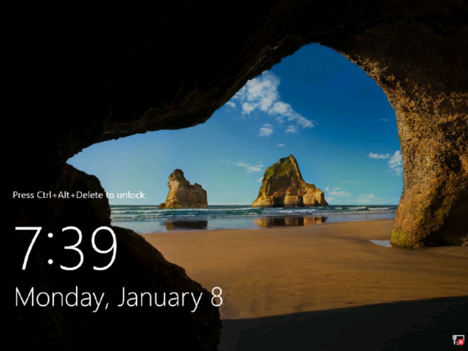
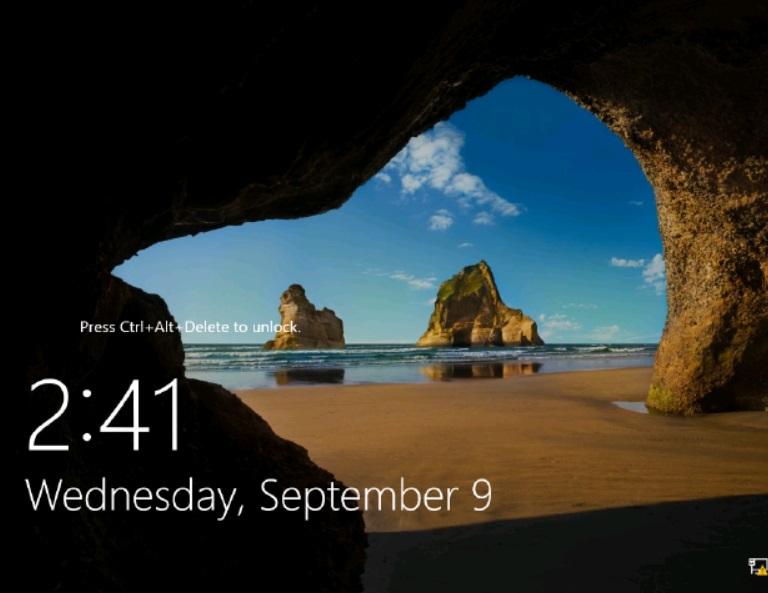

#  Cannot remote desktop to a VM because the network interface is disabled

This article explains how to resolve a problem in which you cannot make a Remote Desktop connection to Azure Windows Virtual Machines (VMs) if the network interface is disabled.


## Symptoms

You cannot make an RDP connection or any other type of connection to any other ports to a VM in Azure because the network interface in the VM is disabled.






## Solution

Before you follow these steps, take a snapshot of the OS disk of the affected VM as a backup. For more information, see [Snapshot a disk](../windows/snapshot-copy-managed-disk.md).

To enable the interface for the VM, use Serial control or [reset network interface](#reset-network-interface) for the VM.

### Use Serial control

1. Connect to [Serial Console and open CMD instance](./serial-console-windows.md#use-cmd-or-powershell-in-serial-console). If the Serial Console is not enabled on your VM, see [reset network interface](#reset-network-interface).
2. Check the state of the network interface:

    ```console
    netsh interface show interface
    ```

    Note the name of the disabled network interface.

3. Enable the network interface:

    ```console
    netsh interface set interface name="interface Name" admin=enabled
    ```

    For example, if the interwork interface is named "Ethernet 2", run the following command:

    ```console
    netsh interface set interface name="Ethernet 2" admin=enabled
    ```

4.  Check the state of the network interface again to make sure that the network interface is enabled.

    ```console
    netsh interface show interface
    ```

    You don't have to restart the VM at this point. The VM will be back reachable.

5.  Connect to the VM and see whether the problem is resolved.

## Reset network interface

To reset network interface, change the IP address to another IP address that is available in the Subnet. To do this, use Azure portal or Azure PowerShell. For more information, see [Reset network interface](reset-network-interface.md).
