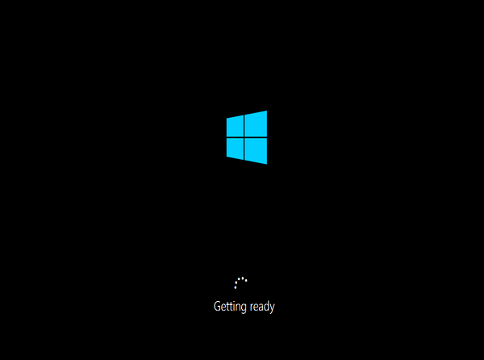
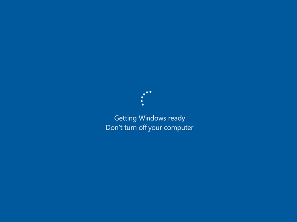

# VM startup is stuck on "Getting Windows ready. Don't turn off your computer" in Azure

This article describes the "Getting ready" and "Getting Windows ready" screens that you may encounter when you boot a Windows virtual machine (VM) in Microsoft Azure. It provides steps to help you collect data for a support ticket.

 

## Symptoms

A Windows VM does not boot. When you use **Boot diagnostics** to get the screenshot of the VM, you may see that the VM displays the message "Getting ready" or "Getting Windows ready".





## Cause

Usually this issue occurs when the server is doing the final reboot after the configuration was changed. The configuration change might be initialized by Windows updates or by the changes on the roles/feature of the server. For Windows Update, if the size of the updates was large, the operating system needs more time to reconfigure the changes.

## Collect an OS memory dump

> [!TIP]
> If you have a recent backup of the VM, you may try [restoring the VM from the backup](../../backup/backup-azure-arm-restore-vms.md) to fix the boot problem.

If the issue does not resolve after waiting for the changes to process, you would need to collect a memory dump file and contact support. To collect the Dump file, follow these steps:

### Attach the OS disk to a recovery VM

1. Take a snapshot of the OS disk of the affected VM as a backup. For more information, see [Snapshot a disk](../windows/snapshot-copy-managed-disk.md).
2. [Attach the OS disk to a recovery VM](./troubleshoot-recovery-disks-portal-windows.md).
3. Remote desktop to the recovery VM. 
4. If the OS disk is encrypted, you must turn off the encryption before you move to the next step. For more information, see [Decrypt the encrypted OS disk in the VM that cannot boot](troubleshoot-bitlocker-boot-error.md#solution).

### Locate dump file and submit a support ticket

1. On the recovery VM, go to windows folder in the attached OS disk. If the driver letter that is assigned to the attached OS disk is F, you need to go to F:\Windows.
2. Locate the memory.dmp file, and then [submit a support ticket](https://portal.azure.com/?#blade/Microsoft_Azure_Support/HelpAndSupportBlade) with the dump file. 

If you cannot find the dump file, move the next step to enable dump log and Serial Console.

### Enable dump log and Serial Console

To enable dump log and Serial Console, run the following script.

1. Open elevated command Prompt session (Run as administrator).
2. Run the following script:

    In this script, we assume that the drive letter that is assigned to the attached OS disk is F.  Replace it with the appropriate value in your VM.

    ```powershell
    reg load HKLM\BROKENSYSTEM F:\windows\system32\config\SYSTEM.hiv

    REM Enable Serial Console
    bcdedit /store F:\boot\bcd /set {bootmgr} displaybootmenu yes
    bcdedit /store F:\boot\bcd /set {bootmgr} timeout 5
    bcdedit /store F:\boot\bcd /set {bootmgr} bootems yes
    bcdedit /store F:\boot\bcd /ems {<BOOT LOADER IDENTIFIER>} ON
    bcdedit /store F:\boot\bcd /emssettings EMSPORT:1 EMSBAUDRATE:115200

    REM Suggested configuration to enable OS Dump
    REG ADD "HKLM\BROKENSYSTEM\ControlSet001\Control\CrashControl" /v CrashDumpEnabled /t REG_DWORD /d 1 /f
    REG ADD "HKLM\BROKENSYSTEM\ControlSet001\Control\CrashControl" /v DumpFile /t REG_EXPAND_SZ /d "%SystemRoot%\MEMORY.DMP" /f
    REG ADD "HKLM\BROKENSYSTEM\ControlSet001\Control\CrashControl" /v NMICrashDump /t REG_DWORD /d 1 /f

    REG ADD "HKLM\BROKENSYSTEM\ControlSet002\Control\CrashControl" /v CrashDumpEnabled /t REG_DWORD /d 1 /f
    REG ADD "HKLM\BROKENSYSTEM\ControlSet002\Control\CrashControl" /v DumpFile /t REG_EXPAND_SZ /d "%SystemRoot%\MEMORY.DMP" /f
    REG ADD "HKLM\BROKENSYSTEM\ControlSet002\Control\CrashControl" /v NMICrashDump /t REG_DWORD /d 1 /f

    reg unload HKLM\BROKENSYSTEM
    ```

    1. Make sure that there's enough space on the disk to allocate as much memory as the RAM, which depends on the size that you are selecting for this VM.
    2. If there's not enough space or this is a large size VM (G, GS or E series), you could then change the location where this file will be created and refer that to any other data disk which is attached to the VM. To do this, you will need to change the following key:
    
        ```console
        reg load HKLM\BROKENSYSTEM F:\windows\system32\config\SYSTEM.hiv

        REG ADD "HKLM\BROKENSYSTEM\ControlSet001\Control\CrashControl" /v DumpFile /t REG_EXPAND_SZ /d "<DRIVE LETTER OF YOUR DATA DISK>:\MEMORY.DMP" /f
        REG ADD "HKLM\BROKENSYSTEM\ControlSet002\Control\CrashControl" /v DumpFile /t REG_EXPAND_SZ /d "<DRIVE LETTER OF YOUR DATA DISK>:\MEMORY.DMP" /f

        reg unload HKLM\BROKENSYSTEM
        ```

3. [Detach the OS disk and then Re-attach the OS disk to the affected VM](./troubleshoot-recovery-disks-portal-windows.md).
4. Start the VM and access the Serial Console.
5. Select **Send Non-Maskable Interrupt(NMI)** to trigger the memory dump.
    
6. Attach the OS disk to a recovery VM again, collect dump file.

## Contact Microsoft support

After you collect the dump file, contact [Microsoft support](https://portal.azure.com/?#blade/Microsoft_Azure_Support/HelpAndSupportBlade) to analyze the root cause.
