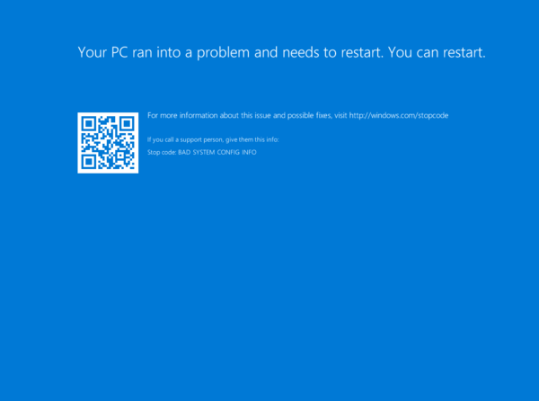
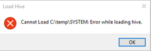

# Windows stop error - 0x00000074 Bad System Config Info

This article provides steps to resolve issues where Windows cannot boot and needs to restart due to bad system configuration information in an Azure Virtual Machine (VM).

## Symptom

When you use [Boot diagnostics](https://docs.microsoft.com/azure/virtual-machines/troubleshooting/boot-diagnostics) to view the screenshot of the VM, you'll see that the screenshot displays the Windows stop code **#0x00000074** or **BAD_SYSTEM_CONFIG_INFO**.

*Your PC ran into a problem and needs to restart. You can restart.*
*For more information about this issue and possible fixes, visit http://windows.com/stopcode*
*If you call a support person, give them this info:*
*Stop code: BAD_SYSTEM_CONFIG_INFO*

  

## Cause

The **BAD_SYSTEM_CONFIG_INFO** stop code occurs if the **SYSTEM** registry hive appears to be corrupted. This error can be caused by any of these reasons:

- The registry hive wasn’t closed properly.
- The registry hive is corrupt.
- There are missing registry keys or values.

## Solution

### Process overview:

1. Create and Access a Repair VM.
1. Check for hive corruption.
1. Enable serial console and memory dump collection.
1. Rebuild the VM.

> [!NOTE]
> When encountering this error, the Guest operating system (OS) is not operational. You'll troubleshoot in offline mode to resolve this issue.

### Create and access a Repair VM

1. Use steps 1-3 of the [VM Repair Commands](https://docs.microsoft.com/azure/virtual-machines/troubleshooting/repair-windows-vm-using-azure-virtual-machine-repair-commands) to prepare a Repair VM.
1. Check for hive corruption.
1. Use Remote Desktop Connection to connect to the Repair VM.
1. Copy the `<VOLUME LETTER OF BROKEN OS DISK>:\windows\system32\config` folder and save it in either your healthy disk partition, or in another safe location. Back up this folder as a precaution, since you will edit critical registry files. 

> [!NOTE]
> Make a copy of the `<VOLUME LETTER OF BROKEN OS DISK>:\windows\system32\config` folder as a backup in case you need to roll back any changes you make to the registry.

### Check for hive corruption

The instructions below will help you determine if the cause was due to hive corruption, or if the hive wasn’t closed correctly. If the hive wasn’t closed correctly, then you'll be able to unlock the file and fix your VM.

1. On your repair VM, open the **Registry Editor** application. Type “REGEDIT” in the Windows search bar to find it.
1. In Registry Editor, select **HKEY_LOCAL_MACHINE** to highlight it, then select **File > Load Hive…** from the menu.
1. Browse to `<VOLUME LETTER OF BROKEN OS DISK>:\windows\system32\config\SYSTEM` and select **Open**.
1. When prompted to enter a name, enter **BROKENSYSTEM**.

   1. If the hive fails to open, or if it is empty, then the hive is corrupted. If the hive has been corrupted, [open a support ticket](https://portal.azure.com/?#blade/Microsoft_Azure_Support/HelpAndSupportBlade).

     

   1. If the hive opens normally, then the hive wasn’t closed properly. Continue to step 5.

1. To fix a hive that wasn’t closed properly, highlight **BROKENSYSTEM** then select **File > Unload Hive…** to unlock the file.

### Enable the serial console and memory dump collection

**Recommended**: Before you rebuild the VM, enable the Serial Console and memory dump collection by running the following script:

1. Open an elevated command prompt session as an Administrator.
1. Run the following commands:

   **Enable the Serial Console**:
   
   ```
   bcdedit /store <VOLUME LETTER WHERE THE BCD FOLDER IS>:\boot\bcd /ems {<BOOT LOADER IDENTIFIER>} ON 
   bcdedit /store <VOLUME LETTER WHERE THE BCD FOLDER IS>:\boot\bcd /emssettings EMSPORT:1 EMSBAUDRATE:115200
   ```

1. Verify that the free space on the OS disk is larger than the memory size (RAM) on the VM.

   If there's not enough space on the OS disk, change the location where the memory dump file will be created, and refer that location to any data disk attached to the VM that has enough free space. To change the location, replace **%SystemRoot%** with the drive letter of the data disk, such as **F:**, in the following commands.

   Suggested configuration to enable OS Dump:

   **Load Registry Hive from the broken OS Disk:**

   ```
   REG LOAD HKLM\BROKENSYSTEM <VOLUME LETTER OF BROKEN OS DISK>:\windows\system32\config\SYSTEM
   ```

   **Enable on ControlSet001:**

   ```
   REG ADD "HKLM\BROKENSYSTEM\ControlSet001\Control\CrashControl" /v CrashDumpEnabled /t REG_DWORD /d 1 /f 
   REG ADD "HKLM\BROKENSYSTEM\ControlSet001\Control\CrashControl" /v DumpFile /t REG_EXPAND_SZ /d "%SystemRoot%\MEMORY.DMP" /f 
   REG ADD "HKLM\BROKENSYSTEM\ControlSet001\Control\CrashControl" /v NMICrashDump /t REG_DWORD /d 1 /f 
   ```

   **Enable on ControlSet002:**

   ```
   REG ADD "HKLM\BROKENSYSTEM\ControlSet002\Control\CrashControl" /v CrashDumpEnabled /t REG_DWORD /d 1 /f 
   REG ADD "HKLM\BROKENSYSTEM\ControlSet002\Control\CrashControl" /v DumpFile /t REG_EXPAND_SZ /d "%SystemRoot%\MEMORY.DMP" /f 
   REG ADD "HKLM\BROKENSYSTEM\ControlSet002\Control\CrashControl" /v NMICrashDump /t REG_DWORD /d 1 /f 
   ```

   **Unload Broken OS Disk:**

   ```
   REG UNLOAD HKLM\BROKENSYSTEM
   ```
   
### Rebuild the VM

Use [step 5 of the VM Repair Commands](https://docs.microsoft.com/azure/virtual-machines/troubleshooting/repair-windows-vm-using-azure-virtual-machine-repair-commands#repair-process-example) to rebuild the VM.
