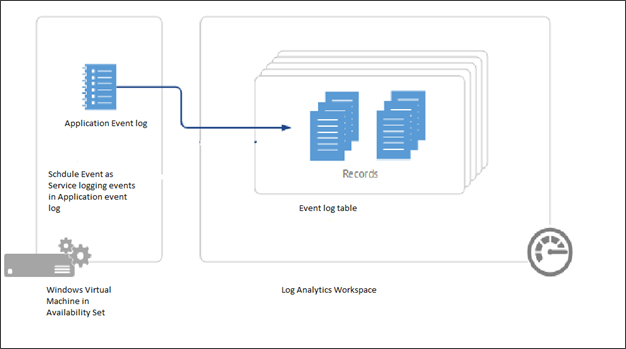
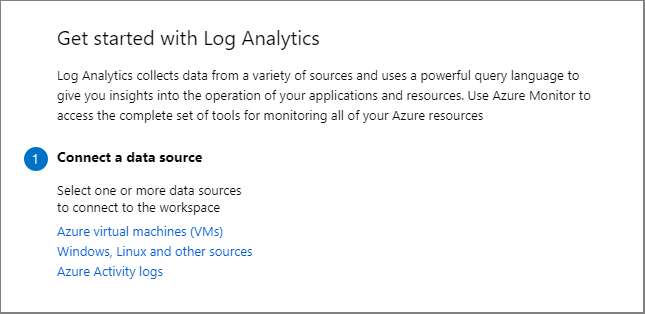
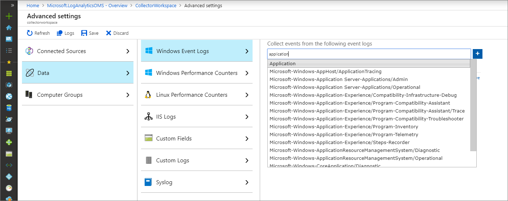
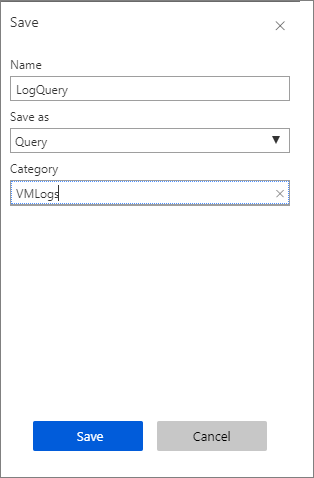

# Monitoring Scheduled Events

Updates are applied to different parts of Azure every day, to keep the services running on them secure, and up-to-date. In addition to planned updates, unplanned events may also occur. For example, if any hardware degradation or fault is detected, Azure services may need to perform unplanned maintenance. Using live migration, memory preserving updates and generally keeping a strict bar on the impact of updates, in most cases these events are almost transparent to customers, and they have no impact or at most cause a few seconds of virtual machine freeze. However, for some applications, even a few seconds of virtual machine freeze could cause an impact. Knowing in advance about upcoming Azure maintenance is important, to ensure the best experience for those applications. [Scheduled Events service](scheduled-events.md) provides you a programmatic interface to be notified about upcoming maintenance, and enables you to gracefully handle the maintenance. 

In this article, we will show how you can use scheduled events to be notified about maintenance events that could be affecting your VMs and build some basic automation that can help with monitoring and analysis.


## Routing scheduled events to Log Analytics

Scheduled Events is available as part of the [Azure Instance Metadata Service](instance-metadata-service.md), which is available on every Azure virtual machine. Customers can write automation to query the endpoint of their virtual machines to find scheduled maintenance notifications and perform mitigations, like saving the state and taking the virtual machine out of rotation. We recommend building automation to record the Scheduled Events so you can have an auditing log of Azure maintenance events. 

In this article, we will walk you through how to capture maintenance Scheduled Events to Log Analytics. Then, we will trigger some basic notification actions, like sending an email to your team and getting a historical view of all events that have affected your virtual machines. For the event aggregation and automation we will use [Log Analytics](../../azure-monitor/learn/quick-create-workspace.md), but you can use any monitoring solution to collect these logs and trigger automation.



## Prerequisites

For this example, you will need to create a [Windows Virtual Machine in an Availability Set](tutorial-availability-sets.md). Scheduled Events provide notifications about changes that can affect any of the virtual machines in your availability set, Cloud Service, Virtual Machine Scale Set or standalone VMs. We will be running a [service](https://github.com/microsoft/AzureScheduledEventsService) that polls for scheduled events on one of the VMs that will act as a collector, to get events for all of the other VMs in the availability set.    

Don't delete the group resource group at the end of the tutorial.

You will also need to [create a Log Analytics workspace](../../azure-monitor/learn/quick-create-workspace.md) that we will use to aggregate information from the VMs in the availability set.

## Set up the environment

You should now have 2 initial VMs in an availability set. Now we need to create a 3rd VM, called myCollectorVM, in the same availability set. 

```azurepowershell-interactive
New-AzVm `
   -ResourceGroupName "myResourceGroupAvailability" `
   -Name "myCollectorVM" `
   -Location "East US" `
   -VirtualNetworkName "myVnet" `
   -SubnetName "mySubnet" `
   -SecurityGroupName "myNetworkSecurityGroup" `
   -OpenPorts 3389 `
   -PublicIpAddressName "myPublicIpAddress3" `
   -AvailabilitySetName "myAvailabilitySet" `
   -Credential $cred
```
 

Download the installation .zip file of the project from [GitHub](https://github.com/microsoft/AzureScheduledEventsService/archive/master.zip).

Connect to **myCollectorVM** and copy the .zip file to the virtual machine and extract all of the files. On your VM, open a PowerShell prompt. Move your prompt into the folder containing `SchService.ps1`, for example: `PS C:\Users\azureuser\AzureScheduledEventsService-master\AzureScheduledEventsService-master\Powershell>`,  and set up the service.

```powershell
.\SchService.ps1 -Setup
```

Start the service.

```powershell
.\SchService.ps1 -Start
```

The service will now start polling every 10 seconds for any scheduled events and approve the events to expedite the maintenance.  Freeze, Reboot, Redeploy, and Preempt are the events captured by Schedule events.   Note that you can extend the script to trigger some mitigations prior to approving the event.

Validate the service status and make sure it is running.

```powershell
.\SchService.ps1 -status  
```

This should return `Running`.

The service will now start polling every 10 seconds for any scheduled events and approve the events to expedite the maintenance.  Freeze, Reboot, Redeploy and Preempt are the events captured by Schedule events. You can extend the script to trigger some mitigations prior to approving the event.

When any of the above events are captured by Schedule Event service, it will get logged in the Application Event Log Event Status, Event Type, Resources (Virtual machine names) and NotBefore (minimum notice period). You can locate the events with ID 1234 in the Application Event Log.

Once the service is set up and started, it will log events in the Windows Application logs.   To verify this works, restart one of the virtual machines in the availability set and you should see an event being logged in Event viewer in  Windows Logs >  Application log showing the VM restarted. 


When events are captured by the Schedule Event service, it will get logged in the application even log with Event Status, Event Type, Resources (VM name) and NotBefore (minimum notice period). You can locate the events with ID 1234 in the Application Event Log.

> [!NOTE] 
> In this example, the virtual machines were are in an availability set, which enabled us to designate a single virtual machine as the collector to listen and route scheduled events to our log analytics works space. If you have standalone virtual machines, you can run the service on every virtual machine, and then connect them individually to your log analytics workspace.
>
> For our set up, we chose Windows, but you can design a similar solution on Linux.

At any point you can stop/remove the Scheduled Event Service by using the switches `–stop` and `–remove`.

## Connect to the workspace


We now want to connect a Log Analytics Workspace to the collector VM. The Log Analytics workspace acts as a repository and we will configure event log collection to capture the application logs from the collector VM. 

 To route the Scheduled Events to the Events Log, which will be saved as Application log by our service, you will need to connect your virtual machine to your Log Analytics workspace.  
 
1. Open the page for the workspace you created.
1. Under **Connect to a data source** select **Azure virtual machines (VMs)**.

	

1. Search for and select **myCollectorVM**. 
1. On the new page for **myCollectorVM**, select **Connect**.

This will install the [Microsoft Monitoring agent](../extensions/oms-windows.md) in your virtual machine. It will take a few minutes to connect your VM to the workspace and install the extension. 

## Configure the workspace

1. Open the page for your workspace and select **Advanced settings**.
1. Select **Data** from the left menu, then select **Windows Event Logs**.
1. In **Collect from the following event logs**, start typing *application* and then select **Application** from the list.

	

1. Leave **ERROR**, **WARNING**, and **INFORMATION** selected and then select **Save** to save the settings.


> [!NOTE]
> There will be some delay, and it may take up to 10 minutes before the log is available. 


## Creating an alert rule with Azure Monitor 


Once the events are pushed to Log Analytics, you can run the following [query](../../azure-monitor/log-query/log-analytics-tutorial.md) to look for the schedule Events.

1. At the top of the page, select **Logs** and paste the following into the text box:

	```
	Event
	| where EventLog == "Application" and Source contains "AzureScheduledEvents" and RenderedDescription contains "Scheduled" and RenderedDescription contains "EventStatus" 
	| project TimeGenerated, RenderedDescription
	| extend ReqJson= parse_json(RenderedDescription)
	| extend EventId = ReqJson["EventId"]
	,EventStatus = ReqJson["EventStatus"]
	,EventType = ReqJson["EventType"]
	,NotBefore = ReqJson["NotBefore"]
	,ResourceType = ReqJson["ResourceType"]
	,Resources = ReqJson["Resources"]
	| project-away RenderedDescription,ReqJson
	```

1. Select **Save**, and then type *logQuery* for the name, leave **Query** as the type, type *VMLogs* as the **Category**, and then select **Save**. 

	

1. Select **New alert rule**. 
1. In the **Create rule** page, leave `collectorworkspace` as the **Resource**.
1. Under **Condition**, select the entry *Whenever the customer log search is <login undefined>*. The **Configure signal logic** page will open.
1. Under **Threshold value**, enter *0* and then select **Done**.
1. Under **Actions**, select **Create action group**. The **Add action group** page will open.
1. In **Action group name**, type *myActionGroup*.
1. In **Short name**, type **myActionGroup**.
1. In **Resource group**, select **myResourceGroupAvailability**.
1. Under Actions, in **ACTION NAME** type **Email**, and then select **Email/SMS/Push/Voice**. The **Email/SMS/Push/Voice** page will open.
1. Select **Email**, type in your e-mail address, then select **OK**.
1. In the **Add action group** page, select **OK**. 
1. In the **Create rule** page, under **ALERT DETAILS**, type *myAlert* for the **Alert rule name**, and then type *Email alert rule* for the **Description**.
1. When you are finished, select **Create alert rule**.
1. Restart one of the VMs in the availability set. Within a few minutes, you should get an e-mail that the alert has been triggered.

To manage your alert rules, go to the resource group, select **Alerts** from the left menu, and then select **Manage alert rules** from the top of the page.

     
## Next steps

To learn more, see the [Scheduled events service](https://github.com/microsoft/AzureScheduledEventsService) page on GitHub.