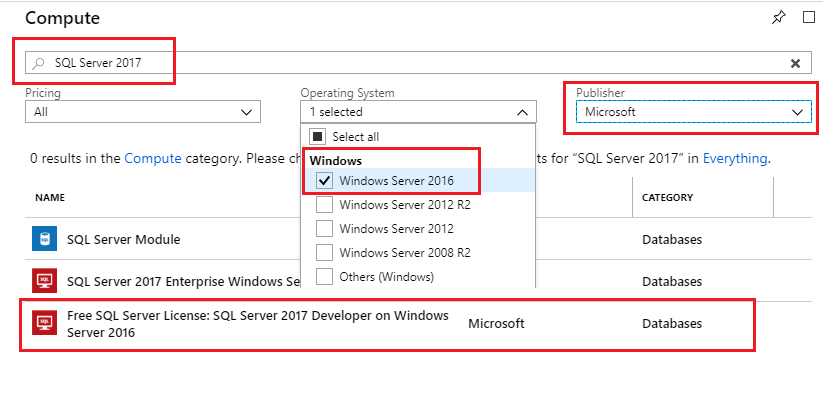
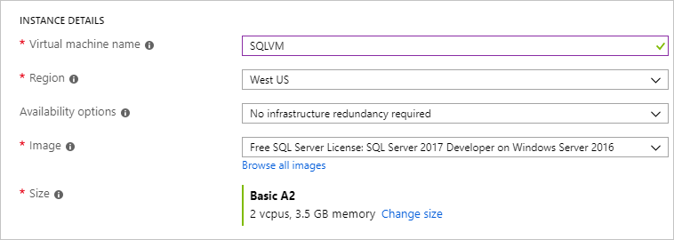
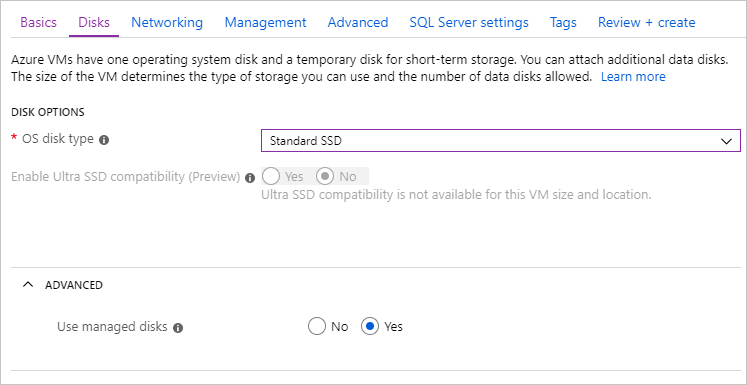
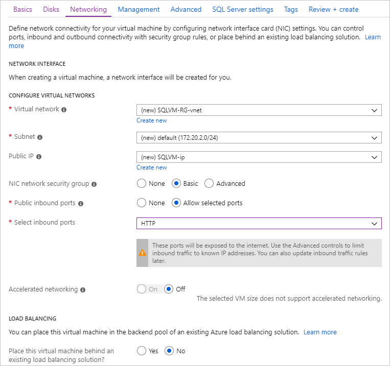
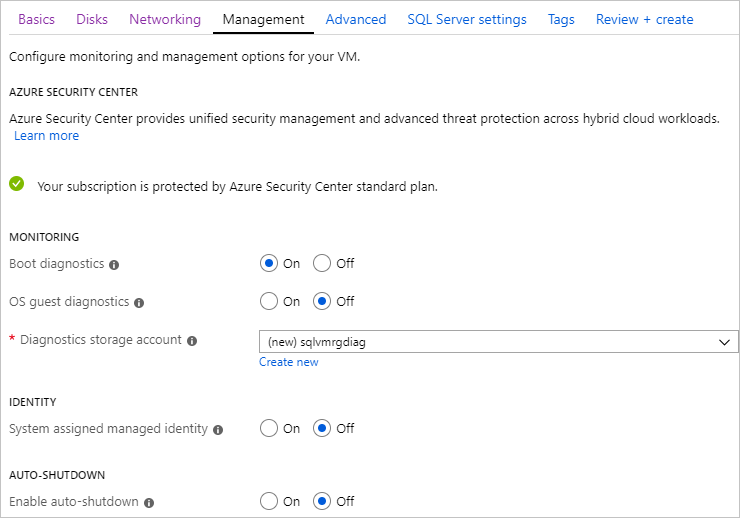
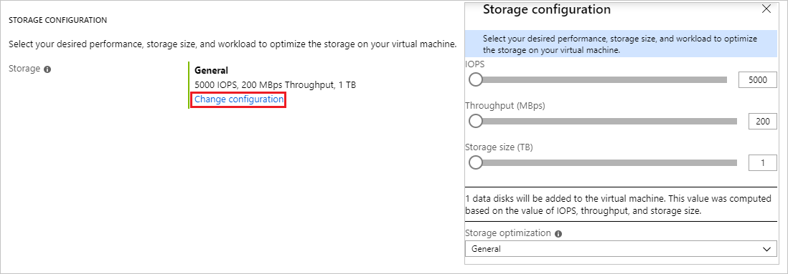
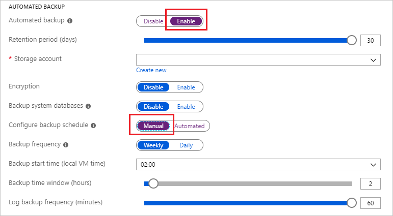

# How to provision a Windows SQL Server virtual machine in the Azure portal

This guide provides details on the different options available when you create a Windows SQL Server virtual machine in the Azure portal. This article covers more configuration options than the [SQL Server VM quickstart](quickstart-sql-vm-create-portal.md), which goes more through one possible provisioning task. 

Use this guide to create your own SQL Server VM. Or, use it as a reference for the available options in the Azure portal.

> [!TIP]
> If you have questions about SQL Server virtual machines, see the [Frequently Asked Questions](virtual-machines-windows-sql-server-iaas-faq.md).

If you don't have an Azure subscription, create a [free account](https://azure.microsoft.com/free/?WT.mc_id=A261C142F) before you begin.

##  SQL Server virtual machine gallery images

When you create a SQL Server virtual machine, you can select one of several pre-configured images from the virtual machine gallery. The following steps demonstrate how to select one of the SQL Server 2017 images.

1. Sign in to the [Azure portal](https://portal.azure.com) using your account.

1. On the Azure portal, click **Create a resource**. The portal opens the **New** window.

1. In the **New** window, click **Compute** and then click **See all**.

1. In the search field, type **SQL Server 2017**, and press ENTER.

1. In the filter drop-downs, select _Windows Server 2016_ for the **Operating System** and select _Microsoft_ as the **Publisher**. 

     

1. Review the available SQL Server images. Each image identifies a SQL Server version and an operating system.

1. Select the image named **Free SQL Server License: SQL Server 2017 Developer on Windows Server 2016**.

   > [!TIP]
   > The Developer edition is used in this walkthrough because it is a full-featured, free edition of SQL Server for development testing. You pay only for the cost of running the VM. However, you are free to choose any of the images to use in this walkthrough. For a description of available images, see the [SQL Server Windows Virtual Machines overview](virtual-machines-windows-sql-server-iaas-overview.md#payasyougo).

   > [!TIP]
   > Licensing costs for SQL Server are incorporated into the per-second pricing of the VM you create and varies by edition and cores. However, SQL Server Developer edition is free for development/testing (not production), and SQL Express is free for lightweight workloads (less than 1 GB of memory, less than 10 GB of storage). You can also bring-your-own-license (BYOL) and pay only for the VM. Those image names are prefixed with {BYOL}. 
   >
   > For more information on these options, see [Pricing guidance for SQL Server Azure VMs](virtual-machines-windows-sql-server-pricing-guidance.md).

1. Under **Select a deployment model**, verify that **Resource Manager** is selected. Resource Manager is the recommended deployment model for new virtual machines. 

1. Select **Create**.

##  Configuration options

There are multiple tabs for configuring a SQL Server virtual machine. For the purpose of this guide, we will focus on the following: 

| Step | Description |
| --- | --- |
| **Basics** |[Configure basic settings](#1-configure-basic-settings) |
| **Optional Features** |[Configure optional features](#2-configure-optional-features) |
| **SQL Server settings** |[Configure SQL server settings](#3-configure-sql-server-settings) |
| **Review + create** | [Review the summary](#4-review--create) |

## 1. Configure basic settings

On the **Basics** tab, provide the following information:

* Under **Project Details**, make sure the correct subscription is selected. 
*  In the **Resource group** section, either select an existing resource group from the list or choose **Create new** to create a new resource group. A resource group is a collection of related resources in Azure (virtual machines, storage accounts, virtual networks, etc.). 

    

  > [!NOTE]
  > Using a new resource group is helpful if you are just testing or learning about SQL Server deployments in Azure. After you finish with your test, delete the resource group to automatically delete the VM and all resources associated with that resource group. For more information about resource groups, see [Azure Resource Manager Overview](../../../azure-resource-manager/resource-group-overview.md).

* Under **Instance details**:
    1. Enter a unique **Virtual machine name**.  
    1. Choose a location for your **Region**. 
    1. For the purpose of this guide, leave **Availability options** set to _No infrastructure redundancy required_. To find out more information about availability options, see [Availability](../../windows/availability.md). 
    1. In the **Image** list, select _Free SQL Server License: SQL Server 2017 Developer on Windows Server 2016_.  
    1. Choose to **Change size** for the **Size** of the virtual machine and select the **A2 Basic** offering. Be sure to clean up your resources once you're done with them to prevent any unexpected charges. For production workloads, see the recommended machine sizes and configuration in [Performance best practices for SQL Server in Azure Virtual Machines](virtual-machines-windows-sql-performance.md).

    

> [!IMPORTANT]
> The estimated monthly cost displayed on the **Choose a size** window does not include SQL Server licensing costs. This estimate is the cost of the VM alone. For the Express and Developer editions of SQL Server, this estimate is the total estimated cost. For other editions, see the [Windows Virtual Machines pricing page](https://azure.microsoft.com/pricing/details/virtual-machines/windows/) and select your target edition of SQL Server. Also see the [Pricing guidance for SQL Server Azure VMs](virtual-machines-windows-sql-server-pricing-guidance.md) and [Sizes for virtual machines](../sizes.md?toc=%2fazure%2fvirtual-machines%2fwindows%2ftoc.json).

* Under **Administrator account**, provide a username and a password. The password must be at least 12 characters long and meet the [defined complexity requirements](../../windows/faq.md#what-are-the-password-requirements-when-creating-a-vm).

   

* Under **Inbound port rules**, choose **Allow selected ports** and then select **RDP (3389)** from the drop-down. 

   

## 2. Configure optional features

### Disks

On the **Disks** tab, configure your disk options. 

* Under **OS disk type**, select the type of disk you want for your OS from the drop-down. Premium is recommended for production systems but is not available for a Basic VM. To utilize Premium SSD, change the virtual machine size. 
* Under **Advanced**, select **Yes** under use **Managed Disks**.

   > [!NOTE]
   > Microsoft recommends Managed Disks for SQL Server. Managed Disks handles storage behind the scenes. In addition, when virtual machines with Managed Disks are in the same availability set, Azure distributes the storage resources to provide appropriate redundancy. For more information, see [Azure Managed Disks Overview][../managed-disks-overview.md). For specifics about managed disks in an availability set, see [Use managed disks for VMs in availability set](../manage-availability.md.

  
  
### Networking

On the **Networking** tab, configure your networking options. 

* Create a new **virtual network**, or use an existing vNet for your SQL Server VM. Designate a **Subnet** as well. 

* Under **NIC network security group**, select either a basic security group, or the advanced security group. Choosing the basic option allows you to select inbound ports for the SQL Server VM (the same values that were configured on the **Basic** tab). Selecting the advanced option allows you to choose an existing network security group, or create a new one. 

* You can make other changes to network settings, or keep the default values.

#### Monitoring

On the **Monitoring** tab, configure monitoring and autoshutdown. 

* Azure enables **Boot diagnostics** by default with the same storage account designated for the VM. You can change these settings here, as well as enabling **OS guest diagnostics**. 
* You can enable **System assigned managed identity** and **autoshutdown** on this tab as well. 

## 3. Configure SQL Server settings

On the **SQL Server settings** tab, configure specific settings and optimizations for SQL Server. The settings that you can configure for SQL Server include the following:

| Setting |
| --- |
| [Connectivity](#connectivity) |
| [Authentication](#authentication) |
| [Azure Key Vault Integration](#azure-key-vault-integration) |
| [Storage configuration](#storage-configuration) |
| [Automated Patching](#automated-patching) |
| [Automated Backup](#automated-backup) |
| [R Services (Advanced Analytics)](#r-services-advanced-analytics) |

### Connectivity

Under **SQL connectivity**, specify the type of access you want to the SQL Server instance on this VM. For the purposes of this walkthrough, select **Public (internet)** to allow connections to SQL Server from machines or services on the internet. With this option selected, Azure automatically configures the firewall and the network security group to allow traffic on the port selected.

> [!TIP]
> By default, SQL Server listens on a well-known port, **1433**. For increased security, change the port in the previous dialog to listen on a non-default port, such as 1401. If you change the port, you must connect using that port from any client tools, such as SSMS.

To connect to SQL Server via the internet, you also must enable SQL Server Authentication, which is described in the next section.

If you would prefer to not enable connections to the Database Engine via the internet, choose one of the following options:

* **Local (inside VM only)** to allow connections to SQL Server only from within the VM.
* **Private (within Virtual Network)** to allow connections to SQL Server from machines or services in the same virtual network.

In general, improve security by choosing the most restrictive connectivity that your scenario allows. But all the options are securable through Network Security Group rules and SQL/Windows Authentication. You can edit Network Security Group after the VM is created. For more information, see [Security Considerations for SQL Server in Azure Virtual Machines](virtual-machines-windows-sql-security.md).

### Authentication

If you require SQL Server Authentication, click **Enable** under **SQL authentication** on the **SQL Server settings** tab.

> [!NOTE]
> If you plan to access SQL Server over the internet (the Public connectivity option), you must enable SQL authentication here. Public access to the SQL Server requires the use of SQL Authentication.

If you enable SQL Server Authentication, specify a **Login name** and **Password**. This login name is configured as a SQL Server Authentication login and member of the **sysadmin** fixed server role. For more information about Authentication Modes, see [Choose an Authentication Mode](https://docs.microsoft.com/sql/relational-databases/security/choose-an-authentication-mode).

If you do not enable SQL Server Authentication, then you can use the local Administrator account on the VM to connect to the SQL Server instance.

### Azure Key Vault integration

To store security secrets in Azure for encryption, select **SQL Server settings**, and scroll down to  **Azure key vault integration**. Select **Enable** and fill in the requested information. 

The following table lists the parameters required to configure Azure Key Vault Integration.

| PARAMETER | DESCRIPTION | EXAMPLE |
| --- | --- | --- |
| **Key Vault URL** |The location of the key vault. |https:\//contosokeyvault.vault.azure.net/ |
| **Principal name** |Azure Active Directory service principal name. This name is also referred to as the Client ID. |fde2b411-33d5-4e11-af04eb07b669ccf2 |
| **Principal secret** |Azure Active Directory service principal secret. This secret is also referred to as the Client Secret. |9VTJSQwzlFepD8XODnzy8n2V01Jd8dAjwm/azF1XDKM= |
| **Credential name** |**Credential name**: AKV Integration creates a credential within SQL Server, allowing the VM to have access to the key vault. Choose a name for this credential. |mycred1 |

For more information, see [Configure Azure Key Vault Integration for SQL Server on Azure VMs](virtual-machines-windows-ps-sql-keyvault.md).

### Storage configuration

On the **SQL Server settings** tab, under **Storage configuration**, select **Change configuration** to specify the storage requirements.

> [!NOTE]
> If you manually configured your VM to use standard storage, this option is not available. Automatic storage optimization is available only for Premium Storage.

> [!TIP]
> The number of stops and the upper limits of each slider is dependent on the size of VM you selected. A larger and more powerful VM is able to scale up more.

You can specify requirements as input/output operations per second (IOPs), throughput in MB/s, and total storage size. Configure these values by using the sliding scales. You can change these storage settings based on workload. The portal automatically calculates the number of disks to attach and configure based on these requirements.

Under **Storage optimized for**, select one of the following options:

* **General** is the default setting and supports most workloads.
* **Transactional** processing optimizes the storage for traditional database OLTP workloads.
* **Data warehousing** optimizes the storage for analytic and reporting workloads.

### SQL Server License
If you're a Software Assurance customer, you can utilize the [Azure Hybrid Benefit](https://azure.microsoft.com/pricing/hybrid-benefit/) to bring your own SQL Server license and save on resources. 

### Automated patching

**Automated patching** is enabled by default. Automated patching allows Azure to automatically patch SQL Server and the operating system. Specify a day of the week, time, and duration for a maintenance window. Azure performs patching in this maintenance window. The maintenance window schedule uses the VM locale for time. If you do not want Azure to automatically patch SQL Server and the operating system, click **Disable**.  

For more information, see [Automated Patching for SQL Server in Azure Virtual Machines](virtual-machines-windows-sql-automated-patching.md).

### Automated backup

Enable automatic database backups for all databases under **Automated backup**. Automated backup is disabled by default.

When you enable SQL automated backup, you can configure the following settings:

* Retention period (days) for backups
* Storage account to use for backups
* Encryption option and password for backups
* Backup system databases
* Configure backup schedule

To encrypt the backup, click **Enable**. Then specify the **Password**. Azure creates a certificate to encrypt the backups and uses the specified password to protect that certificate. By default the schedule is set automatically, but you can create a manual schedule by selecting **Manual**. 

For more information, see [Automated Backup for SQL Server in Azure Virtual Machines](virtual-machines-windows-sql-automated-backup.md).

### R Services (Advanced Analytics)

You have the option to enable [SQL Server R Services (Advanced Analytics)](/sql/advanced-analytics/r/sql-server-r-services/). This option enables you to use advanced analytics with SQL Server 2017. Select **Enable** on the **SQL Server Settings** window.

## 4. Review + create

On the **Review + create** tab, review the summary, and select  **Create** to create SQL Server, resource group, and resources specified for this VM.

You can monitor the deployment from the Azure portal. The **Notifications** button at the top of the screen shows basic status of the deployment.

> [!NOTE]
> To provide you with an idea on deployment times, I deployed a SQL VM to the East US region with default settings. This test deployment took approximately 12 minutes to complete. But you might experience a faster or slower deployment time based on your region and selected settings.

##  Open the VM with Remote Desktop

Use the following steps to connect to the SQL Server virtual machine with Remote Desktop:

[!INCLUDE [Connect to SQL Server VM with remote desktop](../../../../includes/virtual-machines-sql-server-remote-desktop-connect.md)]

After you connect to the SQL Server virtual machine, you can launch SQL Server Management Studio and connect with Windows Authentication using your local administrator credentials. If you enabled SQL Server Authentication, you can also connect with SQL Authentication using the SQL login and password you configured during provisioning.

Access to the machine enables you to directly change machine and SQL Server settings based on your requirements. For example, you could configure the firewall settings or change SQL Server configuration settings.

##  Connect to SQL Server remotely

In this walkthrough, you selected **Public** access for the virtual machine and **SQL Server Authentication**. These settings automatically configured the virtual machine to allow SQL Server connections from any client over the internet (assuming they have the correct SQL login).

> [!NOTE]
> If you did not select Public during provisioning, then you can change your SQL connectivity settings through the portal after provisioning. For more information, see  [Change your SQL connectivity settings](virtual-machines-windows-sql-connect.md#change).

The following sections show how to connect over the internet to your SQL Server VM instance.

[!INCLUDE [Connect to SQL Server in a VM Resource Manager](../../../../includes/virtual-machines-sql-server-connection-steps-resource-manager.md)]

  > [!NOTE]
  > This example uses the common port 1433. However, this value will need to be modified if a different port (such as 1401) was specified during the deployment of the SQL Server VM. 

## Next steps

For other information about using SQL Server in Azure, see [SQL Server on Azure Virtual Machines](virtual-machines-windows-sql-server-iaas-overview.md) and the [Frequently Asked Questions](virtual-machines-windows-sql-server-iaas-faq.md).