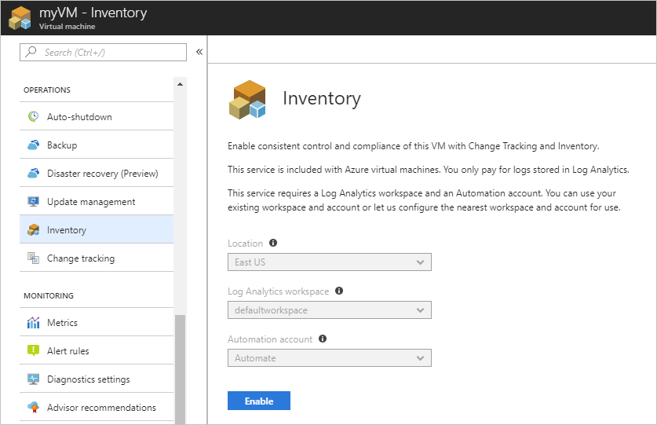
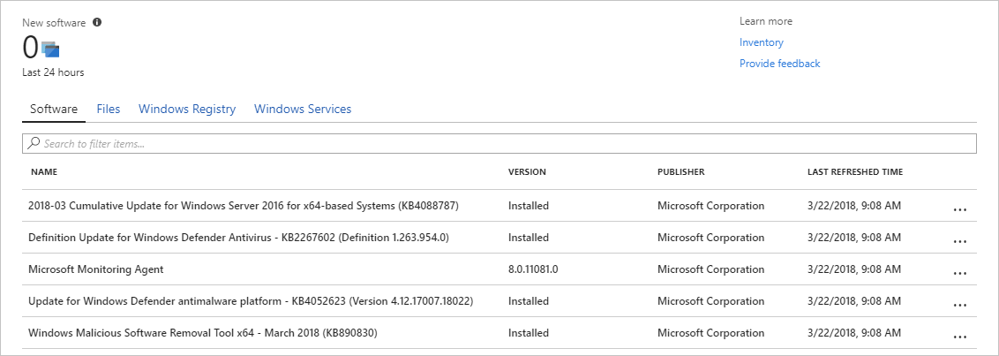

# Tutorial: Monitor changes and update a Windows virtual machine in Azure

With Azure [Change Tracking](../../automation/change-tracking/overview.md) and [Update Management](../../automation/update-management/overview.md), you can easily identify changes in your Windows virtual machines in Azure and manage operating system updates for those VMs.

In this tutorial, you learn how to:

> [!div class="checklist"]
> * Manage Windows updates.
> * Monitor changes and inventory.

## Open Azure Cloud Shell

Azure Cloud Shell is a free interactive shell that you can use to run the steps in this article. It has common Azure tools preinstalled and configured to use with your Azure account.

To open any code block in Cloud Shell, just select **Try it** from the upper-right corner of that code block.

You can also open Cloud Shell in a separate browser tab by going to [https://shell.azure.com/powershell](https://shell.azure.com/powershell). Select **Copy** to copy code blocks, paste them into the Cloud Shell tab, and select the Enter key to run the code.

## Create a virtual machine

To configure Azure monitoring and update management in this tutorial, you need a Windows VM in Azure.

First, set an administrator username and password for the VM with [Get-Credential](/powershell/module/microsoft.powershell.security/get-credential?view=powershell-5.1&preserve-view=true):

```azurepowershell-interactive
$cred = Get-Credential
```

Next, create the VM with [New-AzVM](/powershell/module/az.compute/new-azvm). The following example creates a VM named `myVM` in the `East US` location. If they don't already exist, the resource group `myResourceGroupMonitor` and supporting network resources are created:

```azurepowershell-interactive
New-AzVm `
    -ResourceGroupName "myResourceGroupMonitor" `
    -Name "myVM" `
    -Location "East US" `
    -Credential $cred
```

It takes a few minutes for the resources and VM to be created.

## Manage Windows updates

Update Management helps you manage updates and patches for your Azure Windows VMs. Directly from your VM, you can quickly:

- Assess the status of available updates.
- Schedule installation of required updates.
- Review deployment results to verify updates were successfully applied to the VM.

For pricing information, see [Automation pricing for Update management](https://azure.microsoft.com/pricing/details/automation/).

### Enable Update Management

To enable Update Management for your VM:

1. On the leftmost side of the window, select **Virtual machines**.
1. Choose a VM from the list.
1. In the **Operations** pane of the VM window, select **Update management**.
1. The **Enable Update Management** window opens.

Validation is done to determine if Update Management is enabled for this VM. Validation includes checks for a Log Analytics workspace, for a linked Automation account, and for whether the solution is in the workspace.

You use a [Log Analytics](../../azure-monitor/log-query/log-query-overview.md) workspace to collect data that is generated by features and services such as Update Management. The workspace provides a single location to review and analyze data from multiple sources.

To perform additional actions on VMs that require updates, you can use Azure Automation to run runbooks against VMs. Such actions include downloading or applying updates.

The validation process also checks to see if the VM is provisioned with the Microsoft Monitoring Agent (MMA) and Automation Hybrid Runbook Worker. You use the agent to communicate with the VM and obtain information about the update status.

In the **Enable Update Management** window, choose the Log Analytics workspace and automation account, and then select **Enable**. The solution takes up to 15 minutes to become enabled.

Any of the following prerequisites that are missing during onboarding are automatically added:

* [Log Analytics](../../azure-monitor/log-query/log-query-overview.md) workspace
* [Automation](../../automation/index.yml)
* A [Hybrid runbook worker](../../automation/automation-hybrid-runbook-worker.md), which is enabled on the VM

After the solution is enabled, the **Update management** window opens. Configure the location, Log Analytics workspace and Automation account to use, and then select **Enable**. If these options appear dimmed, another automation solution is enabled for the VM, and that solution's workspace and Automation account must be used.


The Update Management solution can take up to 15 minutes to become enabled. During this time, don't close the browser window. After the solution is enabled, information about missing updates on the VM flows to Azure Monitor logs. It can take from 30 minutes to 6 hours for the data to become available for analysis.

### View an update assessment

After Update Management is enabled, the **Update management** window appears. After the evaluation of updates is finished, you see a list of missing updates on the **Missing updates** tab.

 

### Schedule an update deployment

To install updates, schedule a deployment that follows your release schedule and service window. You choose which update types to include in the deployment. For example, you can include critical or security updates and exclude update rollups.

To schedule a new update deployment for the VM, select **Schedule update deployment** at the top of the **Update management** window. In the **New update deployment** window, specify the following information:

| Option | Description |
| --- | --- |
| **Name** |Enter a unique name to identify the update deployment. |
|**Operating system**| Select either **Linux** or **Windows**.|
| **Groups to update** |For VMs hosted on Azure, define a query based on a combination of subscription, resource groups, locations, and tags. This query builds a dynamic group of Azure-hosted VMs to include in your deployment. </br></br>For VMs not hosted on Azure, select an existing saved search. With this search, you can select a group of these VMs to include in the deployment. </br></br> To learn more, see [Dynamic Groups](../../automation/update-management/configure-groups.md).|
| **Machines to update** |Select **Saved search**, **Imported group**, or **Machines**.<br/><br/>If you select **Machines**, you can choose individual machines from the drop-down list. The readiness of each machine is shown in the **UPDATE AGENT READINESS** column of the table.</br></br> To learn about the different methods of creating computer groups in Azure Monitor logs, see [Computer groups in Azure Monitor logs](../../azure-monitor/platform/computer-groups.md) |
|**Update classifications**|Choose all necessary update classifications.|
|**Include/exclude updates**|Select this option to open the **Include/Exclude** pane. Updates to be included and those to be excluded are on separate tabs. For more information on how inclusion is handled, see [Schedule an Update Deployment](../../automation/update-management/deploy-updates.md#schedule-an-update-deployment). |
|**Schedule settings**|Choose the time to start, and select either **Once** or **Recurring**.|
| **Pre-scripts + Post-scripts**|Choose the scripts to run before and after your deployment.|
| **Maintenance window** | Enter the number of minutes set for updates. Valid values range from 30 to 360 minutes. |
| **Reboot control**| Select how reboots are handled. Available selections are:<ul><li>**Reboot if required**</li><li>**Always reboot**</li><li>**Never reboot**</li><li>**Only reboot**</li></ul>**Reboot if required** is the default selection. If you select **Only reboot**, updates aren't installed.|

After you have finished configuring the schedule, click **Create** to return to the status dashboard. The **Scheduled** table shows the deployment schedule you created.

You can also create update deployments programmatically. To learn how to create an update deployment with the REST API, see [Software Update Configurations - Create](/rest/api/automation/softwareupdateconfigurations/create). There's also a sample runbook that you can use to create a weekly update deployment. To learn more about this runbook, see [Create a weekly update deployment for one or more VMs in a resource group](https://gallery.technet.microsoft.com/scriptcenter/Create-a-weekly-update-2ad359a1).

### View results of an update deployment

After the scheduled deployment starts, you can see the deployment status in the **Update deployments** tab of the **Update management** window.

If the deployment is currently running, its status shows as "In progress." After successful completion, the status changes to "Succeeded." But if any updates in the deployment fail, the status is "Partially failed."

Select the completed update deployment to see the dashboard for that deployment.


The **Update results** tile shows a summary of the total number of updates and deployment results on the VM. The table to the right shows a detailed breakdown of each update and the installation results. Each result has one of the following values:

* **Not attempted**: The update isn't installed. There wasn't enough time available based on the defined maintenance-window duration.
* **Succeeded**: The update succeeded.
* **Failed**: The update failed.

Select **All logs** to see all log entries that the deployment created.

Select the **Output** tile to see the job stream of the runbook responsible for managing the update deployment on the target VM.

Select **Errors** to see detailed information about any deployment errors.

## Monitor changes and inventory

You can collect and view an inventory of the software, files, Linux daemons, Windows services, and Windows registry keys on your computers. Tracking the configurations of your machines helps you pinpoint operational issues across your environment and better understand the state of your machines.

### Enable change and inventory management

To enable change and inventory management for your VM:

1. On the leftmost side of the window, select **Virtual machines**.
1. Choose a VM from the list.
1. Under **Operations** in the VM window, select either **Inventory** or **Change tracking**.
1. The **Enable Change Tracking and Inventory** pane opens.

Configure the location, Log Analytics workspace, and Automation account to use, and then select **Enable**. If the options appear dimmed, an automation solution is already enabled for the VM. In that case, the already enabled workspace and Automation account must be used.

Even though the solutions appear separately in the menu, they're the same solution. Enabling one enables both for your VM.



After the solution has been enabled, it might take some time for inventory to be collected on the VM before data appears.

### Track changes

On your VM under **OPERATIONS**, select **Change Tracking** and then select **Edit Settings**. The **Change Tracking** pane opens. Select the type of setting you want to track and then select **+ Add** to configure the settings.

The available settings options for Windows are:

* Windows Registry
* Windows Files

For detailed information on Change Tracking, see [Troubleshoot changes on a VM](../../automation/automation-tutorial-troubleshoot-changes.md).

### View inventory

On your VM select **Inventory** under **OPERATIONS**. On the **Software** tab, there's a table that shows the software that had been found. The high-level details for each software record appear in the table. These details include the software name, version, publisher, and last refreshed time.



### Monitor activity logs and changes

From the **Change tracking** window on your VM, select **Manage Activity Log Connection** to open the **Azure Activity log** pane. Select **Connect** to connect Change Tracking to the Azure activity log for your VM.

After Change Tracking is enabled, go to the **Overview** pane for your VM and select **Stop** to stop your VM. When prompted, select **Yes** to stop the VM. After the VM is deallocated, select **Start** to restart your VM.

Stopping and restarting a VM logs an event in its activity log. Go back to the **Change tracking** pane and select the **Events** tab at the bottom of the pane. After a while, the events appear in the chart and the table. You can select each event to view detailed information for that event.


The previous chart shows changes that have occurred over time. After you add an Azure Activity Log connection, the line graph at the top displays Azure Activity Log events.

Each row of bar graphs represents a different trackable change type. These types are Linux daemons, files, Windows registry keys, software, and Windows services. The **Change** tab shows the change details. Changes appear in the order of when each occurred, with the most recent change shown first.

## Next steps

In this tutorial, you configured and reviewed Change Tracking and Update Management for your VM. You learned how to:

> [!div class="checklist"]
> * Create a resource group and VM.
> * Manage Windows updates.
> * Monitor changes and inventory.

Go to the next tutorial to learn about monitoring your VM.

> [!div class="nextstepaction"]
> [Monitor virtual machines](tutorial-monitor.md)
