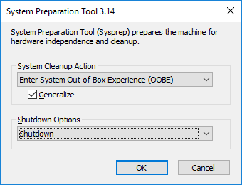

# Upload a generalized VHD and use it to create new VMs in Azure

This article walks you through using PowerShell to upload a VHD of a generalized VM to Azure, create an image from the VHD, and create a new VM from that image. You can upload a VHD exported from an on-premises virtualization tool or from another cloud. Using [Managed Disks](managed-disks-overview.md) for the new VM simplifies the VM management and provides better availability when the VM is placed in an availability set. 

For a sample script, see [Sample script to upload a VHD to Azure and create a new VM](../scripts/virtual-machines-windows-powershell-upload-generalized-script.md).

## Before you begin

- Before uploading any VHD to Azure, you should follow [Prepare a Windows VHD or VHDX to upload to Azure](prepare-for-upload-vhd-image.md?toc=%2fazure%2fvirtual-machines%2fwindows%2ftoc.json).
- Review [Plan for the migration to Managed Disks](on-prem-to-azure.md#plan-for-the-migration-to-managed-disks) before starting your migration to [Managed Disks](managed-disks-overview.md).

[!INCLUDE [updated-for-az.md](../../../includes/updated-for-az.md)]


## Generalize the source VM by using Sysprep

Sysprep removes all your personal account information, among other things, and prepares the machine to be used as an image. For details about Sysprep, see the [Sysprep Overview](https://docs.microsoft.com/windows-hardware/manufacture/desktop/sysprep--system-preparation--overview).

Make sure the server roles running on the machine are supported by Sysprep. For more information, see [Sysprep Support for Server Roles](https://msdn.microsoft.com/windows/hardware/commercialize/manufacture/desktop/sysprep-support-for-server-roles).

> [!IMPORTANT]
> If you plan to run Sysprep before uploading your VHD to Azure for the first time, make sure you have [prepared your VM](prepare-for-upload-vhd-image.md?toc=%2fazure%2fvirtual-machines%2fwindows%2ftoc.json). 
> 
> 

1. Sign in to the Windows virtual machine.
2. Open the Command Prompt window as an administrator. Change the directory to %windir%\system32\sysprep, and then run `sysprep.exe`.
3. In the **System Preparation Tool** dialog box, select **Enter System Out-of-Box Experience (OOBE)**, and make sure that the **Generalize** check box is enabled.
4. For **Shutdown Options**, select **Shutdown**.
5. Select **OK**.
   
    
6. When Sysprep finishes, it shuts down the virtual machine. Do not restart the VM.


## Get a storage account

You'll need a storage account in Azure to store the uploaded VM image. You can either use an existing storage account or create a new one. 

If you'll be using the VHD to create a managed disk for a VM, the storage account location must be the same location where you'll be creating the VM.

To show the available storage accounts, enter:

```azurepowershell
Get-AzStorageAccount | Format-Table
```

## Upload the VHD to your storage account

Use the [Add-AzVhd](https://docs.microsoft.com/powershell/module/az.compute/add-azvhd) cmdlet to upload the VHD to a container in your storage account. This example uploads the file *myVHD.vhd* from *C:\Users\Public\Documents\Virtual hard disks\\* to a storage account named *mystorageaccount* in the *myResourceGroup* resource group. The file will be placed into the container named *mycontainer* and the new file name will be *myUploadedVHD.vhd*.

```powershell
$rgName = "myResourceGroup"
$urlOfUploadedImageVhd = "https://mystorageaccount.blob.core.windows.net/mycontainer/myUploadedVHD.vhd"
Add-AzVhd -ResourceGroupName $rgName -Destination $urlOfUploadedImageVhd `
    -LocalFilePath "C:\Users\Public\Documents\Virtual hard disks\myVHD.vhd"
```


If successful, you get a response that looks similar to this:

```powershell
MD5 hash is being calculated for the file C:\Users\Public\Documents\Virtual hard disks\myVHD.vhd.
MD5 hash calculation is completed.
Elapsed time for the operation: 00:03:35
Creating new page blob of size 53687091712...
Elapsed time for upload: 01:12:49

LocalFilePath           DestinationUri
-------------           --------------
C:\Users\Public\Doc...  https://mystorageaccount.blob.core.windows.net/mycontainer/myUploadedVHD.vhd
```

Depending on your network connection and the size of your VHD file, this command may take a while to complete.

### Other options for uploading a VHD
 
You can also upload a VHD to your storage account using one of the following:

- [AzCopy](https://aka.ms/downloadazcopy)
- [Azure Storage Copy Blob API](https://msdn.microsoft.com/library/azure/dd894037.aspx)
- [Azure Storage Explorer Uploading Blobs](https://azurestorageexplorer.codeplex.com/)
- [Storage Import/Export Service REST API Reference](https://msdn.microsoft.com/library/dn529096.aspx)
-	We recommend using the Import/Export Service if estimated uploading time is longer than seven days. You can use [DataTransferSpeedCalculator](https://github.com/Azure-Samples/storage-dotnet-import-export-job-management/blob/master/DataTransferSpeedCalculator.html) to estimate the time from data size and transfer unit. 
	Import/Export can be used to copy to a standard storage account. You'll need to copy from standard storage to premium storage account by using a tool like AzCopy.

> [!IMPORTANT]
> If you are using AzCopy to upload your VHD to Azure, make sure you have set [**/BlobType:page**](https://docs.microsoft.com/azure/storage/common/storage-use-azcopy-blobs#upload-a-file) before running your upload script. 
> If the destination is a blob and this option is not specified, by default AzCopy creates a block blob.
> 
> 


## Create a managed image from the uploaded VHD 

Create a managed image from your generalized OS VHD. Replace the following values with your own information.


First, set some parameters:

```powershell
$location = "East US" 
$imageName = "myImage"
```

Create the image using your generalized OS VHD.

```powershell
$imageConfig = New-AzImageConfig `
   -Location $location
$imageConfig = Set-AzImageOsDisk `
   -Image $imageConfig `
   -OsType Windows `
   -OsState Generalized `
   -BlobUri $urlOfUploadedImageVhd `
   -DiskSizeGB 20
New-AzImage `
   -ImageName $imageName `
   -ResourceGroupName $rgName `
   -Image $imageConfig
```


## Create the VM

Now that you have an image, you can create one or more new VMs from the image. This example creates a VM named *myVM* from *myImage*, in *myResourceGroup*.


```powershell
New-AzVm `
    -ResourceGroupName $rgName `
    -Name "myVM" `
	-ImageName $imageName `
    -Location $location `
    -VirtualNetworkName "myVnet" `
    -SubnetName "mySubnet" `
    -SecurityGroupName "myNSG" `
    -PublicIpAddressName "myPIP" `
    -OpenPorts 3389
```


## Next steps

Sign in to your new virtual machine. For more information, see [How to connect and log on to an Azure virtual machine running Windows](connect-logon.md?toc=%2fazure%2fvirtual-machines%2fwindows%2ftoc.json). 

