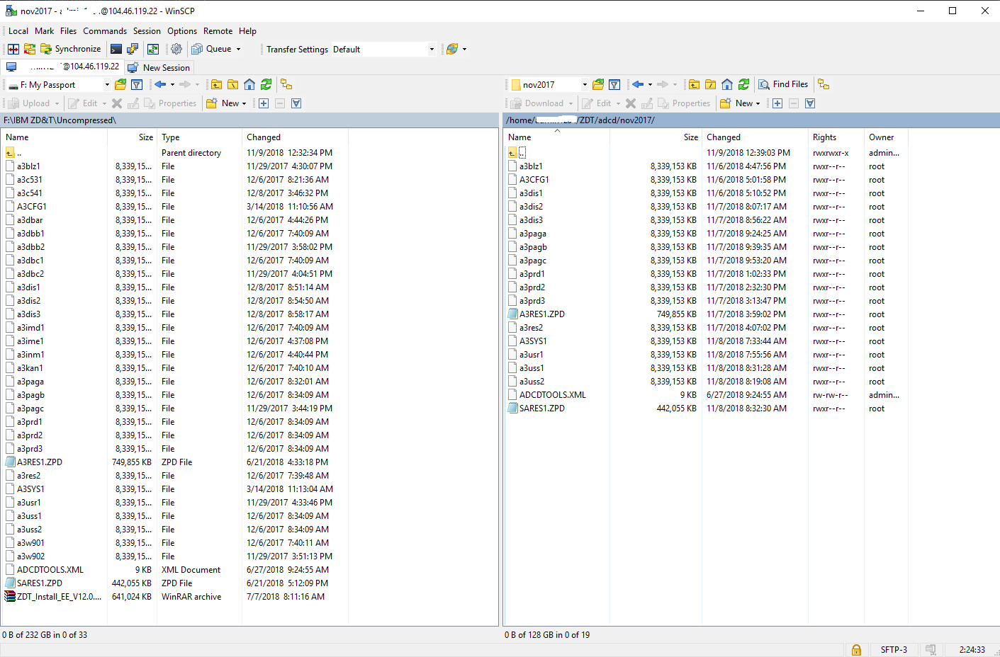
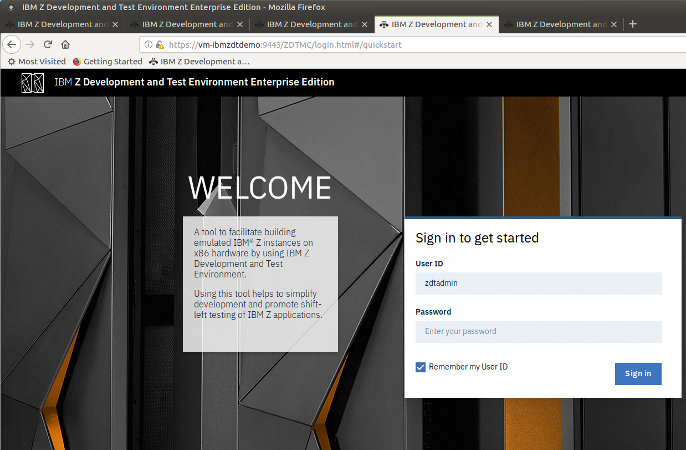
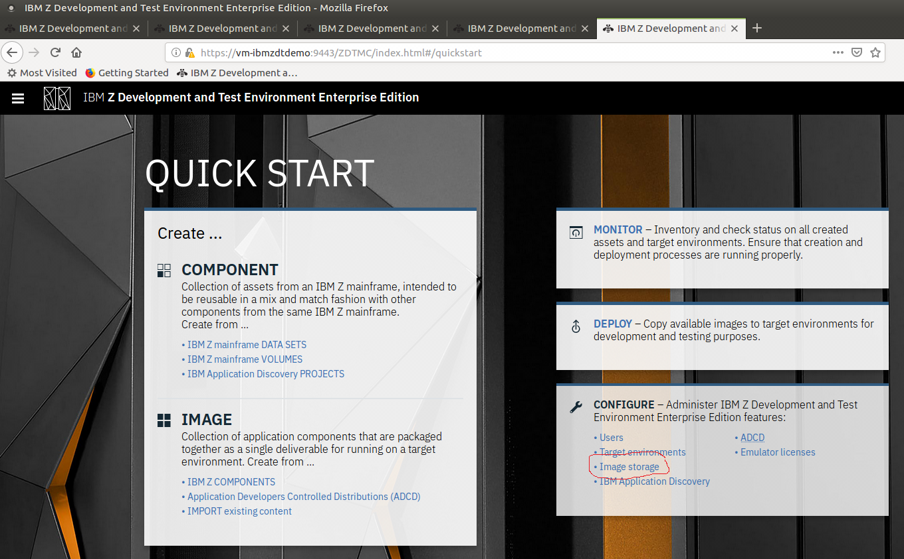
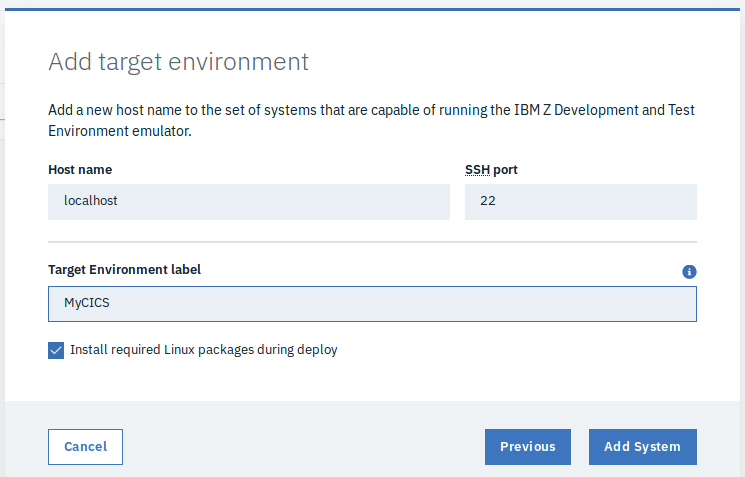
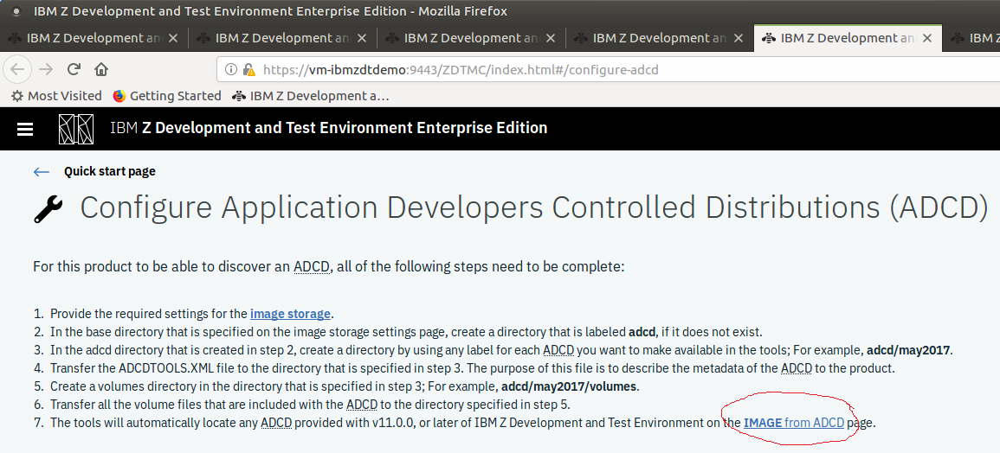
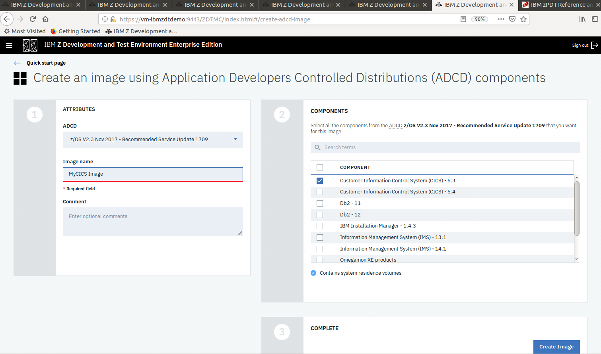
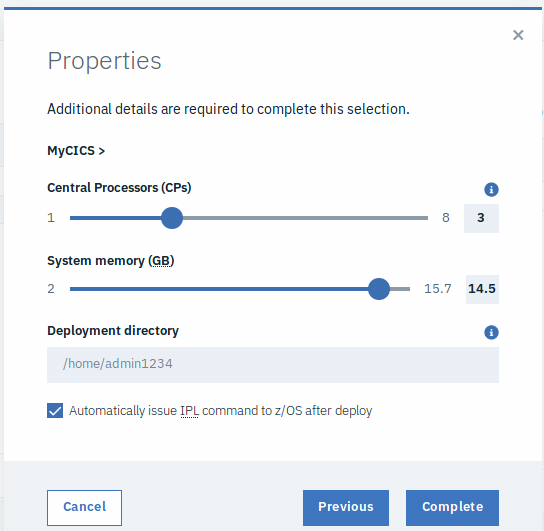

# Set up an Application Developers Controlled Distribution (ADCD) in IBM zD&T v1

You can run an IBM Z Development and Test Environment (zD&T) environment on Azure Virtual Machines (VMs). This environment emulates the IBM Z Series architecture. It can host a variety of Z Series operating systems or installations (also called Z Instances or Packages), which are made available through customized bundles called the IBM Application Developers Controlled Distributions (ADCDs).

This article shows you how to set up an ADCD instance in a zD&T environment on Azure. ADCDs create complete Z Series operating system implementations for development and testing environments that run in zD&T.

Like zD&T, ADCDs are available only to IBM customers and partners and are exclusively for development and testing purposes. They are not to be used for production environments. Numerous IBM installation packages are available for download through [Passport Advantage](https://www.ibm.com/support/knowledgecenter/en/SSTQBD_12.0.0/com.ibm.zsys.rdt.guide.adcd.doc/topics/installation_ps.html)
or [IBM PartnerWorld](https://www.ibm.com/partnerworld/public).

## Prerequisites

- An Azure subscription. If you don't have one, create a [free account](https://azure.microsoft.com/free/?WT.mc_id=A261C142F) before you begin.

- The [zD&T environment][ibm-install-z] previously set up on Azure. This article assumes that you are using the same Ubuntu 16.04 VM image created earlier.

- Access to the ADCD media through IBM PartnerWorld or Passport Advantage.

- A [licensing server](https://www.ibm.com/support/knowledgecenter/en/SSTQBD_12.0.0/com.ibm.zsys.rdt.tools.user.guide.doc/topics/zdt_ee.html). This is required to run IBM zD&T. The way you create it depends on how you license the software from IBM:

  - **Hardware-based licensing server** requires a USB hardware device that contains the Rational Tokens necessary to access all portions of the software. You must obtain this from IBM.

  - **Software-based licensing server** requires you to set up a centralized server for the management of the licensing keys. This method is preferred and requires you to set up the keys you receive from IBM in the management server.

## Download the installation packages from Passport Advantage

Access to the ADCD media is required. The steps below assume you are an IBM customers and can use Passport Advantage. IBM partners can use [IBM PartnerWorld](https://www.ibm.com/partnerworld/public).

> [!NOTE]
> This article assumes that a Windows PC is used to access Azure portal and to download the IBM media. If you are using a Mac or Ubuntu desktop, the commands and process for obtaining the IBM media may differ slightly.

1. Log on to [Passport Advantage](https://www.ibm.com/software/howtobuy/passportadvantage/paocustomer).

2. Select **Software Downloads** and **Media Access**.

3. Select **Program offering and agreement number**, and click **Continue**.

4. Enter the part description or part number, and click **Finder**.

5. Optionally, click the alphabetical order list to display and view theproduct by name.

6. Select **All Operating Systems** in the **Operating system field**, and **All Languages** in the **Languages field**. Then, click **Go**.

7. Click **Select individual files** to expand the list and display the individual media to download.

8. Verify the package(s) that you want to download, select **Download**, and then download the files to the directory you want.

## Upload the ADCD package(s)

Now that you have the package(s), you must upload them to your VM on Azure.

1. In the Azure portal, initiate a **ssh** session with the Ubuntu VM you created. Go to your VM, select the **Overview** blade, and then select **Connect**.

2. Select the **SSH** tab, and then copy the ssh command to the clipboard.

3. Log on to your VM using your credentials and the [SSH client](../../../linux/use-remote-desktop.md) of choice. This demo uses the Linux extensions for Windows 10, which adds a bash shell to the Windows command prompt. PuTTY works just as well.

4. When logged on, create a directory to upload the IBM packages. Keep in mind Linux is case sensitive. For example, this demo assumes the packages are uploaded to:

    `/home/MyUserID/ZDT/adcd/nov2017/volumes`

5. Upload the files using an SSH client such as[WinSCP](https://winscp.net/eng/index.php). Since SCP is a part of SSH , it uses port 22, which is what SSH uses. If your local computer is not Windows, you can type the [scp command](http://man7.org/linux/man-pages/man1/scp.1.html) in your SSH session.

6. Initiate the upload to the Azure VM directory you created, which becomes the image storage for zD&T.

    > [!NOTE]
    > Make sure that **ADCDTOOLS.XML** is included in the upload to the **home/MyUserID/ZDT/adcd/nov2017** directory. You will need it later.

7. Wait for the files to upload, which may take some time depending on your connection to Azure.

8. When the uploads are complete, navigate to the volumes directory and decompress all of the **gz** volumes:

    ```console
    gunzip \*.gz
    ```
    


## Configure the image storage

The next step is to configure zD&T to use the uploaded package(s). The image storage process within zD&T allows you to mount and use the images. It can use SSH or FTP.

1. Start the **zDTServer**. To do this, you must be at the root level. Enter the following two commands in order:
    ```console
    sudo su -
    /opt/ibm/zDT/bin/startServer
    ```
2. Note the URL output by the command and use this URL to access the web server. It looks similar to:
     > https://(your VM name or IP address):9443/ZDTMC/index.html
     >
     > Remember, your web access uses port 9443. Use this to log on to the web server. The user ID for ZD&T is **zdtadmin** and the password is **password**.

    

3. On the **Quick Start** page, under **Configure**, select **Image Storage**.

     

4. On the **Configure image storage** page, select **SSH File Transfer Protocol**.

5. For **Host name**, type **Localhost** and enter the directory path for where you uploaded the images. For example, /home/MyUserID/ZDT/adcd/nov2017/volumes.

6. Enter the **User ID** and **password** for the VM. Do not use the ZD&T user ID and password.

7. Test the connection to make sure you have access, and then select **Save** to save the configuration.

## Configure the target environments

The next step is to configure the zD&T target environment. This emulated hosted environment is where your images run.

1. On the **Quick Start** page, under **Configure**, select **Target environments**.

2. On the **Configure target environments** page, select **Add Target**.

3. Select **Linux**. IBM supports two types of environments, Linux and Cloud(OpenStack), but this demo runs on Linux.

4. On the **Add target environment** page, for **Host name**, enter **localhost**. Keep **SSH port** set to **22**.

5. In the **Target Environment label** box, enter a label such as **MyCICS.**

     

## Configure ADCD and deploy

After completing the previous configuration steps, you must configure zD&T to use the package(s) and target environment. Again, you use the image storage process in zD&T, which allows you to mount and use the images. It can use SSH or FTP.

1. On the **Quick Start** page, under **Configure**, select **ADCD**. A set of instructions appear, telling you the steps that need to be completed before an ADCD package can be mounted. This explains why we named the target directory the way we did earlier.

2. Assuming all the images were uploaded to the correct directories, click the **IMAGE from ADCD** link displayed in the lower right (shown in step 7 in the following screenshot).

     

## Create the image

When the previous configuration step is complete, the **Create an image using ADCD Components** page appears.

1. Select the volume (Nov 2017 in this case) to display the different packages that are in that volume.

2. For this demo, select **Customer Information Control System (CICS) - 5.3**.

3. In the **Image name** box, type a name for the image such as **MyCICS Image**.

4. Select the **Create Image** button at the lower right.

     

5. In the window that appears, telling you the image was deployed successfully, choose **Deploy images**.

6. On the **Deploy an image to a target environment** page, select the image you created on the previous page (**MyCICS Image**) and the target environment created earlier (**MyCICS**).

7. On the next screen, provide your credentials for the VM (that is, not the ztadmin credential).

8. In the Properties pane, enter the number of **Central processors (CPs)**, the amount of **System memory (GB)**, and the **deployment directory** for the running image. Since this is a demo, keep it small.

9. Make sure the box is selected for **Automatically issue IPL command to z/OS after deploy**.

     

10. Select **Complete**.

11. Select **Deploy Image** from the **Deploy an image to a target environment** page.

Your image can now deploy and is ready to be mounted by a 3270 terminal emulator.

> [!NOTE]
> If you receive an error saying you do not have enough disk space, note that the region requires 151 Gb.

Congratulations! You are now running an IBM mainframe environment on Azure.

## Learn more

- [Mainframe migration: myths and facts](/azure/architecture/cloud-adoption/infrastructure/mainframe-migration/myths-and-facts)
- [IBM DB2 pureScale on Azure](../../../linux/ibm-db2-purescale-azure.md)
- [Troubleshooting](../../../troubleshooting/index.yml)
- [Demystifying mainframe to Azure migration](https://azure.microsoft.com/resources/demystifying-mainframe-to-azure-migration/)

<!-- INTERNAL LINKS -->
[microfocus-get-started]: /microfocus/get-started.md
[microfocus-setup]: /microfocus/set-up-micro-focus-on-azure.md
[microfocus-demo]: /microfocus/demo.md
[ibm-get-started]: /ibm/get-started.md
[ibm-install-z]: install-ibm-z-environment.md
[ibm-demo]: /ibm/demo.md
