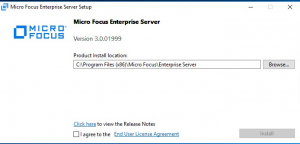
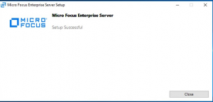
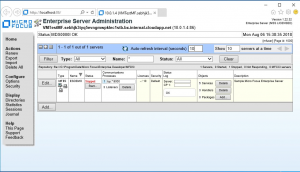
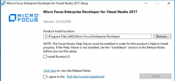
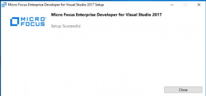
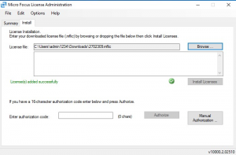

# Install Micro Focus Enterprise Server 4.0 and Enterprise Developer 4.0 on Azure

This article shows how to set up [Micro Focus Enterprise Server 4.0](https://www.microfocus.com/documentation/enterprise-developer/es30/) and
[Micro Focus Enterprise Developer 4.0](https://www.microfocus.com/documentation/enterprise-developer/ed_30/) on Azure.

A common workload on Azure is a development and test environment. This scenario is common because it's so cost-effective and easy to deploy and tear down. With Enterprise Server, Micro Focus has created one of the largest mainframe rehosting platforms available. You can run z/OS workloads on a less expensive x86 platform on Azure using either Windows or Linux virtual machines (VMs).

> [!NOTE]
> Coming soon: Instructions for setting up [Micro Focus Enterprise Server 5.0](https://techcommunity.microsoft.com/t5/azurecat/micro-focus-enterprise-server-5-0-quick-start-template-on-azure/ba-p/1160110) on Azure VMs.

This setup uses Azure VMs running the Windows Server 2016 image from the Azure Marketplace with Microsoft SQL Server 2017 already installed. This setup also applies to Azure Stack.

The corresponding development environment for Enterprise Server is Enterprise Developer, which runs on either Microsoft Visual Studio 2017 or later, Visual Studio Community (free to download), or Eclipse. This article shows how to deploy it using a Windows Server 2016 virtual machine that comes with Visual Studio 2017 or later installed.

## Prerequisites

Before getting started, check out these prerequisites:

- An Azure subscription. If you don't have one, create a [free account](https://azure.microsoft.com/free/?WT.mc_id=A261C142F) before you begin.

- The Micro Focus software and a valid license (or trial license). If you're an existing Micro Focus customer, contact your Micro Focus representative. Otherwise, [request a trial](https://www.microfocus.com/products/enterprise-suite/enterprise-server/trial/).

- Get the documentation for [Enterprise Server and Enterprise Developer](https://www.microfocus.com/documentation/enterprise-developer/#").

> [!NOTE]
> A best practice is to set up a site-to-site virtual private network (VPN) tunnel or a jumpbox so you can control access to the Azure VMs.

## Install Enterprise Server

1. For better security and manageability, consider creating a new resource group just for this project—for example, **RGMicroFocusEntServer**. Use the first part of the name in Azure to choose the type of resource to make it easier to spot in a list.

2. Create a virtual machine. From the Azure Marketplace, select the virtual machine and operating system you want. Here’s a recommended setup:

    - **Enterprise Server**: Select ES2 v3 VM (with 2 vCPUs and 16 GB memory) with Windows Server 2016 and SQL Server 2017 installed. This image is available from the Azure Marketplace. Enterprise Server can use Azure SQL Database as well.

    - **Enterprise Developer**: Select B2ms VM (with 2 vCPUs and 8 GB memory) with Windows 10 and Visual Studio installed. This image is available from the Azure Marketplace.

3. In the **Basics** section, enter your username and password. Select the **Subscription** and **Location/Region** you would like to use for the VMs. Select **RGMicroFocusEntServer** for the Resource Group.

4. Put both VMs into the same virtual network so they can communicate with each other.

5. Accept the defaults for the rest of the settings. Remember the username and password you create for the administrator of these VMs.

6. When the virtual machines have been created, open inbound ports 9003, 86, and 80 for HTTP and 3389 for RDP on the Enterprise Server machine and 3389 on the Developer machine.

7. To sign in to the Enterprise Server virtual machine, in Azure portal, select the ES2 v3 VM. Go to the **Overview** section and select **Connect** to launch an RDP session. Sign in using the credentials you created for the VM.

8. From the RDP session, load the following two files. Because you're using Windows, you can drag and drop the files into the RDP session:

    - **es\_40.exe**, the Enterprise Server installation file.

    - **mflic**, the corresponding license file—Enterprise Server won't load without it.

9. Double-click the file to start the installation. In the first window, select the installation location and accept the end-user license agreement.

     

     When Setup is complete, the following message appears:

     

### Check for updates

After the installation, be sure to check for any additional updates since a number of prerequisites such as the Microsoft C++ Redistributable and .NET Framework are installed along with Enterprise Server.

### Upload the license

1. Start the Micro Focus License Administration.

2. Click **Start** \> **Micro Focus License Manager** \> **License Administration**, and then click the **Install** tab. Choose the type of license format to upload: a license file or a 16-character license code. For example, for a file, in **License file**, browse to the **mflic** file uploaded previously to the VM and select **Install Licenses**.

     

3. Verify that Enterprise Server loads. Try launching the Enterprise Server Administration site from a browser using this URL <http://localhost:86/> . The Enterprise Server Administration page is displayed as shown.

     

## Install Enterprise Developer on the developer machine

1. Select the resource group created earlier (for example, **RGMicroFocusEntServer**), then select the developer image.

2. To sign in to the virtual machine, go to the **Overview** section and select **Connect**. This sign in launches an RDP session. Sign in using the credentials you created for the VM.

3. From the RDP session, load the following two files (drag and drop if you like):

    - **edvs2017.exe**, the Enterprise Server installation file.

    - **mflic**, the corresponding license file (Enterprise Developer will not load without it).

4. Double-click the **edvs2017.exe** file to start the installation. In the first window, select the installation location and accept the end-user license agreement. If you want, choose **Install Rumba 9.5** to install this terminal emulator, which you'll probably need.

     

5. After setup is complete, the following message appears:

     

6. Start the Micro Focus License Manager just as you did for Enterprise Server. Choose **Start** \> **Micro Focus License Manager** \> **License Administration**, and click the **Install** tab.

7. Choose the type of license format to upload: a license file or a 16-character license code. For example, for a file, in **License file**, browse to the **mflic** file uploaded previously to the VM and select **Install Licenses**.

     

When Enterprise Developer loads, your deployment of a Micro Focus development and test environment on Azure is complete!

## Next steps

- [Set up the Bank Demo application](./demo.md)
- [Run Enterprise Server in Docker containers](./run-enterprise-server-container.md)
- [Mainframe application migration](/azure/architecture/cloud-adoption/infrastructure/mainframe-migration/application-strategies)
