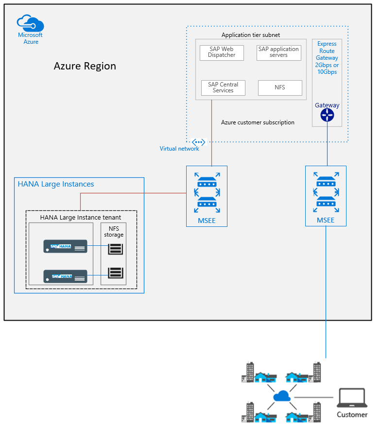

# SAP HANA (Large Instances) architecture on Azure

At a high level, the SAP HANA on Azure (Large Instances) solution has the SAP application layer residing in VMs. The database layer resides on SAP TDI-configured hardware located in a Large Instance stamp in the same Azure region that is connected to Azure IaaS.

> [!NOTE]
> Deploy the SAP application layer in the same Azure region as the SAP DBMS layer. This rule is well documented in published information about SAP workloads on Azure. 

The overall architecture of SAP HANA on Azure (Large Instances) provides an SAP TDI-certified hardware configuration, which is a non-virtualized, bare metal, high-performance server for the SAP HANA database. It also provides the ability and flexibility of Azure to scale resources for the SAP application layer to meet your needs.

The architecture shown is divided into three sections:

- **Right**: Shows an on-premises infrastructure that runs different applications in data centers so that end users can access LOB applications, such as SAP. Ideally, this on-premises infrastructure is connected to Azure with [ExpressRoute](https://azure.microsoft.com/services/expressroute/).

- **Center**: Shows Azure IaaS and, in this case, use of VMs to host SAP or other applications that use SAP HANA as a DBMS system. Smaller HANA instances that function with the memory that VMs provide are deployed in VMs together with their application layer. For more information about virtual machines, see [Virtual machines](https://azure.microsoft.com/services/virtual-machines/).

   Azure network services are used to group SAP systems together with other applications into virtual networks. These virtual networks connect to on-premises systems as well as to SAP HANA on Azure (Large Instances).

   For SAP NetWeaver applications and databases that are supported to run in Azure, see [SAP Support Note #1928533 – SAP applications on Azure: Supported products and Azure VM types](https://launchpad.support.sap.com/#/notes/1928533). For documentation on how to deploy SAP solutions on Azure, see:

  -  [Use SAP on Windows virtual machines](./get-started.md?toc=/azure/virtual-machines/linux/toc.json)
  -  [Use SAP solutions on Azure virtual machines](get-started.md?toc=%2fazure%2fvirtual-machines%2flinux%2ftoc.json)

- **Left**: Shows the SAP HANA TDI-certified hardware in the Azure Large Instance stamp. The HANA Large Instance units are connected to the virtual networks of your Azure subscription by using the same technology as the connectivity from on-premises into Azure. As of May 2019, an optimization got introduced that allows to communicate between the HANA Large Instance units and the Azure VMs without involvement of the ExpressRoute Gateway. This optimization called ExpressRoute Fast Path is displayed in this architecture (red lines). 

The Azure Large Instance stamp itself combines the following components:

- **Computing**: Servers that are based on different generation of Intel Xeon processors that provide the necessary computing capability and are SAP HANA certified.
- **Network**: A unified high-speed network fabric that interconnects the computing, storage, and LAN components.
- **Storage**: A storage infrastructure that is accessed through a unified network fabric. The specific storage capacity that is provided depends on the specific SAP HANA on Azure (Large Instances) configuration that is deployed. More storage capacity is available at an additional monthly cost.

Within the multi-tenant infrastructure of the Large Instance stamp, customers are deployed as isolated tenants. At deployment of the tenant, you name an Azure subscription within your Azure enrollment. This Azure subscription is the one that the HANA Large Instance is billed against. These tenants have a 1:1 relationship to the Azure subscription. For a network, it's possible to access a HANA Large Instance unit deployed in one tenant in one Azure region from different virtual networks that belong to different Azure subscriptions. Those Azure subscriptions must belong to the same Azure enrollment. 

As with VMs, SAP HANA on Azure (Large Instances) is offered in multiple Azure regions. To offer disaster recovery capabilities, you can choose to opt in. Different Large Instance stamps within one geo-political region are connected to each other. For example, HANA Large Instance Stamps in US West and US East are connected through a dedicated network link for disaster recovery replication. 

Just as you can choose between different VM types with Azure Virtual Machines, you can choose from different SKUs of HANA Large Instance that are tailored for different workload types of SAP HANA. SAP applies memory-to-processor-socket ratios for varying workloads based on the Intel processor generations. The following table shows the SKU types offered.

You can find available SKUs [Available SKUs for HLI](hana-available-skus.md).

**Next steps**
- Refer [SAP HANA (Large Instances) network architecture](hana-network-architecture.md)
