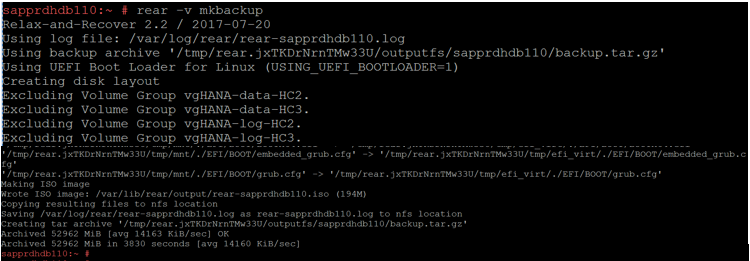

# OS backup and restore for Type II SKUs of Revision 3 stamps

This document describes the steps to perform an operating system file level backup and restore for the **Type II  SKUs** of the HANA Large Instances of Revision 3. 

>[!Important]
> **This article does not apply to Type II SKU deployments in Revision 4 HANA Large Instance stamps.** Boot LUNS of Type II HANA Large Instance units which are deployed in Revision 4 HANA Large Instance stamps can be backed up with storage snapshots as this is the case with Type I SKUs already in Revision 3 stamps


>[!NOTE]
>The OS backup scripts uses the ReaR software, which is pre-installed in the server.  

After the provisioning is complete by the Microsoft `Service Management` team, by default, the server is configured with two backup schedules to back up the file system level back of the operating system. You can check the schedules of the backup jobs by using the following command:
```
#crontab –l
```
You can change the backup schedule anytime using the following command:
```
#crontab -e
```
## How to take a manual backup?

The OS file system backup is scheduled using a **cron job** already. However, you can perform the operating system file level backup manually as well. To perform a manual backup, run the following command:

```
#rear -v mkbackup
```
The following screen show shows the sample manual backup:




## How to restore a backup?

You can restore a full backup or an individual file from the backup. To restore, use the following command:

```
#tar  -xvf  <backup file>  [Optional <file to restore>]
```
After the restore, the file is recovered in the current working directory.

The following command shows the restore of a file */etc/fstabfrom* the backup file *backup.tar.gz*
```
#tar  -xvf  /osbackups/hostname/backup.tar.gz  etc/fstab 
```
>[!NOTE] 
>You need to copy the file to desired location after it is restored from the backup.

The following screenshot shows the restore of a complete backup:


## How to install the ReaR tool and change the configuration? 

The Relax-and-Recover (ReaR) packages are **pre-installed** in the **Type II SKUs** of HANA Large Instances, and no action needed from you. You can directly start using the ReaR for the operating system backup.
However, in the circumstances where you need to install the packages in your own, you can follow the listed steps to install and configure the ReaR tool.

To install the **ReaR** backup packages, use the following commands:

For **SLES** operating system, use the following command:
```
#zypper install <rear rpm package>
```
For **RHEL** operating system, use the following command: 
```
#yum install rear -y
```
To configure the ReaR tool, you need to update parameters **OUTPUT_URL**  and **BACKUP_URL**  in the *file /etc/rear/local.conf*.
```
OUTPUT=ISO
ISO_MKISOFS_BIN=/usr/bin/ebiso
BACKUP=NETFS
OUTPUT_URL="nfs://nfsip/nfspath/"
BACKUP_URL="nfs://nfsip/nfspath/"
BACKUP_OPTIONS="nfsvers=4,nolock"
NETFS_KEEP_OLD_BACKUP_COPY=
EXCLUDE_VG=( vgHANA-data-HC2 vgHANA-data-HC3 vgHANA-log-HC2 vgHANA-log-HC3 vgHANA-shared-HC2 vgHANA-shared-HC3 )
BACKUP_PROG_EXCLUDE=("${BACKUP_PROG_EXCLUDE[@]}" '/media' '/var/tmp/*' '/var/crash' '/hana' '/usr/sap'  ‘/proc’)
```

The following screenshot shows the restore of a complete backup:

