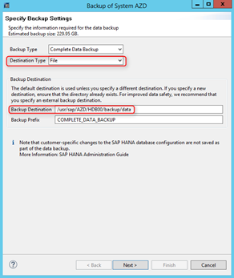
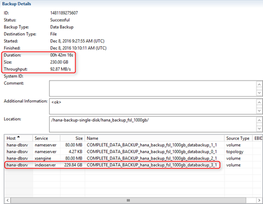
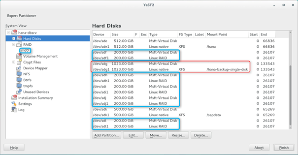
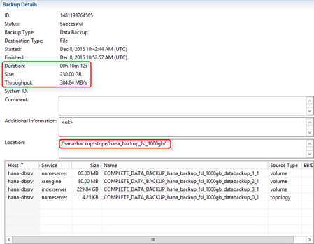
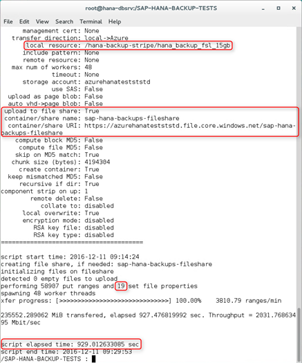

# SAP HANA Azure Backup on file level

## Introduction

This article is a related article to [Backup guide for SAP HANA on Azure Virtual Machines](./sap-hana-backup-guide.md), which provides an overview and information on getting started and more details on Azure Backup service and storage snapshots. 

Different VM types in Azure allow a different number of VHDs attached. The exact details are documented in [Sizes for Linux virtual machines in Azure](../../sizes.md). For the tests referred to in this documentation we used a GS5 Azure VM, which allows 64 attached data disks. For larger SAP HANA systems, a significant number of disks might already be taken for data and log files, possibly in combination with software striping for optimal disk IO throughput. For more details on suggested disk configurations for SAP HANA deployments on Azure VMs, read the article [SAP HANA Azure virtual machine storage configurations](./hana-vm-operations-storage.md). The recommendations made are including disk space recommendations for local backups as well.

The standard way to manage backup/restore at the file level is with a file-based backup via SAP HANA Studio or via SAP HANA SQL statements. For more information, read the article [SAP HANA SQL and System Views Reference](https://help.sap.com/hana/SAP_HANA_SQL_and_System_Views_Reference_en.pdf).

This figure shows the dialog of the backup menu item in SAP HANA Studio. When choosing type &quot;file,&quot; one has to specify a path in the file system where SAP HANA writes the backup files. Restore works the same way.

While this choice sounds simple and straight forward, there are some considerations. An Azure VM has a limitation of number of data disks that can be attached. There might not be capacity to store SAP HANA backup files on the file systems of the VM, depending on the size of the database and disk throughput requirements, which might involve software striping across multiple data disks. Various options for moving these backup files, and managing file size restrictions and performance when handling terabytes of data, are provided later in this article.

Another option, which offers more freedom regarding total capacity, is Azure blob storage. While a single blob is also restricted to 1 TB, the total capacity of a single blob container is currently 500 TB. Additionally, it gives customers the choice to select so-called &quot;cool&quot; blob storage, which has a cost benefit. See [Azure Blob storage: hot, cool, and archive access tiers](../../../storage/blobs/storage-blob-storage-tiers.md?tabs=azure-portal) for details about cool blob storage.

For additional safety, use a geo-replicated storage account to store the SAP HANA backups. See [Azure Storage redundancy](../../../storage/common/storage-redundancy.md) for details about storage redundancy and storage replication.

One could place dedicated VHDs for SAP HANA backups in a dedicated backup storage account that is geo-replicated. Or else one could copy the VHDs that keep the SAP HANA backups to a geo-replicated storage account, or to a storage account that is in a different region.

## Azure blobxfer utility details

To store directories and files on Azure storage, one could use CLI or PowerShell, or develop a tool using one of the [Azure SDKs](https://azure.microsoft.com/downloads/). There is also a ready-to-use utility, AzCopy, for copying data to Azure storage. (see [Transfer data with the AzCopy Command-Line Utility](../../../storage/common/storage-use-azcopy-v10.md)).

Therefore, blobxfer was used for copying SAP HANA backup files. It is open source, used by many customers in production environments, and available on [GitHub](https://github.com/Azure/blobxfer). This tool allows one to copy data directly to either Azure blob storage or Azure file share. It also offers a range of useful features, like md5 hash, or automatic parallelism when copying a directory with multiple files.

## SAP HANA backup performance
In this chapter, performance considerations are discussed. The numbers achieved may not represent most recent state since there is steady development to achieve better throughput to Azure storage. As a result, you should perform individual tests for your configuration and Azure region.

This screenshot shows the SAP HANA backup console of SAP HANA Studio. It took about 42 minutes to perform a backup of 230 GB on a single Azure Standard HDD storage disk attached to the HANA VM using  the XFS file system on the one disk.

This screenshot is of YaST on the SAP HANA test VM. You can see the 1-TB single disk for SAP HANA backup. It took about 42 minutes to backup 230 GB. In addition, five 200-GB disks were attached and software RAID md0 created, with striping on top of these five Azure data disks.

Repeating the same backup on software RAID with striping across five attached Azure standard storage data disks brought the backup time from 42 minutes down to 10 minutes. The disks were attached without caching to the VM. This exercise demonstrates the importance of disk write throughput for achieving good backup time. You could switch to Azure Standard SSD storage or Azure Premium Storage to further accelerate the process for optimal performance. In general, Azure standard HDD storage is not recommended and was used for demonstration purposes only. Recommendation is to use a minimum of Azure Standard SSD storage or Azure Premium Storage for production systems.

## Copy SAP HANA backup files to Azure blob storage
The performance numbers, backup duration numbers, and copy duration numbers mentioned might not represent most recent state of Azure technology. Microsoft is steadily improving Azure storage to deliver more throughput and lower latencies. Therefore the numbers are for demonstration purposes only. You need to test for your individual need in the Azure region of your choice to be able to judge with method is the best for you.

Another option to quickly store SAP HANA backup files is Azure blob storage. One single blob container has a limit of around 500 TB, enough for SAP HANA systems, using M32ts, M32ls, M64ls, and GS5 VM types of Azure, to keep sufficient SAP HANA backups. Customers have the choice between &quot;hot&quot; and &quot;cold&quot; blob storage (see [Azure Blob storage: hot, cool, and archive access tiers](../../../storage/blobs/storage-blob-storage-tiers.md?tabs=azure-portal)).

With the blobxfer tool, it is easy to copy the SAP HANA backup files directly to Azure blob storage.

You can see the files of a full SAP HANA file backup. Of the four files, the biggest one has roughly 230 GB size.

Not using md5 hash in the initial test, it took roughly 3000 seconds to copy the 230 GB to an Azure standard storage account blob container.

The HANA Studio backup console allows one to restrict the max file size of HANA backup files. In the sample environment, it improved performance by having multiple smaller backup files, instead of one large 230-GB file.

Setting the backup file size limit on the HANA side doesn&#39;t improve the backup time, because the files are written sequentially. The file size limit was set to 60 GB, so the backup created four large data files instead of the 230-GB single file. Using multiple backup files can become a necessity for backing up HANA databases if your backup targets have limitations on file sizes of blob sizes.

To test parallelism of the blobxfer tool, the max file size for HANA backups was then set to 15 GB, which resulted in 19 backup files. This configuration brought the time for blobxfer to copy the 230 GB to Azure blob storage from 3000 seconds down to 875 seconds.

As you are exploring copying backups performed against local disks to other locations, like Azure blob storage, keep in mind that the bandwidth used by an eventual parallel copy process is accounting against the network or storage quota of your individual VM type. As a result, you need to balance the duration of the copy against the network and storage bandwidth the normal workload running in the VM is requiring. 

## Copy SAP HANA backup files to NFS share

Microsoft Azure offer native NFS shares through [Azure NetApp Files](https://azure.microsoft.com/services/netapp/). You can create different volumes of dozen of TBs in capacity to store and manage backups. You also can snapshot those volumes based on NetApp's technology. Azure NetApp Files (ANF) is offered in three different service levels that give different storage throughput. For more details, read the article [Service levels for Azure NetApp Files](../../../azure-netapp-files/azure-netapp-files-service-levels.md). You can create and mount an NFS volume from ANF as described in the article [Quickstart: Set up Azure NetApp Files and create an NFS volume](../../../azure-netapp-files/azure-netapp-files-quickstart-set-up-account-create-volumes.md?tabs=azure-portal).

Besides using native NFS volumes of Azure through ANF, there are various possibilities of creating own deployments that provide NFS shares on Azure. All have the disadvantage that you need to deploy and manage those solutions yourself. Some of those possibilities are documented in these articles:

- [High availability for NFS on Azure VMs on SUSE Linux Enterprise Server](./high-availability-guide-suse-nfs.md)
- [GlusterFS on Azure VMs on Red Hat Enterprise Linux for SAP NetWeaver](./high-availability-guide-rhel-glusterfs.md)

NFS shares created by means described above can be used to directly execute HANA backups against or to copy backups that were performed against local disks to those NFS shares.

> [!NOTE]
> SAP HANA support NFS v3 and NFS v4.x. Any other format like SMB with CIFS file system is not supported to write HANA backups against. See also [SAP support note #1820529](https://launchpad.support.sap.com/#/notes/1820529)

## Copy SAP HANA backup files to Azure Files

It is possible to mount an Azure Files share inside an Azure Linux VM. The article [How to use Azure File storage with Linux](../../../storage/files/storage-how-to-use-files-linux.md) provides details on how to perform the configuration. For limitations of on Azure Files or Azure premium files, read the article [Azure Files scalability and performance targets](../../../storage/files/storage-files-scale-targets.md).

> [!NOTE]
> SMB with CIFS file system is not supported by SAP HANA to write HANA backups against. See also [SAP support note #1820529](https://launchpad.support.sap.com/#/notes/1820529). As a result, you only can use this solution as final destination of a HANA database backup that has been conducted directly against local attached disks
> 

In a test conducted against Azure Files, not Azure Premium Files it took around 929 seconds to copy 19 backup files with an overall volume of 230 GB. We expect the time using Azure Premium Files being way better. However, you need to keep in mind that you need to balance the interests of a fast copy with the requirements your workload has on network bandwidth. Since every Azure VM type enforces network bandwidth quota, you need to stay within the range of that quota with your workload plus the copy of the backup files.

Storing SAP HANA backup files on Azure files could be an interesting option. Especially with the improved latency and throughput of Azure Premium Files.

## Next steps
* [Backup guide for SAP HANA on Azure Virtual Machines](sap-hana-backup-guide.md) gives an overview and information on getting started.
* To learn how to establish high availability and plan for disaster recovery of SAP HANA on Azure (large instances), see [SAP HANA (large instances) high availability and disaster recovery on Azure](hana-overview-high-availability-disaster-recovery.md).