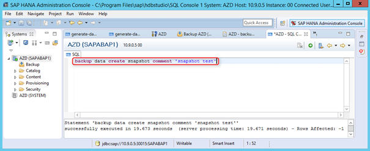
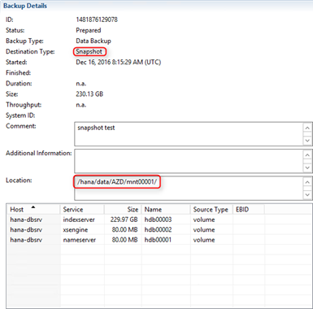
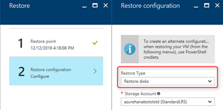
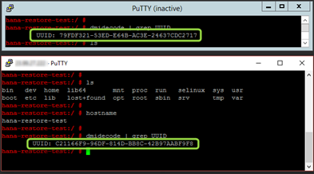
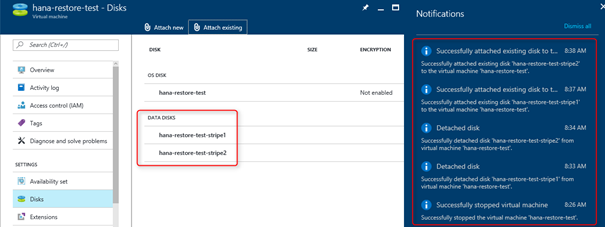

# SAP HANA backup based on storage snapshots

## Introduction

This is part of a three-part series of related articles on SAP HANA backup. [Backup guide for SAP HANA on Azure Virtual Machines](sap-hana-backup-guide.md) provides an overview and information on getting started, and [SAP HANA Azure Backup on file level](sap-hana-backup-file-level.md) covers the file-based backup option.

When using a VM backup feature for a single-instance all-in-one demo system, one should consider doing a VM backup instead of managing HANA backups at the OS level. An alternative is to take Azure blob snapshots to create copies of individual virtual disks, which are attached to a virtual machine, and keep the HANA data files. But a critical point is app consistency when creating a VM backup or disk snapshot while the system is up and running. See _SAP HANA data consistency when taking storage snapshots_ in the related article [Backup guide for SAP HANA on Azure Virtual Machines](sap-hana-backup-guide.md). SAP HANA has a feature that supports these kinds of storage snapshots.

## SAP HANA snapshots as central part of application consistent backups

There is a functionality in SAP HANA that supports taking a storage snapshot. There is a restriction to single-container systems. Scenarios sing SAP HANA MCS with more than one tenant do not support this kind of SAP HANA database snapshot (see [Create a Storage Snapshot (SAP HANA Studio)](https://help.sap.com/saphelp_hanaplatform/helpdata/en/a0/3f8f08501e44d89115db3c5aa08e3f/content.htm)).

It works as follows:

- Prepare for a storage snapshot by initiating the SAP HANA snapshot
- Run the storage snapshot (Azure blob snapshot, for example)
- Confirm the SAP HANA snapshot

This screenshot shows that an SAP HANA data snapshot can be created via a SQL statement.

The snapshot then also appears in the backup catalog in SAP HANA Studio.

On disk, the snapshot shows up in the SAP HANA data directory.

One has to ensure that the file system consistency is also guaranteed before running the storage snapshot while SAP HANA is in the snapshot preparation mode. See _SAP HANA data consistency when taking storage snapshots_ in the related article [Backup guide for SAP HANA on Azure Virtual Machines](sap-hana-backup-guide.md).

Once the storage snapshot is done, it is critical to confirm the SAP HANA snapshot. There is a corresponding SQL statement to run: BACKUP DATA CLOSE SNAPSHOT (see [BACKUP DATA CLOSE SNAPSHOT Statement (Backup and Recovery)](https://help.sap.com/saphelp_hanaplatform/helpdata/en/c3/9739966f7f4bd5818769ad4ce6a7f8/content.htm)).

> [!IMPORTANT]
> Confirm the HANA snapshot. Due to &quot;Copy-on-Write,&quot; SAP HANA might require additional disk space in snapshot-prepare mode, and it is not possible to start new backups until the SAP HANA snapshot is confirmed.

## HANA VM backup via Azure Backup service

The backup agent of the Azure Backup service is not available for Linux VMs. Moreover Linux does not have similar functionality as Windows has it with VSS.  To make use of Azure backup on the file/directory level, one would copy SAP HANA backup files to a Windows VM and then use the backup agent. 

Otherwise, only a full Linux VM backup is possible via the Azure Backup service. See [Overview of the features in Azure Backup](../../../backup/backup-introduction-to-azure-backup.md) to find out more.

The Azure Backup service offers an option to back up and restore a VM. More information about this service and how it works can be found in the article [Plan your VM backup infrastructure in Azure](../../../backup/backup-azure-vms-introduction.md).

There are two important considerations according to that article:

_&quot;For Linux virtual machines, only file-consistent backups are possible, since Linux does not have an equivalent platform to VSS.&quot;_

_&quot;Applications need to implement their own &quot;fix-up&quot; mechanism on the restored data.&quot;_

Therefore, one has to make sure SAP HANA is in a consistent state on disk when the backup starts. See _SAP HANA snapshots_ described earlier in the document. But there is a potential issue when SAP HANA stays in this snapshot preparation mode. See [Create a Storage Snapshot (SAP HANA Studio)](https://help.sap.com/saphelp_hanaplatform/helpdata/en/a0/3f8f08501e44d89115db3c5aa08e3f/content.htm) for more information.

That article states:

_&quot;It is strongly recommended to confirm or abandon a storage snapshot as soon as possible after it has been created. While the storage snapshot is being prepared or created, the snapshot-relevant data is frozen. While the snapshot-relevant data remains frozen, changes can still be made in the database. Such changes will not cause the frozen snapshot-relevant data to be changed. Instead, the changes are written to positions in the data area that are separate from the storage snapshot. Changes are also written to the log. However, the longer the snapshot-relevant data is kept frozen, the more the data volume can grow.&quot;_

Azure Backup takes care of the file system consistency via Azure VM extensions. These extensions are not available standalone, and work only in combination with Azure Backup service. Nevertheless, it is still a requirement to provide scripts to create and delete an SAP HANA snapshot to guarantee app consistency.

Azure Backup has four major phases:

- Execute prepare script - script needs to create an SAP HANA snapshot
- Take Snapshot
- Execute post-snapshot script - script needs to delete the SAP HANA created by the prepare script
- Transfer data to vault

For details on where to copy these scripts and details on how Azure Backup works exactly, check the following articles:

- [Plan your VM backup infrastructure in Azure](https://docs.microsoft.com/azure/backup/backup-azure-vms-introduction)
- [Application-consistent backup of Azure Linux VMs](https://docs.microsoft.com/azure/backup/backup-azure-linux-app-consistent)

At this point in time, Microsoft has not published prepare scripts and post-snapshot scripts for SAP HANA. You as customer or system integrator would need to create those scripts and configure the procedure based on the documentation referenced above.

## Restore from application consistent backup against a VM
The restore process of an application consistent backup taken by Azure backup is documented in the article [Recover files from Azure virtual machine backup](https://docs.microsoft.com/azure/backup/backup-azure-restore-files-from-vm). 

> [!IMPORTANT]
> In the article [Recover files from Azure virtual machine backup](https://docs.microsoft.com/azure/backup/backup-azure-restore-files-from-vm) is a list of exceptions and steps listed when using disk stripe sets. Striped disks are likely the regular VM configuration for SAP HANA. Therefore, it is essential to read the article and test the restore process for such cases as listed in the article. 

## HANA license key and VM restore via Azure Backup service

The Azure Backup service is designed to create a new VM during restore. There is no plan right now to do an &quot;in-place&quot; restore of an existing Azure VM.

This figure shows the restore option of the Azure service in the Azure portal. One can choose between creating a VM during restore or restoring the disks. After restoring the disks, it is still necessary to create a new VM on top of it. Whenever a new VM gets created on Azure the unique VM ID changes (see [Accessing and Using Azure VM Unique ID](https://azure.microsoft.com/blog/accessing-and-using-azure-vm-unique-id/)).

This figure shows the Azure VM unique ID before and after the restore via Azure Backup service. The SAP hardware key, which is used for SAP licensing, is using this unique VM ID. As a consequence, a new SAP license has to be installed after a VM restore.

A new Azure Backup feature was presented in preview mode during the creation of this backup guide. It allows a file level restore based on the VM snapshot that was taken for the VM backup. This avoids the need to deploy a new VM, and therefore the unique VM ID stays the same and no new SAP HANA license key is required. More documentation on this feature will be provided after it is fully tested.

Azure Backup will eventually allow backup of individual Azure virtual disks, plus files and directories from inside the VM. A major advantage of Azure Backup is its management of all the backups, saving the customer from having to do it. If a restore becomes necessary, Azure Backup will select the correct backup to use.

## SAP HANA VM backup via manual disk snapshot

Instead of using the Azure Backup service, one could configure an individual backup solution by creating blob snapshots of Azure VHDs manually via PowerShell. See [Using blob snapshots with PowerShell](https://blogs.msdn.microsoft.com/cie/2016/05/17/using-blob-snapshots-with-powershell/) for a description of the steps.

It provides more flexibility but does not resolve the issues explained earlier in this document:

- You still must make sure that SAP HANA is in a consistent state by creating an SAP HANA snapshot
- The OS disk cannot be overwritten even if the VM is deallocated because of an error stating that a lease exists. It only works after deleting the VM, which would lead to a new unique VM ID and the need to install a new SAP license.

It is possible to restore only the data disks of an Azure VM, avoiding the problem of getting a new unique VM ID and, therefore, invalidated the SAP license:

- For the test, two Azure data disks were attached to a VM and software RAID was defined on top of them 
- It was confirmed that SAP HANA was in a consistent state by SAP HANA snapshot feature
- File system freeze (see _SAP HANA data consistency when taking storage snapshots_ in the related article [Backup guide for SAP HANA on Azure Virtual Machines](sap-hana-backup-guide.md))
- Blob snapshots were taken from both data disks
- File system unfreeze
- SAP HANA snapshot confirmation
- To restore the data disks, the VM was shut down and both disks detached
- After detaching the disks, they were overwritten with the former blob snapshots
- Then the restored virtual disks were attached again to the VM
- After starting the VM, everything on the software RAID worked fine and was set back to the blob snapshot time
- HANA was set back to the HANA snapshot

If it was possible to shut down SAP HANA before the blob snapshots, the procedure would be less complex. In that case, one could skip the HANA snapshot and, if nothing else is going on in the system, also skip the file system freeze. Added complexity comes into the picture when it is necessary to do snapshots while everything is online. See _SAP HANA data consistency when taking storage snapshots_ in the related article [Backup guide for SAP HANA on Azure Virtual Machines](sap-hana-backup-guide.md).

## Next steps
* [Backup guide for SAP HANA on Azure Virtual Machines](sap-hana-backup-guide.md) gives an overview and information on getting started.
* [SAP HANA backup based on file level](sap-hana-backup-file-level.md) covers the file-based backup option.
* To learn how to establish high availability and plan for disaster recovery of SAP HANA on Azure (large instances), see [SAP HANA (large instances) high availability and disaster recovery on Azure](hana-overview-high-availability-disaster-recovery.md).
