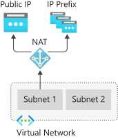
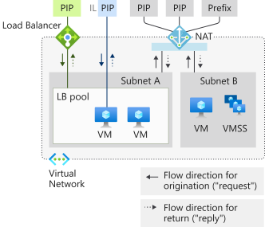
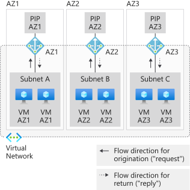

---

title: What is Azure Virtual Network NAT?
titlesuffix: Azure Virtual Network
description: Overview of Virtual Network NAT features, resources, architecture, and implementation. Learn how Virtual Network NAT works and how to use NAT gateway resources in the cloud.
services: virtual-network
documentationcenter: na
author: asudbring
manager: KumudD
ms.service: virtual-network
ms.subservice: nat
Customer intent: As an IT administrator, I want to learn more about Virtual Network NAT, its NAT gateway resources, and what I can use them for. 
ms.devlang: na
ms.topic: conceptual
ms.tgt_pltfrm: na
ms.workload: infrastructure-services
ms.date: 09/28/2020
ms.author: allensu
---

# What is Virtual Network NAT?

Virtual Network NAT (network address translation) simplifies outbound-only Internet connectivity for virtual networks. When configured on a subnet, all outbound connectivity uses your specified static public IP addresses.  Outbound connectivity is possible without load balancer or public IP addresses directly attached to virtual machines. NAT is fully managed and highly resilient.

<!-- 

-->

  

*Figure: Virtual Network NAT*

## Static IP addresses for outbound-only

Outbound connectivity can be defined for each subnet with NAT.  Multiple subnets within the same virtual network can have different NATs. A subnet is configured by specifying which NAT gateway resource to use. All UDP and TCP outbound flows from any virtual machine instance will use NAT. 

NAT is compatible with standard SKU public IP address resources or public IP prefix resources or a combination of both.  You can use a public IP prefix directly or distribute the public IP addresses of the prefix across multiple NAT gateway resources. NAT will groom all traffic to the range of IP addresses of the prefix.  Any IP filtering of your deployments is now easy.

All outbound traffic for the subnet is processed by NAT automatically without any customer configuration.  User-defined routes aren't necessary. NAT takes precedence over other outbound scenarios and replaces the default Internet destination of a subnet.

## On-demand SNAT with multiple IP addresses for scale

NAT uses "port network address translation" (PNAT or PAT) and is recommended for most workloads. Dynamic or divergent workloads can be easily accommodated with on-demand outbound flow allocation. Extensive pre-planning, pre-allocation, and ultimately overprovisioning of outbound resources is avoided. SNAT port resources are shared and available across all subnets using a specific NAT gateway resource and are provided when needed.

A public IP address attached to NAT provides up to 64,000 concurrent flows for UDP and TCP respectively. You can start with a single IP address and scale up to 16  IP addresses using public IP addresses or public IP prefixes or both.  A NAT gateway resource will use all IP addresses associated with the resource for outbound connections from all subnets configured with the same NAT gateway resource.

NAT allows flows to be created from the virtual network to the Internet. Return traffic from the Internet is only allowed in response to an active flow.

Unlike load balancer outbound SNAT, NAT has no restrictions on which private IP of a virtual machine instance can make outbound connections.  Primary and secondary IP configurations can create outbound Internet connection with NAT.

## Coexistence of inbound and outbound

NAT is compatible with the following standard SKU resources:

- Load balancer
- Public IP address
- Public IP prefix

When used together with NAT, these resources provide inbound Internet connectivity to your subnet(s). NAT provides all outbound Internet connectivity from your subnet(s).

NAT and compatible Standard SKU features are aware of the direction the flow was started. Inbound and outbound scenarios can coexist. These scenarios will receive the correct network address translations because these features are aware of the flow direction. 

<!-- 

-->

  

*Figure: Virtual Network NAT flow direction*

## Fully managed, highly resilient

NAT is fully scaled out from the start. There's no ramp up or scale-out operation required.  Azure manages the operation of NAT for you.  NAT always has multiple fault domains and can sustain multiple failures without service outage.

## TCP Reset for unrecognized flows

The private side of NAT sends TCP Reset packets for attempts to communicate on a TCP connection that doesn't exist. One example is connections that have reached idle timeout. The next packet received will return a TCP Reset to the private IP address to signal and force connection closure.

The public side of NAT doesn't generate TCP Reset packets or any other traffic.  Only traffic produced by the customer's virtual network is emitted.

## Configurable TCP idle timeout

A default TCP idle timeout of 4 minutes is used and can be increased to up to 120 minutes. Any activity on a flow can also reset the idle timer, including TCP keepalives.

## Regional or zone isolation with availability zones

NAT is regional by default. When creating [availability zones](../availability-zones/az-overview.md) scenarios, NAT can be isolated in a specific zone (zonal deployment).

<!-- 

-->

  

*Figure: Virtual Network NAT with availability zones*

## Multi-dimensional metrics for observability

You can monitor the operation of your NAT through multi-dimensional metrics exposed in Azure Monitor. These metrics can be used to observe the usage and for troubleshooting.  NAT gateway resources expose the following metrics:
- Bytes
- Packets
- Dropped Packets
- Total SNAT connections
- SNAT connection state transitions per interval.

<!-- "ADD when PM is done" Learn more about [NAT gateway metrics](./nat-gateway-metrics.md) -->

## SLA

At general availability, NAT data path is at least 99.9% available.

## Pricing

For pricing details, see [Virtual Network pricing](https://azure.microsoft.com/pricing/details/virtual-network).

## Availability

Virtual Network NAT and the NAT gateway resource are available in all regions of all Azure clouds [regions](https://azure.microsoft.com/global-infrastructure/regions/).

## Suggestions

We want to know how we can improve the service. Propose and vote on what we should build next at [UserVoice for NAT](https://aka.ms/natuservoice).

## Limitations

* NAT is compatible with standard SKU public IP, public IP prefix, and load balancer resources. Basic resources, such as basic load balancer, and any products derived from them aren't compatible with NAT.  Basic resources must be placed on a subnet not configured with NAT.
* IPv4 address family is supported.  NAT doesn't interact with IPv6 address family.  NAT can't be deployed on a subnet with an IPv6 prefix.
* NAT can't span multiple virtual networks.

## Next steps

* Learn about [NAT gateway resource](./nat-gateway-resource.md).
* [Tell us what to build next for Virtual Network NAT in UserVoice](https://aka.ms/natuservoice).
