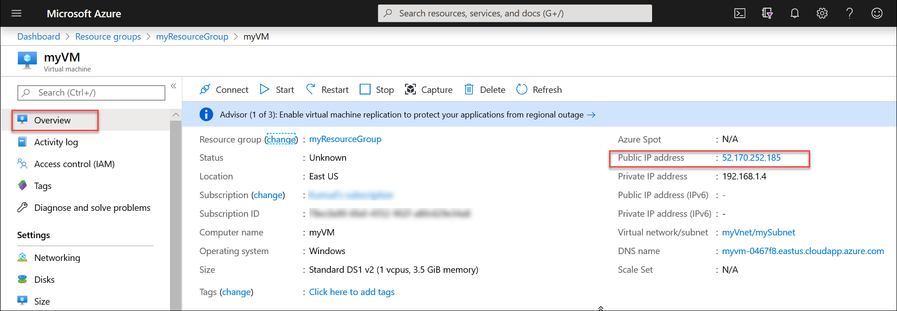

---
title: Dissociate a public IP address from an Azure VM
titlesuffix: Azure Virtual Network
description: Learn how to dissociate a public IP address from a VM
services: virtual-network
documentationcenter: ''
author: asudbring
ms.service: virtual-network
ms.subservice: ip-services
ms.devlang: na
ms.topic: article
ms.tgt_pltfrm: na
ms.workload: infrastructure-services
ms.date: 12/04/2019
ms.author: allensu

---

# Dissociate a public IP address from an Azure VM 

In this article, you learn how to dissociate a public IP address from an Azure virtual machine (VM).

You can use the [Azure portal](#azure-portal), the Azure [command-line interface](#azure-cli) (CLI), or [PowerShell](#powershell) to dissociate a public IP address from a VM.

## Azure portal

1. Sign in to the [Azure portal](https://portal.azure.com).
2. Browse to, or search for the virtual machine that you want to disassociate the public IP address from and then select it.
3. In the VM page, select **Overview**, select the public IP address as shown in the following picture:

   

4. In the public IP address page, select **Overview**, and then select **Dissociate**, as shown in the following picture:

    

5. In **Dissociate public IP address**, select **Yes**.

## Azure CLI

Install the [Azure CLI](/cli/azure/install-azure-cli?toc=%2fazure%2fvirtual-network%2ftoc.json), or use the Azure Cloud Shell. The Azure Cloud Shell is a free Bash shell that you can run directly within the Azure portal. It has the Azure CLI preinstalled and configured to use with your account. Select the **Try it** button in the CLI commands that follow. Selecting **Try it** invokes a Cloud Shell that you can sign in to your Azure account with.

1. If using the CLI locally in Bash, sign in to Azure with `az login`.
2. A public IP address is associated to an IP configuration of a network interface attached to a VM. Use the [az network nic-ip-config update](/cli/azure/network/nic/ip-config?view=azure-cli-latest#az-network-nic-ip-config-update) command to dissociate a public IP address from an IP configuration. The following example dissociates a public IP address named *myVMPublicIP* from the IP configuration named *ipconfigmyVM* of an existing network interface named *myVMVMNic* that is attached to a VM named *myVM* in a resource group named *myResourceGroup*.
  
   ```azurecli-interactive
    az network nic ip-config update \
    --name ipconfigmyVM \
    --resource-group myResourceGroup \
    --nic-name myVMVMNic \
    --remove PublicIpAddress
   ```

   If you don't know the name of a network interface attached to your VM, use the [az vm nic list](/cli/azure/vm/nic?view=azure-cli-latest#az-vm-nic-list) command to view them. For example, the following command lists the names of the network interfaces attached to a VM named *myVM* in a resource group named *myResourceGroup*:

     ```azurecli-interactive
     az vm nic list --vm-name myVM --resource-group myResourceGroup
     ```

     The output includes one or more lines that are similar to the following example:
  
     ```
     "id": "/subscriptions/00000000-0000-0000-0000-000000000000/resourceGroups/myResourceGroup/providers/Microsoft.Network/networkInterfaces/myVMVMNic",
     ```

     In the previous example, *myVMVMNic* is the name of the network interface.

   - If you don't know the name of an IP configuration for a network interface, use the [az network nic ip-config list](/cli/azure/network/nic/ip-config?view=azure-cli-latest#az-network-nic-ip-config-list) command to retrieve them. For example, the following command lists the names of the public IP configurations for a network interface named *myVMVMNic* in a resource group named *myResourceGroup*:

     ```azurecli-interactive
     az network nic ip-config list --nic-name myVMVMNic --resource-group myResourceGroup --out table
     ```

   - If you don't know the name of a public IP configuration for a network interface, use the [az network nic ip-config show](/cli/azure/network/nic/ip-config?view=azure-cli-latest#az-network-nic-ip-config-show) command to retrieve them. For example, the following command lists the names of the public IP configurations for a network interface named *myVMVMNic* in a resource group named *myResourceGroup*:

     ```azurecli-interactive
     az network nic ip-config show --name ipconfigmyVM --nic-name myVMVMNic --resource-group myResourceGroup --query publicIPAddress.id
     ```


## PowerShell

Install [PowerShell](/powershell/azure/install-az-ps), or use the Azure Cloud Shell. The Azure Cloud Shell is a free shell that you can run directly within the Azure portal. It has PowerShell preinstalled and configured to use with your account. Select the **Try it** button in the PowerShell commands that follow. Selecting **Try it** invokes a Cloud Shell that you can sign in to your Azure account with.

1. If using PowerShell locally, sign in to Azure with `Connect-AzAccount`.
2. A public IP address is associated to an IP configuration of a network interface attached to a VM. Use the [Get-AzNetworkInterface](/powershell/module/Az.Network/Get-AzNetworkInterface) command to get a network interface. Set the Public IP address value to null and then use the [Set-AzNetworkInterface](/powershell/module/Az.Network/Set-AzNetworkInterface) command to write the new IP configuration to the network interface.

   The following example dissociates a public IP address named *myVMPublicIP* from a network interface named *myVMVMNic* that is attached to a VM named *myVM*. All resources are in a resource group named *myResourceGroup*.
  
   ```azurepowershell
    $nic = Get-AzNetworkInterface -Name myVMVMNic -ResourceGroup myResourceGroup
    $nic.IpConfigurations.publicipaddress.id = $null
    Set-AzNetworkInterface -NetworkInterface $nic
   ```

  - If you don't know the name of a network interface attached to your VM, use the [Get-AzVM](/powershell/module/Az.Compute/Get-AzVM) command to view them. For example, the following command lists the names of the network interfaces attached to a VM named *myVM* in a resource group named *myResourceGroup*:

    ```azurepowershell
    $vm = Get-AzVM -name myVM -ResourceGroupName myResourceGroup
    $vm.NetworkProfile
    ```

     The output includes one or more lines that are similar to the example that follows. In the example output, *myVMVMNic* is the name of the network interface.
  
     ```
     "id": "/subscriptions/00000000-0000-0000-0000-000000000000/resourceGroups/myResourceGroup/providers/Microsoft.Network/networkInterfaces/myVMVMNic",
     ```

   - If you don't know the name of an IP configuration for a network interface, use the [Get-AzNetworkInterface](/powershell/module/Az.Network/Get-AzNetworkInterface) command to retrieve them. For example, the following command lists the names of the IP configurations for a network interface named *myVMVMNic* in a resource group named *myResourceGroup*:

     ```azurepowershell-interactive
     $nic = Get-AzNetworkInterface -Name myVMVMNic -ResourceGroupName myResourceGroup
     $nic.IPConfigurations.id
     ```

     The output includes one or more lines that are similar to the example that follows. In the example output, *ipconfigmyVM* is the name of an IP configuration.
  
     ```
     "id": "/subscriptions/00000000-0000-0000-0000-000000000000/resourceGroups/myResourceGroup/providers/Microsoft.Network/networkInterfaces/myVMVMNic/ipConfigurations/ipconfigmyVM"
     ```

## Next steps

- Learn how to [associate a public IP address to a VM](associate-public-ip-address-vm.md).
