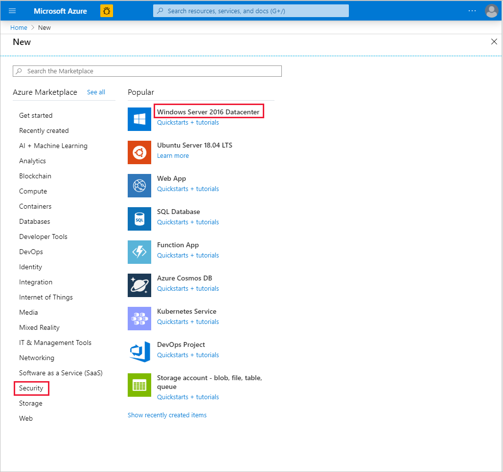
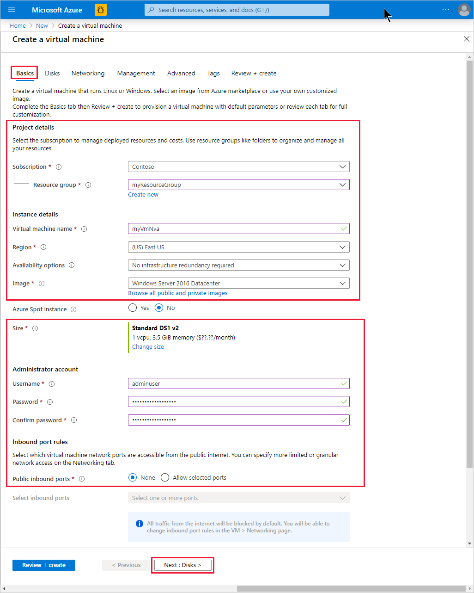
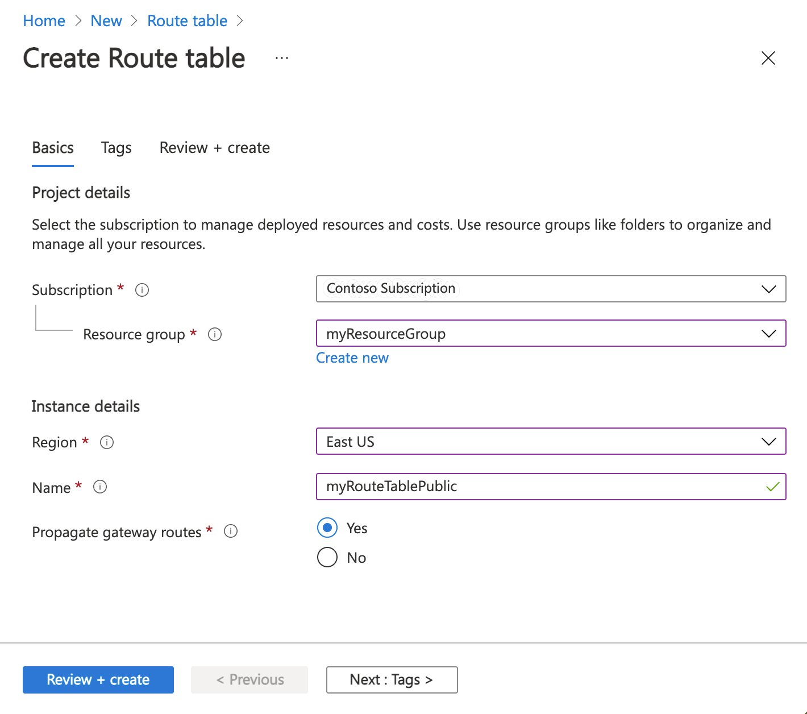
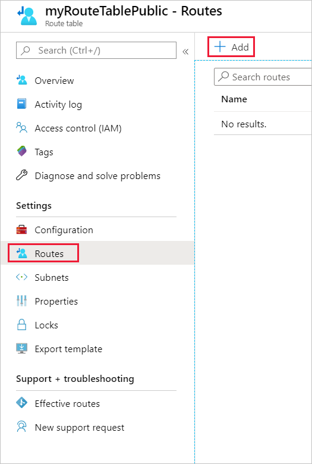
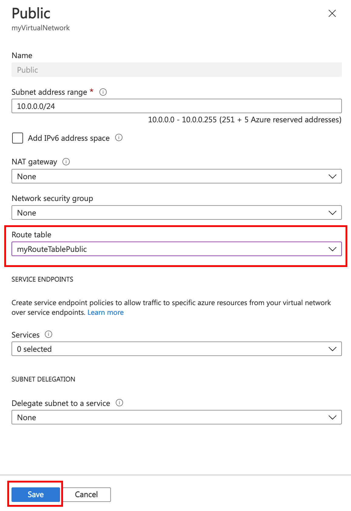
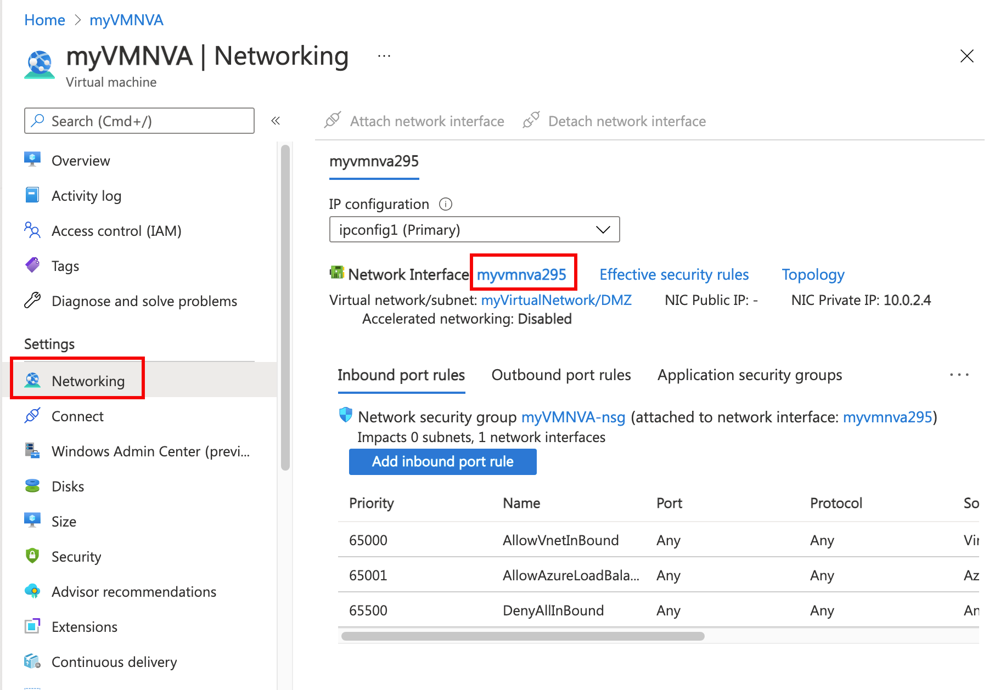
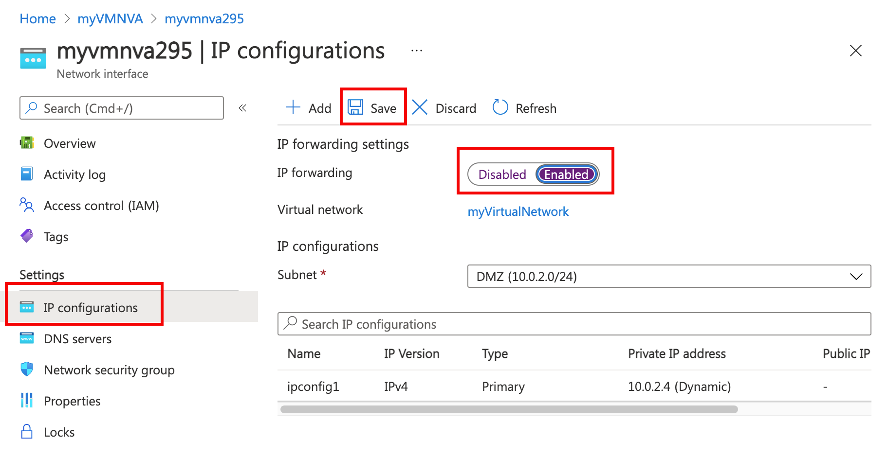

# Tutorial: Route network traffic with a route table using the Azure portal

Azure routes traffic between all subnets within a virtual network, by default. You can create your own routes to override Azure's default routing. Custom routes are helpful when, for example, you want to route traffic between subnets through a network virtual appliance (NVA). In this tutorial, you learn how to:

> [!div class="checklist"]
> * Create an NVA that routes traffic
> * Create a route table
> * Create a route
> * Associate a route table to a subnet
> * Deploy virtual machines (VM) into different subnets
> * Route traffic from one subnet to another through an NVA

This tutorial uses the [Azure portal](https://portal.azure.com). You can also use [Azure CLI](tutorial-create-route-table-cli.md) or [Azure PowerShell](tutorial-create-route-table-powershell.md).

If you don't have an Azure subscription, create a [free account](https://azure.microsoft.com/free/?WT.mc_id=A261C142F) before you begin.

## Create an NVA

Network virtual appliances (NVAs) are virtual machines that help with network functions, such as routing and firewall optimization. This tutorial assumes you're using **Windows Server 2016 Datacenter**. You can select a different operating system if you want.

1. On the [Azure portal](https://portal.azure.com) menu or from the **Home** page, select **Create a resource**.

1. Choose **Security** > **Windows Server 2016 Datacenter**.

    

1. In the **Create a virtual machine** page, under **Basics**, enter or select this information:

    | Section | Setting | Action |
    | ------- | ------- | ----- |
    | **Project details** | Subscription | Choose your subscription. |
    | | Resource group | Select **Create new**, enter *myResourceGroup*, and select **OK**. |
    | **Instance details** | Virtual machine name | Enter *myVmNva*. |
    | | Region | Choose **(US) East US**. |
    | | Availability options | Choose **No infrastructure redundancy required**. |
    | | Image | Choose **Windows Server 2016 Datacenter**. |
    | | Size | Keep the default, **Standard DS1 v2**. |
    | **Administrator account** | Username | Enter a user name of your choosing. |
    | | Password | Enter a password of your choosing, which must be at least 12 characters long and meet the [defined complexity requirements](../virtual-machines/windows/faq.md?toc=%2fazure%2fvirtual-network%2ftoc.json#what-are-the-password-requirements-when-creating-a-vm). |
    | | Confirm Password | Enter the password again. |
    | **Inbound port rules** | Public inbound ports | Pick **None**. |
    | **Save money** | Already have a Windows Server license? | Pick **No**. |

    

    Then select **Next : Disks >**.

1. Under **Disks**, select the settings that are right for your needs, and then select **Next : Networking >**.

1. Under **Networking**:

    1. For **Virtual network**, select **Create new**.
    
    1. In the **Create virtual network** dialog box, under **Name**, enter *myVirtualNetwork*.

    1. In **Address space**, replace the existing address range with *10.0.0.0/16*.

    1. In **Subnets**, select the **Delete** icon to delete the existing subnet, and then enter the following combinations of **Subnet name** and **Address range**. Once a valid name and range is entered, a new empty row appears below it.

        | Subnet name | Address range |
        | ----------- | ------------- |
        | *Public* | *10.0.0.0/24* |
        | *Private* | *10.0.1.0/24* |
        | *DMZ* | *10.0.2.0/24* |

    1. Select **OK** to exit the dialog box.

    1. In **Subnet**, choose **DMZ (10.0.2.0/24)**.

    1. In **Public IP**, choose **None**, since this VM won't connect over the internet.

    1. Select **Next : Management >**.

1. Under **Management**:

    1. In **Diagnostics storage account**, select **Create New**.
    
    1. In the **Create storage account** dialog box, enter or select this information:

        | Setting | Value |
        | ------- | ----- |
        | Name | *mynvastorageaccount* |
        | Account kind | **Storage (general purpose v1)** |
        | Performance | **Standard** |
        | Replication | **Locally-redundant storage (LRS)** |
    
    1. Select **OK** to exit the dialog box.

    1. Select **Review + create**. You're taken to the **Review + create** page, and Azure validates your configuration.

1. When you see the **Validation passed** message, select **Create**.

    The VM takes a few minutes to create. Wait until Azure finishes creating the VM. The **Your deployment is underway** page shows you deployment details.

1. When your VM is ready, select **Go to resource**.

## Create a route table

1. On the [Azure portal](https://portal.azure.com) menu or from the **Home** page, select **Create a resource**.

2. In the search box, enter *Route table*. When **Route table** appears in the search results, select it.

3. In the **Route table** page, select **Create**.

4. In **Create route table**, enter or select this information:

    | Setting | Value |
    | ------- | ----- |
    | Name | *myRouteTablePublic* |
    | Subscription | Your subscription |
    | Resource group | **myResourceGroup** |
    | Location | **(US) East US** |
    | Virtual network gateway route propagation | **Enabled** |

    

5. Select **Create**.

## Create a route

1. Go to the [Azure portal](https://portal.azure.com) to manage your route table. Search for and select **Route tables**.

1. Pick the name of your route table (**myRouteTablePublic**).

1. Choose **Routes** > **Add**.

    

1. In **Add route**, enter or select this information:

    | Setting | Value |
    | ------- | ----- |
    | Route name | *ToPrivateSubnet* |
    | Address prefix | *10.0.1.0/24* (the address range of the *Private* subnet created earlier) |
    | Next hop type | **Virtual appliance** |
    | Next hop address | *10.0.2.4* (an address within the address range of the *DMZ* subnet) |

1. Select **OK**.

## Associate a route table to a subnet

1. Go to the [Azure portal](https://portal.azure.com) to manage your virtual network. Search for and select **Virtual networks**.

1. Pick the name of your virtual network (**myVirtualNetwork**).

1. In the virtual network's menu bar, choose **Subnets**.

1. In the virtual network's subnet list, choose **Public**.

1. In **Route table**, choose the route table you created (**myRouteTablePublic**), and then select **Save** to associate your route table to the *Public* subnet.

    

## Turn on IP forwarding

Next, turn on IP forwarding for your new NVA virtual machine, *myVmNva*. When Azure sends network traffic to *myVmNva*, if the traffic is destined for a different IP address, IP forwarding sends the traffic to the correct location.

1. Go to the [Azure portal](https://portal.azure.com) to manage your VM. Search for and select **Virtual machines**.

1. Pick the name of your VM (**myVmNva**).

1. In your NVA virtual machine's menu bar, select **Networking**.

1. Select **myvmnva123**. That's the network interface Azure created for your VM. Azure adds numbers to ensure a unique name.

    

1. In the network interface menu bar, select **IP configurations**.

1. In the **IP configurations** page, set **IP forwarding** to **Enabled**, and select **Save**.

    

## Create public and private virtual machines

Create a public VM and a private VM in the virtual network. Later, you'll use them to see that Azure routes the *Public* subnet traffic to the *Private* subnet through the NVA.

To create the public VM and the private VM, follow the steps of [Create an NVA](#create-an-nva) earlier. You don't need to wait for deployment to finish or go to the VM resource. You'll use most of the same settings, except as described below.

Before you select **Create** to create the public or private VM, go to the following two subsections ([Public VM](#public-vm) and [Private VM](#private-vm)), which show the values that have to be different. You may continue to the next section ([Route traffic through an NVA](#route-traffic-through-an-nva)) after Azure finishes deploying both VMs.

### Public VM

| Tab | Setting | Value |
| --- | ------- | ----- |
| Basics | Resource group | **myResourceGroup** |
| | Virtual machine name | *myVmPublic* |
| | Public inbound ports | **Allow selected ports** |
| | Select inbound ports | **RDP** |
| Networking | Virtual network | **myVirtualNetwork** |
| | Subnet | **Public (10.0.0.0/24)** |
| | Public IP address | The default |
| Management | Diagnostics storage account | **mynvastorageaccount** |

### Private VM

| Tab | Setting | Value |
| --- | ------- | ----- |
| Basics | Resource group | **myResourceGroup** |
| | Virtual machine name | *myVmPrivate* |
| | Public inbound ports | **Allow selected ports** |
| | Select inbound ports | **RDP** |
| Networking | Virtual network | **myVirtualNetwork** |
| | Subnet | **Private (10.0.1.0/24)** |
| | Public IP address | The default |
| Management | Diagnostics storage account | **mynvastorageaccount** |

## Route traffic through an NVA

### Sign in to myVmPrivate over remote desktop

1. Go to the [Azure portal](https://portal.azure.com) to manage your private VM. Search for and select **Virtual machines**.

1. Pick the name of your private VM (**myVmPrivate**).

1. In the VM menu bar, select **Connect** to create a remote desktop connection to the private VM.

1. In the **Connect with RDP** page, select **Download RDP File**. Azure creates a Remote Desktop Protocol (*.rdp*) file and downloads it to your computer.

1. Open the downloaded *.rdp* file. If prompted, select **Connect**. Select **More choices** > **Use a different account**, and then enter the user name and password you specified when creating the private VM.

1. Select **OK**.

1. If you receive a certificate warning during the sign-in process, select **Yes** to connect to the VM.

### Enable ICMP through the Windows firewall

In a later step, you'll use the trace route tool to test routing. Trace route uses the Internet Control Message Protocol (ICMP), which the Windows Firewall denies by default. Enable ICMP through the Windows firewall.

1. In the Remote Desktop of *myVmPrivate*, open PowerShell.

1. Enter this command:

    ```powershell
    New-NetFirewallRule –DisplayName "Allow ICMPv4-In" –Protocol ICMPv4
    ```

    You'll be using trace route to test routing in this tutorial. For production environments, we don't recommend allowing ICMP through the Windows Firewall.

### Turn on IP forwarding within myVmNva

You [turned on IP forwarding](#turn-on-ip-forwarding) for the VM's network interface using Azure. The VM's operating system also has to forward network traffic. Turn on IP forwarding for *myVmNva* VM's operating system with these commands.

1. From a command prompt on the *myVmPrivate* VM, open a remote desktop to the *myVmNva* VM:

    ```cmd
    mstsc /v:myvmnva
    ```

1. From PowerShell on the *myVmNva* VM, enter this command to turn on IP forwarding:

    ```powershell
    Set-ItemProperty -Path HKLM:\SYSTEM\CurrentControlSet\Services\Tcpip\Parameters -Name IpEnableRouter -Value 1
    ```

1. Restart the *myVmNva* VM: From the taskbar, select **Start** > **Power**, **Other (Planned)** > **Continue**.

    This also disconnects the remote desktop session.

1. After the *myVmNva* VM restarts, create a remote desktop session to the *myVmPublic* VM. While still connected to the *myVmPrivate* VM, open a command prompt and run this command:

    ```cmd
    mstsc /v:myVmPublic
    ```
1. In the remote desktop of *myVmPublic*, open PowerShell.

1. Enable ICMP through the Windows firewall by entering this command:

    ```powershell
    New-NetFirewallRule –DisplayName "Allow ICMPv4-In" –Protocol ICMPv4
    ```

## Test the routing of network traffic

First, let's test routing of network traffic from the *myVmPublic* VM to the *myVmPrivate* VM.

1. From PowerShell on the *myVmPublic* VM, enter this command:

    ```powershell
    tracert myVmPrivate
    ```

    The response is similar to this example:

    ```powershell
    Tracing route to myVmPrivate.vpgub4nqnocezhjgurw44dnxrc.bx.internal.cloudapp.net [10.0.1.4]
    over a maximum of 30 hops:

    1    <1 ms     *        1 ms  10.0.2.4
    2     1 ms     1 ms     1 ms  10.0.1.4

    Trace complete.
    ```

    You can see the first hop is to 10.0.2.4, which is NVA's private IP address. The second hop is to the private IP address of the *myVmPrivate* VM: 10.0.1.4. Earlier, you added the route to the *myRouteTablePublic* route table and associated it to the *Public* subnet. As a result, Azure sent the traffic through the NVA and not directly to the *Private* subnet.

1. Close the remote desktop session to the *myVmPublic* VM, which leaves you still connected to the *myVmPrivate* VM.

1. From a command prompt on the *myVmPrivate* VM, enter this command:

    ```cmd
    tracert myVmPublic
    ```

    This command tests the routing of network traffic from the *myVmPrivate* VM to the *myVmPublic* VM. The response is similar to this example:

    ```cmd
    Tracing route to myVmPublic.vpgub4nqnocezhjgurw44dnxrc.bx.internal.cloudapp.net [10.0.0.4]
    over a maximum of 30 hops:

    1     1 ms     1 ms     1 ms  10.0.0.4

    Trace complete.
    ```

    You can see that Azure routes traffic directly from the *myVmPrivate* VM to the *myVmPublic* VM. By default, Azure routes traffic directly between subnets.

1. Close the remote desktop session to the *myVmPrivate* VM.

## Clean up resources

When the resource group is no longer needed, delete *myResourceGroup* and all resources it has:

1. Go to the [Azure portal](https://portal.azure.com) to manage your resource group. Search for and select **Resource groups**.

1. Pick the name of your resource group (**myResourceGroup**).

1. Select **Delete resource group**.

1. In the confirmation dialog box, enter *myResourceGroup* for **TYPE THE RESOURCE GROUP NAME**, and then select **Delete**. Azure deletes the *myResourceGroup* and all resources tied to that resource group, including your route tables, storage accounts, virtual networks, VMs, network interfaces, and public IP addresses.

## Next steps

In this tutorial, you created a route table and associated it to a subnet. You created a simple NVA that routed traffic from a public subnet to a private subnet. Now you can deploy different preconfigured NVAs from the [Azure Marketplace](https://azuremarketplace.microsoft.com/marketplace/apps/category/networking), which provide many useful network functions. To learn more about routing, see [Routing overview](virtual-networks-udr-overview.md) and [Manage a route table](manage-route-table.md).

While you can deploy many Azure resources within a virtual network, Azure can't deploy resources for some PaaS services into a virtual network. It's possible to restrict access to the resources of some Azure PaaS services, though the restriction must only be traffic from a virtual network subnet. To learn how to restrict network access to Azure PaaS resources, see the next tutorial.

> [!div class="nextstepaction"]
> [Restrict network access to PaaS resources](tutorial-restrict-network-access-to-resources.md)

> [!NOTE] 
> Azure services cost money. Azure Cost Management helps you set budgets and configure alerts to keep spending under control. Analyze, manage, and optimize your Azure costs with Cost Management. To learn more, see the [quickstart on analyzing your costs](../cost-management-billing/costs/quick-acm-cost-analysis.md?WT.mc_id=costmanagementcontent_docsacmhorizontal_-inproduct-learn).