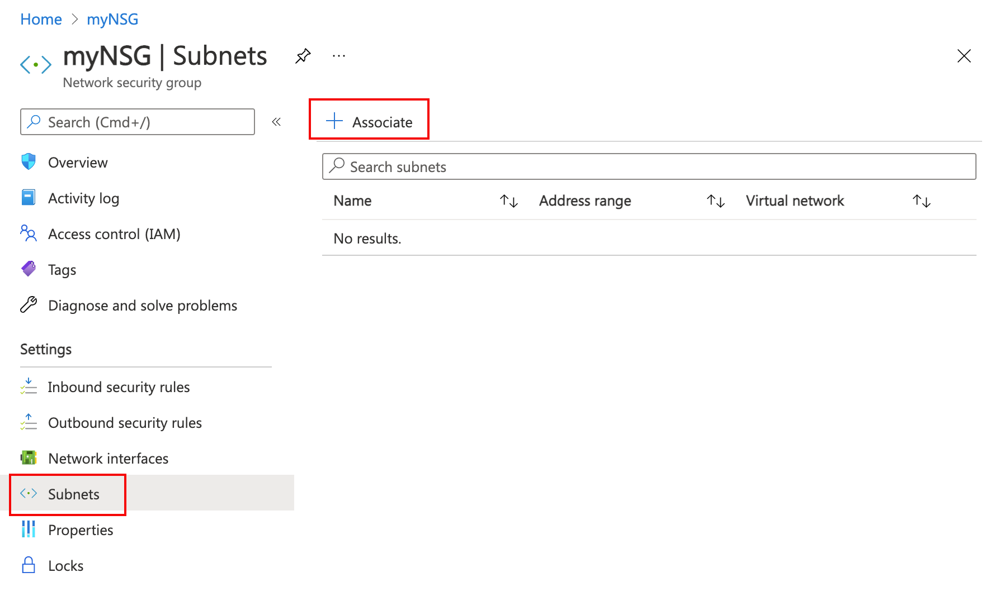
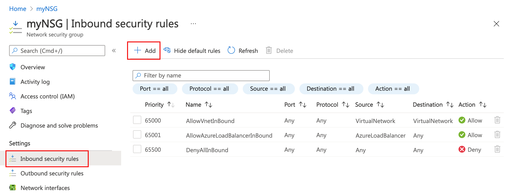
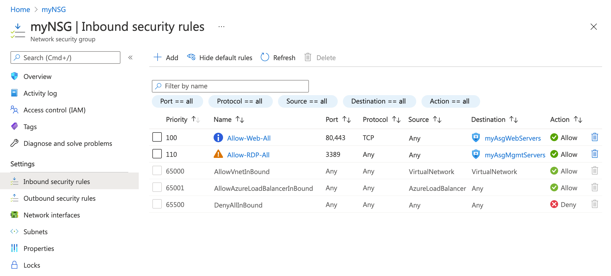
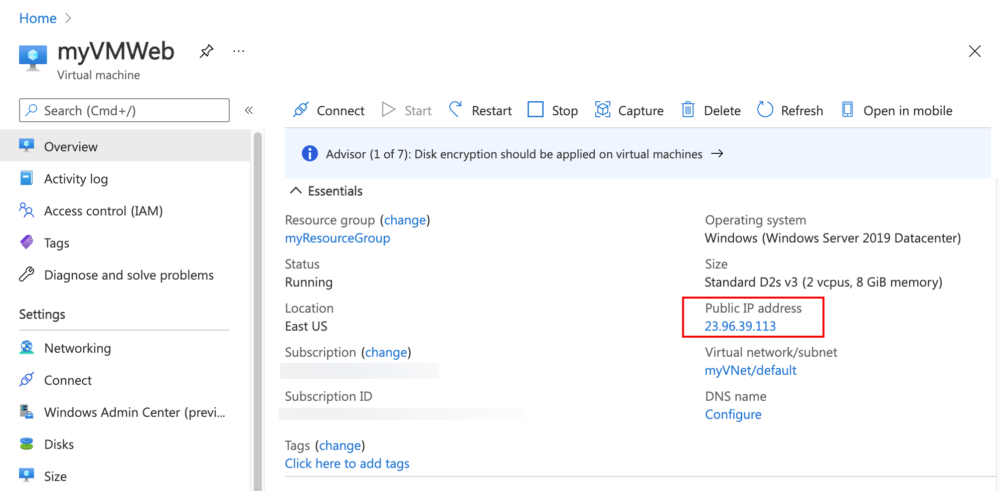

# Tutorial: Filter network traffic with a network security group using the Azure portal

You can filter network traffic inbound to and outbound from a virtual network subnet with a network security group. Network security groups contain security rules that filter network traffic by IP address, port, and protocol. Security rules are applied to resources deployed in a subnet. In this tutorial, you learn how to:

> [!div class="checklist"]
> * Create a network security group and security rules
> * Create a virtual network and associate a network security group to a subnet
> * Deploy virtual machines (VM) into a subnet
> * Test traffic filters

If you prefer, you can complete this tutorial using the [Azure CLI](tutorial-filter-network-traffic-cli.md) or [PowerShell](tutorial-filter-network-traffic-powershell.md).

If you don't have an Azure subscription, create a [free account](https://azure.microsoft.com/free/?WT.mc_id=A261C142F) before you begin.

## Sign in to Azure

Sign in to the Azure portal at https://portal.azure.com.

## Create a virtual network

1. On the Azure portal menu or from the **Home** page, select **Create a resource**. 
2. Select **Networking**, and then select **Virtual network**.
3. Enter, or select, the following information, accept the defaults for the remaining settings, and then select **Create**:

    | Setting                 | Value                                              |
    | ---                     | ---                                                |
    | Name                    | myVirtualNetwork                                   |
    | Address space           | 10.0.0.0/16                                        |
    | Subscription            | Select your subscription.                          |
    | Resource group          | Select **Create new** and enter *myResourceGroup*. |
    | Location                | Select **East US**.                                |
    | Subnet- Name            | mySubnet                                           |
    | Subnet - Address range  | 10.0.0.0/24                                        |

## Create application security groups

An application security group enables you to group together servers with similar functions, such as web servers.

1. On the Azure portal menu or from the **Home** page, select **Create a resource**. 
2. In the **Search the Marketplace** box, enter *Application security group*. When **Application security group** appears in the search results, select it, select **Application security group** again under **Everything**, and then select **Create**.
3. Enter, or select, the following information, and then select **Create**:

    | Setting        | Value                                                         |
    | ---            | ---                                                           |
    | Name           | myAsgWebServers                                               |
    | Subscription   | Select your subscription.                                     |
    | Resource group | Select **Use existing** and then select  **myResourceGroup**. |
    | Location       | East US                                                       |

4. Complete step 3 again, specifying the following values:

    | Setting        | Value                                                         |
    | ---            | ---                                                           |
    | Name           | myAsgMgmtServers                                              |
    | Subscription   | Select your subscription.                                     |
    | Resource group | Select **Use existing** and then select  **myResourceGroup**. |
    | Location       | East US                                                       |

## Create a network security group

1. On the Azure portal menu or from the **Home** page, select **Create a resource**. 
2. Select **Networking**, and then select **Network security group**.
3. Enter, or select, the following information, and then select **Create**:

    |Setting|Value|
    |---|---|
    |Name|myNsg|
    |Subscription| Select your subscription.|
    |Resource group | Select **Use existing** and then select *myResourceGroup*.|
    |Location|East US|

## Associate network security group to subnet

1. In the *Search resources, services, and docs* box at the top of the portal, begin typing *myNsg*. When **myNsg** appears in the search results, select it.
2. Under **SETTINGS**, select **Subnets** and then select **+ Associate**, as shown in the following picture:

    

3. Under **Associate subnet**, select **Virtual network** and then select **myVirtualNetwork**. Select **Subnet**, select **mySubnet**, and then select **OK**.

## Create security rules

1. Under **SETTINGS**, select **Inbound security rules** and then select **+ Add**, as shown in the following picture:

    

2. Create a security rule that allows ports 80 and 443 to the **myAsgWebServers** application security group. Under **Add inbound security rule**, enter, or select the following values, accept the remaining defaults, and then select **Add**:

    | Setting                 | Value                                                                                                           |
    | ---------               | ---------                                                                                                       |
    | Destination             | Select **Application security group**, and then select **myAsgWebServers** for **Application security group**.  |
    | Destination port ranges | Enter 80,443                                                                                                    |
    | Protocol                | Select TCP                                                                                                      |
    | Name                    | Allow-Web-All                                                                                                   |

3. Complete step 2 again, using the following values:

    | Setting                 | Value                                                                                                           |
    | ---------               | ---------                                                                                                       |
    | Destination             | Select **Application security group**, and then select **myAsgMgmtServers** for **Application security group**. |
    | Destination port ranges | Enter 3389                                                                                                      |
    | Protocol                | Select TCP                                                                                                      |
    | Priority                | Enter 110                                                                                                       |
    | Name                    | Allow-RDP-All                                                                                                   |

    In this tutorial, RDP (port 3389) is exposed to the internet for the VM that is assigned to the *myAsgMgmtServers* application security group. For production environments, instead of exposing port 3389 to the internet, it's recommended that you connect to Azure resources that you want to manage using a VPN or private network connection.

Once you've completed steps 1-3, review the rules you created. Your list should look like the list in the following picture:



## Create virtual machines

Create two VMs in the virtual network.

### Create the first VM

1. On the Azure portal menu or from the **Home** page, select **Create a resource**. 
2. Select **Compute**, and then select **Windows Server 2016 Datacenter**.
3. Enter, or select, the following information, and accept the defaults for the remaining settings:

    |Setting|Value|
    |---|---|
    |Subscription| Select your subscription.|
    |Resource group| Select **Use existing** and select **myResourceGroup**.|
    |Name|myVmWeb|
    |Location| Select **East US**.|
    |User name| Enter a user name of your choosing.|
    |Password| Enter a password of your choosing. The password must be at least 12 characters long and meet the [defined complexity requirements](../virtual-machines/windows/faq.md?toc=%2fazure%2fvirtual-network%2ftoc.json#what-are-the-password-requirements-when-creating-a-vm).|

   

4. Select a size for the VM and then select **Select**.
5. Under **Networking**, select the following values, and accept the remaining defaults:

    |Setting|Value|
    |---|---|
    |Virtual network |Select **myVirtualNetwork**.|
    |NIC network security group |Select **None**.|
  

6. Select **Review + Create** at the bottom, left corner, select **Create** to start VM deployment.

### Create the second VM

Complete steps 1-6 again, but in step 3, name the VM *myVmMgmt*. The VM takes a few minutes to deploy. Do not continue to the next step until the VM is deployed.

## Associate network interfaces to an ASG

When the portal created the VMs, it created a network interface for each VM, and attached the network interface to the VM. Add the network interface for each VM to one of the application security groups you created previously:

1. In the *Search resources, services, and docs* box at the top of the portal, begin typing *myVmWeb*. When the **myVmWeb** VM appears in the search results, select it.
2. Under **SETTINGS**, select **Networking**.  Select **Configure the application security groups**, select **myAsgWebServers** for **Application security groups**, and then select **Save**, as shown in the following picture:

    

3. Complete steps 1 and 2 again, searching for the **myVmMgmt** VM and selecting the  **myAsgMgmtServers** ASG.

## Test traffic filters

1. Connect to the *myVmMgmt* VM. Enter *myVmMgmt* in the search box at the top of the portal. When **myVmMgmt** appears in the search results, select it. Select the **Connect** button.
2. Select **Download RDP file**.
3. Open the downloaded rdp file and select **Connect**. Enter the user name and password you specified when creating the VM. You may need to select **More choices**, then **Use a different account**, to specify the credentials you entered when you created the VM.
4. Select **OK**.
5. You may receive a certificate warning during the sign-in process. If you receive the warning, select **Yes** or **Continue**, to proceed with the connection.

    The connection succeeds, because port 3389 is allowed inbound from the internet to the *myAsgMgmtServers* application security group that the network interface attached to the *myVmMgmt* VM is in.

6. Connect to the *myVmWeb* VM from the *myVmMgmt* VM by entering the following command in a PowerShell session:

    ``` 
    mstsc /v:myVmWeb
    ```

    You are able to connect to the myVmWeb VM from the myVmMgmt VM because VMs in the same virtual network can communicate with each other over any port, by default. You can't however, create a remote desktop connection to the *myVmWeb* VM from the internet, because the security rule for the *myAsgWebServers* doesn't allow port 3389 inbound from the internet and inbound traffic from the Internet is denied to all resources, by default.

7. To install Microsoft IIS on the *myVmWeb* VM, enter the following command from a PowerShell session on the *myVmWeb* VM:

    ```powershell
    Install-WindowsFeature -name Web-Server -IncludeManagementTools
    ```

8. After the IIS installation is complete, disconnect from the *myVmWeb* VM, which leaves you in the *myVmMgmt* VM remote desktop connection.
9. Disconnect from the *myVmMgmt* VM.
10. In the *Search resources, services, and docs* box at the top of the Azure portal, begin typing *myVmWeb* from your computer. When **myVmWeb** appears in the search results, select it. Note the **Public IP address** for your VM. The address shown in the following picture is 137.135.84.74, but your address is different:

    
  
11. To confirm that you can access the *myVmWeb* web server from the internet, open an internet browser on your computer and browse to `http://<public-ip-address-from-previous-step>`. You see the IIS welcome screen, because port 80 is allowed inbound from the internet to the *myAsgWebServers* application security group that the network interface attached to the *myVmWeb* VM is in.

## Clean up resources

When no longer needed, delete the resource group and all of the resources it contains:

1. Enter *myResourceGroup* in the **Search** box at the top of the portal. When you see **myResourceGroup** in the search results, select it.
2. Select **Delete resource group**.
3. Enter *myResourceGroup* for **TYPE THE RESOURCE GROUP NAME:** and select **Delete**.

## Next steps

In this tutorial, you created a network security group and associated it to a virtual network subnet. To learn more about network security groups, see [Network security group overview](./network-security-groups-overview.md) and [Manage a network security group](manage-network-security-group.md).

Azure routes traffic between subnets by default. You may instead, choose to route traffic between subnets through a VM, serving as a firewall, for example. To learn how to create a route table, advance to the next tutorial.

> [!div class="nextstepaction"]
> [Create a route table](./tutorial-create-route-table-portal.md)