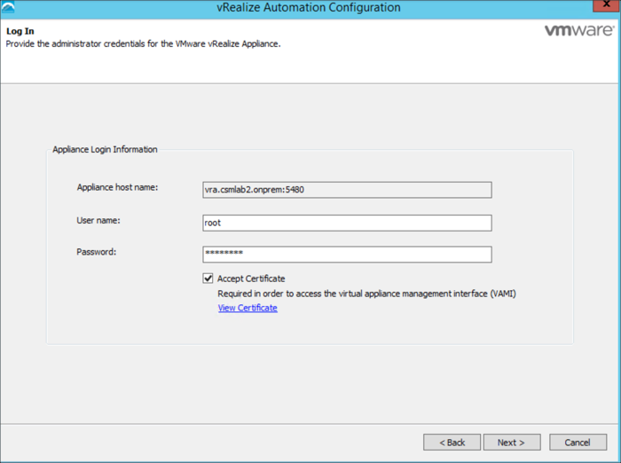
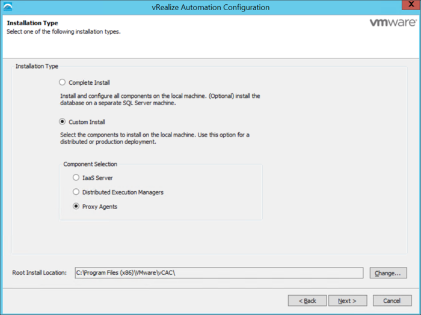
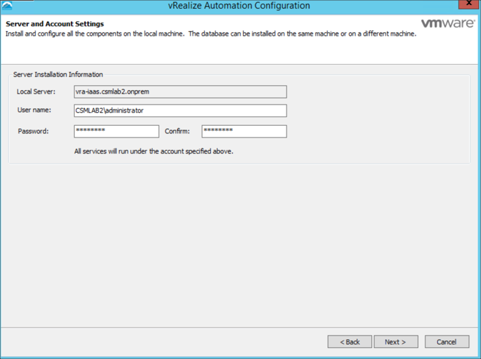
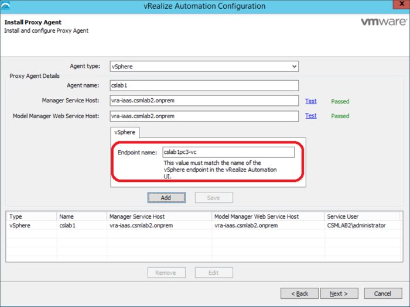
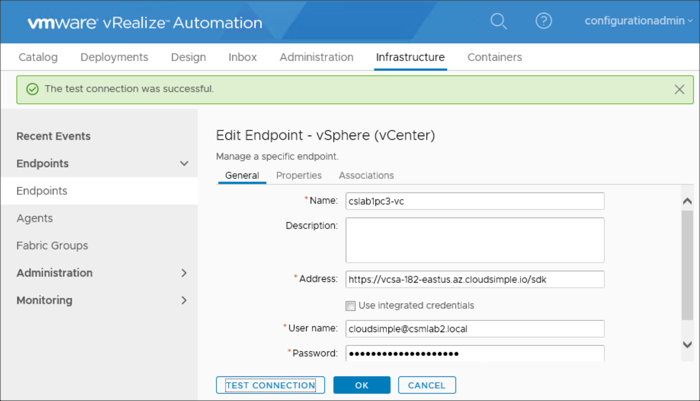

--- 
title: Azure VMware Solution by CloudSimple - Set up vCenter on Private Cloud for vRealize Automation
description: Describes how to set up a VMware vCenter server on your CloudSimple Private Cloud as an endpoint for VMware vRealize Automation
author: shortpatti
ms.author: v-patsho
ms.date: 08/19/2019 
ms.topic: article 
ms.service: azure-vmware-cloudsimple 
ms.reviewer: cynthn 
manager: dikamath 
---
# Set up vCenter on your Private Cloud for VMware vRealize Automation

You can set up a VMware vCenter server on your CloudSimple Private Cloud as an endpoint for VMware vRealize Automation.

## Before you begin

Complete these tasks before configuring the vCenter server:

* Configure a [Site-to-Site VPN connection](vpn-gateway.md#set-up-a-site-to-site-vpn-gateway) between your on-premises environment and your Private Cloud.
* [Configure DNS forwarding of on-premises DNS requests](on-premises-dns-setup.md) to the DNS servers for your Private Cloud.
* Submit a [support request](https://portal.azure.com/#blade/Microsoft_Azure_Support/HelpAndSupportBlade/newsupportrequest) to create a vRealize Automation IaaS administrative user with the set of permissions that are listed in the following table.

| Attribute Value | Permission |
------------ | ------------- |  
| Datastore |  Allocate Space <br> Browse Datastore |
| Datastore Cluster | Configure a Datastore Cluster |
| Folder | Create Folder <br>Delete Folder |
| Global |  Manage Custom Attributes<br>Set Custom Attribute |
| Network | Assign Network |
| Permissions | Modify Permissions |
| Resource | Assign VM to Resource Pool<br>Migrate Powered Off Virtual Machine<br>Migrate Powered On Virtual Machine |
| Virtual Machine Inventory |  Create from existing<br>Create New<br>Move<br>Remove | 
| Virtual Machine Interaction |  Configure CD Media<br>Console Interaction<br>Device Connection<br>Power Off<br>Power On<br>Reset<br>Suspend<br>Tools Install | 
| Virtual Machine Configuration |  Add Existing Disk<br>Add New Disk<br>Add or Remove<br>Remove Disk<br>Advanced<br>Change CPU Count<br>Change Resource<br>Extend Virtual Disk<br>Disk Change Tracking<br>Memory<br>Modify Device Settings<br>Rename<br>Set Annotation (version 5.0 and later)<br>Settings<br>Swapfile Placement |
| Provisioning |  Customize<br>Clone Template<br>Clone Virtual Machine<br>Deploy Template<br>Read Customization Specs |
| Virtual Machine State | Create Snapshot<br>Remove Snapshot<br>Revert to Snapshot |

## Install vRealize Automation in your on-premises environment

1. Sign in to the vRealize Automation IaaS server appliance as the IaaS administrator that CloudSimple Support created for you.
2. Deploy a vSphere Agent for the vRealize Automation endpoint.
    1. Go to https://*vra-url*:5480/installer, where *vra-url* is the URL that you use to access the vRealize Automation administration UI.
    2. Click the **IaaS Installer** to download the installer.<br>
    The naming convention for the installer file is setup_*vra-url*@5480.exe.
    3. Run the installer. On the Welcome screen, click **Next**.
    4. Accept the EULA and click **Next**.
    5. Provide the sign-in information, click **Accept Certificate**, and then click **Next**.
    
    6. Select **Custom Install** and **Proxy Agents** and click **Next**.
    
    7. Enter the IaaS server sign-in information and click **Next**. If you are using Active Directory, enter the username in **domain\user** format. Otherwise, use **user@domain** format.
    
    8. For the proxy settings, enter **vSphere** for **Agent type**. Enter a name for the agent.
    9. Enter the IaaS server FQDN in the **Manager Service Host** and the **Model Manager Web Service Host** fields. Click **Test** to test the connection for each of the FQDN values. If the test fails, modify your DNS settings so that the IaaS server hostname is resolved.
    10. Enter a name for vCenter server endpoint for the Private Cloud. Record the name for use later in the configuration process.

        

    11. Click **Next**.
    12. Click **Install**.

## Configure the vSphere agent

1. Go to https://*vra-url*/vcac and sign in as **ConfigurationAdmin**.
2. Select **Infrastructure** > **Endpoints** > **Endpoints**.
3. Select **New** > **Virtual** > **vSphere**.
4. Enter the vSphere endpoint name that you specified in the previous procedure.
5. For **Address**, enter the Private Cloud vCenter Server URL in the format https://*vcenter-fqdn*/sdk, where *vcenter-fqdn* is the name of the vCenter server.
6. Enter the credentials for the vRealize Automation IaaS administrative user that CloudSimple Support created for you.
7. Click **Test Connection** to validate the user credentials. If the test fails, verify the URL, account information, and [endpoint name](#verify-the-endpoint-name) and test again.
8. After a successful test, click **OK** to create the vSphere endpoint.
    

### Verify the endpoint name

To identify the correct vCenter server endpoint name, do the following:

1. Open a command prompt on the IaaS appliance.
2. Change directory to C:\Program Files (x86)\VMware\vCAC\Agents\agent-name, where *agent-name* is the name you assigned to the vCenter server endpoint.
3. Run the following command.

```
..\..\Server\DynamicOps.Vrm.VRMencrypt.exe VRMAgent.exe.config get
```

The output is similar to the following. The value of the `managementEndpointName` field is the endpoint name.

```
managementEndpointName: cslab1pc3-vc
doDeletes: true
```
