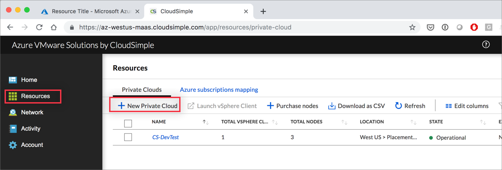

--- 
title: Create Azure VMware Solution by CloudSimple Private Cloud
description: Describes how to create a CloudSimple Private Cloud to extend VMware workloads to the cloud with operational flexibility and continuity
author: sharaths-cs
ms.author: b-shsury 
ms.date: 06/10/2019 
ms.topic: article 
ms.service: azure-vmware-cloudsimple 
ms.reviewer: cynthn 
manager: dikamath 
---

# Create a CloudSimple Private Cloud

Creating a Private Cloud helps you address a variety of common needs for network infrastructure:

* **Growth**. If you've reached a hardware refresh point for your existing infrastructure, a Private Cloud allows you to expand with no new hardware investment required.

* **Fast expansion**. If any temporary or unplanned capacity needs arise, a Private Cloud allows you to create the additional capacity with no delay.

* **Increased protection**. With a Private Cloud of three or more nodes, you get automatic redundancy and high availability protection.

* **Long-term infrastructure needs**. If your datacenters are at capacity or you want to restructure to lower your costs, a Private Cloud allows you to retire datacenters and migrate to a cloud-based solution while remaining compatible with your enterprise operations.

When you create a Private Cloud, you get a single vSphere cluster and all the management VMs that are created in that cluster.

## Before you begin

Nodes must be provisioned before you can create your Private Cloud.  For more information on provisioning nodes, see [Provision nodes for VMware Solution by CloudSimple - Azure](create-nodes.md) article.

Allocate a CIDR range for vSphere/vSAN subnets for the Private Cloud. A Private Cloud is created as an isolated VMware stack (ESXi hosts, vCenter, vSAN, and NSX) environment managed by a vCenter server. Management components are deployed in the network selected for vSphere/vSAN subnets CIDR. The network CIDR range is divided into different subnets during the deployment.  The vSphere/vSAN subnet address space must be unique. It must not overlap with any network that communicates with the CloudSimple environment.  The networks that communicate with CloudSimple include on-premises networks and Azure virtual networks.  For more information on vSphere/vSAN subnets, see [VLANs and subnets overview](cloudsimple-vlans-subnets.md).

* Minimum vSphere/vSAN subnets CIDR range prefix: /24 
* Maximum vSphere/vSAN subnets CIDR range prefix: /21

## Sign in to Azure

Sign in to the Azure portal at [https://portal.azure.com](https://portal.azure.com).

## Access the CloudSimple portal

Access the [CloudSimple portal](access-cloudsimple-portal.md).

## Create a New Private Cloud

1. On the **Resources** page, click **New Private Cloud**.

    

2. Select the location to host the Private Cloud resources.

3. Choose the CS28 or CS36 node type you'ev provisioned for the Private Cloud. The latter option includes the maximum compute and memory capacity.

4. Select the number of nodes for the Private Cloud. You can select at most the available number of nodes that you'ev [provisioned](create-nodes.md).

    

5. Click **Next: Advanced options**.

6. Enter the CIDR range for vSphere/vSAN subnets. Make sure that the CIDR range doesn't overlap with any of your on-premises or other Azure subnets (virtual networks) or with the gateway subnet.  Don't use any CIDR range defined on Azure virtual networks.
    
    **CIDR Range Options:** /24, /23, /22, or /21. A /24 CIDR range supports up to nine nodes, a /23 CIDR range supports up to 41 nodes, and a /22 and /21 CIDR range supports up to 64 nodes (the maximum number of nodes in a Private Cloud).

    > [!CAUTION]
    > IP addresses in vSphere/vSAN CIDR range is reserved for use by Private Cloud infrastructure.  Do not use the IP address in this range on any virtual machine.

7. Click **Next: Review and create**.

8. Review the settings. If you need to change any settings, click **Previous**.

9. Click **Create**.

Private Cloud provisioning will start once you click create.  You can monitor the progress from [tasks](https://docs.azure.cloudsimple.com/activity/#tasks) page on CloudSimple portal.  Provisioning can take 30 minutes to two hours.  You'll receive an email once the provisioning is complete.

## Next steps

* [Expand private cloud](expand-private-cloud.md)