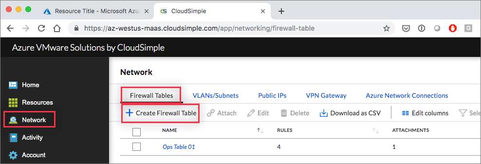
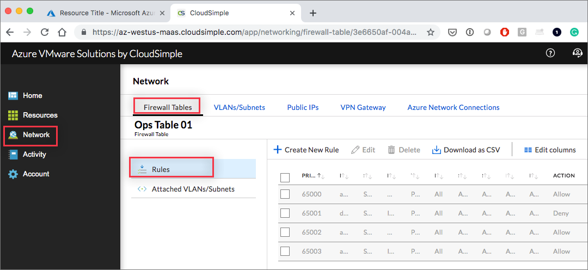
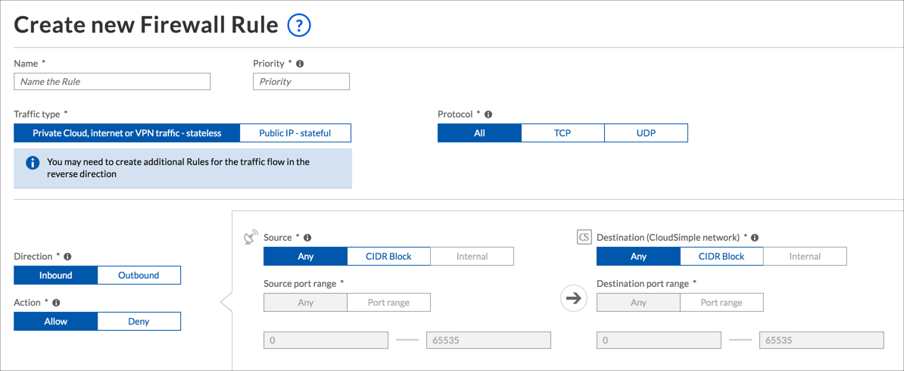

--- 
title: Azure VMware Solution by CloudSimple - Set up firewall tables and rules
description: Describes how to set up Private Cloud firewall tables and rules to restrict traffic on subnets and VLANs.  
author: sharaths-cs 
ms.author: b-shsury 
ms.date: 08/15/2019 
ms.topic: article 
ms.service: azure-vmware-cloudsimple 
ms.reviewer: cynthn 
manager: dikamath 
---

# Set up firewall tables and rules for Private Clouds

Firewall tables and the associated rules allow you to specify restrictions on traffic to apply to particular subnets and VLANs.

* A subnet can be associated with one firewall table.
* A firewall table can be associated with multiple subnets.

## Add a new firewall table

1. [Access the CloudSimple portal](monitor-activity.md) and select **Network** on the side menu.
2. Select **Firewall Tables**.
3. Select **Create firewall table**.

    

4. Enter a name for the table.
5. A default rule for the table is listed. Click **Create New Rule** to create an additional rule. See the following procedure for details.
6. Click **Done** to save the firewall table.

## Firewall rules

Firewall rules determine how the firewall treats specific types of traffic. The **Rules** tab for a selected firewall table lists all the associated rules.

## Create a firewall rule

1. Display the settings to create a firewall rule in either of these ways:
    * Click **Add Rule** when creating a firewall table.
    * Select a particular firewall table on the **Network > Firewall Tables** page and click **Create new firewall rule**.
2. Set up the rule as follows:
    * **Name**. Give the rule a name.
    * **Priority**. Assign a priority to the rule. Rules with lower numbers are executed first.
    * **Traffic type**. Select whether the rule is for Private Cloud, Internet, or VPN traffic (stateless) or for a public IP address (stateful).
    * **Protocol**. Select the protocol covered by the rule (TCP, UDP, or any protocol).
    * **Direction**. Select whether the rule is for inbound or outbound traffic. You must define separate rules for inbound and outbound traffic.
    * **Action**. Select the action to take if the rule matches (allow or deny).
    * **Source**. Specify the sources covered by the rule (CIDR block, internal, or any source).
    * **Source port range**. Specify the range of ports subject to the rule.
    * **Direction**. Select inbound or outbound.
    * **Destination**. Specify the destinations covered by the rule (CIDR block, internal, or any source).
    * **Source port range**. Specify the range of ports subject to the rule.

    

3. Click **Done** to save the rule and add it to the list of rules for the firewall table.

## Attach VLANs/subnets

After you define a firewall table, you can specify the subnets that are subject to the rules in the table.

1. On the **Network** > **Firewall Tables** page, select a firewall table.
2. Open the **Attached VLANs/Subnet** tab.
3. Click **Attach to a VLAN/Subnet**.
4. Select the Private Cloud and VLAN. The associated subnet name and CIDR block are shown.
5. Click **Submit**.
