--- 
title: Azure VMware Solution by CloudSimple - Stretch a Layer 2 network on-premises to Private Cloud
description: Describes how to set up a Layer 2 VPN between NSX-T on a CloudSimple Private Cloud and an on-premises standalone NSX Edge client
author: sharaths-cs
ms.author: b-shsury 
ms.date: 08/19/2019 
ms.topic: article 
ms.service: azure-vmware-cloudsimple 
ms.reviewer: cynthn 
manager: dikamath 
---

# Migrate workloads using Layer 2 stretched networks

In this guide, you will learn how to use Layer 2 VPN (L2VPN) to stretch a Layer 2 network from your on-premises environment to your CloudSimple Private Cloud. This solution enables migration of workloads running in your on-premises VMware environment to the Private Cloud in Azure within the same subnet address space without having to re-IP your workloads.

L2VPN based stretching of Layer 2 networks can work with or without NSX-based networks in your on-premises VMware environment. If you don't have NSX-based networks for workloads on-premises, you can use a standalone NSX Edge Services Gateway.

> [!NOTE]
> This guide covers the scenario where on-premises and the Private Cloud datacenters are connected over Site-to-Site VPN.

## Deployment scenario

To stretch your on-premises network using L2VPN, you must configure an L2VPN server (destination NSX-T Tier0 router) and an L2VPN client (source standalone client).  

In this deployment scenario, your Private Cloud is connected to your on-premises environment via a Site-to-Site VPN tunnel that allows on-premises management and vMotion subnets to communicate with the Private Cloud management and vMotion subnets. This arrangement is necessary for Cross vCenter vMotion (xVC-vMotion). A NSX-T Tier0 router is deployed as an L2VPN server in the Private Cloud.

Standalone NSX Edge is deployed in your on-premises environment as an L2VPN client and subsequently paired with the L2VPN server. A GRE tunnel endpoint is created on each side and configured to 'stretch' the on-premises Layer 2 network to your Private Cloud. This configuration is depicted in the following figure.

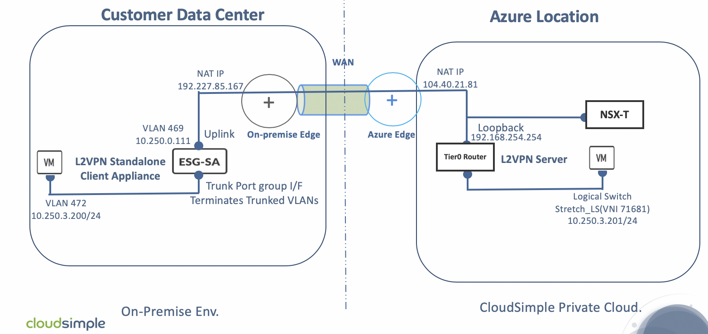

To learn more about migration using L2 VPN, see [Virtual Private Networks](https://docs.vmware.com/en/VMware-NSX-T-Data-Center/2.3/com.vmware.nsxt.admin.doc/GUID-A8B113EC-3D53-41A5-919E-78F1A3705F58.html#GUID-A8B113EC-3D53-41A5-919E-78F1A3705F58__section_44B4972B5F12453B90625D98F86D5704) in the VMware documentation.

## Prerequisites for deploying the solution

Verify that the following are in place before deploying and configuring the solution:

* The on-premises vSphere version is 6.7U1+ or 6.5P03+.
* The on-premises vSphere license is at the Enterprise Plus level (for vSphere Distributed Switch).
* Identify the workload Layer 2 network to be stretched to your Private Cloud.
* Identify a Layer 2 network in your on-premises environment for deploying your L2VPN client appliance.
* [A Private Cloud is already created](create-private-cloud.md).
* The version of the standalone NSX-T Edge appliance is compatible with the NSX-T Manager version (NSX-T 2.3.0) used in your Private Cloud environment.
* A trunk port group has been created in the on-premises vCenter with forged transmits enabled.
* A public IP address has been reserved to use for the NSX-T standalone client uplink IP  address, and 1:1 NAT is in place for translation between the two addresses.
* DNS forwarding is set on the on-premises DNS servers for the az.cloudsimple.io domain to point to the Private Cloud DNS servers.
* RTT latency is less than or equal to 150 ms, as required for vMotion to work across the two sites.

## Limitations and considerations

The following table lists supported vSphere versions and network adaptor types.  

| vSphere version | Source vSwitch type | Virtual NIC driver | Target vSwitch Type | Supported? |
------------ | ------------- | ------------ | ------------- | ------------- 
| All | DVS | All | DVS | Yes |
| vSphere 6.7UI or higher, 6.5P03 or higher | DVS | VMXNET3 | N-VDS | Yes |
| vSphere 6.7UI or higher, 6.5P03 or higher | DVS | E1000 | N-VDS | [Not supported per VWware](https://kb.vmware.com/s/article/56991) |
| vSphere 6.7UI or 6.5P03, NSX-V or versions below NSX-T2.2, 6.5P03 or higher | All | All | N-VDS | [Not supported per VWware](https://kb.vmware.com/s/article/56991) |

As of the VMware NSX-T 2.3 release:

* The logical switch on the Private Cloud side that is stretched to on-premises over L2VPN can't be routed at the same time. The stretched logical switch can't be connected to a logical router.
* L2VPN and route-based IPSEC VPNs can only be configured using API calls.

For more information, see [Virtual Private Networks](https://docs.vmware.com/en/VMware-NSX-T-Data-Center/2.3/com.vmware.nsxt.admin.doc/GUID-A8B113EC-3D53-41A5-919E-78F1A3705F58.html#GUID-A8B113EC-3D53-41A5-919E-78F1A3705F58__section_44B4972B5F12453B90625D98F86D5704) in the VMware documentation.

### Sample L2 VPN deployment addressing

### On-premises network where the standalone ESG (L2 VPN client) is deployed

| **Item** | **Value** |
|------------|-----------------|
| Network name | MGMT_NET_VLAN469 |
| VLAN | 469 |
| CIDR| 10.250.0.0/24 |
| Standalone Edge appliance IP address | 10.250.0.111 |
| Standalone Edge appliance NAT IP address | 192.227.85.167 |

### On-premises network to be stretched

| **Item** | **Value** |
|------------|-----------------|
| VLAN | 472 |
| CIDR| 10.250.3.0/24 |

### Private Cloud IP schema for NSX-T Tier0 Router (L2 VPN serve)

| **Item** | **Value** |
|------------|-----------------|
| Loopback interface | 192.168.254.254/32 |
| Tunnel interface | 5.5.5.1/29 |
| Logical switch (stretched) | Stretch_LS |
| Loopback interface (NAT IP address) | 104.40.21.81 |

### Private Cloud network to be mapped to the stretched network

| **Item** | **Value** |
|------------|-----------------|
| VLAN | 712 |
| CIDR| 10.200.15.0/24 |

## Fetch the logical router ID needed for L2VPN

The following steps show how to fetch the logical-router ID of Tier0 DR logical router instance for the IPsec and L2VPN services. The logical-router ID is needed later when implementing the L2VPN.

1. Sign in to NSX-T Manager https://*nsx-t-manager-ip-address* and select **Networking** > **Routers** > **Provider-LR** > **Overview**. For **High Availability Mode**, select **Active-Standby**. This action opens a pop-up window that shows the Edge VM on which the Tier0 router is currently active.

    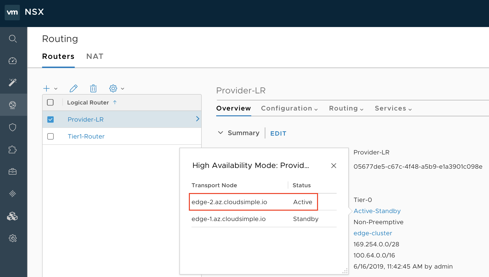

2. Select **Fabric** > **Nodes** > **Edges**. Make a note of the management IP address of the active Edge VM (Edge VM1) identified in the previous step.

    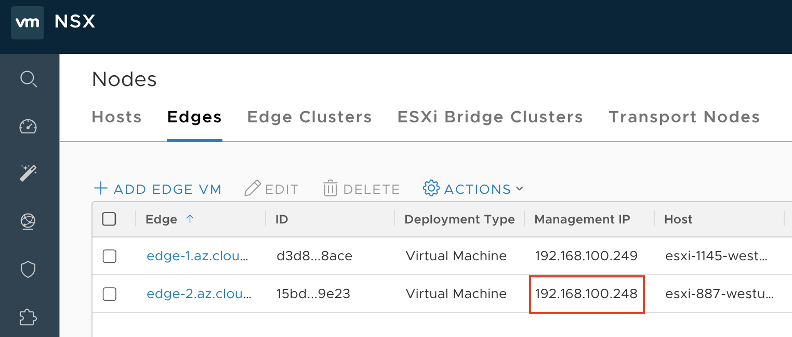

3. Open an SSH session to the management IP address of the Edge VM. Run the ```get logical-router``` command with username **admin** and password **CloudSimple 123!**.

    

4. If you don't see an entry 'DR-Provider-LR', complete the following steps.

5. Create two overlay-backed logical switches. One logical switch is stretched to on-premises where the migrated workloads reside. Another logical switch is a dummy switch. For instructions, see [Create a Logical Switch](https://docs.vmware.com/en/VMware-NSX-T-Data-Center/2.3/com.vmware.nsxt.admin.doc/GUID-23194F9A-416A-40EA-B9F7-346B391C3EF8.html) in the VMware documentation.

    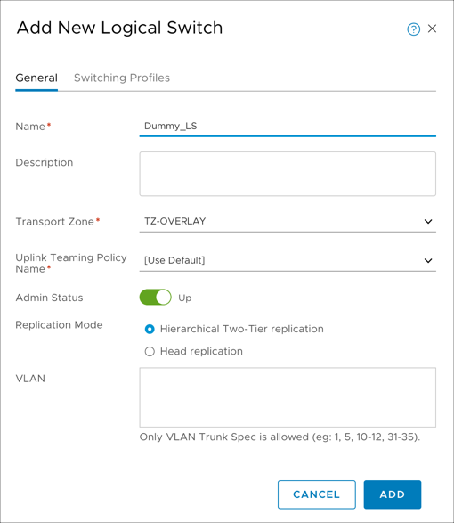

6. Attach the dummy switch to the Tier1 router with a link local IP address or any non-overlapping subnet from on-premises or your Private Cloud. See [Add a Downlink Port on a Tier-1 Logical Router](https://docs.vmware.com/en/VMware-NSX-T-Data-Center/2.3/com.vmware.nsxt.admin.doc/GUID-E7EA867C-604C-4224-B61D-2A8EF41CB7A6.html) in the VMware documentation.

    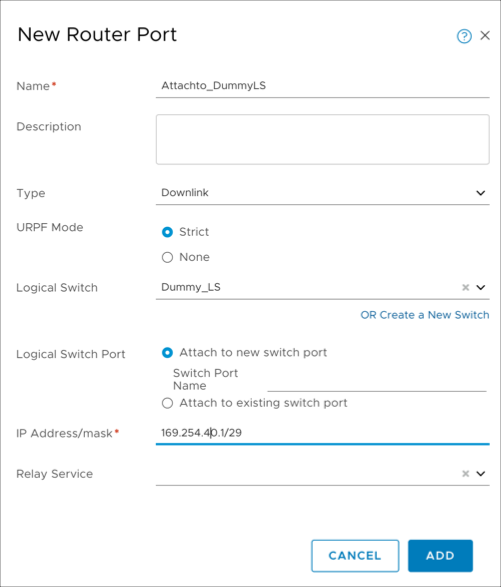

7. Run the `get logical-router` command again on the SSH session of the Edge VM. The UUID of the 'DR-Provider-LR' logical router is displayed. Make a note of the UUID, which is required when configuring the L2VPN.

    

## Fetch the logical-switch ID needed for L2VPN

1. Sign in to [NSX-T Manager](https://nsx-t-manager-ip-address).
2. Select **Networking** > **Switching** > **Switches** > **<\Logical switch\>** > **Overview**.
3. Make a note of the UUID of the stretch logical switch, which is required when configuring the L2VPN.

    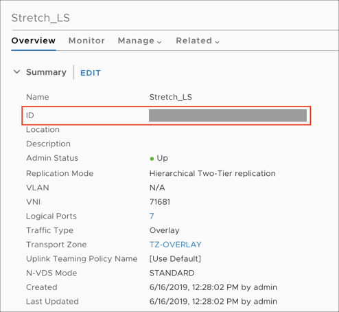

## Routing and security considerations for L2VPN

To establish an IPsec route-based VPN between the NSX-T Tier0 router and the standalone NSX Edge client, the loopback interface of the NSX-T Tier0 router must be able to communicate with the public IP address of NSX standalone client on-premises over UDP 500/4500.

### Allow UDP 500/4500 for IPsec

1. [Create a public IP address](public-ips.md) for the NSX-T Tier0 loopback interface in the CloudSimple portal.

2. [Create a firewall table](firewall.md) with stateful rules that allow UDP 500/ 4500 inbound traffic and attach the firewall table to the NSX-T HostTransport subnet.

### Advertise the loopback interface IP to the underlay network

1. Create a null route for the loopback interface network. Sign in to NSX-T Manager and select **Networking** > **Routing** > **Routers** > **Provider-LR** > **Routing** > **Static Routes**. Click **Add**. For **Network**, enter the loopback interface IP address. For **Next Hops**, click **Add**, specify 'Null' for the next hop, and keep the default of 1 for Admin Distance.

    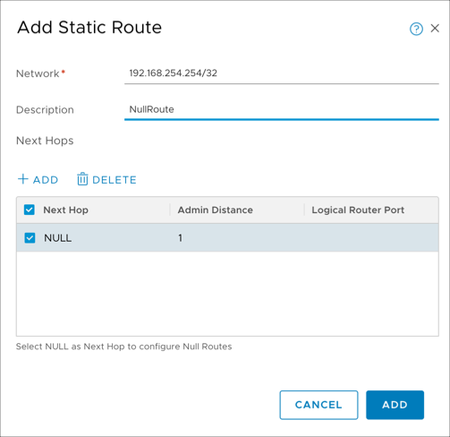

2. Create an IP prefix list. Sign in to NSX-T Manager and select **Networking** > **Routing** > **Routers** > **Provider-LR** > **Routing** > **IP Prefix Lists**. Click **Add**. Enter a name to identify the list. For **Prefixes**, click **Add** twice. In the first line, enter '0.0.0.0/0' for **Network** and 'Deny' for **Action**. In the second line, select **Any** for **Network** and **Permit** for **Action**.
3. Attach the IP prefix list to both BGP neighbors (TOR). Attaching the IP prefix list to the BGP neighbor prevents the default route from being advertised in BGP to the TOR switches. However, any other route that includes the null route will advertise the loopback interface IP address to the TOR switches.

    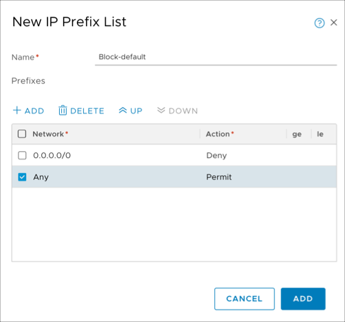

4. Sign in to NSX-T Manager and select **Networking** > **Routing** > **Routers** > **Provider-LR** > **Routing** > **BGP** > **Neighbors**. Select the first neighbor. Click **Edit** > **Address Families**. For the IPv4 family, Edit the **Out Filter** column and select the IP prefix list that you created. Click **Save**. Repeat this step for the second neighbor.

    
    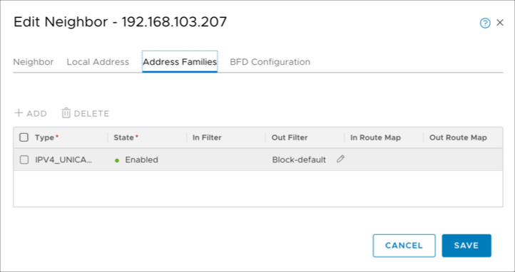

5. Redistribute the null static route into BGP. To advertise the loopback interface route to the underlay, you must redistribute the null static route into BGP. Sign in to NSX-T Manager and select **Networking** > **Routing** > **Routers** > **Provider-LR** > **Routing** > **Route Redistribution** > **Neighbors**. Select **Provider-LR-Route_Redistribution** and click **Edit**. Select the **Static** checkbox and click **Save**.

    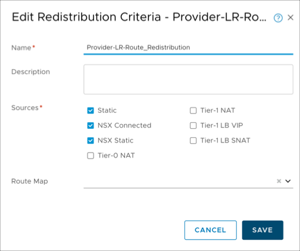

## Configure a route-based VPN on the NSX-T Tier0 router

Use the following template to fill in all the details for configuring a route-based VPN on the NSX-T Tier0 router. The UUIDs in each POST call are required in subsequent POST calls. The IP addresses for the loopback and tunnel interfaces for L2VPN must be unique and not overlap with the on-premises or Private Cloud networks.

The IP addresses chosen for loopback and tunnel interface used for L2VPN must be unique and not overlap with the on-premises or Private Cloud networks. The loopback interface network must always be /32.

```
Loopback interface ip : 192.168.254.254/32
Tunnel interface subnet : 5.5.5.0/29
Logical-router ID : UUID of Tier0 DR logical router obtained in section “Steps to fetch Logical-Router ID needed for L2VPN”
Logical-switch ID(Stretch) : UUID of Stretch Logical Switch obtained earlier
IPSec Service ID :
IKE profile ID :
DPD profile ID :
Tunnel Profile ID :
Local-endpoint ID :
Peer end-point ID :
IPSec VPN session ID (route-based) :
L2VPN service ID :
L2VPN session ID :
Logical-Port ID :
Peer Code :
```

For all of the following API calls, replace the IP address with your NSX-T Manager IP address. You can run all these API calls from the POSTMAN client or by using `curl` commands.

### Enable the IPSec VPN service on the logical router

```
POST   https://192.168.110.201/api/v1/vpn/ipsec/services/
{
"resource_type": "IPSecVPNService",
"description": "Manage VPN service",
"display_name": "IPSec VPN service",
"logical_router_id": "Logical-router ID",
"ike_log_level": "INFO",
"enabled": true
}
```

### Create profiles: IKE

```
POST https://192.168.110.201/api/v1/vpn/ipsec/ike-profiles
 
{
"resource_type": "IPSecVPNIKEProfile",
"description": "IKEProfile for siteA",
"display_name": "IKEProfile siteA",
"encryption_algorithms": ["AES_128"],
"ike_version": "IKE_V2",
"digest_algorithms": ["SHA2_256"],
"sa_life_time":21600,
"dh_groups": ["GROUP14"]
}
```

### Create profiles: DPD

```
POST  https://192.168.110.201/api/v1/vpn/ipsec/dpd-profiles  

{
"resource_type": "IPSecVPNDPDProfile",
"display_name": "nsx-default-dpd-profile",
"enabled": true
}
```

### Create profiles: Tunnel

```
POST  https://192.168.110.201/api/v1/vpn/ipsec/tunnel-profiles
 
{
"resource_type": "IPSecVPNTunnelProfile",
"display_name": "nsx-default-tunnel-profile",
"enable_perfect_forward_secrecy": true,
"encryption_algorithms": ["AES_GCM_128"],
"digest_algorithms": [],
"sa_life_time":3600,
"dh_groups": ["GROUP14"],
"encapsulation_mode": "TUNNEL_MODE",
"transform_protocol": "ESP",
"df_policy": "COPY"
}
```

### Create a local endpoint

``` 
POST https://192.168.110.201/api/v1/vpn/ipsec/local-endpoints
 
{
"resource_type": "IPSecVPNLocalEndpoint",
"description": "Local endpoint",
"display_name": "Local endpoint",
"local_id": "<Public IP of Loopback interface>",
"ipsec_vpn_service_id": {
"target_id": "IPSec VPN service ID"},
"local_address": "<IP of Loopback interface>",
"trust_ca_ids": [],
"trust_crl_ids": []
}
```

### Create a peer endpoint

```
POST https://192.168.110.201/api/v1/vpn/ipsec/peer-endpoints

{
"resource_type": "IPSecVPNPeerEndpoint",
"description": "Peer endpoint for site B",
"display_name": "Peer endpoint for site B",
"connection_initiation_mode": "INITIATOR",
"authentication_mode": "PSK",
"ipsec_tunnel_profile_id": "IPSec Tunnel profile ID",
"dpd_profile_id": "DPD profile ID",
"psk":"nsx",
"ike_profile_id": "IKE profile ID",
"peer_address": "<Public IP of Standalone client",
"peer_id": "<Public IP of Standalone client>"
}
```

### Create a route-based VPN session

```
POST :  https://192.168.110.201/api/v1/vpn/ipsec/sessions
 
{
"resource_type": "RouteBasedIPSecVPNSession",
"peer_endpoint_id": "Peer Endpoint ID",
"ipsec_vpn_service_id": "IPSec VPN service ID",
"local_endpoint_id": "Local Endpoint ID",
"enabled": true,
"tunnel_ports": [
{
"ip_subnets": [
{
"ip_addresses": [
 "5.5.5.1"
],
"prefix_length": 24
}
  ]
}
]
}
```

## Configure L2VPN on NSX-T Tier0 router

Fill in the following information after every POST call. The IDs are required in subsequent POST calls.

```
L2VPN Service ID:
L2VPN Session ID:
Logical Port ID:
```

### Create the L2VPN service

The output of the following GET command will be blank, because the configuration is not complete yet.

```
GET : https://192.168.110.201/api/v1/vpn/l2vpn/services
```

For the following POST command, the logical router ID is the UUID of the Tier0 DR logical router obtained earlier.

```
POST : https://192.168.110.201/api/v1/vpn/l2vpn/services

{
"logical_router_id": "Logical Router ID",
"enable_full_mesh" : true
}
```

### Create the L2VPN session

For the following POST command, the L2VPN service ID is the ID that you just obtained and the IPsec VPN session ID is the ID obtained in the previous section.

```	
POST: https://192.168.110.201/api/v1/vpn/l2vpn/sessions

{
"l2vpn_service_id" : "L2VPN service ID",
"transport_tunnels" : [
    {
    "target_id" : "IPSec VPN session ID"
    }]
}
```

These calls create a GRE tunnel endpoint. To check the status, run the following command.

```
edge-2> get tunnel-port
Tunnel  	: 44648dae-8566-5bc9-a065-b1c4e5c3e03f
IFUID   	: 328
LOCAL   	: 169.254.64.1
REMOTE  	: 169.254.64.2
ENCAP   	: GRE

Tunnel  	: cf950ca1-5cf8-5438-9b1a-d2c8c8e7229b
IFUID   	: 318
LOCAL   	: 192.168.140.155
REMOTE  	: 192.168.140.152
ENCAP   	: GENEVE

Tunnel  	: 63639321-87c5-529e-8a61-92c1939799b2
IFUID   	: 304
LOCAL   	: 192.168.140.155
REMOTE  	: 192.168.140.156
ENCAP   	: GENEVE
```

### Create logical port with the tunnel ID specified

```
	POST https://192.168.110.201/api/v1/logical-ports/

{
"resource_type": "LogicalPort",
"display_name": "Extend logicalSwitch, port for service",
"logical_switch_id": "Logical switch ID",
"admin_state" : "UP",
"attachment": {
"attachment_type":"L2VPN_SESSION",
"id":"L2VPN session ID",
"context" : {
"resource_type" : "L2VpnAttachmentContext",
	"tunnel_id" : 10
}
	}
    	}
```

## Obtain the peer code for L2VPN on the NSX-T side

Obtain the peer code of the NSX-T endpoint. The peer code is required when configuring the remote endpoint. The L2VPN <session-id> can be obtained from the previous section. For more information, see the [NSX-T 2.3 API Guide](https://www.vmware.com/support/nsxt/doc/nsxt_23_api.html).

```
GET https://192.168.110.201/api/v1/vpn/l2vpn/sessions/<session-id>/peer-codes
```

## Deploy the NSX-T standalone client (on-premises)

Before deploying, verify that your on-premises firewall rules allow inbound and outbound UDP 500/4500 traffic from/to the CloudSimple public IP address that was reserved earlier for the NSX-T T0 router loopback interface. 

1. [Download the Standalone NSX Edge Client](https://my.vmware.com/group/vmware/details?productId=673&rPId=33945&downloadGroup=NSX-T-230) OVF and Extract the files from the downloaded bundle into a folder.

    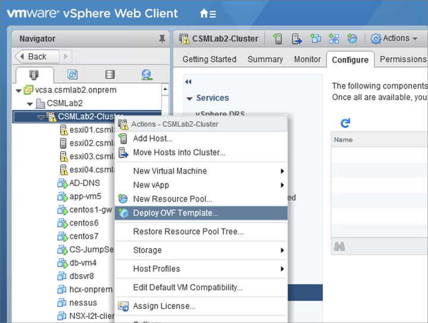

2. Go to the folder with all the extracted files. Select all the vmdks (NSX-l2t-client-large.mf and NSX-l2t-client-large.ovf for large appliance size or NSX-l2t-client-Xlarge.mf and NSX-l2t-client-Xlarge.ovf for extra large size appliance size). Click **Next**.

    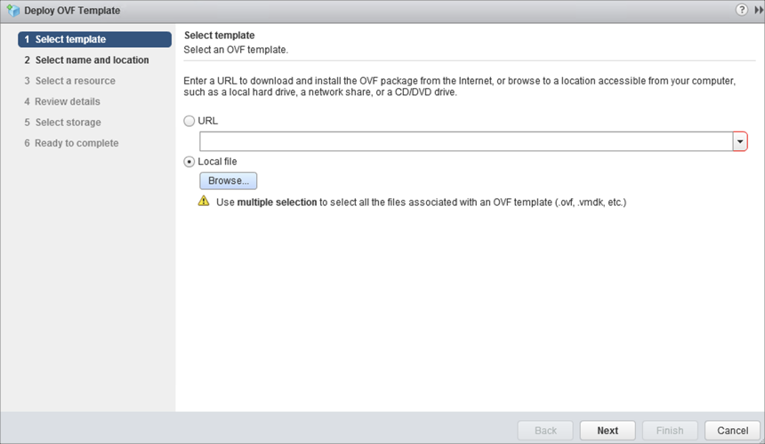
    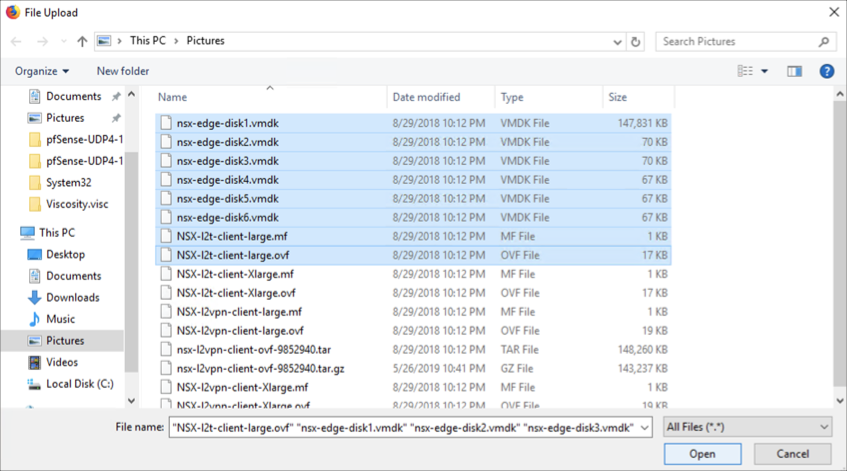

3. Enter a name for the NSX-T standalone client and click **Next**.

    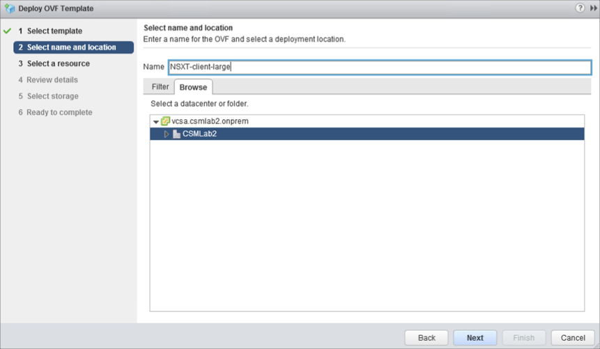

4. Click **Next** as needed to reach the datastore settings. Select the appropriate datastore for NSX-T standalone client and click **Next**.

    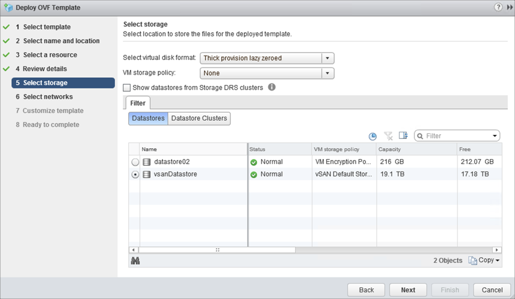

5. Select the correct port groups for Trunk (Trunk PG), Public (Uplink PG) and HA interface (Uplink PG) for the NSX-T standalone client. Click **Next**.

    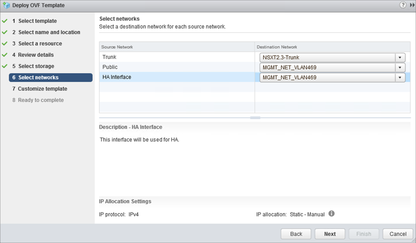

6. Fill the following details in the **Customize template** screen and click **Next**:

    Expand L2T:

    * **Peer Address**. Enter the IP address reserved on Azure CloudSimple portal for NSX-T Tier0 Loopback interface.
    * **Peer Code**. Paste the peer code obtained from the last step of L2VPN Server deployment.
    * **Sub Interfaces VLAN (Tunnel ID)**. Enter the VLAN ID to be stretched. In parentheses (), enter the tunnel ID that was previously configured.

    Expand Uplink Interface:

    * **DNS IP Address**. Enter the on-premises DNS IP address.
    * **Default Gateway**.  Enter the default gateway of the VLAN that will act as a default gateway for this client.
    * **IP Address**. Enter the uplink IP address of the standalone client.
    * **Prefix Length**. Enter the prefix length of the uplink VLAN/subnet.
    * **CLI admin/enable/root User Password**. Set the password for admin /enable /root account.

      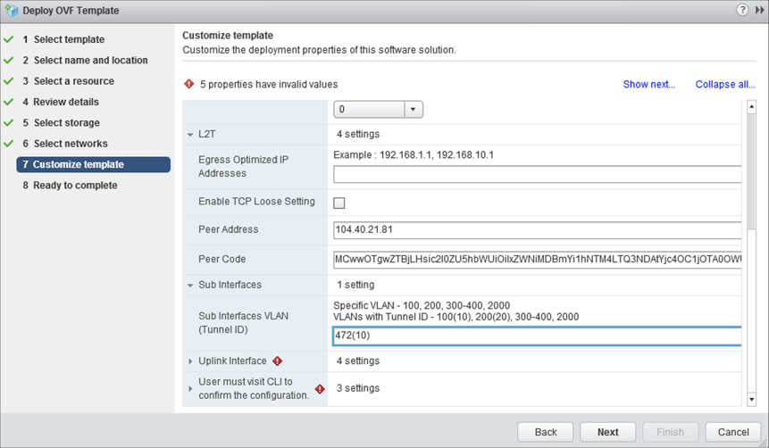
      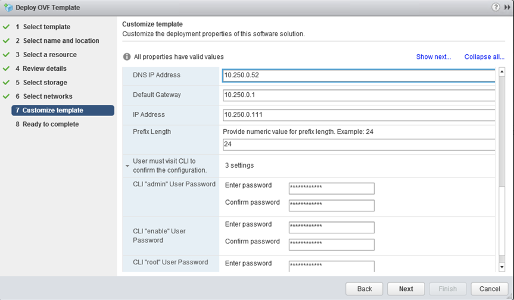

7. Review the settings and click **Finish**.

    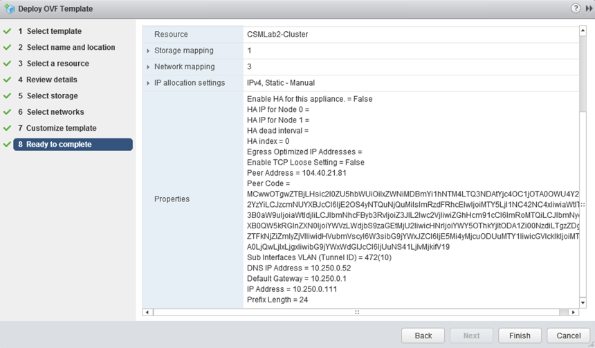

## Configure an on-premises sink port

If one of the VPN sites doesn't have NSX deployed, you can configure an L2 VPN by deploying a standalone NSX Edge at that site. A standalone NSX Edge is deployed using an OVF file on a host that is not managed by NSX. This deploys an NSX Edge Services Gateway appliance to function as an L2 VPN client.

If a standalone edge trunk vNIC is connected to a vSphere Distributed Switch, either promiscuous mode or a sink port is required for L2 VPN function. Using promiscuous mode can cause duplicate pings and duplicate responses. For this reason, use sink port mode in the L2 VPN standalone NSX Edge configuration. See the [Configure a sink port](https://docs.vmware.com/en/VMware-NSX-Data-Center-for-vSphere/6.4/com.vmware.nsx.admin.doc/GUID-3CDA4346-E692-4592-8796-ACBEEC87C161.html) in the VMware documentation.

## IPsec VPN and L2VPN verification

Use the following commands to verify IPsec and L2VPN sessions from standalone NSX-T Edge.

```
nsx-l2t-edge> show service ipsec
-----------------------------------------------------------------------
vShield Edge IPSec Service Status:
IPSec Server is running.
AESNI is enabled.
Total Sites: 1, 1 UP, 0 Down
Total Tunnels: 1, 1 UP, 0 Down
----------------------------------
Site:  10.250.0.111_0.0.0.0/0-104.40.21.81_0.0.0.0/0
Channel: PeerIp: 104.40.21.81    LocalIP: 10.250.0.111  Version: IKEv2  Status: UP
Tunnel: PeerSubnet: 0.0.0.0/0    LocalSubnet: 0.0.0.0/0   Status: UP
----------------------------------
```

```
nsx-l2t-edge> show service l2vpn
L2 VPN is running
----------------------------------------
L2 VPN type: Client/Spoke

SITENAME                       IPSECSTATUS          VTI                  GRE
1ecb00fb-a538-4740-b788-c9049e8cb6c6 UP                   vti-100              l2t-1
```

Use the following commands to verify IPsec and L2VPN sessions from the NSX-T Tier0 router.

```
edge-2> get ipsecvpn session
Total Number of Sessions: 1

IKE Session ID : 3
UUID           : 1ecb00fb-a538-4740-b788-c9049e8cb6c6
Type           : Route

Local IP       : 192.168.254.254      Peer IP        : 192.227.85.167
Local ID       : 104.40.21.81         Peer ID        : 192.227.85.167
Session Status : Up

Policy Rules
    VTI UUID       : 4bf96e3b-e50b-49cc-a16e-43a6390e3d53
    ToRule ID      : 560874406            FromRule ID    : 2708358054
    Local Subnet   : 0.0.0.0/0            Peer Subnet    : 0.0.0.0/0
    Tunnel Status  : Up
```

```
edge-2> get l2vpn session
Session       : f7147137-5dd0-47fe-9e53-fdc2b687b160
Tunnel        : b026095b-98c8-5932-96ff-dda922ffe316
IPSEC Session : 1ecb00fb-a538-4740-b788-c9049e8cb6c6
Status        : UP
```

Use the following commands to verify the sink port on the ESXi host where the NSX-T standalone client VM resides in the on-premises environment.

```
 [root@esxi02:~] esxcfg-vswitch -l |grep NSX
  53                  1           NSXT-client-large.eth2
  225                1           NSXT-client-large.eth1
  52                  1           NSXT-client-large.eth0
```

```
[root@esxi02:~] net-dvs -l | grep "port\ [0-9]\|SINK\|com.vmware.common.alias"
                com.vmware.common.alias = csmlab2DS ,   propType = CONFIG
        port 24:
        port 25:
        port 26:
        port 27:
        port 13:
        port 19:
        port 169:
        port 54:
        port 110:
        port 6:
        port 107:
        port 4:
        port 199:
        port 168:
        port 201:
        port 0:
        port 49:
        port 53:
        port 225:
                com.vmware.etherswitch.port.extraEthFRP =   SINK
        port 52:
```
