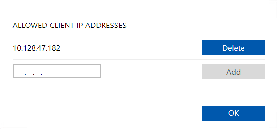
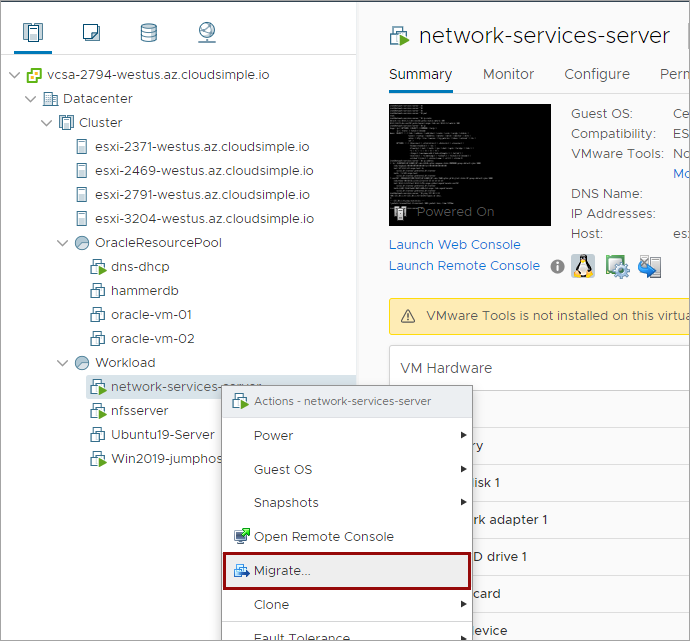
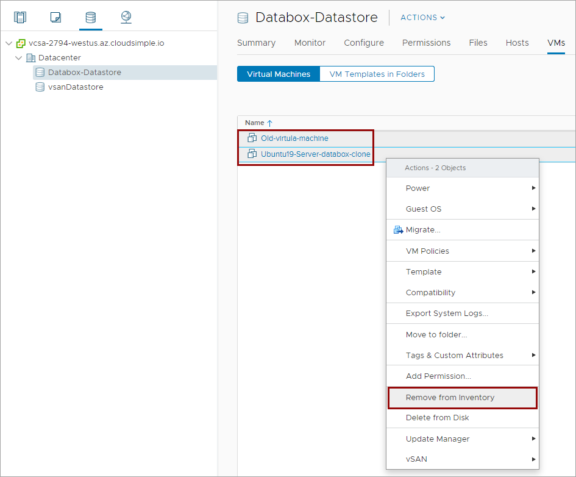
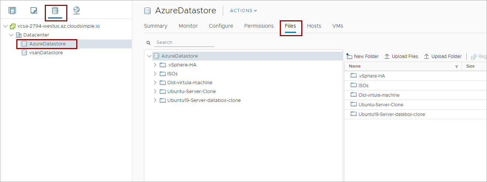

# Migrating data to Azure VMware Solution by CloudSimple using Azure Data Box

The Microsoft Azure Data Box cloud solution lets you send terabytes of data into Azure in a quick, inexpensive, and reliable way. The secure data transfer is accelerated by shipping you a proprietary Data Box storage device. Each storage device has a maximum usable storage capacity of 80 TB and is transported to your datacenter through a regional carrier. The device has a rugged casing to protect and secure data during the transit.

Using Azure Data Box, you can migrate bulk of your VMware data to your Private Cloud.  Data from your on-premises vSphere environment is copied to the Data Box using NFS protocol.  Bulk data migration involves copying a point-in-time copy of virtual machines, configuration, and associated data to the Data Box and shipped to Azure.

In this article, you learn about:

* Setting up Azure Data Box.
* Copying data from on-premises VMware environment to the Data Box using NFS.
* Preparing for return of Azure Data Box.
* Prepare blob data for copy to Azure VMware Solution by CloudSimple.
* Copying the data from Azure to your Private Cloud.

## Scenarios

Azure Data Box should be used in the following scenarios for bulk data migration.

* Migrate large amount of data from on-premises to Azure VMware Solution by CloudSimple to be used as a baseline and sync differences over the network.
* Migrate large amount of powered off virtual machines (cold virtual machines).
* Migrate virtual machine data for setting up development and test environments.
* Migrate large number of virtual machine templates, ISOs, virtual machine disks.

## Before you begin

* Check the prerequisites and [order Data Box](../databox/data-box-deploy-ordered.md) from your Azure portal.  During the order process, you must select a storage account, which allows BLOB storage.  Once you receive the Data Box, connect it to your on-premises network and [set up the Data Box](../databox/data-box-deploy-set-up.md) with an IP address reachable from your vSphere management network.

* Create a virtual network and a storage account in the same region of Azure where your Azure VMware solution by CloudSimple is provisioned.

* Create [Azure virtual network connection](cloudsimple-azure-network-connection.md) from your Private Cloud to the virtual network where storage account is created using steps mentioned in the article [Connect Azure virtual network to CloudSimple using ExpressRoute](virtual-network-connection.md)

## Set up Azure Data Box for NFS

Connect to your Azure Data Box local web UI using steps mentioned in the section **Connect to your device** in the article [Tutorial: Cable and connect to your Azure Data Box](../databox/data-box-deploy-set-up.md).  Configure Data Box to allow access to NFS clients.

1. In the local web UI, go to **Connect and copy** page. Under **NFS settings**, click **NFS client access**. 

    

2. Enter the IP address of the VMware ESXi hosts and click **Add**. You can configure access for all hosts in your vSphere cluster by repeating this step. Click **OK**.

    
> [!IMPORTANT]
> **Always create a folder for the files that you intend to copy under the share and then copy the files to that folder**. The folder created under block blob and page blob shares represents a container to which data is uploaded as blobs. You cannot copy files directly to *root* folder in the storage account.

Under block blob and page blob shares, first-level entities are containers, and second-level entities are blobs. Under shares for Azure Files, first-level entities are shares, second-level entities are files.

The following table shows the UNC path to the shares on your Data Box and Azure Storage path URL where the data is uploaded. The final Azure Storage path URL can be derived from the UNC share path.
 
|                   |                                                            |
|-------------------|--------------------------------------------------------------------------------|
| Azure Block blobs | <li>UNC path to shares: `//<DeviceIPAddress>/<StorageAccountName_BlockBlob>/<ContainerName>/files/a.txt`</li><li>Azure Storage URL: `https://<StorageAccountName>.blob.core.windows.net/<ContainerName>/files/a.txt`</li> |  
| Azure Page blobs  | <li>UNC path to shares: `//<DeviceIPAddres>/<StorageAccountName_PageBlob>/<ContainerName>/files/a.txt`</li><li>Azure Storage URL: `https://<StorageAccountName>.blob.core.windows.net/<ContainerName>/files/a.txt`</li>   |  
| Azure Files       |<li>UNC path to shares: `//<DeviceIPAddres>/<StorageAccountName_AzFile>/<ShareName>/files/a.txt`</li><li>Azure Storage URL: `https://<StorageAccountName>.file.core.windows.net/<ShareName>/files/a.txt`</li>        |

> [!NOTE]
> Use Azure Block Blobs for copying VMware data.

## Mount NFS share as a datastore on on-premises vCenter cluster and copy data

NFS share from your Azure Data Box must be mounted as a datastore on your on-premises vCenter cluster or VMware ESXi host for copying the data.  Once mounted, data can be copied on to the NFS datastore.

1. Log in to your on-premises vCenter server.

2. Right click on the **Datacenter**, select **Storage** add click on **New Datastore** and click **Next**

   

3. In step 1 of the add datastore wizard, select the type **NFS**.

   

4. In step 2, select **NFS 3** as NFS version and click **Next**.

   

5. In step 3, specify the name for the datastore, the path, and the server.  You can use the IP address of your Data Box for server.  The folder path will be in the format `/<StorageAccountName_BlockBlob>/<ContainerName>/`.

   

6. In step 4, select the ESXi hosts where you want the datastore to be mounted and click **Next**.  In a cluster, select all hosts to ensure migration of virtual machines.

   

7. In step 5, review the summary and click **Finish**

## Copy data to Data Box NFS datastore

Virtual machines can be migrated or cloned to the new datastore.  Any unused virtual machines, which need to be migrated can be migrated to Data Box NFS datastore using **storage vMotion**.  Active virtual machines can be **cloned** to the Data Box NFS datastore.

* Identify the list of virtual machines, which can be **moved**.
* Identify the list of virtual machines, which must be **cloned**.

### Move virtual machine to Data Box datastore

1. Right click on the virtual machine, which you want to move to Data Box datastore and select **Migrate**.

    

2. Select **Change storage only** for migration type and click **Next**.

    

3. Select Data Box datastore as the destination and click **Next**.

    

4. Review the information and click on **Finish**.

5. Repeat steps 1 to 4 for other virtual machines.

> [!TIP]
> You can select multiple virtual machines in same power state (powered on or powered off) and migrate them in bulk.

Storage for the virtual machine will be migrated to the NFS datastore from Azure Data Box.  Once all virtual machines are migrated, you can shut down the powered on virtual machines in preparation for migration of data to Azure VMware Solution.

### Clone a virtual machine or a virtual machine template to Data Box datastore

1. Right click on a virtual machine or a virtual machine template, which you want to clone.  Select **Clone**, **Clone to virtual machine**

    

2. Select a name for the cloned virtual machine or the virtual machine template.

3. Select the folder where you want to place the cloned object and click **Next**.

4. Select the cluster or the resource pool where you want the cloned object and click **Next**.

5. Select the Azure Data Box NFS datastore as the storage location and click **Next**.

    

6. Select the customize options if you want to customize any options for the cloned object and click **Next**.

7. Review the configurations and click **Finish**.

8. Repeat steps 1 to 7 for additional virtual machines or virtual machine templates.

Virtual machines will be cloned and stored on the NFS datastore from Azure Data Box.  Once the virtual machines are cloned, ensure that the cloned virtual machines are powered off in preparation for migration of data to Azure VMware solution.

### Copy ISO files to Data Box datastore

1. From your on-premises vCenter web UI, navigate to **Storage**.  Select Data Box NFS datastore and click on **Files**.  Create a **New Folder** for storing ISO files.

    

2. Give a name for the folder where ISO files will be stored.

3. Double-click on the newly created folder to access the contents.

4. Click on **Upload Files** and select the ISOs you want to upload.
    
    

> [!TIP]
> If you already have ISO files on your on-premises datastore, you can select the files and **Copy to** the Data Box NFS datastore.


## Prepare Azure Data Box for return

Once all virtual machine data, virtual machine template data and any ISO files are copied to the Data Box NFS datastore, the datastore can be disconnected from your vCenter.  All virtual machines and virtual machine templates must be removed from the inventory before the datastore can be disconnected.

### Remove objects from inventory

1. From your on-premises vCenter web UI, navigate to **Storage**.  Select Data Box NFS datastore and click on **VMs**.

2. Ensure that all the virtual machines are powered off.

    

3. Select all virtual machines, right-click and select **Remove from inventory**.

    

4. Select **VM Templates in Folders** from the top buttons and repeat step 3. 

### Remove Azure Data Box NFS datastore from vCenter

Data Box NFS datastore must be disconnected from VMware ESXi hosts before preparing for return.

1. From your on-premises vCenter web UI, navigate to **Storage**.

2. Right click on the Data Box NFS datastore and select **Unmount Datastore**.

    

3. Select all ESXi hosts where the datastore is mounted and click **Ok**.

    

4. Review and accept any warnings and click **Ok**.

### Prepare Data Box for return and return the Data Box

Follow the steps outlined in the article [Return Azure Data Box and verify data upload to Azure](../databox/data-box-deploy-picked-up.md) to return the Data Box.  Check the status of data copy to your Azure storage account and once the status shows completed, you can verify the data in your Azure storage account.

## Copy data from Azure storage to Azure VMware Solution by CloudSimple

Data copied to your Azure Data Box will be available on your Azure storage account once the order status of your Data Box shows as completed.  The data can now be copied to your Azure VMware solution by CloudSimple.  Data in the storage account must be copied using NFS protocol to the vSAN datastore of your Private Cloud.  First, copy blob store data to a managed disk on a Linux virtual machine in Azure using **AzCopy**.  Make the managed disk available through NFS protocol and mount the NFS share as a datastore on your Private Cloud and copy the data.  This method allows faster copy of the data to your Private Cloud. 

### Copy data to your Private Cloud using a Linux virtual machine and managed disks and export as NFS share

1. Create a [Linux virtual machine](../virtual-machines/linux/quick-create-portal.md) in Azure in the same region where your storage account is created and has an Azure virtual network connection to your Private Cloud.

2. Create a managed disk, which is larger than the amount of blob data and [attach it to your Linux virtual machine](../virtual-machines/linux/attach-disk-portal.md).  If the amount of blob data is larger than the largest managed disk available, the data must be copied in multiple steps or using multiple managed disks.

3. Connect to the Linux virtual machine and mount the managed disk.

4. Install [AzCopy on your Linux virtual machine](../storage/common/storage-use-azcopy-v10.md).

5. Download the data from your Azure blob storage on to the managed disk using AzCopy.  Command syntax: `azcopy copy "https://<storage-account-name>.blob.core.windows.net/<container-name>/*" "<local-directory-path>/"`.  Replace `<storage-account-name>` with your Azure storage account name and `<container-name>` with the container, which contains the data copied using Azure Data Box.

6. Install NFS server on your linux virtual machine.

    1. On an Ubuntu/Debian distribution: `sudo apt install nfs-kernel-server`.
    2. On an Enterprise Linux distribution: `sudo yum install nfs-utils`.

7. Change the permission of the folder on your managed disk where data from Azure blob store was copied.  Change the permissions for all the folders, which you want to export as NFS share.

    ```bash
    chmod -R 755 /<folder>/<subfolder>
    chown nfsnobody:nfsnobody /<folder>/<subfolder>
    ```

8. Assign permissions for client IP addresses to access NFS share by editing the `/etc/exports` file.

    ```bash
    sudo vi /etc/exports
    ```
    
    Enter the following lines in the file for every ESXi host IP of your Private Cloud.  If you are creating shares for multiple folders, add all the folders.

    ```bash
    /<folder>/<subfolder> <ESXiNode1IP>(rw,sync,no_root_squash,no_subtree_check)
    /<folder>/<subfolder> <ESXiNode2IP>(rw,sync,no_root_squash,no_subtree_check)
    .
    .
    ```

9. Export the NFS shares using the command `sudo exportfs -a`.

10. Restart NFS kernel server using the command `sudo systemctl restart nfs-kernel-server`.


### Mount Linux virtual machine NFS share as a datastore on Private Cloud vCenter cluster and copy data

NFS share from your Linux virtual machine must be mounted as a datastore on your Private Cloud vCenter cluster for copying the data.  Once mounted, data can be copied from the NFS datastore to Private Cloud vSAN datastore.

1. Log in to your Private Cloud vCenter server.

2. Right click on the **Datacenter**, select **Storage** add click on **New Datastore** and click **Next**

   

3. In step 1 of the add datastore wizard, select the type **NFS**.

   

4. In step 2, select **NFS 3** as NFS version and click **Next**.

   

5. In step 3, specify the name for the datastore, the path, and the server.  You can use the IP address of your Linux virtual machine for server.  The folder path will be in the format `/<folder>/<subfolder>/`.

   

6. In step 4, select the ESXi hosts where you want the datastore to be mounted and click **Next**.  In a cluster, select all hosts to ensure migration of virtual machines.

   

7. In step 5, review the summary and click **Finish**

### Add virtual machines and virtual machine templates from NFS datastore to the inventory

1. From your Private Cloud vCenter web UI, navigate to **Storage**.  Select Linux virtual machine NFS datastore and click on **Files**.

    

2. Select a folder, which contains a virtual machine or a virtual machine template.  From the details pane, select `.vmx` file for a virtual machine or `.vmtx` file for a virtual machine template.

3. Click on **Register VM** to register the virtual machine on your Private Cloud vCenter.

    

4. Select the Datacenter, Folder, and Cluster/Resource pool where you want the virtual machine to be registered.

4. Repeat step 3 and 4 for all the virtual machines and virtual machine templates.

5. Navigate to the folder, which contains the ISO files.  Select ISO files and **Copy to** a folder on your vSAN datastore.

The virtual machines and virtual machine templates are now available on your Private Cloud vCenter.  These virtual machines must be moved from NFS datastore to vSAN datastore before powering them on.  You can do a storage vMotion of the virtual machines and selecting vSAN datastore as the target for the virtual machine.

The virtual machine templates must be cloned from your Linux virtual machine NFS datastore to your vSAN datastore.

### Clean up of your Linux virtual machine

Once all the data is copied to your Private Cloud, you can remove the NFS datastore from your Private Cloud.

1. Ensure all virtual machines and templates are moved and cloned to your vSAN datastore.

2. Remove all virtual machine templates from NFS datastore from inventory.

3. Unmount Linux virtual machine datastore from your Private Cloud vCenter.

4. Delete the virtual machine and managed disk from Azure.

5. If you do not wish to keep the data transferred using Azure Data Box on your storage account, delete the Azure storage account.  
    


## Next steps

* Learn more about [Azure Data Box](../databox/data-box-overview.md)
* Learn more about different options for [migrating workloads to Private Cloud](migrate-workloads.md)
