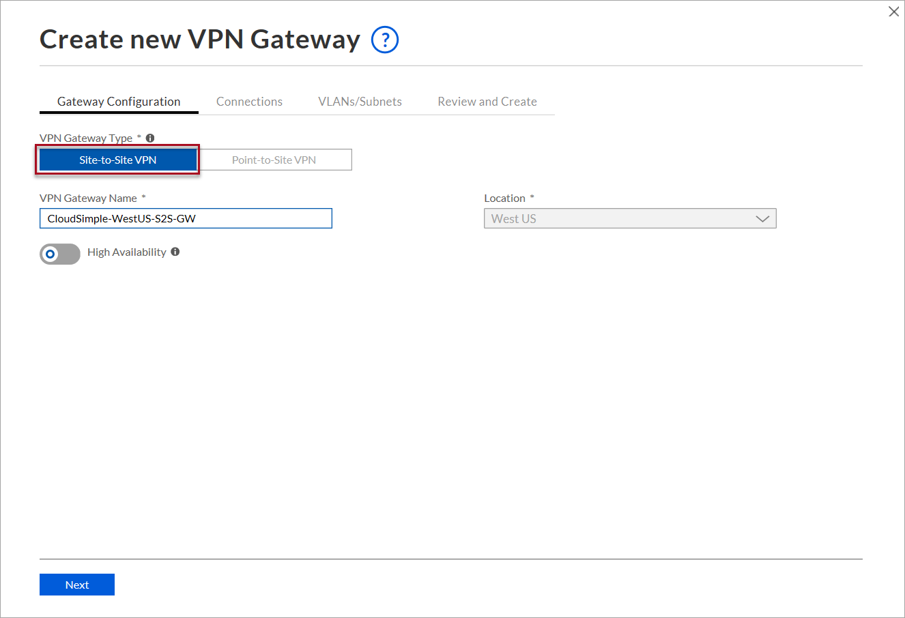
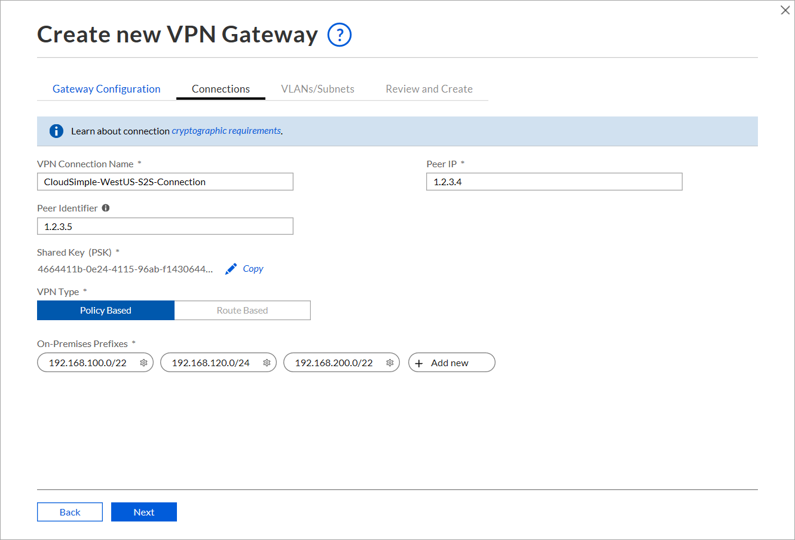
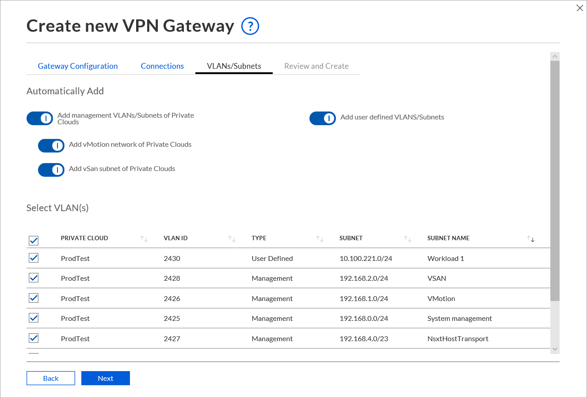
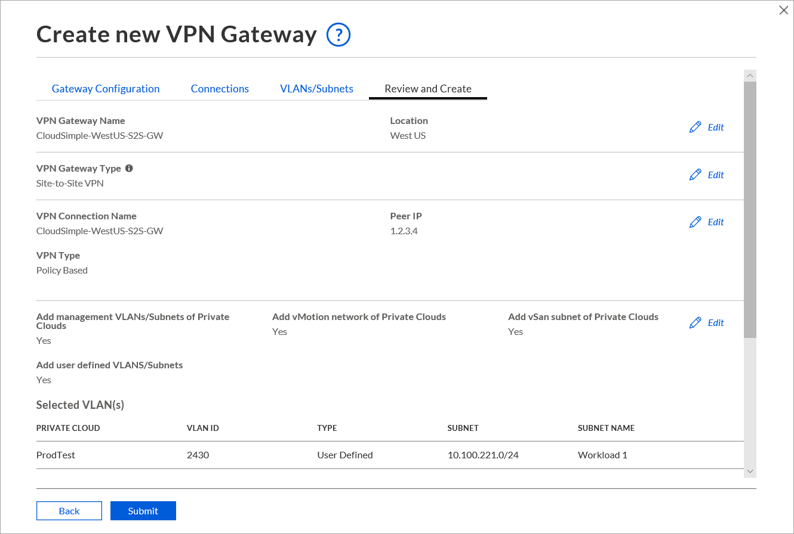

--- 
title: Azure VMware Solution by CloudSimple - Set up a VPN gateway
description: Describes how to set up Point-to-Site VPN gateway and Site-to-Site VPN gateway and create connections between your on-premises network and your CloudSimple Private Cloud
author: Ajayan1008
ms.author: v-hborys 
ms.date: 08/14/2019 
ms.topic: article 
ms.service: azure-vmware-cloudsimple 
ms.reviewer: cynthn 
manager: dikamath 
---

# Set up VPN gateways on CloudSimple network

VPN gateways allow you to connect to CloudSimple network from your on-premises network and from a client computer remotely. A VPN connection between your on-premises network and your CloudSimple network provides access to the vCenter and workloads on your Private Cloud. CloudSimple supports both Site-to-Site VPN and Point-to-Site VPN gateways.

## VPN gateway types

* **Site-to-Site VPN** connection allows you to set up your Private Cloud workloads to access on-premises services. You can also use on-premises Active Directory as an identity source for authenticating to your Private Cloud vCenter.  Currently, only **Policy-Based VPN** type is supported.
* **Point-to-Site VPN** connection is the simplest way to connect to your Private Cloud from your computer. Use Point-to-Site VPN connectivity to connect to the Private Cloud remotely. For information about installing a client for a Point-to-Site VPN connection, see [Configure a VPN connection to your Private Cloud](set-up-vpn.md).

In a region, you can create one Point-to-Site VPN gateway and one Site-to-Site VPN gateway.

## Automatic addition of VLAN/subnets

CloudSimple VPN gateways provide policies for adding VLAN/subnets to VPN gateways.  Policies allow you to specify different rules for management VLAN/subnets and user-defined VLAN/subnets.  Rules for management VLAN/subnets apply to any new Private Clouds you create.  Rules for user-defined VLANs/subnets allow you to automatically add any new VLAN/subnets to existing or new Private Clouds  For a Site-to-Site VPN gateway, you define the policy for each connection.

The policies on adding VLANs/subnets to VPN gateways apply to both Site-to-Site VPN and Point-to-Site VPN gateways.

## Automatic addition of users

A Point-to-Site VPN gateway allows you to define an automatic addition policy for new users. By default, all owners and contributors of the subscription have access to CloudSimple portal.  Users are created only when the CloudSimple portal is launched for the first time.  Selecting **Automatically add** rules enables any new user to access the CloudSimple network using Point-to-Site VPN connection.

## Set up a Site-to-Site VPN gateway

1. [Access the CloudSimple portal](access-cloudsimple-portal.md) and select **Network**.
2. Select **VPN Gateway**.
3. Click **New VPN Gateway**.

    

4. For **Gateway configuration**, specify the following settings and click **Next**.

    * Select **Site-to-Site VPN** as the gateway type.
    * Enter a name to identify the gateway.
    * Select the Azure location where your CloudSimple service is deployed.
    * Optionally, enable High Availability.

    

    > [!WARNING]
    > Enabling High Availability requires your on-premises VPN device to support connecting to two IP addresses. This option cannot be disabled once VPN gateway is deployed.

5. Create the first connection from your on-premises network and click **Next**.

    * Enter a name to identify the connection.
    * For the peer IP, enter your on-premises VPN gateway's public IP address.
    * Enter the peer identifier of your on-premises VPN gateway.  The peer identifier is usually the public IP address of your on-premises VPN gateway.  If you've configured a specific identifier on your gateway, enter the identifier.
    * Copy the shared key to use for connection from your on-premises VPN gateway.  To change the default shared key and specify a new one, click the edit icon.
    * For **On-Premises Prefixes**, enter the on-premises CIDR prefixes that will access CloudSimple network.  You can add multiple CIDR prefixes when you create the connection.

    

6. Enable the VLAN/subnets on your Private Cloud network that will be accessed from the on-premises network and click **Next**.

    * To add a management VLAN/subnet, enable **Add management VLANs/Subnets of Private Clouds**.  Management subnet is required for vMotion and vSAN subnets.
    * To add vMotion subnets, enable **Add vMotion network of Private Clouds**.
    * To add vSAN subnets, enable **Add vSAN subnet of Private Clouds**.
    * Select or de-select specific VLANs.

    

7. Review the settings and click **Submit**.

    

## Create Point-to-Site VPN gateway

1. [Access the CloudSimple portal](access-cloudsimple-portal.md) and select **Network**.
2. Select **VPN Gateway**.
3. Click **New VPN Gateway**.

    

4. For **Gateway configuration**, specify the following settings and click **Next**.

    * Select **Point-to-Site VPN** as the gateway type.
    * Enter a name to identify the gateway.
    * Select the Azure location where your CloudSimple service is deployed.
    * Specify the client subnet for the Point-to-Site gateway.  DHCP addresses will be given from the client subnet when you connect.

5. For **Connection/User**, specify the following settings and click **Next**.

    * To automatically allow all current and future users to access the Private Cloud through the Point-to-Site gateway, select **Automatically add all users**. When you select the option, all users in the user list are automatically selected. You can override the automatic option by deselecting individual users in the list.
    * To select individual users, click the check boxes in the user list.

6. The VLANs/Subnets section allows you to specify management and user VLANs/subnets for the gateway and connections.

    * The **Automatically add** options set the global policy for the gateway. The settings apply to the current gateway. The settings can be overridden in the **Select** area.
    * Select **Add management VLANs/Subnets of Private Clouds**. 
    * To add all user-defined VLANs/subnets, click  **Add user-defined VLANs/Subnets**.
    * The **Select** settings override the global settings under **Automatically add**.

7. Click **Next** to review the settings. Click the Edit icons to make any changes.
8. Click **Create** to create the VPN gateway.

### Client subnet and protocols for Point-to-Site VPN gateway

The Point-to-Site VPN gateway allows TCP and UDP connections.  Choose the protocol to use when you connect from your computer by selecting the TCP or UDP configuration.

The configured client subnet is used for both TCP and UDP clients.  The CIDR prefix is divided into two subnets, one for TCP and one for UDP clients. Choose the prefix mask based on the number of VPN users who will connect concurrently.  

The following table lists the number of concurrent client connections for prefix mask.

| Prefix Mask | /24 | /25 | /26 | /27 | /28 |
|-------------|-----|-----|-----|-----|-----|
| Number of concurrent TCP connections | 124 | 60 | 28 | 12 | 4 |
| Number of concurrent UDP connections | 124 | 60 | 28 | 12 | 4 |

To connect using Point-to-Site VPN, see [Connect to CloudSimple using Point-to-Site VPN](set-up-vpn.md#connect-to-cloudsimple-using-point-to-site-vpn).
