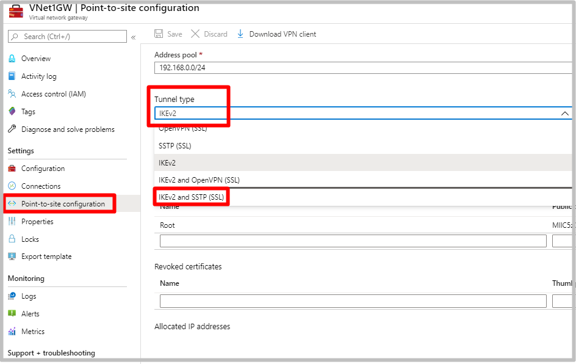
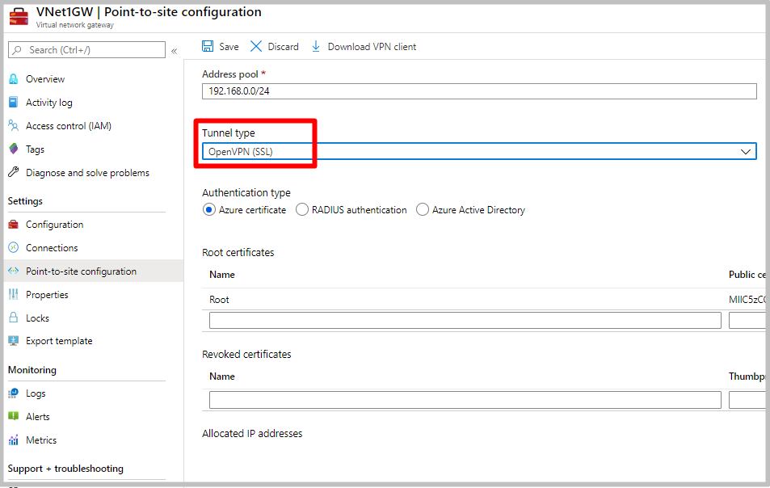

# Transition to OpenVPN protocol or IKEv2 from SSTP

A Point-to-Site (P2S) VPN gateway connection lets you create a secure connection to your virtual network from an individual client computer. A P2S connection is established by starting it from the client computer. This article applies to the Resource Manager deployment model and talks about ways to overcome the 128 concurrent connection limit of SSTP by transitioning to OpenVPN protocol or IKEv2.

## What protocol does P2S use?

Point-to-site VPN can use one of the following protocols:

* **OpenVPN&reg; Protocol**, an SSL/TLS based VPN protocol. An SSL VPN solution can penetrate firewalls, since most firewalls open TCP port 443 outbound, which SSL uses. OpenVPN can be used to connect from Android, iOS (versions 11.0 and above), Windows, Linux and Mac devices (OSX versions 10.13 and above).

* **Secure Socket Tunneling Protocol (SSTP)**, a proprietary SSL-based VPN protocol. An SSL VPN solution can penetrate firewalls, since most firewalls open TCP port 443 outbound, which SSL uses. SSTP is only supported on Windows devices. Azure supports all versions of Windows that have SSTP (Windows 7 and later). **SSTP supports up to 128 concurrent connections only regardless of the gateway SKU**.

* IKEv2 VPN, a standards-based IPsec VPN solution. IKEv2 VPN can be used to connect from Mac devices (OSX versions 10.11 and above).

>[!NOTE]
>IKEv2 and OpenVPN for P2S are available for the Resource Manager deployment model only. They are not available for the classic deployment model. Basic gateway SKU does not support IKEv2 or OpenVPN protocols. If you are using the basic SKU, you will have to delete and recreate a production SKU Virtual Network Gateway.
>

## Migrating from SSTP to IKEv2 or OpenVPN

There may be cases when you want to support more than 128 concurrent P2S connection to a VPN gateway but are using SSTP. In such a case, you need to move to IKEv2 or OpenVPN protocol.

### Option 1 - Add IKEv2 in addition to SSTP on the Gateway

This is the simplest option. SSTP and IKEv2 can coexist on the same gateway and give you a higher number of concurrent connections. You can simply enable IKEv2 on the existing gateway and redownload the client.

Adding IKEv2 to an existing SSTP VPN gateway will not affect existing clients and you can configure them to use IKEv2 in small batches or just configure the new clients to use IKEv2. If a Windows client is configured for both SSTP and IKEv2, it will try to connect using IKEV2 first and if that fails, it will fall back to SSTP.

**IKEv2 uses non-standard UDP ports so you need to ensure that these ports are not blocked on the user's firewall. The ports in use are UDP 500 and 4500.**

To add IKEv2 to an existing gateway, simply go to the "point-to-site configuration" tab under the Virtual Network Gateway in portal, and select **IKEv2 and SSTP (SSL)** from the drop-down box.

### Option 2 - Remove SSTP and enable OpenVPN on the Gateway

Since SSTP and OpenVPN are both TLS-based protocol, they cannot coexist on the same gateway. If you decide to move away from SSTP to OpenVPN, you will have to disable SSTP and enable OpenVPN on the gateway. This operation will cause the existing clients to lose connectivity to the VPN gateway until the new profile has been configured on the client.

You can enable OpenVPN along side with IKEv2 if you desire. OpenVPN is TLS-based and uses the standard TCP 443 port. To switch to OpenVPN, go to the "point-to-site configuration" tab under the Virtual Network Gateway in portal, and select **OpenVPN (SSL)** or **IKEv2 and OpenVPN (SSL)** from the drop-down box.

Once the gateway has been configured, existing clients will not be able to connect until you [deploy and configure the OpenVPN Clients](./vpn-gateway-howto-openvpn-clients.md).

If you are using Windows 10, you can also use the [Azure VPN Client for Windows](./openvpn-azure-ad-client.md#to-download-the-azure-vpn-client)

## Frequently asked questions
### What are the client configuration requirements?

>[!NOTE]
>For Windows clients, you must have administrator rights on the client device in order to initiate the VPN connection from the client device to Azure.
>

Users use the native VPN clients on Windows and Mac devices for P2S. Azure provides a VPN client configuration zip file that contains settings required by these native clients to connect to Azure.

* For Windows devices, the VPN client configuration consists of an installer package that users install on their devices.
* For Mac devices, it consists of the mobileconfig file that users install on their devices.

The zip file also provides the values of some of the important settings on the Azure side that you can use to create your own profile for these devices. Some of the values include the VPN gateway address, configured tunnel types, routes, and the root certificate for gateway validation.

>[!NOTE]
>[!INCLUDE [TLS version changes](../../includes/vpn-gateway-tls-change.md)]
>

### Which gateway SKUs support P2S VPN?

[!INCLUDE [aggregate throughput sku](../../includes/vpn-gateway-table-gwtype-aggtput-include.md)]

* For Gateway SKU recommendations, see [About VPN Gateway settings](vpn-gateway-about-vpn-gateway-settings.md#gwsku).

>[!NOTE]
>The Basic SKU does not support IKEv2 or RADIUS authentication.
>

### What IKE/IPsec policies are configured on VPN gateways for P2S?

**IKEv2**

| **Cipher** | **Integrity** | **PRF** | **DH Group** |
|--|--|--|--|
| GCM_AES256 | GCM_AES256 | SHA384 | GROUP_24 |
| GCM_AES256 | GCM_AES256 | SHA384 | GROUP_14 |
| GCM_AES256 | GCM_AES256 | SHA384 | GROUP_ECP384 |
| GCM_AES256 | GCM_AES256 | SHA384 | GROUP_ECP256 |
| GCM_AES256 | GCM_AES256 | SHA256 | GROUP_24 |
| GCM_AES256 | GCM_AES256 | SHA256 | GROUP_14 |
| GCM_AES256 | GCM_AES256 | SHA256 | GROUP_ECP384 |
| GCM_AES256 | GCM_AES256 | SHA256 | GROUP_ECP256 |
| AES256 | SHA384 | SHA384 | GROUP_24 |
| AES256 | SHA384 | SHA384 | GROUP_14 |
| AES256 | SHA384 | SHA384 | GROUP_ECP384 |
| AES256 | SHA384 | SHA384 | GROUP_ECP256 |
| AES256 | SHA256 | SHA256 | GROUP_24 |
| AES256 | SHA256 | SHA256 | GROUP_14 |
| AES256 | SHA256 | SHA256 | GROUP_ECP384 |
| AES256 | SHA256 | SHA256 | GROUP_ECP256 |
| AES256 | SHA256 | SHA256 | GROUP_2 |

**IPsec**

| **Cipher** | **Integrity** | **PFS Group** |
|--|--|--|
| GCM_AES256 | GCM_AES256 | GROUP_NONE |
| GCM_AES256 | GCM_AES256 | GROUP_24 |
| GCM_AES256 | GCM_AES256 | GROUP_14 |
| GCM_AES256 | GCM_AES256 | GROUP_ECP384 |
| GCM_AES256 | GCM_AES256 | GROUP_ECP256 |
| AES256 | SHA256 | GROUP_NONE |
| AES256 | SHA256 | GROUP_24 |
| AES256 | SHA256 | GROUP_14 |
| AES256 | SHA256 | GROUP_ECP384 |
| AES256 | SHA256 | GROUP_ECP256 |
| AES256 | SHA1 | GROUP_NONE |

### What TLS policies are configured on VPN gateways for P2S?
**TLS**

|**Policies** |
|---| 
|TLS_ECDHE_ECDSA_WITH_AES_128_GCM_SHA256 |
|TLS_ECDHE_ECDSA_WITH_AES_256_GCM_SHA384 |
|TLS_ECDHE_RSA_WITH_AES_128_GCM_SHA256 |
|TLS_ECDHE_RSA_WITH_AES_256_GCM_SHA384 |
|TLS_ECDHE_ECDSA_WITH_AES_128_CBC_SHA256 |
|TLS_ECDHE_ECDSA_WITH_AES_256_CBC_SHA384 |
|TLS_ECDHE_RSA_WITH_AES_128_CBC_SHA256 |
|TLS_ECDHE_RSA_WITH_AES_256_CBC_SHA384 |
|TLS_RSA_WITH_AES_128_GCM_SHA256 |
|TLS_RSA_WITH_AES_256_GCM_SHA384 |
|TLS_RSA_WITH_AES_128_CBC_SHA256 |
|TLS_RSA_WITH_AES_256_CBC_SHA256 |

### How do I configure a P2S connection?

A P2S configuration requires quite a few specific steps. The following articles contain the steps to walk you through P2S configuration, and links to configure the VPN client devices:

* [Configure a P2S connection - RADIUS authentication](point-to-site-how-to-radius-ps.md)

* [Configure a P2S connection - Azure native certificate authentication](vpn-gateway-howto-point-to-site-rm-ps.md)

* [Configure OpenVPN](vpn-gateway-howto-openvpn.md)

## Next steps

* [Configure a P2S connection - RADIUS authentication](point-to-site-how-to-radius-ps.md)

* [Configure a P2S connection - Azure native certificate authentication](vpn-gateway-howto-point-to-site-rm-ps.md)

**"OpenVPN" is a trademark of OpenVPN Inc.**