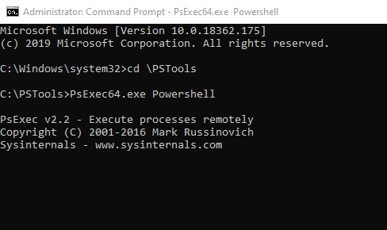
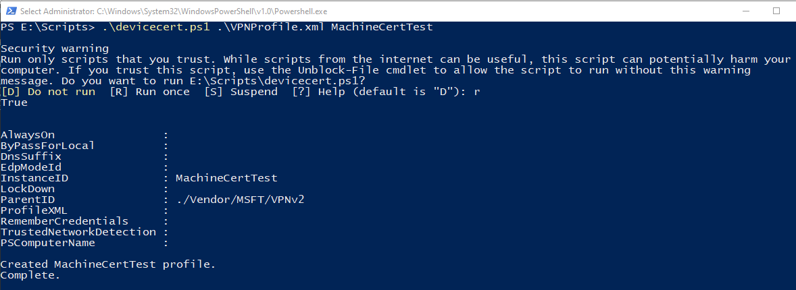
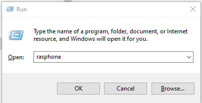
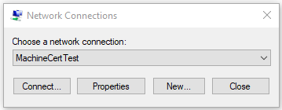

# Configure an Always On VPN device tunnel

One of the new features of the Windows 10 Virtual Private Network (VPN) client is the ability to maintain a VPN connection. Always On is a Windows 10 feature that enables the active VPN profile to connect automatically and remain connected based on triggers — namely, user sign-in, network state change, or device screen active.

Azure virtual network gateways can be used with Windows 10 Always On to establish persistent user tunnels as well as device tunnels to Azure. This article will help you configure an Always ON VPN device tunnel.

Always On VPN connections include two types of tunnels:

* **Device tunnel** connects to specified VPN servers before users sign in the device. Pre-login connectivity scenarios and device management purposes use device tunnel.

* **User tunnel** connects only after a user sign in the device. User tunnel allows users to access organization resources through VPN servers.

Both Device tunnel and User tunnel operate independently with their VPN profiles. They can be connected at the same time, and can use different authentication methods and other VPN configuration settings as appropriate.

## 1. Configure the gateway

Configure the VPN gateway to use IKEv2 and certificate-based authentication using this [point-to-site article](vpn-gateway-howto-point-to-site-resource-manager-portal.md).

## 2. Configure the device tunnel

The following requirements must be met in order to successfully establish a device tunnel:

* The device must be a domain joined computer running Windows 10 Enterprise or Education version 1709 or later.
* The tunnel is only configurable for the Windows built-in VPN solution and is established using IKEv2 with computer certificate authentication. 
* Only one device tunnel can be configured per device.

1. Install client certificates on the Windows 10 client as shown in this [point-to-site VPN client article](point-to-site-how-to-vpn-client-install-azure-cert.md). The certificate needs to be in the Local Machine store.
1. Use [these instructions](https://docs.microsoft.com/windows-server/remote/remote-access/vpn/vpn-device-tunnel-config#vpn-device-tunnel-configuration) to create a VPN Profile and configure device tunnel in the context of the LOCAL SYSTEM account.

### Configuration example for device tunnel

After you have configured the virtual network gateway and installed the client certificate in the Local Machine store on the Windows 10 client, use the following examples to configure a client device tunnel.

1. Copy the following text and save it as ***devicecert.ps1***.

   ```
   Param(
   [string]$xmlFilePath,
   [string]$ProfileName
   )

   $a = Test-Path $xmlFilePath
   echo $a

   $ProfileXML = Get-Content $xmlFilePath

   echo $XML

   $ProfileNameEscaped = $ProfileName -replace ' ', '%20'

   $Version = 201606090004

   $ProfileXML = $ProfileXML -replace '<', '&lt;'
   $ProfileXML = $ProfileXML -replace '>', '&gt;'
   $ProfileXML = $ProfileXML -replace '"', '&quot;'

   $nodeCSPURI = './Vendor/MSFT/VPNv2'
   $namespaceName = "root\cimv2\mdm\dmmap"
   $className = "MDM_VPNv2_01"

   $session = New-CimSession

   try
   {
   $newInstance = New-Object Microsoft.Management.Infrastructure.CimInstance $className, $namespaceName
   $property = [Microsoft.Management.Infrastructure.CimProperty]::Create("ParentID", "$nodeCSPURI", 'String', 'Key')
   $newInstance.CimInstanceProperties.Add($property)
   $property = [Microsoft.Management.Infrastructure.CimProperty]::Create("InstanceID", "$ProfileNameEscaped", 'String', 'Key')
   $newInstance.CimInstanceProperties.Add($property)
   $property = [Microsoft.Management.Infrastructure.CimProperty]::Create("ProfileXML", "$ProfileXML", 'String', 'Property')
   $newInstance.CimInstanceProperties.Add($property)

   $session.CreateInstance($namespaceName, $newInstance)
   $Message = "Created $ProfileName profile."
   Write-Host "$Message"
   }
   catch [Exception]
   {
   $Message = "Unable to create $ProfileName profile: $_"
   Write-Host "$Message"
   exit
   }
   $Message = "Complete."
   Write-Host "$Message"
   ```
1. Copy the following text and save it as ***VPNProfile.xml*** in the same folder as **devicecert.ps1**. Edit the following text to match your environment.

   * `<Servers>azuregateway-1234-56-78dc.cloudapp.net</Servers>`
   * `<Address>192.168.3.5</Address>`
   * `<Address>192.168.3.4</Address>`

   ```
   <VPNProfile>  
     <NativeProfile>  
   <Servers>azuregateway-1234-56-78dc.cloudapp.net</Servers>  
   <NativeProtocolType>IKEv2</NativeProtocolType>  
   <Authentication>  
     <MachineMethod>Certificate</MachineMethod>  
   </Authentication>  
   <RoutingPolicyType>SplitTunnel</RoutingPolicyType>  
    <!-- disable the addition of a class based route for the assigned IP address on the VPN interface -->
   <DisableClassBasedDefaultRoute>true</DisableClassBasedDefaultRoute>  
     </NativeProfile> 
     <!-- use host routes(/32) to prevent routing conflicts -->  
     <Route>  
   <Address>192.168.3.5</Address>  
   <PrefixSize>32</PrefixSize>  
     </Route>  
     <Route>  
   <Address>192.168.3.4</Address>  
   <PrefixSize>32</PrefixSize>  
     </Route>  
   <!-- need to specify always on = true --> 
     <AlwaysOn>true</AlwaysOn> 
   <!-- new node to specify that this is a device tunnel -->  
    <DeviceTunnel>true</DeviceTunnel>
   <!--new node to register client IP address in DNS to enable manage out -->
   <RegisterDNS>true</RegisterDNS>
   </VPNProfile>
   ```
1. Download **PsExec** from [Sysinternals](https://docs.microsoft.com/sysinternals/downloads/psexec) and extract the files to **C:\PSTools**.
1. From an Admin CMD prompt, launch PowerShell by running:

   ```
   C:\PsTools\PsExec.exe Powershell for 32-bit Windows
   C:\PsTools\PsExec64.exe Powershell for 64-bit Windows
   ```

   
1. In PowerShell, switch to the folder where **devicecert.ps1** and **VPNProfile.xml** are located, and run the following command:

   ```powershell
   C:\> .\devicecert.ps1 .\VPNProfile.xml MachineCertTest
   ```
   
   
1. Run **rasphone**.

   
1. Look for the **MachineCertTest** entry and click **Connect**.

   
1. If the connection succeeds, reboot the computer. The tunnel will connect automatically.

## Cleanup

To remove the profile, run the following command:


## Next steps

For troubleshooting, see [Azure point-to-site connection problems](vpn-gateway-troubleshoot-vpn-point-to-site-connection-problems.md)
