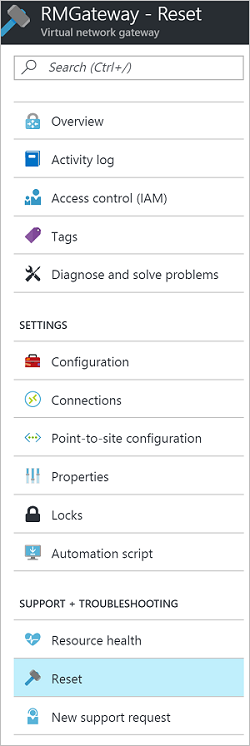

# Reset a VPN Gateway

Resetting an Azure VPN gateway is helpful if you lose cross-premises VPN connectivity on one or more Site-to-Site VPN tunnels. In this situation, your on-premises VPN devices are all working correctly, but are not able to establish IPsec tunnels with the Azure VPN gateways. This article helps you reset your VPN gateway.

### What happens during a reset?

A VPN gateway is composed of two VM instances running in an active-standby configuration. When you reset the gateway, it reboots the gateway, and then reapplies the cross-premises configurations to it. The gateway keeps the public IP address it already has. This means you won’t need to update the VPN router configuration with a new public IP address for Azure VPN gateway.

When you issue the command to reset the gateway, the current active instance of the Azure VPN gateway is rebooted immediately. There will be a brief gap during the failover from the active instance (being rebooted), to the standby instance. The gap should be less than one minute.

If the connection is not restored after the first reboot, issue the same command again to reboot the second VM instance (the new active gateway). If the two reboots are requested back to back, there will be a slightly longer period where both VM instances (active and standby) are being rebooted. This will cause a longer gap on the VPN connectivity, up to 30 to 45 minutes for VMs to complete the reboots.

After two reboots, if you are still experiencing cross-premises connectivity problems, please open a support request from the Azure portal.

## <a name="before"></a>Before you begin

Before you reset your gateway, verify the key items listed below for each IPsec Site-to-Site (S2S) VPN tunnel. Any mismatch in the items will result in the disconnect of S2S VPN tunnels. Verifying and correcting the configurations for your on-premises and Azure VPN gateways saves you from unnecessary reboots and disruptions for the other working connections on the gateways.

Verify the following items before resetting your gateway:

* The Internet IP addresses (VIPs) for both the Azure VPN gateway and the on-premises VPN gateway are configured correctly in both the Azure and the on-premises VPN policies.
* The pre-shared key must be the same on both Azure and on-premises VPN gateways.
* If you apply specific IPsec/IKE configuration, such as encryption, hashing algorithms, and PFS (Perfect Forward Secrecy), ensure both the Azure and on-premises VPN gateways have the same configurations.

## <a name="portal"></a>Azure portal

You can reset a Resource Manager VPN gateway using the Azure portal. If you want to reset a classic gateway, see the [PowerShell](#resetclassic) steps.

### Resource Manager deployment model

1. Open the [Azure portal](https://portal.azure.com) and navigate to the Resource Manager virtual network gateway that you want to reset.
2. On the blade for the virtual network gateway, click 'Reset'.

   
3. On the Reset blade, click the **Reset** button.

## <a name="ps"></a>PowerShell

### Resource Manager deployment model

[!INCLUDE [updated-for-az](../../includes/updated-for-az.md)]

The cmdlet for resetting a gateway is **Reset-AzVirtualNetworkGateway**. Before performing a reset, make sure you have the latest version of the [PowerShell Az cmdlets](https://docs.microsoft.com/powershell/module/az.network). The following example resets a virtual network gateway named VNet1GW in the TestRG1 resource group:

```powershell
$gw = Get-AzVirtualNetworkGateway -Name VNet1GW -ResourceGroupName TestRG1
Reset-AzVirtualNetworkGateway -VirtualNetworkGateway $gw
```

Result:

When you receive a return result, you can assume the gateway reset was successful. However, there is nothing in the return result that indicates explicitly that the reset was successful. If you want to look closely at the history to see exactly when the gateway reset occurred, you can view that information in the [Azure portal](https://portal.azure.com). In the portal, navigate to **'GatewayName' -> Resource Health**.

### <a name="resetclassic"></a>Classic deployment model

The cmdlet for resetting a gateway is **Reset-AzureVNetGateway**. The Azure PowerShell cmdlets for Service Management must be installed locally on your desktop. You can't use Azure Cloud Shell. Before performing a reset, make sure you have the latest version of the [Service Management (SM) PowerShell cmdlets](https://docs.microsoft.com/powershell/azure/servicemanagement/install-azure-ps?view=azuresmps-4.0.0#azure-service-management-cmdlets). When using this command, make sure you are using the full name of the virtual network. Classic VNets that were created using the portal have a long name that is required for PowerShell. You can view the long name by using 'Get-AzureVNetConfig -ExportToFile C:\Myfoldername\NetworkConfig.xml'.

The following example resets the gateway for a virtual network named "Group TestRG1 TestVNet1" (which shows as simply "TestVNet1" in the portal):

```powershell
Reset-AzureVNetGateway –VnetName 'Group TestRG1 TestVNet1'
```

Result:

```powershell
Error          :
HttpStatusCode : OK
Id             : f1600632-c819-4b2f-ac0e-f4126bec1ff8
Status         : Successful
RequestId      : 9ca273de2c4d01e986480ce1ffa4d6d9
StatusCode     : OK
```

## <a name="cli"></a>Azure CLI

To reset the gateway, use the [az network vnet-gateway reset](https://docs.microsoft.com/cli/azure/network/vnet-gateway) command. The following example resets a virtual network gateway named VNet5GW in the TestRG5 resource group:

```azurecli
az network vnet-gateway reset -n VNet5GW -g TestRG5
```

Result:

When you receive a return result, you can assume the gateway reset was successful. However, there is nothing in the return result that indicates explicitly that the reset was successful. If you want to look closely at the history to see exactly when the gateway reset occurred, you can view that information in the [Azure portal](https://portal.azure.com). In the portal, navigate to **'GatewayName' -> Resource Health**.
