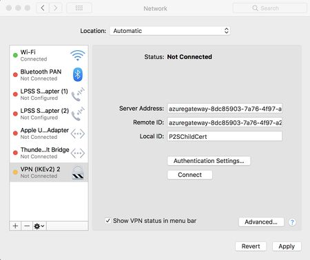
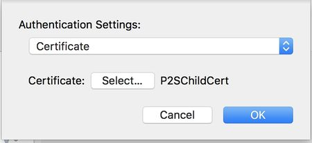
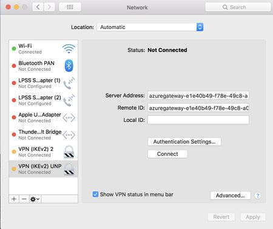
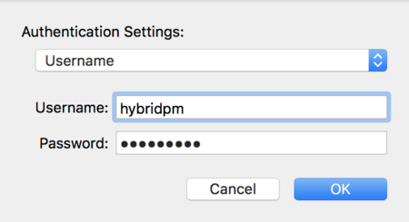
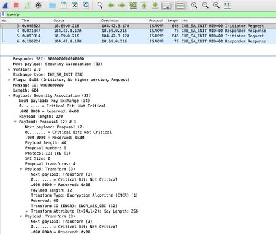

# Troubleshoot Point-to-Site VPN connections from Mac OS X VPN clients

This article helps you troubleshoot Point-to-Site connectivity issues from Mac OS X using the native VPN client and IKEv2. The VPN client in Mac for IKEv2 is very basic and does not allow for much customization. There are only four settings that need to be checked:

* Server Address
* Remote ID
* Local ID
* Authentication Settings
* OS Version (10.11 or higher)

##  Troubleshoot certificate-based authentication
1. Check the VPN client settings. Go to the **Network Setting** by pressing Command + Shift, and then type "VPN" to check the VPN client settings. From the list, click the VPN entry that needs to be investigated.

   
2. Verify that the **Server Address** is the complete FQDN and includes the cloudapp.net.
3. The **Remote ID** should be the same as the Server Address (Gateway FQDN).
4. The **Local ID** should be the same as the **Subject** of the client certificate.
5. Click on **Authentication Settings** to open the Authentication Settings page.

   
6. Verify that **Certificate** is selected from the dropdown.
7. Click the **Select** button and verify that the correct certificate is selected. Click **OK** to save any changes.

## Troubleshoot username and password authentication

1. Check the VPN client settings. Go to the **Network Setting** by pressing Command + Shift, and then type "VPN" to check the VPN client settings. From the list, click the VPN entry that needs to be investigated.

   
2. Verify that the **Server Address** is the complete FQDN and includes the cloudapp.net.
3. The **Remote ID** should be the same as the Server Address (Gateway FQDN).
4. The **Local ID** can be blank.
5. Click the **Authentication Setting** button and verify that "Username" is selected from the dropdown.

   
6. Verify that the correct credentials are entered.

## Additional steps

If you try the previous steps and everything is configured properly, download [Wireshark](https://www.wireshark.org/#download) and perform a packet capture.

1. Filter on *isakmp* and look at the **IKE_SA** packets. You should be able to look at the SA proposal details under the **Payload: Security Association**. 
2. Verify that the client and the server have a common set.

    
  
3. If there is no server response on the network traces, verify you enabled IKEv2 protocol on the Azure Gateway Configuration page on the Azure Portal website.

## Next steps
For additional help, see [Microsoft Support](https://portal.azure.com/?#blade/Microsoft_Azure_Support/HelpAndSupportBlade).
