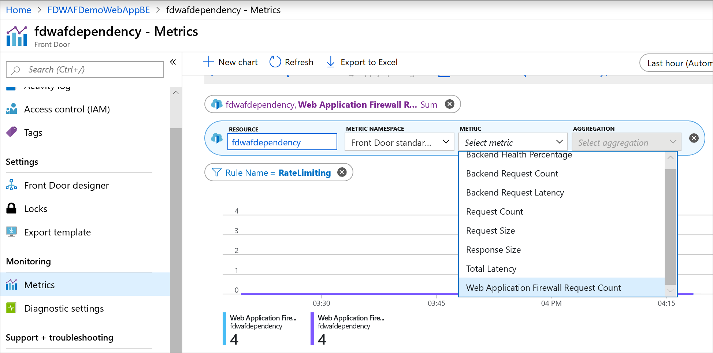

# Azure Web Application Firewall monitoring and logging 

Azure Web Application Firewall (WAF) monitoring and logging are provided through logging and integration with Azure Monitor and Azure Monitor logs.

## Azure Monitor

WAF with FrontDoor log is integrated with [Azure Monitor](../../azure-monitor/overview.md). Azure Monitor allows you to track diagnostic information including WAF alerts and logs. You can configure WAF monitoring within the Front Door resource in the portal under the **Diagnostics** tab or through the Azure Monitor service directly.

From Azure portal, go to Front Door resource type. From **Monitoring**/**Metrics** tab on the left, you can add **WebApplicationFirewallRequestCount** to track number of requests that match WAF rules. Custom filters can be created based on action types and rule names.



## Logs and diagnostics

WAF with Front Door provides detailed reporting on each threat it detects. Logging is integrated with Azure Diagnostics logs and alerts are recorded in a json format. These logs can be integrated with [Azure Monitor logs](../../azure-monitor/insights/azure-networking-analytics.md).


FrontdoorAccessLog logs all requests that are forwarded to customer back-ends. FrontdoorWebApplicationFirewallLog logs any request that matches a WAF rule.

The following example query obtains WAF logs on blocked requests:

``` WAFlogQuery
AzureDiagnostics
| where ResourceType == "FRONTDOORS" and Category == "FrontdoorWebApplicationFirewallLog"
| where action_s == "Block"

```

Here is an example of a logged request in WAF log:

``` WAFlogQuerySample
{
    "PreciseTimeStamp": "2020-01-25T00:11:19.3866091Z",
    "time": "2020-01-25T00:11:19.3866091Z",
    "category": "FrontdoorWebApplicationFirewallLog",
    "operationName": "Microsoft.Network/FrontDoor/WebApplicationFirewallLog/Write",
    "properties": {
        "clientIP": "xx.xx.xxx.xxx",
        "socketIP": "xx.xx.xxx.xxx",
        "requestUri": "https://wafdemofrontdoorwebapp.azurefd.net:443/?q=../../x",
        "ruleName": "Microsoft_DefaultRuleSet-1.1-LFI-930100",
        "policy": "WafDemoCustomPolicy",
        "action": "Block",
        "host": "wafdemofrontdoorwebapp.azurefd.net",
        "refString": "0p4crXgAAAABgMq5aIpu0T6AUfCYOroltV1NURURHRTA2MTMANjMxNTAwZDAtOTRiNS00YzIwLTljY2YtNjFhNzMyOWQyYTgy",
        "policyMode": "prevention"
    }
}

``` 

The following example query obtains AccessLogs entries:

``` AccessLogQuery
AzureDiagnostics
| where ResourceType == "FRONTDOORS" and Category == "FrontdoorAccessLog"

```

Here is an example of a logged request in Access log:

``` AccessLogSample
{
    "PreciseTimeStamp": "2020-01-25T00:11:12.0160150Z",
    "time": "2020-01-25T00:11:12.0160150Z",
    "category": "FrontdoorAccessLog",
    "operationName": "Microsoft.Network/FrontDoor/AccessLog/Write",
    "properties": {
        "trackingReference": "0n4crXgAAAACnRKbdALbyToAqNfSHssDvV1NURURHRTA2MTMANjMxNTAwZDAtOTRiNS00YzIwLTljY2YtNjFhNzMyOWQyYTgy",
        "httpMethod": "GET",
        "httpVersion": "2.0",
        "requestUri": "https://wafdemofrontdoorwebapp.azurefd.net:443/",
        "requestBytes": "710",
        "responseBytes": "3116",
        "userAgent": "Mozilla/5.0 (Windows NT 10.0; Win64; x64) AppleWebKit/537.36 (KHTML, like Gecko) Chrome/81.0.4017.0 Safari/537.36 Edg/81.0.389.2",
        "clientIp": "xx.xx.xxx.xxx",
        "timeTaken": "0.598",
        "securityProtocol": "TLS 1.2",
        "routingRuleName": "WAFdemoWebAppRouting",
        "backendHostname": "wafdemouksouth.azurewebsites.net:443",
        "sentToOriginShield": false,
        "httpStatusCode": "200",
        "httpStatusDetails": "200"
    }
}

```

## Next steps

- Learn more about [Front Door](../../frontdoor/front-door-overview.md).
