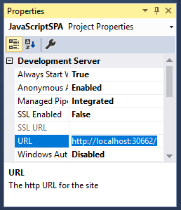

## Register your application

1. Sign in to the [Azure portal](https://portal.azure.com/).

1. If your account gives you access to more than one tenant, select the account at the top right, and then set your portal session to the Azure AD tenant that you want to use.
1. Go to the Microsoft identity platform for developers [App registrations](https://go.microsoft.com/fwlink/?linkid=2083908) page.
1. When the **Register an application** page appears, enter a name for your application.
1. Under **Supported account types**, select **Accounts in any organizational directory and personal Microsoft accounts**.
1. Under the **Redirect URI** section, in the drop-down list, select the **Web** platform, and then set the value to the application URL that's based on your web server. 

   For information about setting and obtaining the redirect URL in Visual Studio and Node.js, see the next two sections.

1. Select **Register**.
1. On the app **Overview** page, note the **Application (client) ID** value for later use.
1. This quickstart requires the [Implicit grant flow](../articles/active-directory/develop/v2-oauth2-implicit-grant-flow.md) to be enabled. In the left pane of the registered application, select **Authentication**.
1. In **Advanced settings**, under **Implicit grant**, select the **ID tokens** and **Access tokens** check boxes. ID tokens and access tokens are required, because this app needs to sign in users and call an API.
1. Select **Save**.

> #### Set a redirect URL for Node.js
> For Node.js, you can set the web server port in the *server.js* file. This tutorial uses port 30662 for reference, but you can use any other available port. 
>
> To set up a redirect URL in the application registration information, switch back to the **Application Registration** pane, and do either of the following:
>
> - Set *`http://localhost:30662/`* as the **Redirect URL**.
> - If you're using a custom TCP port, use *`http://localhost:<port>/`* (where *\<port>* is the custom TCP port number).
>
> #### Set a redirect URL for Visual Studio
> To obtain the redirect URL for Visual Studio, do the following:
> 1. In **Solution Explorer**, select the project.
>
>    The **Properties** window opens. If it doesn't open, press **F4**.
>
>    
>
> 1. Copy the **URL** value.
 
> 1. Switch back to the **Application Registration** pane, and paste the copied value as the **Redirect URL**.

#### Configure your JavaScript SPA

1. In the *index.html* file that you created during project setup, add the application registration information. At the top of the file, within the `<script></script>` tags, add the following code:

    ```javascript
    var msalConfig = {
        auth: {
            clientId: "<Enter_the_Application_Id_here>",
            authority: "https://login.microsoftonline.com/<Enter_the_Tenant_info_here>"
        },
        cache: {
            cacheLocation: "localStorage",
            storeAuthStateInCookie: true
        }
    };
    ```

    Where:
    - *\<Enter_the_Application_Id_here>* is the **Application (client) ID** for the application you registered.
    - *\<Enter_the_Tenant_info_here>* is set to one of the following options:
       - If your application supports *Accounts in this organizational directory*, replace this value with the **Tenant ID** or **Tenant name** (for example, *contoso.microsoft.com*).
       - If your application supports *Accounts in any organizational directory*, replace this value with **organizations**.
       - If your application supports *Accounts in any organizational directory and personal Microsoft accounts*, replace this value with **common**. To restrict support to *Personal Microsoft accounts only*, replace this value with **consumers**.
