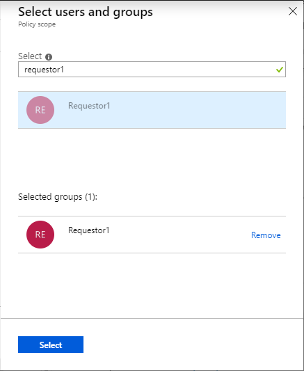
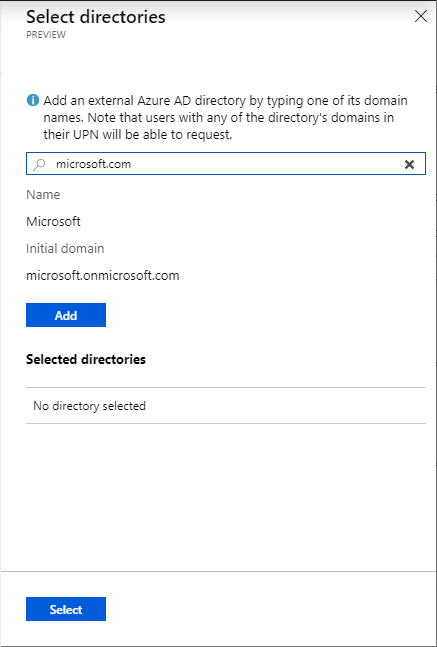
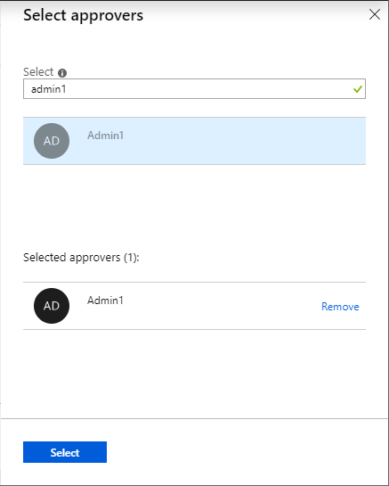
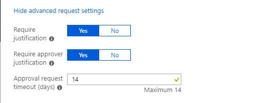
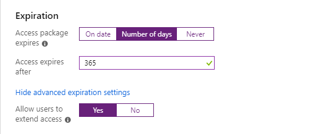

### Policy: For users in your directory

Follow these steps if you want your policy to be for users in your directory that can request this access package.  The **users in your directory** refers to both internal users as well as external users that have been previously invited to the directory, either through them requesting entitlement management with another access package or being invited with Azure AD B2B. When defining the policy, you can specify individual users, or more commonly groups of users. For example, your organization may already have a group such as **All employees**.  If that group is added in the policy for users who can request access, then any member of that group can then request access.

1. In the **Users who can request access** section, select **For users in your directory**.

    Note that the **For users in your directory** setting includes both member users and guest users that have been added to your directory. If you want to only include member users and not guest users, select **For users in your directory** and then select a group of your member users. If necessary, you can create a dynamic group of your member users (user.userType -eq "Member"). For more information, see [Dynamic membership rules for groups in Azure Active Directory](../articles/active-directory/users-groups-roles/groups-dynamic-membership.md).

1. In the **Select users and groups** section, click **Add users and groups**.

1. In the Select users and groups pane, select the users and groups you want to add.

    

1. Click **Select** to add the users and groups.

1. Skip down to the [Policy: Request](#policy-request) section.

### Policy: For users not in your directory

Follow these steps if you want your policy to be for users not in your directory that can request this access package. The **users not in your directory** refers to users who are in another Azure AD directory, and may not have yet been invited into your directory. Currently, you can only add users from organizations that have Azure AD. Directories must be configured to be allowed in the **Organizational relationships collaboration restrictions** settings.

> [!NOTE]
> A guest external user account will be created for a user not yet in your directory whose request is approved or auto-approved. The guest will be invited, but will not receive an invite email. Instead, they will receive an email when their access package assignment is delivered. By default, later when that guest user no longer has any access package assignments, because their last assignment has expired or been cancelled, that guest user account will be blocked from sign in and subsequently deleted. If you want to have guest users remain in your directory indefinitely, even if they have no access package assignments, you can change the settings for your entitlement management configuration.

1. In the **Users who can request access** section, select **For users not in your directory**.

1. In the **Select external Azure AD directory** section, click **Add directories**.

1. Enter a domain name and search for an Azure AD directory with that domain name.

1. Verify it is the correct directory by the provided directory name and initial domain.

    > [!NOTE]
    > All users from the directory will be able to request this access package. This includes users from all subdomains associated with the directory, not just the domain used in the search.

    

1. Click **Add** to add the directory.

1. Repeat this step to add any more directories.

1. Once you have added all directories you'd like to include in the policy, click **Select**.

1. Skip down to the [Policy: Request](#policy-request) section.

### Policy: None (administrator direct assignments only)

Follow these steps if you want your policy to bypass access requests and allow administrators to directly assign specific users to the access package. Users won't have to request the access package. You can still set expiration settings, but there are no request settings.

1. In the **Users who can request access** section, select **None (administrator direct assignments only**.

    After you create the access package, you can directly assign specific internal and external users to the access package. If you specify an external user, a guest user account will be created in your directory.

1. Skip down to the [Policy: Expiration](#policy-expiration) section.

### Policy: Request

In the Request section, you specify approval settings when users request the access package.

1. To require approval for requests from the selected users, set the **Require approval** toggle to **Yes**. To have requests automatically approved, set the toggle to **No**.

1. If you require approval, in the **Select approvers** section, click **Add approvers**.

1. In the Select approvers pane, select one or more users and/or groups to be approvers.

    Only one of the selected approvers needs to approve a request. Approval from all approvers is not required. The approval decision is based on whichever approver reviews the request first.

    

1. Click **Select** to add the approvers.

1. Click **Show advanced request settings** to show additional settings.

    

1. To require users to provide a justification to request the access package, set **Require justification** to **Yes**.

1. To require the approver to provide a justification to approve a request for the access package, set **Require approver justification** to **Yes**.

1. In the **Approval request timeout (days)** box, specify the amount of time the approvers have to review a request. If no  approvers review it in this number of days, the request expires and the user will have to submit another request for the access package.

### Policy: Expiration

In the Expiration section, you specify when a user's assignment to the access package expires.

1. In the **Expiration** section, set **Access package expires** to **On date**, **Number of days**, or **Never**.

    For **On date**, select an expiration date in the future.

    For **Number of days**, specify a number between 0 and 3660 days.

    Based on your selection, a user's assignment to the access package expires on a certain date, a certain number of days after they are approved, or never.

1. Click **Show advanced expiration settings** to show additional settings.

1. To allow user to extend their assignments, set **Allow users to extend access** to **Yes**.

    If extensions are allowed in the policy, the user will receive an email 14 days and also 1 day before their access package assignment is set to expire prompting them to extend the assignment.

    

### Policy: Enable policy

1. If you want the access package to be made immediately available to the users in the policy, click **Yes** to enable the policy.

    You can always enable it in the future after you have finished creating the access package.

    

1. Click **Next** or **Create**.
