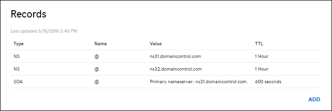

> [!NOTE]
> You can use Azure DNS to configure a custom DNS name for Azure App Service. For more information, see [Use Azure DNS to provide custom domain settings for an Azure service](../articles/dns/dns-custom-domain.md#app-service-web-apps).
>
>

1. Sign in to the website of your domain provider.

1. Find the page for managing DNS records. Every domain provider has its own DNS records interface, so consult the provider's documentation. Look for areas of the site labeled **Domain Name**, **DNS**, or **Name Server Management**.

   Often, you can find the DNS records page by viewing your account information and then looking for a link such as **My domains**. Go to that page, and then look for a link that's named something like **Zone file**, **DNS Records**, or **Advanced configuration**.

   The following screenshot is an example of a DNS records page:

   

1. In the example screenshot, select **Add** to create a record. Some providers have different links to add different record types. Again, consult the provider's documentation.

> [!NOTE]
> For certain providers, such as GoDaddy, changes to DNS records don't become effective until you select a separate **Save Changes** link.
