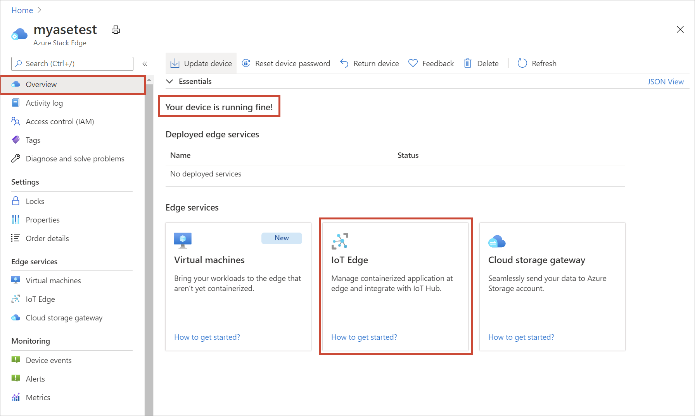
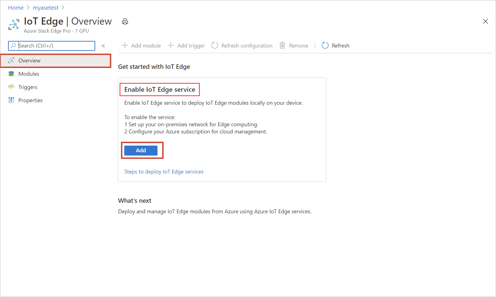
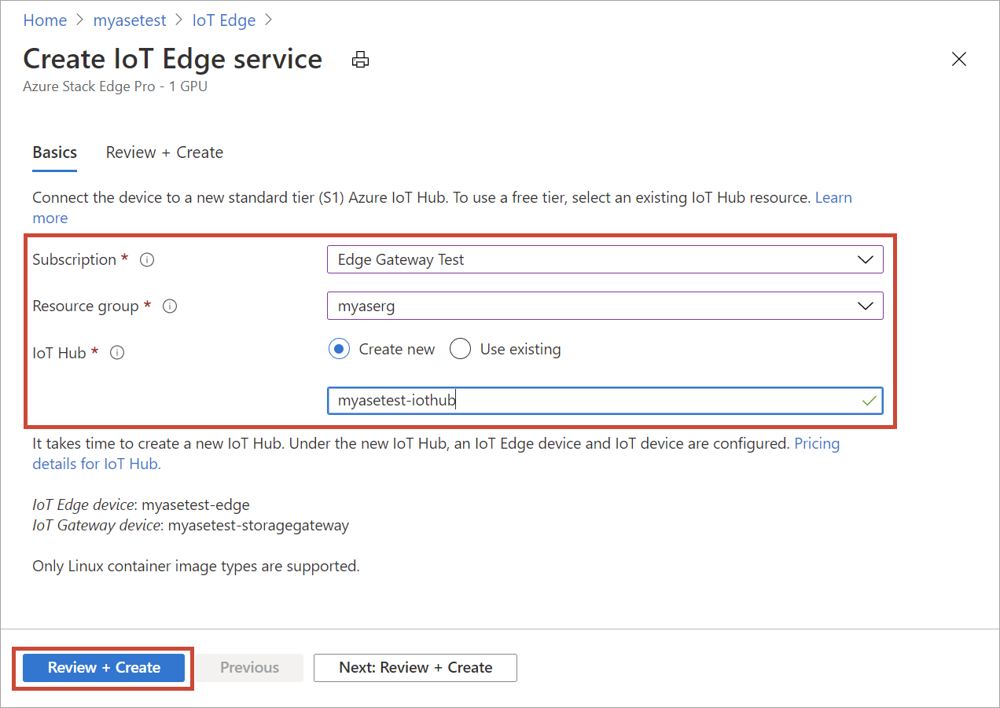
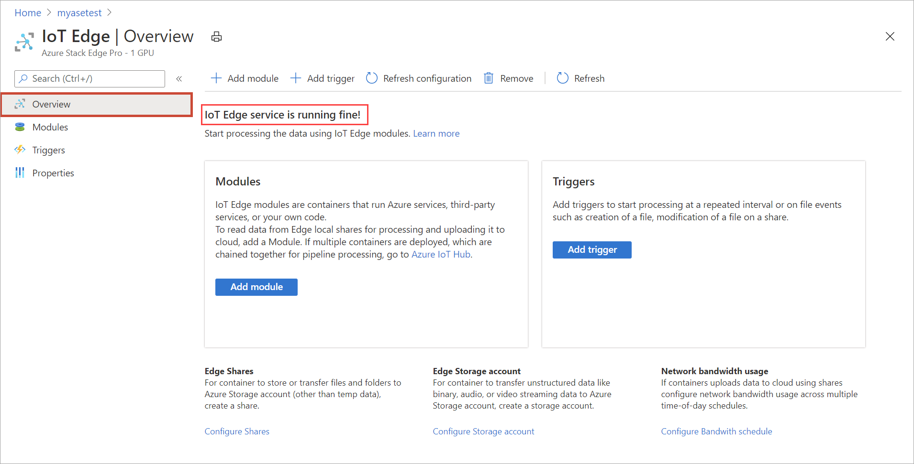
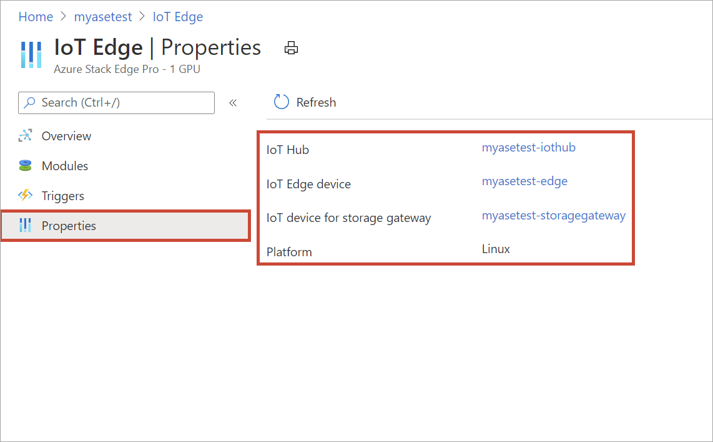

To configure compute on your Azure Stack Edge Pro, you'll create an IoT Hub resource via the Azure portal.

1. In the Azure portal of your Azure Stack Edge resource, go to **Overview**, and select **IoT Edge**.

   

2. In **Enable IoT Edge service**, select **Add**.

   

3. On the **Configure Edge compute** blade, input the following information:
   
    |Field  |Value  |
    |---------|---------|
    |Subscription     |Select a subscription for your IoT Hub resource. You can use the same subscription as that used by the Azure Stack Edge resource.         |
    |Resource group     |Select a resource group for your IoT Hub resource. You can use the same resource group as that used by the Azure Stack Edge resource.         |
    |IoT Hub     | Choose from **New** or **Existing**.   By default, a Standard tier (S1) is used to create an IoT resource. To use a free tier IoT resource, create one and then select the existing resource.   In each case, the IoT Hub resource uses the same subscription and resource group that is used by the Azure Stack Edge resource.     |
    |Name     |Accept the default name or enter a name for your IoT Hub resource.         |

   

4. When you finish the settings, select **Review + Create**. Review the settings for your IoT Hub resource, and select **Create**.

   Resource creation for an IoT Hub resource takes several minutes. After the resource is created, the **Overview** indicates the IoT Edge service is now running.

   

5. To confirm the Edge compute role has been configured, go to **IoT Edge > Properties**.

   

   When the Edge compute role is set up on the Edge device, it creates two devices: an IoT device and an IoT Edge device. Both devices can be viewed in the IoT Hub resource. An IoT Edge Runtime is also running on this IoT Edge device. At this point, only the Linux platform is available for your IoT Edge device.

It can take 20-30 minutes to configure compute because, behind the scenes, virtual machines and a Kubernetes cluster are being created.

After you have successfully configured compute in the Azure portal, a Kubernetes cluster and a default user associated with the IoT namespace (a system namespace controlled by Azure Stack Edge Pro) exist.
