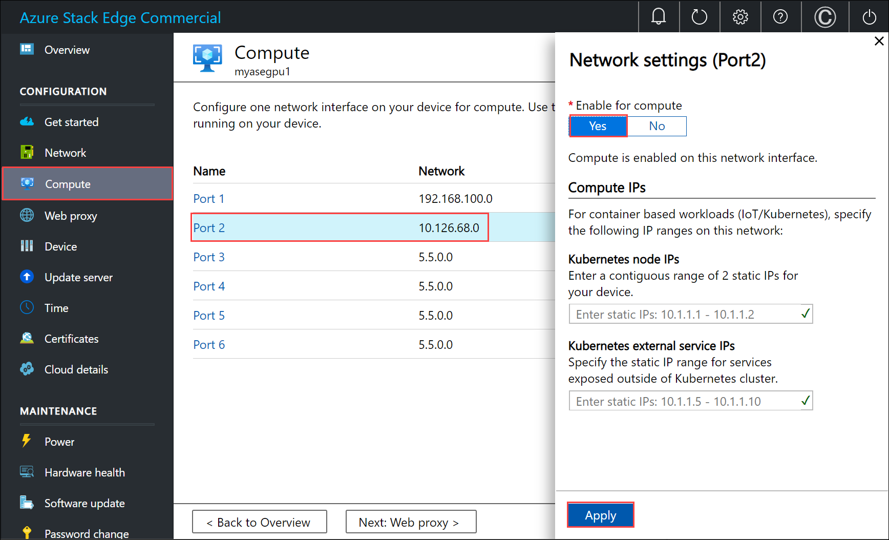

Before you can deploy VMs on your Azure Stack Edge device, you must configure your client to connect to the device via Azure Resource Manager over Azure PowerShell. For detailed steps, go to [Connect to Azure Resource Manager on your Azure Stack Edge device](../articles/databox-online/azure-stack-edge-j-series-connect-resource-manager.md).


Make sure that the following steps can be used to access the device from your client (You have done this configuration when connecting to Azure Resource Manager, you are just verifying that the configuration was successful.): 

1. Verify that Azure Resource Manager communication is working. Type:     

    ```powershell
    Add-AzureRmEnvironment -Name <Environment Name> -ARMEndpoint "https://management.<appliance name>.<DNSDomain>"
    ```

1. Call local device APIs to authenticate. Type: 

    `login-AzureRMAccount -EnvironmentName <Environment Name>`

    Provide the username - *EdgeARMuser* and the password to connect via Azure Resource Manager.

1. If you configured **Compute** for Kubernetes, you can skip this step. Proceed to ensure that you've enabled a network interface for compute. In local UI, go to **Compute** settings. Select the network interface that you will use to create a virtual switch. The VMs you create will be attached to a virtual switch attached to this port and the associated network. Be sure to choose a network that matches the IP address you will use for the VM.  

    

    Enable compute on the network interface. Azure Stack Edge will create and manage a virtual switch corresponding to that network interface. Do not enter specific IPs for Kubernetes at this time. It can take several minutes to enable compute.

    > [!NOTE]
    > If creating GPU VMs, select a network interface connected to the Internet. This allows you to install GPU extension on your device.


