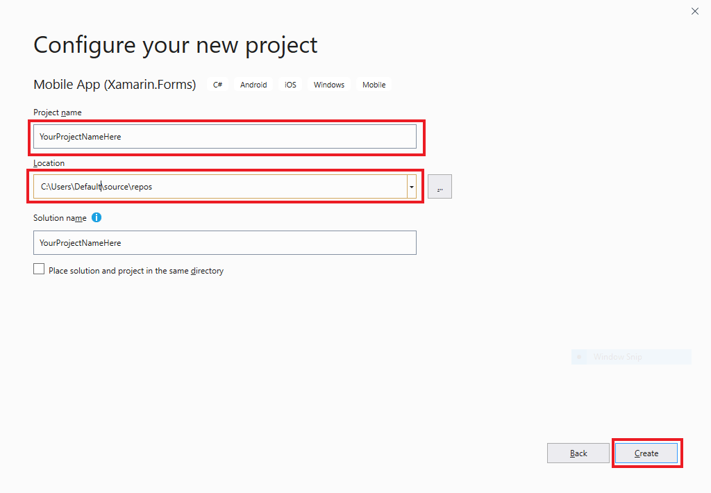
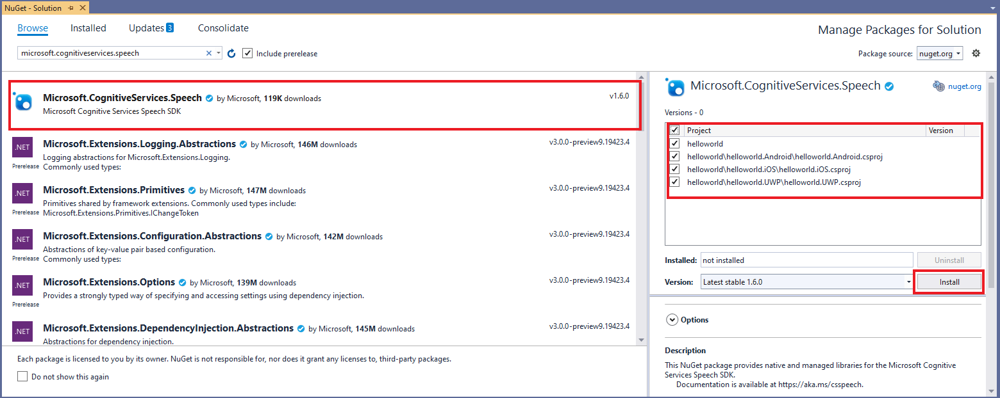

To create a Visual Studio project for cross-platform Mobile App .NET development with Xamarin, you need to set up Visual Studio development options, create the project, select the target architecture, and install the Speech SDK.

### Set up Visual Studio development options

To start, make sure you're set up correctly in Visual Studio for cross-platform Mobile Development with .NET:

1. Open Visual Studio 2019.

1. From the Visual Studio menu bar, select **Tools** > **Get Tools and Features** to open Visual Studio Installer and view the **Modifying** dialog box.

   

1. In the **Workloads** tab, under **Windows**, find the **Mobile Development with .NET** workload. If the check box next to that workload is already selected, close the **Modifying** dialog box, and go to step 5.

1. Select the **Mobile Development with .NET** check box, select **Modify**, and then in the **Before we get started** dialog box, select **Continue** to install the Mobile Development with .NET workload. Installation of the new feature may take a while.

1. Close Visual Studio Installer.

### Create the project

1. In the Visual Studio menu bar, choose **File** > **New** > **Project** to display the **Create a new project** window.

   

1. Find and select **Mobile app (Xamarin Forms)**.

1. Select **Next** to display the **Configure your new project** screen. 

   

1. In **Project name**, enter `helloworld`.

1. In **Location**, navigate to and select or create the folder to save your project in.

1. Select **Create** to go to the **New Mobile App Xamarin Forms Project** window.

   

1. Select **Blank** template

1. In **Platform**, check boxes for **Android**, **iOS** and **Windows (UWP)**.

1. Select **OK**. You're returned to the Visual Studio IDE, with the new project created and visible in the **Solution Explorer** pane.

   

Now select your target platform architecture and start-up project. In the Visual Studio toolbar, find the **Solution Platforms** drop-down box. (If you don't see it, choose **View** > **Toolbars** > **Standard** to display the toolbar containing **Solution Platforms**.) If you're running 64-bit Windows, choose **x64** in the drop-down box. 64-bit Windows can also run 32-bit applications, so you can choose **x86** if you prefer. For **Start-up Projects** drop-down box set helloworld.UWP (Universal Windows).

### Install the Speech SDK

Install the [Speech SDK NuGet package](https://aka.ms/csspeech/nuget), and reference the Speech SDK in your project:

1. In **Solution Explorer**, right-click your solution, and choose **Manage NuGet Packages for Solution** to go to the **NuGet - Solution** window.

1. Select **Browse**.

   

1. In **Package source**, choose **nuget.org**.

1. In the **Search** box, enter `Microsoft.CognitiveServices.Speech`, and then choose that package after it appears in the search results.

   
   > Note: iOS library inside Microsoft.CognitiveServices.Speech nuget do not have bitcode enabled. In case you need bitcode enabled library for your application, please use Microsoft.CognitiveServices.Speech.Xamarin.iOS nuget for the iOS project specifically.

1. In the package status pane next to the search results, select all projects. **helloworld**, **helloworld.Android**, **helloworld.iOS** and **helloworld.UWP**.

1. Select **Install**.

1. In the **Preview Changes** dialog box, select **OK**.

1. In the **License Acceptance** dialog box, view the license, and then select **I Accept** and install speech SDK package reference to all projects. After installation is completed successfully, you may see following warning for helloworld.iOS. This is known issue and should not impact to your app functionality.

> Could not resolve reference "C:\Users\Default\.nuget\packages\microsoft.cognitiveservices.speech\1.7.0\build\Xamarin.iOS\libMicrosoft.CognitiveServices.Speech.core.a". If this reference is required by your code, you may get compilation errors.
