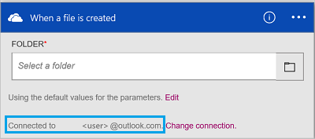

## Prerequisites

* A [OneDrive](https://www.microsoft.com/store/apps/onedrive/9wzdncrfj1p3) account 

Before you can use your OneDrive account with Logic Apps, you must authorize Logic Apps to connect to your OneDrive account in the Azure portal.

Follow these steps to authorize Logic Apps to connect to your OneDrive account:  

1. Sign in to the Azure portal. 

1. Under **Azure services**, select **Logic Apps**. Then, select the name of your logic app from the list.

1. On your logic app's menu, select **Logic app designer** under **Development Tools**.

1. In the Logic Apps Designer, select **Show Microsoft managed APIs** in the drop-down list, then enter *OneDrive* in the search box. Select the trigger or action to use:

   

2. If you haven't previously created any connections to OneDrive, follow the prompt to sign in using your OneDrive credentials:  

   

3. Select **Sign in**, and enter your user name and password. Select **Sign in**: 

      

    These credentials are used to authorize your logic app to access the data in your OneDrive account. 

4. Select **Yes** to authorize the logic app to use your OneDrive account:  

      
   
5. The connection is now listed in the step. Select save, then continue creating your logic app. 

   
