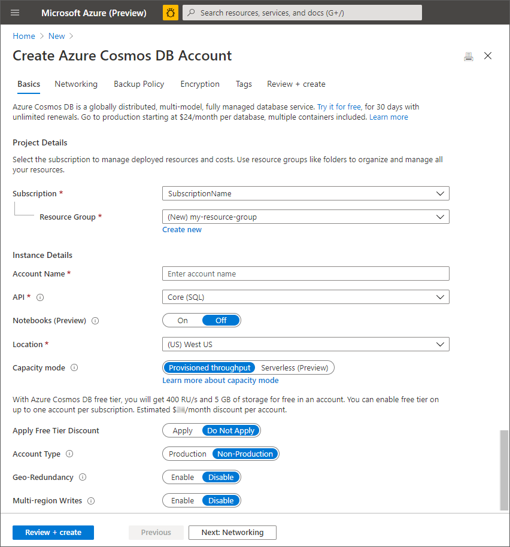
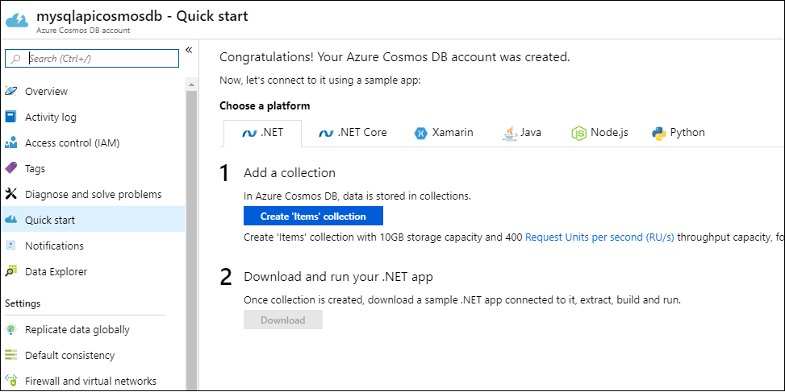

1. Go to the [Azure portal](https://portal.azure.com/) to create an Azure Cosmos DB account. Search for and select **Azure Cosmos DB**.

   

1. Select **Add**.
1. On the **Create Azure Cosmos DB Account** page, enter the basic settings for the new Azure Cosmos account. 

    |Setting|Value|Description |
    |---|---|---|
    |Subscription|Subscription name|Select the Azure subscription that you want to use for this Azure Cosmos account. |
    |Resource Group|Resource group name|Select a resource group, or select **Create new**, then enter a unique name for the new resource group. |
    |Account Name|A unique name|Enter a name to identify your Azure Cosmos account. Because *documents.azure.com* is appended to the name that you provide to create your URI, use a unique name.  The name can only contain lowercase letters, numbers, and the hyphen (-) character. It must be between 3-31 characters in length.|
    |API|The type of account to create|Select **Core (SQL)** to create a document database and query by using SQL syntax.   The API determines the type of account to create. Azure Cosmos DB provides five APIs: Core (SQL) and MongoDB for document data, Gremlin for graph data, Azure Table, and Cassandra. Currently, you must create a separate account for each API.   [Learn more about the SQL API](../articles/cosmos-db/documentdb-introduction.md).|
    |Apply Free Tier Discount|Apply or Do not apply|With Azure Cosmos DB free tier, you will get the first 400 RU/s and 5 GB of storage for free in an account. Learn more about [free tier](https://azure.microsoft.com/pricing/details/cosmos-db/).|
    |Location|The region closest to your users|Select a geographic location to host your Azure Cosmos DB account. Use the location that is closest to your users to give them the fastest access to the data.|
    |Account Type|Production or Non-Production|Select **Production** if the account will be used for a production workload. Select **Non-Production** if the account will be used for non-production, e.g. development, testing, QA, or staging. This is an Azure resource tag setting that tunes the Portal experience but does not affect the underlying Azure Cosmos DB account. You can change this value anytime.|

> [!NOTE]
> You can have up to one free tier Azure Cosmos DB account per Azure subscription and must opt-in when creating the account. If you do not see the option to apply the free tier discount, this means another account in the subscription has already been enabled with free tier.
   
   

1. Select **Review + create**. You can skip the **Network** and **Tags** sections.

1. Review the account settings, and then select **Create**. It takes a few minutes to create the account. Wait for the portal page to display **Your deployment is complete**. 

    

1. Select **Go to resource** to go to the Azure Cosmos DB account page. 

    
