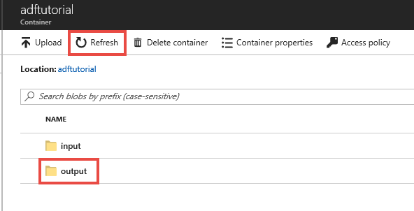
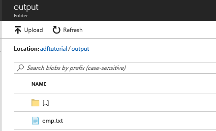

## Review deployed resources

The pipeline automatically creates the output folder in the adftutorial blob container. Then, it copies the emp.txt file from the input folder to the output folder. 

1. In the Azure portal, on the **adftutorial** container page, select **Refresh** to see the output folder. 
    
    

2. Select **output** in the folder list. 

3. Confirm that the **emp.txt** is copied to the output folder. 

    

## Clean up resources

You can clean up the resources that you created in the Quickstart in two ways. You can delete the [Azure resource group](../articles/azure-resource-manager/management/overview.md), which includes all the resources in the resource group. If you want to keep the other resources intact, delete only the data factory you created in this tutorial.

Deleting a resource group deletes all resources including data factories in it. Run the following command to delete the entire resource group: 

```powershell
Remove-AzResourceGroup -ResourceGroupName $resourcegroupname
```

> [!Note]
> Dropping a resource group may take some time. Please be patient with the process

If you want to delete just the data factory, not the entire resource group, run the following command: 

```powershell
Remove-AzDataFactoryV2 -Name $dataFactoryName -ResourceGroupName $resourceGroupName
```